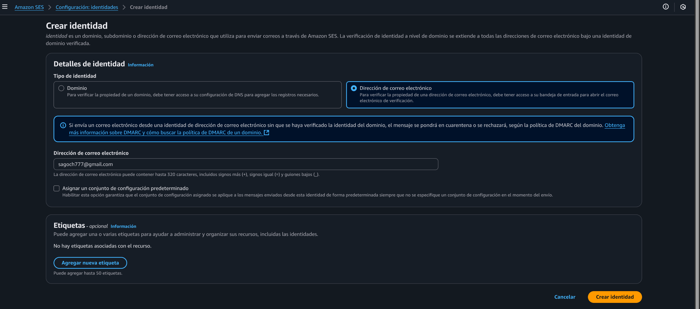
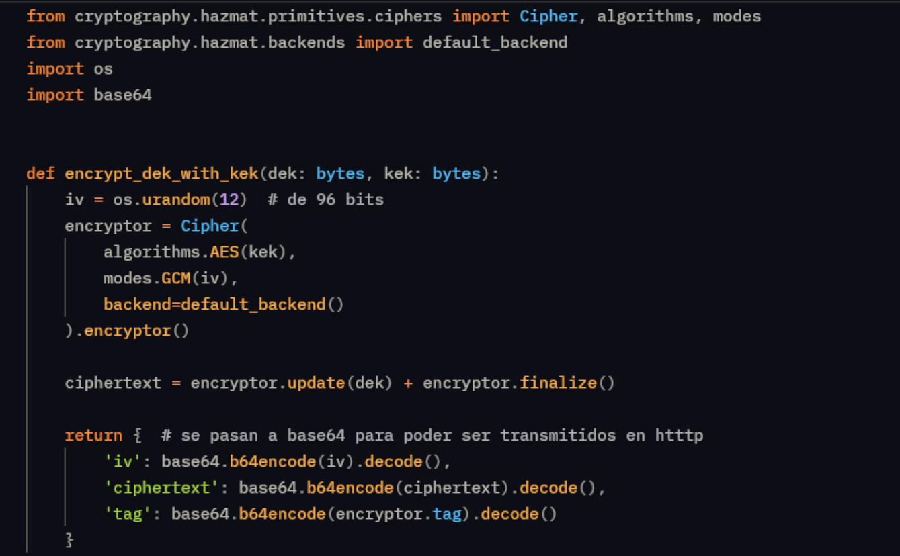

# Encryptyon Keys 

Esta prueba de concepto pretende mostrar como se realizarán múltiples del proyecto: 
- Como desplegar infraestructura en kubernetes por medio de helm charts.
- Como crear llaves tripartitas. 
- Como enviar correos por medio de AWS SES. 
- Como organizar microservicios con RabbitMQ
- Como desarrollar un API con FastAPI 


Su propósito es ofrecer una API que permita generar solicitudes para crear llaves tripartitas y enviarlas posteriormente por correo electrónico.
## Creación de SES 

Paras la creación de Amazon Simple Email service se siguieron los siguientes pasos: 

1. Configuración inicial de una identidad 

 

2. Luego en IAM se asigno el permiso de SESFullAccess al usuario que se usó en la prueba de concepto de SparkProcessor

## Creación de llaves tripartitas

Se usó la librería de Cryptography para poder cifrar con AES-GCM:


## Componentes 

### EncryptionManager

1. Este tiene un API escrita en FastAPI, que recibe por medio de POST /generate-keys, las solicitudes para hacer llaves tripartitas, en su body recibe lo siguiente: 

``` json 
{
    "admin": "Nombre del Admin",
    "representantes": ["Nombre de los representantes"]
}
```

2. Una vez hecho esto, se llama al módulo encargado de hacer las claves. 

3. Luego se envía por RabbitMQ un mensaje al EmailService que estará encargado de enviar mensajes.

### EmailService

Este componente es más simple, lee una cola de RabbitMQ en la que el EncryptionManager manda solicitudes para crear correos. Posteriormente los adapta con los datos extraidos del mensaje, y los envía usando AWS SES por medio de Boto3.
 

## Despliegue en Kubernetes

Para poder usar dichos componentes se les creo imágenes de docker y posteriormente un helm chart con las instrucciones para que puedan ser desplegados:
- EmailService: Un deployment, con configuraciones por variables de entorno.
- EncryptionManager: Un deployment con configuraciones por variables de entorno y un Service Nodeport. 
