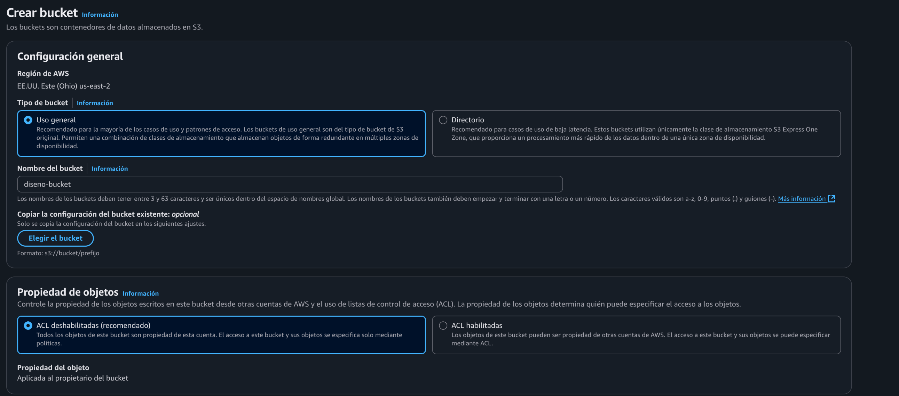
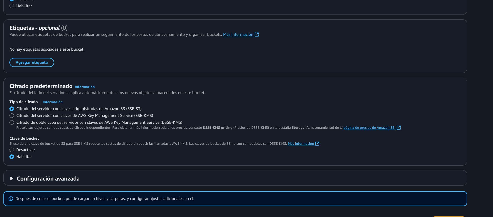
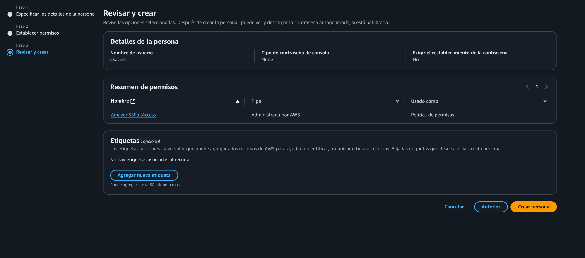
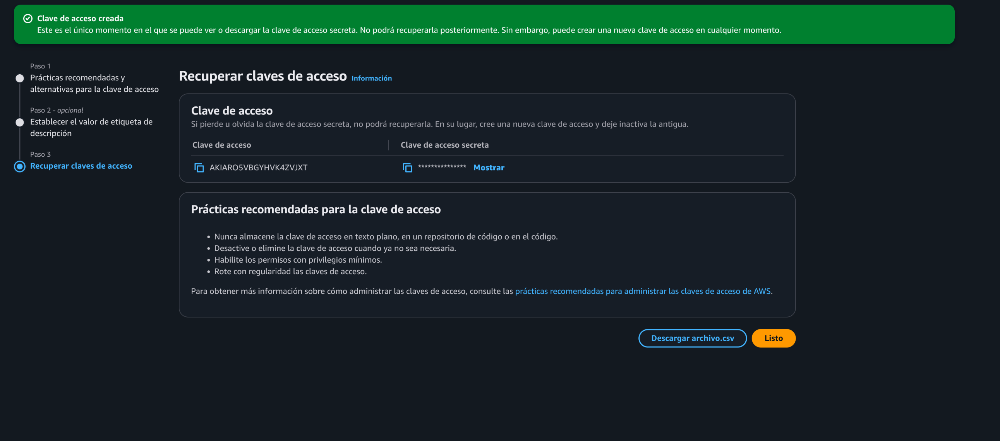
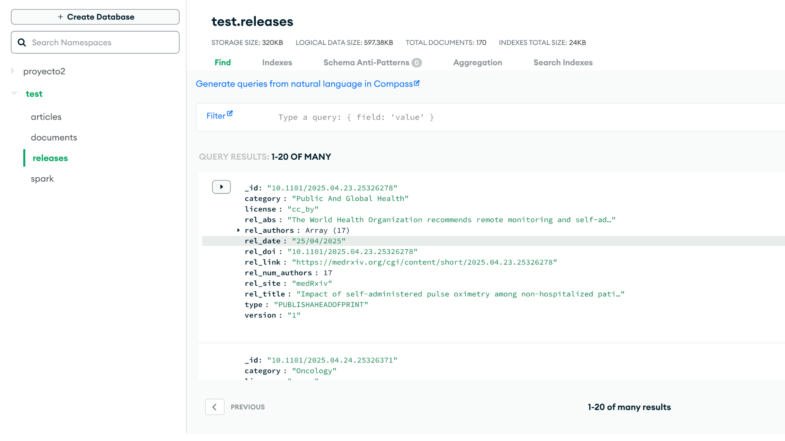
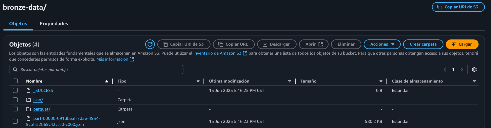
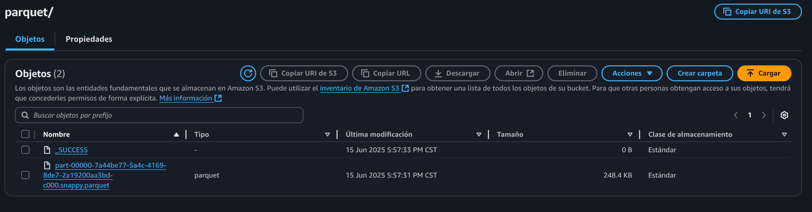

# Spark processor

Como prueba de concepto se probó como con base en un connection string a una base de datos "externa", en este caso de mongo, se puede lograr por medio de un job pequeño de spark su contenido a un S3 Bucket.

Esto es importante, ya que nos da una visión sobre como en el Centro de Carga se puede implementar esta solución.

## Preparación en AWS

1. Primero se creó un S3 Bucket en la consola de AWS



2. Luego por medio de la consola de IAM se creo una persona que pudiera accder a S3 con acceso completo.




## Preparación de datos

Como fuente externa de datos se utilizó una colección de Mongo en Mongo Atlas que junta documentos sobre investigaciones científicas sobre el covid.



## Imagen de docker personalizada

Para que spark pueda conectar con Mongo y el S3 ocupa unos JARS específicos que funcionan como connector. Por lo que se hizo una imagen customizada de apache/spark-py, en la que se copiaron dichos archivos a su directorio de /opt/spark/jars/.


## Pasos para correrlo

EL archivo encargado es el de processor.py, este mismo recibe las credenciales para conectarse a AWS y Mongo Atlas por medio de variables de entorno, por lo que tan solo hay que modificar el siguiente comando de docker y ejecutarlo para que empieze el proceso de ETL:

``` bash
docker run -it \
-e AWS_ACCESS_KEY_ID=AWS_KEY \
-e AWS_SECRET_ACCESS_KEY=AWS_SECRET_KEY \
-e MONGO_URI=MONGO_CONN_STRING \
-v $(pwd):/app \
chago05/spark-diseno /opt/spark/bin/spark-submit /app/processor.py
```

## Resultado Final

El resultado final de dicho proceso es lo esperado, un mapeo del dataset de Mongo hacia el S3. Se hizo en parquet ya que es el formato que se usará en data pura vida, y también en json para comprobar que si se hizo correctamente la carga.







## Fuentes

https://medium.com/@satrupapanda1/step-by-step-guide-for-reading-data-from-s3-using-pyspark-140a99fb19ba
https://www.mongodb.com/docs/spark-connector/current/getting-started/
