# Caso-3-Diseno

## 1. Planeamiento

En esta sección se detallan los aspectos relacionados con la comprensión del problema, la forma en que se dividirá el trabajo dentro del equipo, los hitos en los que se estructura el desarrollo del proyecto y los mecanismos que permitirán evaluar si se está avanzando conforme a lo planificado.

### 1.1 Estructura del Equipo, Stakeholders, Key Players

#### Estructura Interna

El equipo de trabajo consiste de 5 integrantes:

- Santiago Chaves Garbanzo
- Anthony Fuentes
- Luis David Blanco
- Gabriel Gutiérrez
- Jefferson Salas Cordero

Todos tenemos asignaciones distintas dentro del proyecto, pero como vamos a trabajar con metodología Kanban, cualquiera puede hacerse cargo de cualquier tarea. Basta con elegirla en ClickUp y ponerse a trabjar.

Además, una pieza muy importante en el proyecto será Rodrigo Núñez, el cuál actuará como Product Owner de Data Pura Vida, y consultor de diseño de software en caso de que tengamos algún tipo de duda.

#### Stakeholders y Key Players:

Se identificaron los principales actores que influyen o se ven afectados por el desarrollo de la plataforma. A continuación, se presenta una matriz que los muestra:


Como se puede observar, los principales interesados en que el proyecto avance son el Product Owner y el equipo de trabajo, ya que están comprometidos con lograr que el producto final cumpla con los objetivos planteados desde el inicio.

La población general, aunque no tiene un alto nivel de poder dentro del proyecto, demuestra un gran interés. Una plataforma de este tipo promovería la transparencia en el acceso a datos y aportaría a un Costa Rica con mayor disponibilidad de información para todos (incluso aunque parte del contenido sea privado).

Por otro lado, el actor con mayor poder es el gobierno, al ser quien financia el proyecto. Su interés se considera moderado, posiblemente por cierto escepticismo respecto al impacto que la plataforma podría tener sobre su reputación.

Finalmente, aquellos actores que incurren en prácticas como el lavado de dinero o evasión fiscal son los menos interesados, ya que el sistema ofrecería mayor visibilidad sobre los datos, lo cual podría exponer dichas irregularidades.

Ahora bien, ya que se conocen los stakeholders principales se puede evidenciar que los key players son tanto el Product Owner, como el Equipo de trabajo, ya que serán los encargados de que el proyecto tenga exito.

#### Sistemas y Ecosistemas de Software Existentes:

En Costa Rica no existe ningún sistema ni ecosistema previo que funcione como antecedente directo de Data Pura Vida, por lo que no se anticipan problemas de integración con plataformas existentes. Si bien existen herramientas puntuales, como el API del TSE para consultas por cédula, estas no representan un obstáculo, ya que los requerimientos del proyecto contemplan la capacidad del sistema para aceptar datos provenientes de APIs externas.

### 1.2 Gestión de la Comunicación y Documentación del proyecto

Para la comunicación interna del equipo se utilizará Slack. A través de esta herramienta se coordinará la asignación de tareas en ClickUp, y también se notificará cuando una tarea haya sido finalizada. Antes de marcarla como completada, la tarea deberá pasar al estado de "Esperando Aprobación" en ClickUp, para que Rodrigo pueda revisarla y aprobarla.

Además, se utilizará Discord para realizar al menos una reunión semanal, en la cual se discutirán avances generales del proyecto. En caso de surgir dudas más complejas, se invitará al profesor para que pueda brindar orientación.

La documentación principal del proyecto se mantendrá en el README del repositorio de GitHub Chagui05/Caso-3-Diseno. En ese archivo se incluirán todos los detalles relevantes. Si existieran anexos, como la hoja de requerimientos o la entrevista con el profesor, se agregarán al mismo repositorio en archivos separados con nombres descriptivos, y se hará referencia a ellos desde el README. Toda la documentación será escrita en formato Markdown.

### 1.3 Entendimiento del problema

Para entender adecuadamente el problema, el equipo realizó una entrevista al Product Owner, basada en una serie de preguntas que surgieron tras revisar la especificación del proyecto. Las respuestas obtenidas fueron registradas en el archivo RespuestaEntrevista, y permitieron extraer información clave, como por ejemplo:

- La plataforma debe permitir el registro de personas físicas primero, y luego dar la posibilidad de vincularlas como administradoras de organizaciones.
- La validación de cuentas puede involucrar múltiples métodos: revisión manual, validaciones automatizadas y uso de servicios externos como SumSub.
- La inclusión de IBAN y datos de tarjetas en el registro busca filtrar usuarios no comprometidos y evitar registros superficiales.
- Se recomienda restringir el acceso por IP solo a la sección de registro, o permitir el registro de IPs confiables para quienes estén en el extranjero.
- Los datos cargados (sin importar el origen) deben convertirse a un formato unificado tras aplicar el proceso ETDL (relacional, documental, etc.).
- El sistema debe validar estructura, formato y contenido de los datasets, considerando reglas como formatos de fechas, booleanos y tipos de datos.
- El motor de visualización de dashboards debe permitir a los usuarios crear sus propios paneles, compartirlos y gestionarlos.
- La arquitectura de backend puede ser definida libremente por el equipo (monolítica o microservicios), según convenga al diseño general.
- Se permite la integración con herramientas de IA, siempre que se respeten los criterios de autorización definidos por la administración de la plataforma.
- El portal web de backoffice será administrado por una organización gubernamental registrada dentro del sistema, actuando como custodio de la información.

A partir de esta información, se desarrollaron los siguientes diagramas de flujo que ilustran las tareas clave identificadas dentro del sistema:

- Diagrama de registro:

El siguiente diagrama presenta una visión general del proceso de registro en nuestra plataforma. No incluye detalles técnicos ni especificaciones sobre los campos dinámicos que varían según el tipo de entidad registrada; su objetivo es ilustrar de forma abstracta y comprensible cómo se estructura el flujo de registro dentro del sistema.

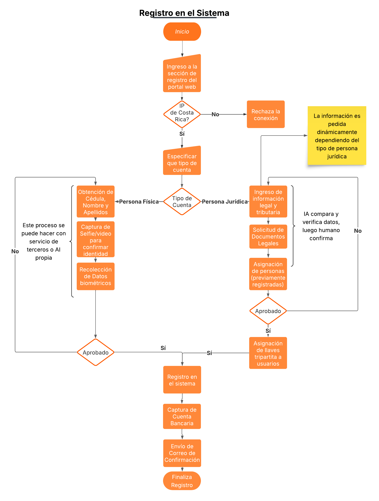

- Diagrama de Ingesta y configuración de un dataset

Subir y configurar un dataset en la plataforma no es nada trivial, por eso se armaron estos dos diagramas que separan el proceso en dos partes.

El primer diagrama muestra cómo se le pide al usuario que suba el dataset: qué datos tiene que dar, qué información se necesita para la IA, y cómo se valida el archivo que subió (formato, estructura, nombres de columnas, etc.).

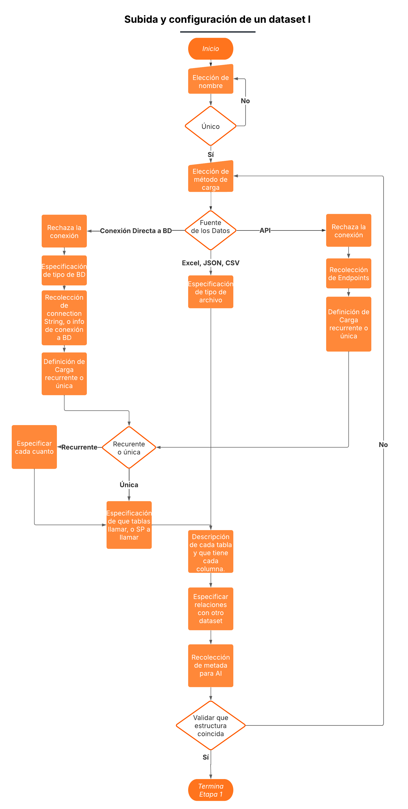

El segundo diagrama arranca una vez que el dataset ya fue validado. Ahí se definen cosas como si el conjunto de datos va a ser público, privado o de pago, y qué métodos de acceso y cobro se van a aplicar.

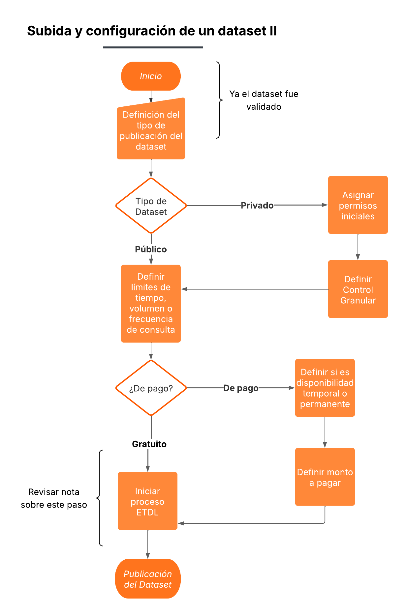

Es importante aclarar que en el diagrama II no se detalla paso a paso lo que hace el motor ETDL, pero sí se deja claro que va a encargarse de tareas como: detectar duplicados, relacionar datos con otros ya cargados, ajustar el modelo según las conexiones que encuentre, y aplicar automáticamente un flujo con extracción, transformación, limpieza, detección de contexto, modelado y carga con ayuda de AI.

#### Componentes del Sistema

Con el fin de lograr una arquitectura modular, segura y mantenible, el sistema se divide en macrocomponentes. Cada uno aborda un conjunto específico de requerimientos funcionales y no funcionales. En esta sección se listan los componentes y sus principales responsabilidades. La implementación técnica y subdivisión de estos se detalla más adelante en el documento.

##### bioregistro verde

Este módulo gestiona el proceso de incorporación de personas físicas y jurídicas a la plataforma. Abarca desde el llenado de formularios hasta la validación de identidad y la emisión de credenciales digitales. Debe cumplir con regulaciones AML y estándares avanzados de identidad digital.

Requerimientos:

- El componente debe permitir el registro de personas físicas, jurídicas, instituciones, cámaras, grupos y empresas.
- El formulario de registro debe adaptarse dinámicamente según el tipo de entidad seleccionada.
- El registro de usuarios debe estar asegurado con MFA y biometría, cumpliendo estándares de identidad digital avanzada.
- El componente debe solicitar y capturar información personal, societaria, legal y tributaria según el tipo de entidad.
- El componente debe revisar que cuando se van a asignar personas físicas a la organización al crearla, efectivamente formen parte de dicho conjunto.
- El registro debe pasar por una etapa de validación interna manual para el registro de empresas
- El componente debe implementar validación automática por inteligencia artificial de los documentos subidos.
- El componente debe exigir a los representantes legales el registro como individuos con: identidad digital, biometría, prueba de vida y autenticación multifactor (MFA).
- Cada organización debe recibir llaves de seguridad que le permitan delegar o revocar accesos a sus usuarios.
- Un usuario debe poder administrar múltiples organizaciones desde una única cuenta.
- El componente debe capturar datos preliminares de cuentas IBAN y/o tarjetas de crédito como parte del registro.
- El componente debe enviar una notificación por correo electrónico cuando un registro sea aprobado.
- El componente debe exigir documentos específicos según el tipo de entidad: cédulas físicas o jurídicas, actas, RTN, dirección, etc.
- El componente debe permitir registrar direcciones IP institucionales (listas blancas) para permitir acceso autorizado.
- El componente debe permitir únicamente IPs costarricenses en el registro
- El sistema debe proteger las claves generadas mediante un esquema de llave tripartita, distribuidas entre Data Pura Vida y dos custodios.


##### La Bóveda

La Bóveda es el almacén central de datos del sistema, diseñado para ser seguro, escalable y auditable. Unifica todos los datos cargados, sin importar su formato de origen, y permite relaciones entre datasets. Cifra la información en tránsito y reposo, controla el acceso por roles y entidades, y mantiene trazabilidad completa del uso y movimientos de los datos. Está pensada para soportar millones de registros con alto rendimiento y cumplir estándares de gobierno de datos.

Requerimientos:

- La Bóveda tiene que almacenar los datos en un solo formato, por más de que las fuentes externas sean de distintos tipos (relacionales, documentales, csv, excel)
- La Bóveda debe permitir especificar columnas que relacionan un dataset con otros datasets del ecosistema.
- La Bóveda debe de estar monitoreada en todo momento para detectar movimientos sospechosos, para dar contenido de uso de un dataset, y para asegurar trazabilidad y diagnóstico rápido de fallas.
- Debe ser resiliente, auditable y alineado con estándares de gobierno de datos.
- Debe permitir crecimiento dinámico sin perder eficiencia.
- Debe escalar a millones de registros y miles de usuarios concurrentes.
- Mantener trazabilidad de datos usados, no usados y descartados.
- Todos los datos cargados deben estar protegidos mediante cifrado, incluso frente al personal técnico ("ingenieros de la plataforma").
- Cifrar toda la data en tránsito y en reposo, dejando trazabilidad auditable.
- Permitir almacenamiento masivo de datos estructurados y semiestructurados.
- Controlar accesos lógicos por entidad, usuario o tipo de dato.
- Implementar control de acceso a nivel de rol (RBAC) y a nivel de fila (RLS) o equivalentes.

##### Módulo de Ingesta de dato / posibles nombres: El Ingestor, Centro de Carga, Dock de Datos

Este módulo permite a los usuarios cargar sus datasets a la plataforma. Desde acá pueden definir qué datos desean cifrar, especificar el formato de origen y configurar otros parámetros clave para asegurar que la carga se procese correctamente.

Requerimientos: 

- Permitir a los usuarios decidir qué datos compartir dentro del ecosistema.
- Requerir que cada dataset tenga un nombre único.
- Soportar múltiples métodos de carga de datos: archivos Excel, CSV, JSON, APIs y conexiones directas a bases de datos SQL y NoSQL. 
- Requerir nombre, descripción y metadata útil para IA sobre las columnas del dataset.
- Permitir configurar los parámetros de conexión de forma cifrada para cada medio de carga.
- Los parámetros de conexión de bases de datos y APIs deben almacenarse de forma cifrada.
- Permitir configurar si el dataset es público o privado, gratuito o pagado, permanente o con disponibilidad temporal.
- El sistema de permisos debe prevenir accesos no autorizados a datasets privados o pagos.
- Asignar permisos de acceso a los datasets privados.
- Permitir definir montos de acceso para datasets con modelo de cobro.
- Restringir acceso a datos por tiempo, volumen o frecuencia de consulta.
- Indicar si la carga es única o recurrente, completa o por deltas.
- Configurar parámetros para carga por deltas: campos diferenciales, frecuencia (timed pull) o mediante callbacks.
- Habilitar control granular de acceso por institución, persona o grupo.


##### Módulo de transformación de datos / posibles nombres: Motor de Transformación, Procesador ETDL

Este módulo es clave para garantizar que los datasets se almacenen correctamente en la Bóveda. Se encarga de recibir datos desde distintas fuentes, validar que el formato coincida con el indicado en el formulario de ingesta y, en caso contrario, rechazar la carga. Una vez superada esta validación, aplica todo el proceso de ETDL y mapea los datos al formato interno de la Bóveda.

Requerimientos: 

- Validar el formato, estructura y contenido de cada dataset cargado sea correcto, o bien adaptarlo al interno de la Bóveda (formatos de fecha, booleans, etc.).
- Validar el formato, estructura y contenido de cada dataset cargado coincida con lo especificado en el proceso de carga.
- Automatizar el proceso de carga mediante un motor de IA que aplique un flujo ETDL (extracción, transformación, limpieza, detección de contexto, modelado y carga).
- Aplicar IA para normalizar, rediseñar modelos de datos y vincularlos automáticamente.
- Detectar duplicidades, optimizar relaciones y ajustar el modelo de datos automáticamente según las interrelaciones detectadas.
- Monitorear el proceso completo con métricas de transferencia, carga, limpieza, eliminación, modelado, volumen, datos omitidos, datos consultados y tasa de éxito.
- El sistema debe ser capaz de procesar cargas recurrentes y automatizadas sin intervención manual.
- Soportar cargas delta con identificación de cambios.
- Realizar merges eficientes sin pérdida de integridad.

##### Centro de Visualización y Consumo

Este módulo está compuesto por 3 subcomponentes clave:


1. **Generador de dashboards**: permite a los usuarios diseñar y crear gráficos de forma rápida y amigable para visualizar cualquier dataset.

Requerimientos:
- El sistema debe permitir la construcción de dashboards personalizados de forma manual.
- El sistema debe permitir construir dashboards manualmente o mediante prompts inteligentes que generen visualizaciones automáticas.
- El sistema debe permitir representar visualmente los datos en tablas, gráficos, conteos, tendencias y predicciones.
- El sistema debe permitir a los usuarios guardar sus dashboards personalizados.
- El sistema debe permitir compartir dashboards con otros usuarios o hacerlos públicos dentro de la plataforma.
- La interfaz de construcción de dashboards debe ser segura, intuitiva y con capacidad de respuesta en tiempo real.

2. **Visualización y Consumo**: ofrece una interfaz para revisar esas visualizaciones y realizar análisis de datos directamente sobre los dashboards.

Requerimientos:
- El sistema debe permitir visualizar todos los datasets accesibles como una fuente consolidada.
- El sistema debe bloquear toda exportación directa de datos y gráficos desde el portal.
- El sistema debe mostrar datos de forma preliminar en modo de construcción de dashboard y luego con datos reales al ejecutar consultas
- El sistema debe deshabilitar temporalmente el acceso a datasets cuando se superen los límites de consumo.
- El sistema debe registrar todas las transacciones y consumos de datos en un historial accesible para cada usuario.
- El sistema debe mostrar métricas de uso: volumen de datos consultados, número de consultas realizadas, tiempo restante o límites alcanzados.
- El sistema no debe permitir en ningún momento la descarga directa de datasets o gráficos generados.
- La visualización de datos debe realizarse exclusivamente dentro del portal, sin opciones de exportación, captura o embedding externo.
- Los límites de consumo deben aplicarse en tiempo real, sin permitir bypasses o reintentos abusivos.

3. **Consumo para IA**: Este subcomponente es el regulador de consumo de IA, define límites y los métodos de ingesta disponibles desde el sistema para los usuarios. 

Requerimientos:

- El sistema debe permitir el acceso sistema a sistema únicamente para alimentar modelos de IA aprobados.
- La entrega de datos para modelos de IA debe ser monitoreada, registrada y limitada a contextos aprobados explícitamente por Data Pura Vida.
- El sistema debe ofrecer plataformas limitadas y controladas para esta alimentación de IA. Solo permitirá 2 por usuario. 
- El sistema debe minimizar al máximo el riesgo de descargas indirectas mediante presunción de uso en IA.
- Los datos deben ser envíados en un formato que no permita poder ser desencriptado para otro uso que no sea alimentar IA (por ejemplo uso de embeddings).

##### Marketplace

Este módulo está enfocado en ofrecer una interfaz amigable que permita a los usuarios encontrar datasets de forma eficiente, con descripciones claras y navegación fluida. Además, incluye una sección adicional para buscar dashboards creados por otros usuarios, facilitando el descubrimiento y reutilización de visualizaciones dentro de la plataforma.

Requerimientos:

- La experiencia de compra de datasets debe ser fluida, transparente y accesible desde los dashboards personales.
- Incluir un módulo de compra donde se visualicen datasets disponibles bajo acceso pagado.
- Permitir seleccionar un dataset, visualizar precio, términos de uso, duración del acceso y condiciones de cobro.
- Soportar múltiples métodos de pago: tarjeta de crédito, débito y otros mecanismos nacionales compatibles.
- Mostrar confirmaciones de transacción y activar el acceso según condiciones (tiempo, volumen, frecuencia).
- El sistema debe mostrar opciones para renovar o ampliar los paquetes de acceso en caso de superar el límite.
 

##### Backoffice Administrativo

Este módulo concentra las herramientas de backoffice necesarias para la gestión integral de la plataforma. Su enfoque está en el control, la seguridad, la gobernanza de datos y la trazabilidad completa de las operaciones. 

Requerimientos:

- Administrar usuarios: validación de identidad, membresía y roles.
- Gestionar reglas de carga de datos (formatos, estructuras, validaciones).
- Configurar conexiones externas (APIs, BDs, callbacks).
- Activar, desactivar y supervisar objetos de datos, pipelines y flujos.
- Revocar o regenerar llaves de seguridad (simétricas, asimétricas, tri-partitas).
- Administrar custodios de llaves y flujos de confirmación mancomunada.
- Auditar operaciones por usuario, fecha, acción y resultado.
- Generar reportes de uso, calidad, integración y anomalías.
- Monitorear el estado operativo de servicios y tareas.
- Extraer evidencias para procesos legales bajo autorización.
- Gestionar permisos y accesos mediante RBAC.
- Debe ofrecer una interfaz robusta y segura solo para personal autorizado.
- Debe permitir gestión flexible pero estricta de accesos y configuraciones.

#### Prototipado 

Se desarrolló un prototipo funcional de la página del Bioregistro Verde con el objetivo principal de probar el comportamiento de los formularios dinámicos. Este prototipo no incluye procesos de prueba de vida ni captura de datos biométricos, y tampoco recolecta la información final que se almacenará en el sistema definitivo. Su propósito es demostrar, a alto nivel, cómo el formulario se adapta dinámicamente según las selecciones del usuario.

A continuación las imágenes del flujo de recolección de data de una persona física:

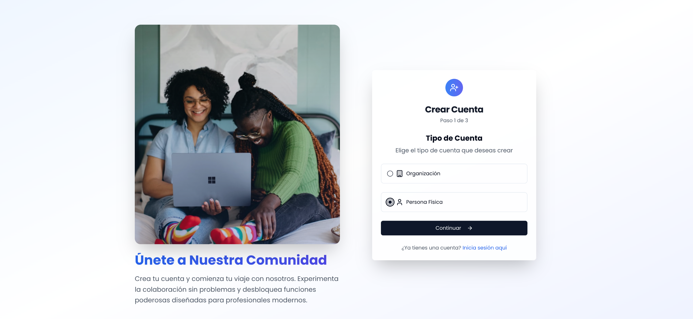


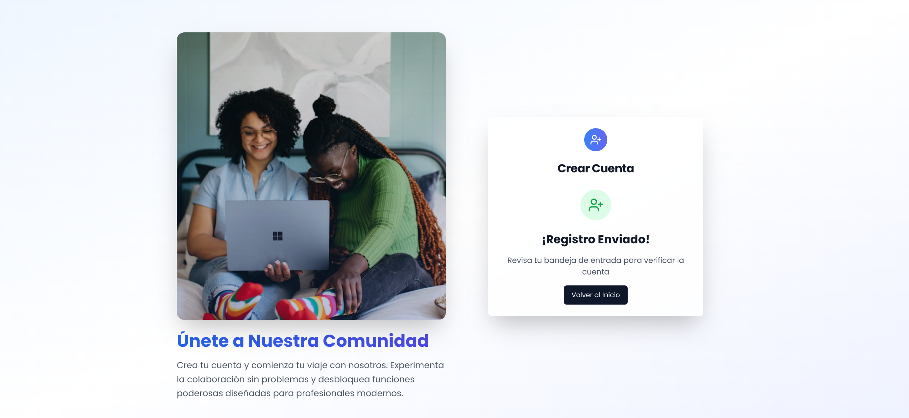

Además, se adjunta el proceso de registar compañía pública:


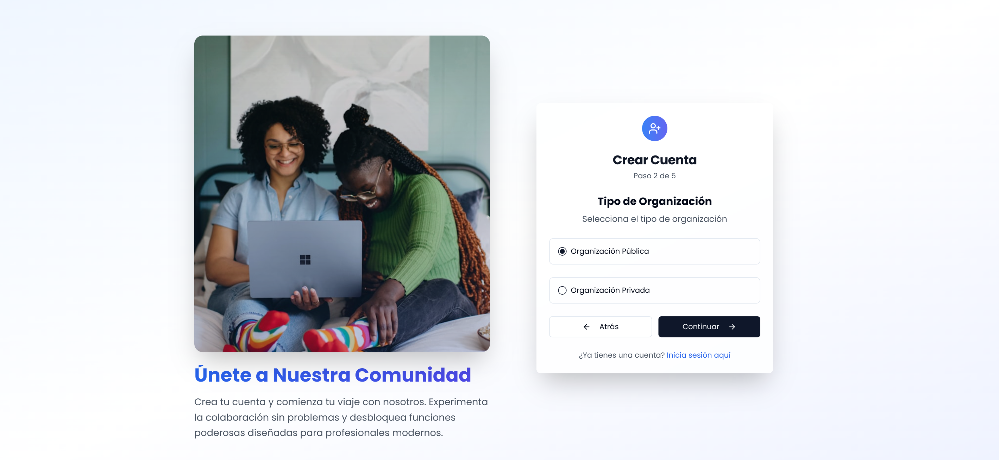
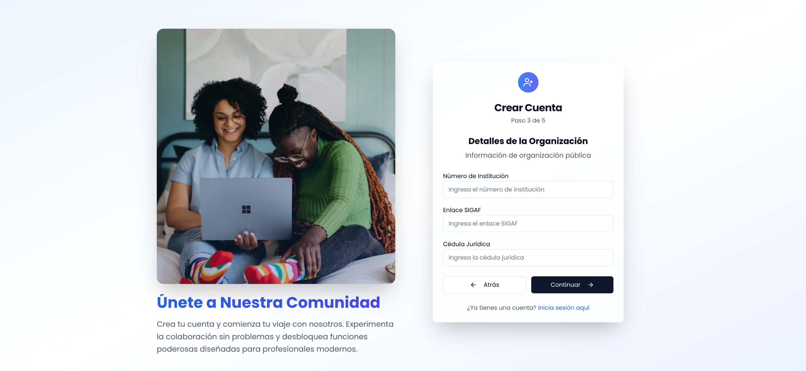
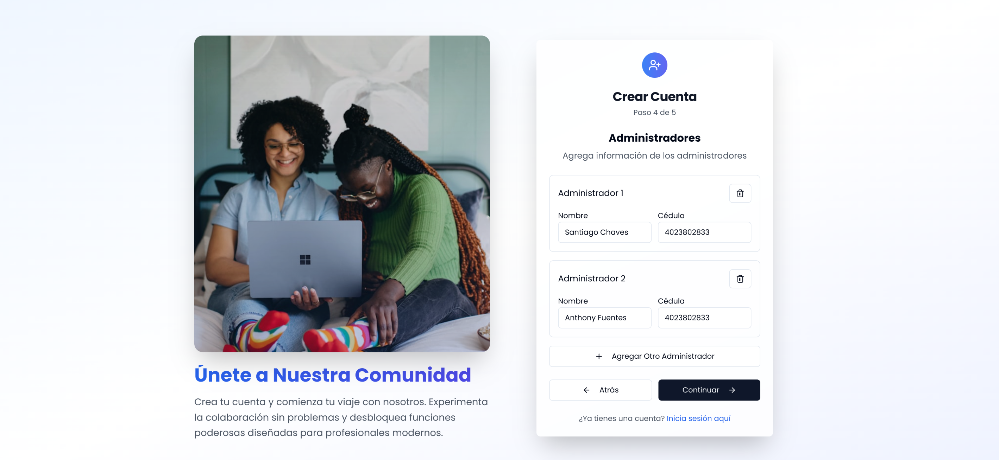
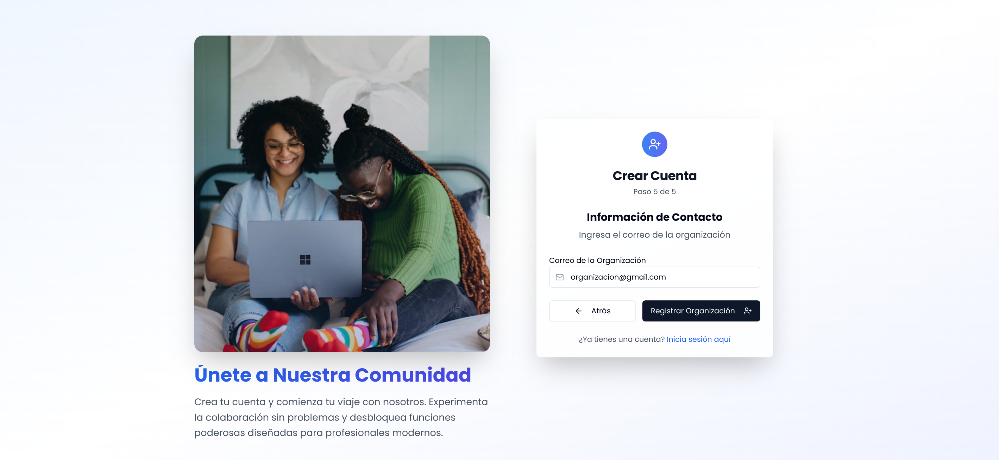


Si deseá probar el prototipo visite el siguiente [link](https://gentle-signup-wizard.lovable.app/).

### 1.4 Customer Journeys

Este Service Blueprint representa el recorrido completo de un ciudadano dentro del ecosistema Data Pura Vida, desde el descubrimiento de la plataforma hasta la creación, publicación y monitoreo de un dashboard personalizado con datos públicos.

El diagrama detalla no solo las acciones del usuario, sino también los touchpoints del sistema, los procesos internos (backstage) y las herramientas de soporte involucradas en cada etapa. Además, se integran las emociones del usuario para identificar oportunidades de mejora en la experiencia.

Las líneas de interacción, visibilidad e interacción interna permiten visualizar claramente los límites entre lo que el ciudadano ve, lo que ocurre detrás del sistema y las herramientas tecnológicas que lo sustentan.

Este blueprint se organiza en **seis** fases principales:

1. Conciencia: El ciudadano conoce la existencia de la plataforma.

2. Ingreso: Accede y se autentica de forma segura.

3. Exploración: Navega los datasets disponibles.

4. Creación: Construye un dashboard visual con datos abiertos.

5. Publicación: Comparte su dashboard con otros usuarios.

6. Monitoreo: Consulta métricas de visualización y uso.b


Este Service Blueprint representa el recorrido completo de una empresa dentro del ecosistema Data Pura Vida, desde el descubrimiento de la plataforma hasta la publicación y monitoreo de un dataset privado con fines de monetización.

Este blueprint se organiza en siete fases principales:

1. Conciencia: La empresa conoce la plataforma y sus posibilidades de monetización.

2. Registro: Se registra como entidad jurídica mediante un proceso validado.

3. Carga de datos: Sube su dataset en formatos compatibles como archivos o APIs.

4. Configuración: Define permisos, privacidad, cifrado y condiciones de acceso.

5. Validación de valor: Evalúa la calidad y el potencial del dataset con ayuda de IA.

6. Publicación: Hace público el dataset con opciones de pago o acceso controlado.

7. Monitoreo: Supervisa ingresos, visualizaciones y transacciones en tiempo real.

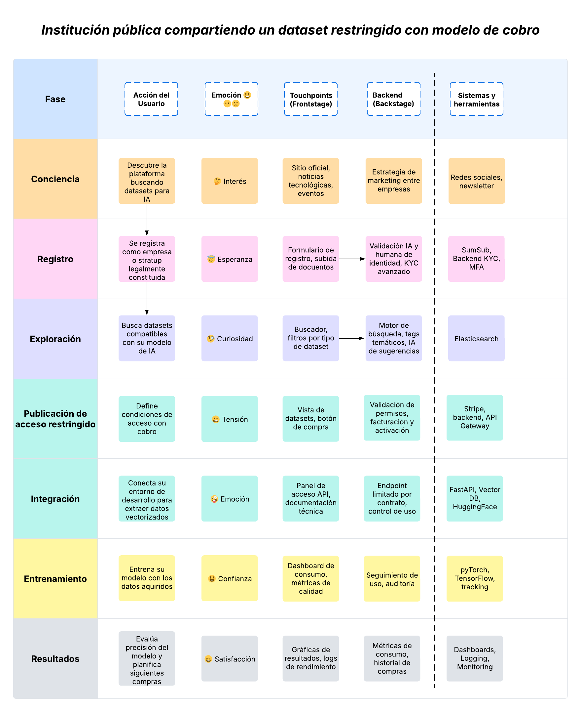

**Fases principales:**

1. Registro: Un representante oficial crea una cuenta institucional y sube los documentos requeridos.
2. Validación: La plataforma aplica validaciones automáticas y manuales con ayuda de IA.
3. Configuración: La institución decide qué datos compartir y con qué restricciones.
4. Carga: Se conecta una base de datos externa para carga automatizada.
5. Publicación: El dataset queda disponible para actores autorizados mediante pago.
6. Seguimiento: La institución consulta métricas de acceso y consumo.

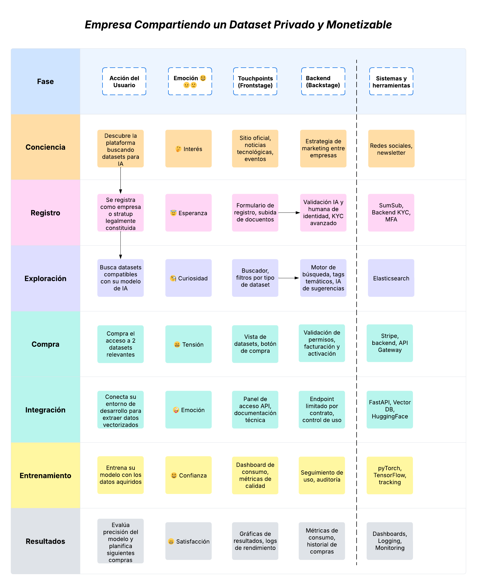

### 1.5 Plan de ejecución del proyecto

El proyecto se estructura en cinco hitos principales que marcarán su progreso:

- Planeamiento del Proyecto
- Supuestos del Proyecto
- Stack Tecnológico
- Diseño de los Componentes
- Validación de los requerimientos

Cada uno de estos hitos cuenta con un plazo definido para su ejecución, lo cual se puede observar en el siguiente diagrama de Gantt:

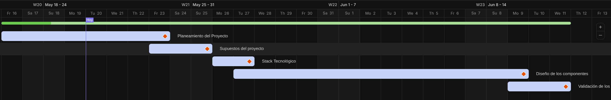

Dentro de cada hito se contemplan varias tareas. Cada integrante del equipo debe seleccionar una tarea según su disponibilidad. Un hito se considera finalizado únicamente cuando todas sus tareas han sido completadas y se encuentran en el tablero de completado en ClickUp.

Además, como se indicó anteriormente, se realizarán reuniones semanales para verificar que el proyecto avance conforme al plan establecido.

Además, como se dijo previamente, se harán reuniones semanales para verificar que el proyecto se esté realizando según lo dice el plan.

### 1.6 WBS del sistema

Como parte del análisis inicial del sistema **Data Pura Vida**, se realizó una descomposición de alto nivel para identificar los límites del sistema y los actores involucrados. A continuación, se presenta el diagrama de contexto basado en las técnicas descritas para la identificación del sistema y sus límites:

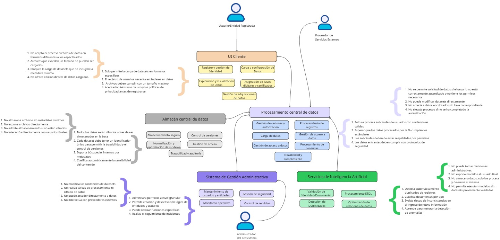

Esta representación facilita el entendimiento general del sistema y servirá como base para la posterior descomposición en subsistemas, componentes funcionales y diseño arquitectónico detallado.

#### Propósito del diagrama
- **Identificación de límites del sistema:** El diagrama establece una frontera clara entre lo que está dentro y fuera del alcance del desarrollo, lo cual es crucial para evitar ambigüedades durante el diseño detallado.

- **Visualización de los actores externos:** Permite entender quiénes interactúan con el sistema y con qué propósito.

- **Detección de puntos de integración:** Ayuda a anticipar necesidades de interoperabilidad, seguridad, formatos de intercambio de datos y protocolos de comunicación.

#### Consideraciones adicionales
Este diagrama será utilizado como punto de partida para:

- La descomposición en subsistemas o módulos funcionales, agrupando responsabilidades afines.

- La definición de casos de uso y escenarios de interacción.

- La elaboración de la arquitectura técnica, donde se identificarán servicios, componentes y flujos de datos internos.

En resumen, este modelo de contexto es una herramienta clave para asegurar un entendimiento compartido del dominio del problema y sentar las bases de una solución técnica coherente, escalable y alineada con los objetivos del proyecto.

### 1.7 Evaluación de Riesgos

#### Metodología ISO 31000

La evaluación de riesgos sigue los principios de **ISO 31000** para la gestión de riesgos del proyecto Data Pura Vida.

#### Marco de Evaluación:

La evaluación de riesgos utiliza una matriz de probabilidad versus impacto basada en criterios específicos del proyecto Data Pura Vida y su contexto de diseño de sistemas complejos.

#### Escala de probabilidad:

- Muy Alta (100%) : Es prácticamente seguro que el riesgo ocurrirá durante el proyecto (9 de cada 10 proyectos similares)
- Alta (80%) : Es muy probable que el riesgo se materialice (7-8 de cada 10 casos)
- Medios (60%) : Hay una posibilidad moderada de que ocurra (5-6 de cada 10 casos)
- Baja (40%) : Es poco probable pero posible que suceda (3-4 de cada 10 casos)
- Muy Baja (20%) : Es muy poco probable que se materialice (1-2 de cada 10 casos)

#### Escala de Impacto:

- Muy Alto (100%) : Falla completa del proyecto, rediseño total necesario, o retraso superior a 4 semanas
- Alto (80%) : Compromete objetivos principales del proyecto, retraso de 2-4 semanas, o afecta múltiples componentes críticos
- Medio (60%) : Afecta la calidad del diseño o genera retraso de 1-2 semanas, requiere trabajo adicional significativo
- Bajo (40%) : Impacto menor en cronograma (3-7 días) o calidad, se puede resolver con ajustes menores
- Muy Bajo (20%) : Impacto mínimo (menos de 3 días), no afecta objetivos principales del proyecto

#### Riesgos para el Diseño de Data Pura Vida

| ID      | Categoría         | Riesgo                                               | Descripción Detallada                                                                                                                                                                           | Probabilidad        | Impacto             | Clasificación   | Estrategia     | Plan de Respuesta                                                                                                                                                                 |
| ------- | ----------------- | ---------------------------------------------------- | ----------------------------------------------------------------------------------------------------------------------------------------------------------------------------------------------- | ------------------- | ------------------- | --------------- | -------------- | --------------------------------------------------------------------------------------------------------------------------------------------------------------------------------- |
| **R01** | **Diseño**        | **Complejidad arquitectónica del ecosistema**        | Diseñar una arquitectura que integre efectivamente portal web, API backend, datalake, backoffice y múltiples sistemas de seguridad requiere experiencia en arquitecturas distribuidas complejas | **Muy Alta (100%)** | **Muy Alto (100%)** | **🔴 EXTREMO**  | **MITIGAR**    | **Prevención:** Definir patrones arquitectónicos estándar, revisiones semanales, división en capas<br>**Contingencia:** Consultoría externa, arquitectura monolítica simplificada |
| **R02** | **Alcance**       | **Subestimación del alcance técnico**                | El sistema requiere diseñar más de 50 componentes técnicos diferentes incluyendo motor ETDL con IA, cifrado tripartito, validación biométrica y procesamiento de millones de registros          | **Alta (80%)**      | **Alto (80%)**      | **🟠 ALTO**     | **MITIGAR**    | **Prevención:** Descomponer en historias simples, Planning Poker, estimación por horas<br>**Contingencia:** Re-priorización MoSCoW, reducción a MVP                               |
| **R03** | **Documentación** | **Inconsistencias en la documentación técnica**      | Generar documentación técnica coherente entre arquitectura de alto nivel, especificaciones de APIs, modelos de datos, diagramas de seguridad y patrones de integración                          | **Alta (80%)**      | **Alto (80%)**      | **🟠 ALTO**     | **MITIGAR**    | **Prevención:** Templates estándar, peer review, checklist calidad<br>**Contingencia:** Auditoría semanal, refactoring documental                                                 |
| **R04** | **Tiempo**        | **Cronograma optimista para la complejidad**         | El tiempo asignado puede ser insuficiente para diseñar completamente todos los componentes técnicos con el nivel de detalle requerido para un sistema de esta magnitud                          | **Muy Alta (100%)** | **Medio (60%)**     | **🟠 ALTO**     | **MITIGAR**    | **Prevención:** Re-estimación semanal, burndown charts, escalación automática<br>**Contingencia:** Priorización dinámica, redistribución de tareas                                |
| **R05** | **Técnico**       | **Complejidad del motor ETDL con IA**                | Especificar técnicamente un motor que procese automáticamente múltiples formatos, detecte duplicados, relacione datos y aplique transformaciones inteligentes es altamente complejo             | **Media (60%)**     | **Muy Alto (100%)** | **🟠 ALTO**     | **MITIGAR**    | **Prevención:** Spike 16 horas, prototipo con 3 casos, arquitectura modular<br>**Contingencia:** Motor simplificado sin IA, integración Talend/NiFi                               |
| **R06** | **Seguridad**     | **Diseño de sistema de cifrado tripartito**          | Especificar correctamente un sistema de llaves criptográficas divididas entre tres custodios, incluyendo protocolos de recuperación y validación mancomunada                                    | **Baja (40%)**      | **Muy Alto (100%)** | **🟠 ALTO**     | **TRANSFERIR** | **Prevención:** Consulta expertos, estándares FIPS 140-2, validación externa<br>**Contingencia:** Cifrado HSM tradicional, esquema dual                                           |
| **R07** | **Integración**   | **Interfaces entre componentes mal definidas**       | Riesgo de que las especificaciones de APIs, contratos de datos y protocolos de comunicación entre portal, backend y datalake no sean completamente compatibles                                  | **Media (60%)**     | **Alto (80%)**      | **🟠 ALTO**     | **MITIGAR**    | **Prevención:** Contratos OpenAPI 3.0, reuniones bi-semanales, diagramas secuencia<br>**Contingencia:** Workshop alineación 4 horas, rediseño contratos                           |
| **R08** | **Escalabilidad** | **Arquitectura no preparada para la carga esperada** | El diseño puede no contemplar adecuadamente el manejo de millones de registros, miles de usuarios concurrentes y procesamiento de grandes volúmenes de datos                                    | **Baja (40%)**      | **Medio (60%)**     | **🟡 MODERADO** | **ACEPTAR**    | **Prevención:** Análisis capacidad inicial, documentar recomendaciones<br>**Contingencia:** Roadmap escalabilidad futura, patrones horizontales                                   |
| **R09** | **Recursos**      | **Disponibilidad limitada del Product Owner**        | El Product Owner puede no estar disponible para validar decisiones arquitectónicas críticas o para resolver ambigüedades en los requerimientos técnicos                                         | **Media (60%)**     | **Bajo (40%)**      | **🟡 MODERADO** | **ACEPTAR**    | **Prevención:** Agenda fija martes/viernes, decisiones escritas, timeboxing 24h<br>**Contingencia:** Escalación stakeholders, decisiones equipo con validación posterior          |
| **R10** | **Coordinación**  | **Diseños de componentes desconectados**             | Los diferentes integrantes del equipo pueden diseñar sus componentes sin suficiente coordinación, resultando en interfaces incompatibles o duplicación de funcionalidades                       | **Media (60%)**     | **Medio (60%)**     | **🟡 MODERADO** | **MITIGAR**    | **Prevención:** Sincronización semanal viernes, documentación GitHub, daily stand-ups<br>**Contingencia:** Workshop alineación medio día, rediseño interfaces                     |

### 1.8 Definición de KPIs

#### KPIs por Hito del Proyecto

##### Hito 1: Planeamiento del Proyecto

**Período**: 18-22 Mayo 2025 (Semana W20)

| KPI                              | Métrica                            | Objetivo | Método de Recolección                              |
| -------------------------------- | ---------------------------------- | -------- | -------------------------------------------------- |
| **Cumplimiento de cronograma**   | % de tareas completadas a tiempo   | 100%     | ClickUp - estado de tareas vs. fechas planificadas |
| **Completitud de documentación** | % de entregables documentados      | 100%     | Revisión de README y archivos en GitHub            |
| **Participación del equipo**     | % de integrantes activos en tareas | 100%     | ClickUp - asignación y progreso de tareas          |
| **Validación del Product Owner** | % de entregables aprobados         | 100%     | Estado "Aprobado" en ClickUp                       |

##### Hito 2: Supuestos del Proyecto

**Período**: 25-31 Mayo 2025 (Semana W21)

| KPI                            | Métrica                              | Objetivo | Método de Recolección                            |
| ------------------------------ | ------------------------------------ | -------- | ------------------------------------------------ |
| **Cumplimiento de cronograma** | % de tareas completadas a tiempo     | 100%     | ClickUp - comparación fecha planificada vs. real |
| **Calidad de supuestos**       | Número de supuestos validados con PO | 100%     | Documentación de validaciones en Slack/GitHub    |
| **Identificación de riesgos**  | Número de riesgos documentados       | ≥10      | Matriz de riesgos actualizada                    |

##### Hito 3: Stack Tecnológico

**Período**: 1-7 Junio 2025 (Semana W22)

| KPI                               | Métrica                                       | Objetivo | Método de Recolección                        |
| --------------------------------- | --------------------------------------------- | -------- | -------------------------------------------- |
| **Cumplimiento de cronograma**    | % de tareas completadas a tiempo              | 100%     | ClickUp - estado vs. cronograma              |
| **Decisiones tecnológicas**       | % de tecnologías seleccionadas y justificadas | 100%     | Documentación técnica en GitHub              |
| **Factibilidad técnica**          | Prototipos de concepto funcionando            | ≥2       | Repositorio con ejemplos funcionales         |
| **Compatibilidad con requisitos** | % de requisitos cubiertos por stack           | 100%     | Matriz de trazabilidad requisitos-tecnología |

##### Hito 4: Diseño de los Componentes

**Período**: 8-14 Junio 2025 (Semana W23)

| KPI                               | Métrica                                   | Objetivo | Método de Recolección                 |
| --------------------------------- | ----------------------------------------- | -------- | ------------------------------------- |
| **Cumplimiento de cronograma**    | % de tareas completadas a tiempo          | 100%     | ClickUp - seguimiento diario          |
| **Cobertura de componentes**      | % de componentes diseñados vs. requeridos | 100%     | Documentación de arquitectura         |
| **Calidad del diseño**            | Revisiones aprobadas por PO               | 100%     | Estados de aprobación en ClickUp      |
| **Integración entre componentes** | % de interfaces definidas                 | 100%     | Diagramas de integración documentados |

##### Hito 5: Validación de los Requerimientos

**Período**: 15-21 Junio 2025 (Semana W24)

| KPI                            | Métrica                           | Objetivo | Método de Recolección             |
| ------------------------------ | --------------------------------- | -------- | --------------------------------- |
| **Cumplimiento de cronograma** | Entrega a tiempo                  | 100%     | Fecha de entrega final            |
| **Cobertura de requisitos**    | % de requisitos validados         | 100%     | Matriz de trazabilidad completa   |
| **Calidad de documentación**   | Checklist de atributos completado | 100%     | Revisión contra checklist oficial |
| **Aprobación final**           | Validación del Product Owner      | 100%     | Confirmación formal de aceptación |

#### KPIs Transversales del Proyecto

##### Gestión y Comunicación

| KPI                         | Métrica                        | Objetivo | Frecuencia de Medición |
| --------------------------- | ------------------------------ | -------- | ---------------------- |
| **Comunicación efectiva**   | Respuestas en Slack < 24h      | 90%      | Semanal                |
| **Reuniones semanales**     | Asistencia a reuniones         | 100%     | Semanal                |
| **Actualización de tareas** | Tareas actualizadas en ClickUp | Diario   | Diario                 |
| **Resolución de bloqueos**  | Tiempo promedio de resolución  | <48h     | Semanal                |

##### Calidad y Riesgos

| KPI                        | Métrica                             | Objetivo | Frecuencia de Medición |
| -------------------------- | ----------------------------------- | -------- | ---------------------- |
| **Gestión de riesgos**     | % de riesgos con plan de mitigación | 100%     | Semanal                |
| **Incidencias críticas**   | Número de riesgos materializados    | 0        | Semanal                |
| **Calidad de entregables** | % de entregables sin retrabajos     | 90%      | Por hito               |

#### Mecanismos de Recolección y Cálculo

#####  Herramientas de Monitoreo

1. **ClickUp**: Seguimiento automático de tareas, tiempos y estados
2. **Slack**: Métricas de comunicación y tiempo de respuesta
3. **GitHub**: Commits, documentación y versiones
4. **Reuniones semanales**: Revisión manual de KPIs y ajustes

## 2. Supuestos del proyecto

### 2.1 Estándares y Regulaciones

Para el proyecto "Data Pura Vida", la revisión de estándares y regulaciones nacionales e internacionales es crucial para garantizar la legalidad, seguridad, privacidad y gobernanza de los datos. A continuación, se detalla la relevancia de cada una de las normativas mencionadas y cómo se aplican a los requerimientos de la plataforma:


#### 1. Ley 8968 (Costa Rica) - Ley de Protección de la Persona frente al Tratamiento de sus Datos Personales

Esta es la normativa nacional fundamental que rige la protección de datos personales en Costa Rica. "Data Pura Vida" debe cumplir íntegramente con sus disposiciones, dado que el sistema manejará una gran cantidad de datos personales de personas físicas y jurídicas.

##### Aplicación a los Requerimientos de la Plataforma:

##### Bio Registro Verde:
##### ARTÍCULO 5.- Principio de consentimiento informado:**
El principio del consentimiento de información se regie por dos puntos importantes, a continuación, se mencionan los dos puntos y su aplicación dentro de la plataforma:

**Punto 1 - Obligación de informar**
Durante el proceso de registro en **Bio Registro Verde**, el sistema debe presentar de forma destacada y fácil de entender la siguiente información: 

- La existencia de la base de datos **Data Pura Vida**.

- La finalidad clara de la recolección de datos (ej. validar identidad para operar en el ecosistema, permitir compartir/consumir datos, etc.).

- Los destinatarios de los datos (ej. otros usuarios del ecosistema con los que el usuario decida compartir, la administración de "Data Pura Vida").

- La obligatoriedad de ciertos datos (ej. cédula, información tributaria) y las consecuencias de no proporcionarlos (ej. imposibilidad de completar el registro o acceder a ciertas funcionalidades).

- Los derechos ARCO (Acceso, Rectificación, Cancelación y Oposición) y cómo ejercerlos dentro del portal. Esta información debe estar disponible antes de que el usuario envíe sus datos.

 **Punto 2 - Otorgamiento del consentimiento**
El consentimiento para el tratamiento de datos debe ser expreso. "Bio Registro Verde" debe implementar un mecanismo de aceptación clara y explícita, como: 

- Un checkbox de "Acepto los Términos y Condiciones y la Política de Privacidad" que el usuario debe marcar activamente.

- La documentación de este consentimiento debe almacenarse de forma segura, vinculada al registro del usuario.

- La autenticación avanzada (identidad digital, biometría, prueba de vida, MFA) y la validación documental automatizada por IA refuerzan la seguridad del proceso de consentimiento, asegurando que la persona que da el consentimiento es quien dice ser.

##### ARTÍCULOS 6 y 7 - Principio de calidad de la información; y Derechos que le asisten a la persona( Derechos ARCO ):
Estos principios garantizan que los datos sean apropiados y que los usuarios mantengan el control sobre su información.

**Aplicación a la Plataforma:**

Los datos solicitados (información personal, societaria, legal y tributaria) deben ser estrictamente necesarios y pertinentes para la creación y operación de una cuenta dentro del ecosistema **Data Pura Vida**.

La implementación de IA para verificar la completitud y validez de los documentos subidos (cédulas, actas, registros tributarios) es clave para asegurar la veracidad y exactitud de los datos, cumpliendo con el Artículo 6 (Principio de Calidad de la Información). Esto también ayuda a evitar la recolección de datos fraudulentos.

El portal debe ofrecer mecanismos claros y accesibles para que los usuarios puedan acceder, rectificar o solicitar la eliminación de sus datos personales, directamente desde su perfil o mediante un proceso de solicitud documentado, en cumplimiento con el Artículo 7 (Derechos ARCO). Esto incluye la posibilidad de actualizar información o cerrar cuentas.

##### ARTÍCULO 9 - Categorías particulares de los datos:

Aunque los requerimientos actuales del "Bio Registro Verde" no mencionan explícitamente la recolección de "datos sensibles" (como salud, origen racial, etc.), si el alcance de la plataforma evolucionara para incluirlos, "Data Pura Vida" deberá implementar garantías adicionales y obtener un consentimiento aún más explícito y específico para el tratamiento de estas categorías, según lo exige el Artículo 9 (Datos Sensibles).

##### ARTÍCULO 10 - Seguridad de los Datos:
Este artículo impone la obligación de proteger los datos de carácter personal y evitar su alteración, destrucción accidental o ilícita, pérdida, tratamiento o acceso no autorizado, así como cualquier otra acción contraria a esta ley al responsable de la base de datos.

Los requerimientos de seguridad del **Bio Registro Verde** son una respuesta directa al Artículo 10 ( Seguridad de los datos): 

- El uso de autenticación avanzada (identidad digital, biometría, prueba de vida, MFA) son medidas de seguridad lógicas para controlar el acceso.

- La asignación y protección de llaves de seguridad criptográficas (simétricas y asimétricas), incluyendo el sistema de llave tripartita, son medidas de seguridad lógicas esenciales para proteger la integridad y confidencialidad de la identidad y datos asociados.

- La restricción de acceso al portal solo desde direcciones IP ubicadas en Costa Rica, o mediante listas blancas de IPs institucionales, es una medida de seguridad lógica que limita el acceso geográfico y fortalece la protección contra accesos no autorizados.

- El cifrado de datos en reposo y en tránsito y el control de acceso estricto para ingenieros (para evitar acceso a datos en claro) son vitales para cumplir con el deber de confidencialidad y proteger la información sensible.

##### Feliz Compartiendo Datos:

##### ARTÍCULO 4.- Autodeterminación informativa:

La capacidad de los usuarios para gestionar sus datasets es central para este principio.

La sección **Feliz Compartiendo Datos** encarna el Artículo 4 (Autodeterminación Informativa) al permitir a los usuarios:

- Decidir qué datos compartir dentro del ecosistema
- Configurar la visibilidad del dataset (público o privado).
- Definir el modelo de acceso (gratuito o pagado).
- Establecer control granular sobre el acceso por institución, persona o grupo de actores.

Estas funcionalidades garantizan que el titular mantenga el control sobre el uso y la difusión de su información.

##### ARTÍCULO 6 - Principio de calidad de la información:
La Ley 8968 exige que la recolección y uso de datos sea proporcional a la finalidad.

Los requerimientos de **Feliz Compartiendo Datos** se alinean con el Artículo 6 (Principio de Calidad de la Información) al promover la minimización y el propósito limitado: 

- La opción de seleccionar campos específicos a cifrar dentro del dataset permite a los usuarios proteger solo la información sensible, sin necesidad de cifrar todo, lo que se alinea con la minimización del tratamiento de datos sensibles.

- La capacidad de restringir acceso a datos por límites de tiempo, volumen o frecuencia de consulta asegura que el acceso y uso de los datos se realice únicamente para la finalidad acordada y bajo las condiciones definidas por el titular.


#### ARTÍCULO 14 - Transferencia de datos personales, regla general:

Si bien la "comercialización" dentro del ecosistema se enfoca en el acceso y consumo interno, el Artículo 20 es una consideración preventiva. Si la plataforma habilitara en el futuro transferencias a entidades o servicios fuera de Costa Rica (por ejemplo, para alimentar modelos de IA en la nube en otros países), se deberían cumplir las condiciones establecidas por este artículo, que incluyen el consentimiento del titular y garantías de seguridad adecuadas para los datos transferidos.

##### Descubriendo Costa Rica:

##### ARTÍCULOS 4 y 10 - Autodeterminación informativa; Seguridad de los datos:

La protección de la autodeterminación informativa y la seguridad son cruciales en la visualización.

La sección **Descubriendo Costa Rica** refuerza el Artículo 4 (Autodeterminación Informativa) y el Artículo 11 (Seguridad de los datos) al: 

 - Impedir la descarga directa de datos en cualquier momento y bloquear exportaciones de gráficos y contenidos. Esta medida es fundamental para mantener el control del titular sobre la información y prevenir usos no autorizados fuera del entorno seguro de la plataforma.

 - Al obligar a la visualización exclusivamente dentro del portal, "Data Pura Vida" implementa una medida de seguridad lógica que reduce el riesgo de fugas de datos y asegura que el uso de la información esté bajo la gobernanza y protección de la Ley 8968. Esto también apoya el principio de limitación de la finalidad.


##### Backend API y Datalake: Aplicación de la Ley 8968 (Costa Rica)
##### Artículo 10 y 30 - Seguridad de los datos; Faltas graves:

Estos son el muy importantes para la infraestructura de seguridad.

Los requerimientos del Backend API y el Datalake son directamente aplicables al Artículo 10 (Seguridad de los datos) y al Artículo 30 (Faltas Graves): 

La exigencia de que "Data Pura Vida" implemente medidas técnicas y organizativas para asegurar la protección de los datos se refleja en:

- La protección de la API mediante whitelist de IPs, validación de tokens y MFA.

- Los módulos separados para gestión de credenciales, firmas y cifrado de datos.

- La trazabilidad, cumplimiento legal y control de cada transacción, lo que demuestra un enfoque proactivo en la gestión de la seguridad.

- La implementación de RBAC (Role-Based Access Control) y RLS (Row-Level Security) en el Datalake, junto con el cifrado de datos sensibles en reposo y en tránsito, son medidas de seguridad robustas para proteger la confidencialidad e integridad de la información, previniendo accesos indebidos.

- La prohibición explícita de que ingenieros o personal técnico accedan a los datos en claro o sin autorización refuerza el principio de "conocimiento necesario" y el deber de confidencialidad del Artículo 10.

La auditoría detallada de todas las operaciones realizadas en el sistema (por usuario, acción, fecha y efecto) y el historial de consumo de datos son esenciales para:

- Demostrar el cumplimiento con la Ley 8968 ante la PRODHAB o en caso de una auditoría.

- Permitir la trazabilidad necesaria para la rendición de cuentas y la identificación de cualquier actividad irregular, ayudando a prevenir faltas graves como el tratamiento no autorizado de datos.

- Facilitar la extracción de evidencias para procesos legales o regulatorios.

#### 2. GDPR (General Data Protection Regulation)
Aunque es una regulación de la Unión Europea, el GDPR tiene un alcance extraterritorial. Si "Data Pura Vida" procesa datos de ciudadanos o residentes de la UE, o si ofrece bienes y servicios a ellos, entonces el GDPR es aplicable, independientemente de dónde se encuentre el servidor o la empresa. Dado que Costa Rica es un destino turístico y centro de negocios internacional, es muy probable que haya interacción con datos de la UE. Además, el GDPR ha influenciado muchas leyes de privacidad a nivel mundial, por lo que su cumplimiento a menudo supera los requisitos de otras normativas locales.

##### Aplicación a los Requerimientos de la Plataforma:

##### Bio Registro Verde:

**Bases Legales para el Tratamiento:** El registro debe establecer claramente la base legal para el procesamiento de cada tipo de dato (consentimiento, obligación legal, interés legítimo, etc.) según lo establece el GDPR (artículos 6 y 7). El consentimiento debe ser libre, específico, informado e inequívoco, y fácilmente revocable.

**Privacy by Design and by Default:** El diseño del sistema debe integrar la privacidad desde el inicio (por ejemplo, el cifrado de datos, el control granular de acceso, la minimización de datos por defecto), como exige el artículo 25 del GDPR.

**Derechos de los Interesados:** El GDPR otorga derechos robustos a los interesados (data subjects): 

- **Derecho a la Información:** Transparencia sobre el procesamiento de datos (artículos 13 y 14 del GDPR).

- **Derecho de Acceso:** Los usuarios deben poder acceder a sus datos personales (Artículo 15).

- **Derecho de Rectificación:** Corrección de datos inexactos (Artículo 16).

- **Derecho de Supresión ("Derecho al Olvido"):** Eliminación de datos bajo ciertas condiciones (Artículo 17).

- **Derecho a la Limitación del Tratamiento:** Restringir el procesamiento de datos (Artículo 18).

- **Derecho a la portabilidad de los Datos:** Permite a los usuarios r recibir y transmitir sus datos en un formato estructurado (artículo 20).

- **Derecho de Oposición:** Oponerse al tratamiento de sus datos (Artículo 21).

- **Derechos en relación con Decisiones Automatizadas y Perfilado:** El uso de IA debe considerar el derecho a no ser objeto de decisiones basadas únicamente en procesamiento automatizado (artículo 22).

##### Feliz Compartiendo Datos:
**Transferencias Internacionales de Datos:** Si los datos pudieran ser accedidos o transferidos fuera del Espacio Económico Europeo, deben cumplirse los requisitos del Capítulo V del GDPR (artículos 44 al 50), incluyendo garantías como cláusulas tipo o reglas corporativas vinculantes.

**Evaluación de Impacto de Protección de Datos (DPIA):** Para el procesamiento de datos de alto riesgo (como la combinación de grandes volúmenes de datos sensibles, uso de IA para perfilado), una DPIA sería obligatoria bajo el GDPR (Artículo 35).

##### Backend API y Datalake:

**Oficial de Protección de Datos (DPO):** Si se cumple con los criterios (ej. procesamiento a gran escala de categorías especiales de datos o monitoreo sistemático de interesados), Data Pura Vida debería designar un Oficial de Protección de Datos (DPO) (Artículo 37).

**Notificación de Violaciones de Seguridad:** En caso de una brecha de seguridad que afecte datos personales, el GDPR exige la notificación a la autoridad de control en un plazo de 72 horas y, en ciertos casos, también a los interesados (Artículos 33 y 34). Esto implica un robusto sistema de monitoreo y respuesta a incidentes.

#### 3. ISO/IEC 27001 - Sistemas de Gestión de la Seguridad de la Información (SGSI)
Relevancia para **Data Pura Vida**: Aunque no es una ley obligatoria, la ISO/IEC 27001 es un estándar internacional que proporciona un marco para establecer, implementar, mantener y mejorar continuamente un Sistema de Gestión de la Seguridad de la Información (SGSI). Obtener la certificación ISO 27001 demostraría un compromiso serio con la seguridad de la información y la protección de activos, generando confianza en un ecosistema de datos.

##### Aplicación a los Requerimientos de la Plataforma:
La ISO 27001 se basa en la identificación y gestión de riesgos de seguridad de la información. Esto es fundamental para "Data Pura Vida", dada la sensibilidad y el volumen de los datos. Se debe realizar una evaluación de riesgos exhaustiva para determinar las medidas de seguridad necesarias.

Estan los controles de seguidad ubicadas en el anexo A de ISO 27001/ISO 27002 en la cual se ubican el estándar para un conjunto de controles que son relevantes para todos los requerimientos de la plataforma:

- **A.5 Políticas de seguridad de la información:** Definir políticas claras para el uso y acceso de datos.
- **A.6 Organización de la seguridad de la información:** Definir roles y responsabilidades (ej. PM, roles del Backoffice).
- **A.6.2.3 Tratamiento de la seguridad en contratos con terceras personas:** Gestión de la seguridad con terceros si se utilizan servicios externos.
- **A.7 Gestión de activos:** Clasificación de la información (público/privado, gratuito/pagado), y protección de activos.
- **A.8 Seguridad de los recursos humanos:** Seguridad antes, durante y después del empleo (fundamental para el personal de Data Pura Vida, incluyendo ingenieros y personal de backoffice).
- **A.10.6 Gestión de seguridad de redes:** Protección de la información en redes.
- **A.10.10 Monitoreo:** Gestión de logs (auditoría), monitoreo de sistemas, gestión de vulnerabilidades.
- **A.11 Control de acceso:** Implementación de RBAC, RLS, MFA, validación de tokens, whitelists de IPs, y la asignación/revocación de llaves de seguridad. La "llave tripartita" es un control de seguridad avanzado.
- **A.12.3 Controles criptográficos:** El uso de cifrado para datos en reposo y en tránsito, y el cifrado de campos específicos, son controles clave.
- **A.13 Gestión de incidentes de seguridad de la información:** Proceso para detectar, reportar, responder y aprender de los incidentes (crucial para notificar brechas como exige GDPR).
- **A.14.1 Aspectos de seguridad de la información de la gestión de la continuidad del negocio:** Planes de respaldo y recuperación.
- **A.15 Cumplimiento:** Identificación y cumplimiento de requisitos legales y contractuales.

**Mejora Continua (Ciclo PDCA):** ISO 27001 promueve un ciclo de Planificar-Hacer-Verificar-Actuar (PDCA), lo que se alinea con la necesidad de monitoreo continuo de métricas, auditorías y revisión de la dirección para garantizar la mejora continua de la seguridad y el cumplimiento normativo.

#### 4. OECD Data Governance 
La OCDE establece principios fundamentales de gobernanza de datos que sirven como referencia para proyectos como Data Pura Vida, orientados a maximizar el uso y la compartición responsable de datos, mientras se protege la privacidad y se fortalece la confianza.

##### Principios Fundamentales de la OCDE
##### Enfoque Integral (Whole-of-Government)

- Promueve la participación de todos los actores (públicos y privados) y la coherencia entre sectores y niveles de gobierno.

##### Equilibrio de Beneficios y Riesgos

- Reconoce la necesidad de equilibrar los beneficios del acceso y uso de datos con los riesgos asociados (privacidad, seguridad, propiedad intelectual).

##### Diversidad de Datos y Respeto a Derechos

- Reconoce distintos niveles de sensibilidad y riesgo de los datos, y garantiza derechos como el acceso, la rectificación y la autodeterminación informativa.

##### Fortalecimiento de Capacidades y Confianza

- Fomenta la cultura de datos, el desarrollo de infraestructura y el establecimiento de relaciones de confianza entre actores.

##### Recomendaciones de la OCDE Aplicables

La OCDE ha emitido siete recomendaciones que sirven como marco para la gobernanza de datos y que deben integrarse a Data Pura Vida:

- Acceso a datos de investigación financiados públicamente (2006).
- Acceso y uso de información del sector público (2008).
- Protección de privacidad y flujos transfronterizos de datos (2013).
- Gobernanza de datos de salud (2016).
- Estrategias de gobierno digital (2014).

##### Aplicación a los Requerimientos de la Plataforma
##### Bio Registro Verde

Aplica el enfoque integral al registrar a todos los actores relevantes con autenticación avanzada (MFA, biometría, prueba de vida).

Implementa controles criptográficos (llaves simétricas y asimétricas) y segmentación de acceso por roles, siguiendo los estándares de confianza y seguridad.

##### Feliz Compartiendo Datos

Permite la clasificación de datasets (públicos, privados, gratuitos o pagados) y la definición de controles de acceso granular, balanceando beneficios de compartición con protección de derechos.

Soporta múltiples formatos de carga y mecanismos de conexión, fomentando la interoperabilidad.

##### Descubriendo Costa Rica

Limita la descarga directa y exportación de datos, asegurando que el acceso a datos se haga solo en entornos seguros y controlados.

Construcción de dashboards personalizables con visibilidad granular, respetando la autonomía de los usuarios y el principio de minimización.

##### Backend API y Datalake

Implementación de MFA, whitelists de IPs y control de acceso estricto para proteger la confidencialidad y cumplir con las recomendaciones de seguridad de la OCDE.

Uso de IA para normalización, relación de datos y detección de duplicidades, reforzando la calidad y eficiencia de la gobernanza de datos.


La implementación de **Data Pura Vida** no solo debe enfocarse en la funcionalidad, sino que debe tener la privacidad y seguridad integradas desde el diseño. El cumplimiento de la Ley 8968 es mandatorio para operar en Costa Rica. La incorporación de principios del GDPR y ISO 27001 garantizará un nivel de protección de datos de clase mundial y facilitará la confianza, mientras que las directrices de la OCDE proporcionarán la base para una gobernanza de datos efectiva y una promoción responsable del intercambio y uso de la información.

### 2.2 Prácticas de Manejo de Código

Para garantizar que el código fuente de Data Pura Vida sea seguro, mantenible y escalable, se adoptan tres marcos principales de buenas prácticas:
#### 1. OWASP Secure Coding Practices
Basados en los estándares de OWASP Top 10 y OWASP ASVS:

- Validación de entradas: 
    - Se realiza con el objetivo de que solo los datos parametrizados correctamente entren al workflow de Data Pura Vida. 
    - Se evita que malformaciones de datos entren en las bases de datos y realicen un efecto en cadena de malfuncionamientos.

- Control de acceso y privilegios mínimos: 
    - El objetivo es asegurar que cada usuario solo tenga acceso a los recursos estrictamente necesarios para cumplir su función. 
    - Se evitará la acumulación de privilegios innecesarios a lo largo del tiempo mediante revisiones periódicas.
    - Todas las solicitudes serán validadas en el backend, independientemente de su origen. 
    - En lugar de depender exclusivamente de roles (RBAC) también se hara el uso de ABAC (Attribute-Based Access Control).

- Almacenamiento y transmisión segura: 
    - Todos los datos sensibles serán cifrados en tránsito mediante TLS 1.3 y en reposo mediante AES-256.
	- **TLS 1.3 (Transport Layer Security):** protocolo criptográfico utilizado para proteger los datos en tránsito entre el cliente y el servidor. Asegura la confidencialidad e integridad de la información, evitando ataques de MITM(Man in the middle).
        - **AES-256 (Advanced Encryption Standard):** algoritmo de cifrado simétrico que se usa para proteger los datos almacenados en el sistema. Utiliza una clave de 256 bits, lo que lo hace extremadamente resistente a ataques de fuerza bruta. Es uno de los estándares más seguros y reconocidos a nivel mundial.
    - El sistema implementará gestión segura de llaves y almacenamiento segmentado para evitar accesos no autorizados, incluso desde el personal técnico.
- Manejo seguro de errores: 
    - Los mensajes de error visibles para el usuario serán genéricos, evitando revelar información del sistema.
    - Los errores serán registrados en logs internos enmascarados, permitiendo análisis posterior sin comprometer datos sensibles.

- Protección ante dependencias vulnerables: 
    - Se integrará un escaneo automatizado de dependencias y librerías de terceros en el pipeline de CI/CD.
    - Las versiones serán actualizadas de forma periódica y se restringirá el uso de paquetes sin mantenimiento o con vulnerabilidades conocidas.

- Autenticación robusta: 
    - El sistema implementará OAuth2 para autorización y JWT como mecanismo de sesión segura.
        - **OAuth2 (Open Authorization 2.0):** es un protocolo de autorización que permite a una aplicación acceder a recursos en nombre del usuario sin necesidad de compartir sus credenciales.
        - **JWT (JSON Web Token):** es un formato compacto y seguro para transmitir información entre partes como un objeto JSON firmado. Se usa para manejar sesiones de forma segura, ya que contiene los datos del usuario y sus permisos codificados y firmados digitalmente, lo que permite validar su autenticidad sin necesidad de consultar una base de datos en cada petición.
    - Además, toda cuenta que acceda a áreas críticas deberá utilizar autenticación multifactor (MFA), y se exigirá prueba de vida y biometría en el registro de representantes legales.

#### 2. Clean code

El proyecto aplicará los principios fundamentales de Clean Code propuestos por Robert C. Martin y enriquecidos con buenas prácticas reconocidas de la industria, con el objetivo de asegurar un código legible, mantenible y confiable.

**Principios clave aplicados:**

- **Funciones pequeñas y específicas:** Cada función debe realizar una sola tarea de forma clara.

- **Nombres claros y semánticos:** Variables, funciones y clases deben ser autodescriptivas.

- **Evitar código innecesario:** Se eliminará código muerto o comentarios obvios.

- **Regla del Boy Scout:** Dejar el código más limpio de como se encontró.

- **Manejo explícito de errores:** Nunca se deben silenciar excepciones.

- **Evitar condicionales complejos:** Preferir polimorfismo sobre if o switch.

- **Separación vertical:** Agrupar código relacionado en bloques visuales cercanos.

- **Ley de Demeter:** Cada clase solo debe conocer sus dependencias directas.

**Implementación concreta en el proyecto:**

- **Uso de linters y formatters:** Se utilizaran para validar estilo de código en cada lenguaje usado (ESLint, SonarQube, entre otros).

- **Refactorización continua:** Esta práctica será integrada como una actividad habitual dentro del flujo de trabajo del equipo.

- **Validaciones reutilizables:** Se implementarán middlewares específicos para validar tokens, estructura de datos y permisos, evitando duplicación de lógica (principio DRY: Don’t Repeat Yourself).

- **Inyección de dependencias:** Los servicios críticos como cifrado, autenticación y conexión a base de datos se gestionarán por inyección de dependencias, lo que facilita el testing y desacopla las capas del sistema.

- **Controladores REST claros:** Los endpoints de la API seguirán convenciones semánticas (`GET /datasets`, `POST /register`, etc.) y estarán separados en archivos por entidad, facilitando su lectura y mantenimiento.

- **Nombres de funciones como verbos y de clases como sustantivos:**
Por ejemplo: `validateInput()`, `encryptDataset()`, `DatasetUploader`, `IbanVerifier`.

- **Uso de constantes centralizadas:** Valores como `MAX_UPLOAD_SIZE_MB`, `SUPPORTED_FORMATS`, `DEFAULT_LANGUAGE` estarán definidos en archivos de configuración o constantes globales.

- **Errores bien definidos y gestionados:** Todos los errores tendrán estructuras estandarizadas `({code, message, details})` y serán manejados con `try/catch` en backend, registrando trazas seguras en logs sin exponer detalles internos al usuario.

Estas prácticas no solo mejoran la calidad del software, sino que también reducen los costos de mantenimiento, facilitan las auditorías de seguridad y mejoran la experiencia del equipo de desarrollo durante todo el ciclo de vida del sistema.

#### 3. The Twelve-Factor App
El desarrollo de Data Pura Vida también se alinea con los principios del manifiesto Twelve-Factor App, con el objetivo de garantizar una arquitectura moderna, portable, escalable y apta para despliegues en la nube o entornos híbridos. A continuación se detallan los factores aplicados:

1. **Código base:** El código está centralizado en un único repositorio de GitHub con control de versiones. Cada microservicio o módulo mantiene su propio namespace lógico.

2. **Dependencias explícitas:** Se utiliza un package manager en cada stack (como npm, pip, o cargo) y un archivo de lock (package-lock.json, Pipfile.lock, etc.) para gestionar y auditar todas las dependencias.

3. **Configuración separada:** Variables sensibles como claves de API, cadenas de conexión y llaves criptográficas se mantienen fuera del código, gestionadas mediante variables de entorno y servicios seguros de secretos (como AWS Secrets Manager o .env en desarrollo).

4. **Servicios externos como recursos:** Todas las bases de datos, colas, y almacenamiento externo se consideran recursos gestionados a través de URLs o credenciales inyectadas dinámicamente, lo que permite su intercambio sin afectar el código.

5. **Construcción, ejecución y publicación desacopladas:** Se definen pipelines de CI/CD que separan claramente la fase de build (npm run build), la fase de ejecución (node app.js) y el entorno de despliegue (Docker/OCI).

6. **Procesos sin estado:** El backend es stateless. Toda la sesión del usuario se gestiona mediante JWT y los archivos temporales se almacenan en servicios externos como S3, no en disco local.

7. **Vinculación de puertos:** Cada componente expone sus servicios por medio de puertos estándar (PORT=3000) facilitando integración y despliegue en contenedores.

8. **Concurrencia:** Se utilizan workers y multiprocesamiento para escalar horizontalmente los módulos de procesamiento intensivo, como el motor de validación ETDL y el generador de dashboards.

9. **Descarte rápido:** Las apps manejan señales del sistema operativo (SIGTERM, SIGINT) y liberan recursos como conexiones o archivos abiertos. Esto permite ciclos de despliegue seguros y rápidos.

10. **Entornos de desarrollo y producción iguales:** Se utilizan contenedores (Docker) para asegurar que el código se ejecute de forma idéntica en desarrollo, staging y producción.

11. **Logs como streams:** Los logs no se almacenan en archivos, sino que se emiten a stdout/stderr y se redirigen a herramientas de agregación como Elastic Stack o Grafana Loki.

12. **Procesos administrativos como tareas one-off:** Scripts de migración, pruebas y carga inicial de datos se ejecutan como procesos independientes (npm run seed, python manage.py migrate), no embebidos en el ciclo de vida principal de la app.


#### Buenas Prácticas Complementarias de Codificación Segura

| Objetivo                         | Práctica                        | Aplicación |
| --------------------------- | ------------------------------ | -------- |
| **Visibilidad y detección**   | 	Logs + monitoreo en tiempo real      | 	Uso de Prometheus y Alertmanager para monitoreo     |
| **Seguridad en dependencias**     | Escaneo continuo y alertas automáticas        | GitHub Dependabot activado    | 
| **Gestión de secretos** | Manejo seguro de claves, tokens y credenciales | Uso de servicios como AWS Secrets Manager o archivos .env con acceso restringido   | 
| **Protección de endpoints**  | CORS y rate-limiting  | Configuración estricta de origen cruzado (CORS) y límites de solicitudes por IP     | 

### 2.3 Sistema de Versionamiento

Para el versionamiento de los distintos componentes de Data Pura Vida manejaremos un solo repositorio en GitHub, utilizando una enfoque de GitHub Flow con las siguientes ramas:

- main: rama estable lista para production.

- dev: rama de integración en ella se corren los tests 

- feature/*: son ramas efímeras en las que se desarrolla una característica en específico

- fix/*: son ramas efímeras en las que se solventan  hotfixes o bugs.

Todo cambio realizado en las ramas de feature y hotfix, una vez estén listos, se deben fusionar a la rama dev, donde se ejecutarán las pruebas correspondientes. Luego, cuando todo esté aprobado, se harán merge a la rama main para que se realice el despliegue a producción.


A continuación, esta será la estructura del repositorio:

``` bash
/data-pura-vida/
├── components/
│   ├── bioregistro-verde/
│   ├── la-boveda/
│   ├── ingestor/
│   ├── motor-de-transformacion/
│   ├── centro-de-visualizacion-y-consumo/
│   │   ├── generador-de-dashboards/
│   │   ├── consumo-para-ia/
│   │   └── visualización-consumo/
│   ├── marketplace/
│   └── backoffice/
├── shared/
│   ├── utils/
│   └── auth/
├── infra/
│   └── terraform/
├── .github/
│   └── workflows/
└── docker-compose.yml
```

- En la carpeta de components estarán albergados todos los componentes del sistema, junto con sus subcomponentes.

- El el directorio de shared se encontrarán librerias y herramientas comunes a todos los componentes.

- En terraform/ estará la estructura para el despliegue en AWS, todo cambio al app para poder verse reflejado en el cloud provider debe pasar por acá.

ejemplos de archivos en terraform son:

``` hcl 

# provider.tf, para poner la metada del cloud provider 
provider "aws" {
  region = "us-east-1"
}

# s3.tf, para crear un bucket de S3
resource "aws_s3_bucket" "react_app_bucket" {
  bucket = "mi-bucket-react-app-unique-1234"
  acl    = "public-read"
}

# eks.tf, para crear un cluster de EKS
module "eks" {
  source          = "terraform-aws-modules/eks/aws"
  cluster_name    = "mi-cluster-eks"
  cluster_version = "1.27"

  subnets         = ["subnet-12345", "subnet-67890"] # las subnets donde va el cluster
  vpc_id          = "vpc-abcde123"

  node_groups = {
    default = {
      desired_capacity = 2
      max_capacity     = 3
      min_capacity     = 1

      instance_type = "t3.medium"
    }
  }
}

```
- En .github/ estarán ubicados los pipelines de GitHub Actions. Definirá las reglas de despliegue del app, por ejmplo, cuando se haga un push a main de cierto componente, se encargará de prepararlo y hacer su deploy al cloud provider. A continuación un ejemplo de un pipeline que monta un microservicio en EKS:

``` yaml 
name: Deploy-Microservice

on:
  push:
    branches:
      - main

jobs:
  build-and-deploy:
    runs-on: ubuntu-latest
    steps:
    - uses: actions/checkout@v3

    - name: Set up AWS CLI
      uses: aws-actions/configure-aws-credentials@v2
      with:
        aws-access-key-id: ${{ secrets.AWS_ACCESS_KEY_ID }}
        aws-secret-access-key: ${{ secrets.AWS_SECRET_ACCESS_KEY }}
        aws-region: us-east-1

    - name: Terraform Init and Apply
      working-directory: ./terraform/bioregistro-verde
      run: |
        terraform init
        terraform apply -auto-approve

    - name: Build Docker image
      run: |
        docker build -t ${{ secrets.ECR_REPO_URI }}/bioregistro-verde:latest .
        aws ecr get-login-password | docker login --username AWS --password-stdin ${{ secrets.ECR_REPO_URI }}
        docker push ${{ secrets.ECR_REPO_URI }}/bioregistro-verde:latest

    - name: Deploy to EKS
      run: |
        helm upgrade --install bioregistro-verde ./charts/bioregistro-verde \
        --set image.repository=${{ secrets.ECR_REPO_URI }}/bioregistro-verde \
        --set image.tag=latest
```


### 2.4 Sistemas de Teceros

Durante el desarrollo y la integración de la plataforma Data Pura Vida, se contempla el uso de múltiples sistemas de terceros para asegurar funcionalidades clave relacionadas con identidad, autenticación integración de datos y procesamiento inteligente. 
Se describen los principales 
- Protocolos de Autenticación 
  - OAuth2: Protocolo estándar que será utilizado para la autorización segura entre los componentes del frontend y backend, así como para acceso de terceros a APIs protegidas
  - JWT (Json web token): Para la transmisión segura de credenciales y validación de sesiones dentro del ecosistema, especialmente útil en el acceso a dashboards, APIs y servicios personalizados. 
  - MFA: Es la autenticación multifactor mediante integración con servicios externos como Google Autheticator, Auth0 para asegurar una autenticación robusta y fortalecer los proceso de login y administración de cuentas.

- Verificación de identidad y Seguridad 
  - SumSub: Plataforma externa utilizada para la verificación de identidad (KYC), para validación documental automatica y prueba de vida para personas físicas y representantes institucionales 
 

-Cloud Provider General 
  - AWS: Plataforma en la nube seleccionada para desplegar componentes de la solución. Se utilizarán servicios específicos de AWS para hosting, bases de datos, control de acceos, colas de eventos, API exposure y otros detallados más adelante.

- Inteligencia Artificial y Recomendaciones
  - HiggingFace / GPT Recommender: Se explorar diferentes integraciones para ofrecer recomendaciones de datasets relevantes a los usuarios mediante modelos preentrenados 

### 2.5 Aspectos de Calidad/SLA

Hacer Enfasis en que será Escalabilidad y Mantenibilidad, Reutilización y Eficiencia y Claridad y Gestión de Complejidad

## 3. Stack Tecnológico

En cada una documentar versiones de frameworks, SDKs, lenguajes y herramientas utilizadas, así como sus restricciones y licencias

- Herramientas para Frontend, Backend, Data
- Herramientas para AI
- que sistemas de Terceros, Cloud y Protocolos se usarán
- Herramientas para testing y DevOps

## 4. Diseño de los componentes

A conitnuación cada una de estas secciones fue sacada del punto 7 de los documentos del repo del profe, hace falta aplicar cada uno de estos para todos los componentes del sistema.

Además cabe aclarar que cada sección no aplica necesariamente para todos los componentes. Por ejemplo, el motor de transformación no ocupa realmente una sección de frontend ya que toda su funcionalidad ocurre en el backend.

### Análisis del Componente

### Diseño de la Arquitectura

- Diseño del Frontend
  - Que sistema de autenticación se usará
  - Como se llevará a cabo el KYC, y la verificación de identidad
  - Arquitectura del Client, N-Layer, Client Server, etc.
  - Componentes Visuales.
  - Patrones y Principios
  - Toolkkits y Standards
  - Estructura de carpetas del sistema
- Diseño del Backend
  - Definir porque el sistema tiene alta disponibilidad y como
  - Definir porque tiene monitoreo y como
  - Definir modelo de seguridad detallado: encriptación, auditoría, logging seguro.
  - REST, GraphQL, gRPC, Monolithic, or Monolithic-MVC?
  - Serverless, Cloud, On-Premise, or Hybrid?
  - Service vs. Microservices?
  - Event-Driven, Queues, Brokers, Producer/Consumer, Pub/Sub?
  - API Gateway (Security & Scalability)?
  - El de arquitectura considera donde sea necesario prácticas y patrones para AI. Unidad 8.
- Diseño de los Datos
  - Usar como base el proyecto anterior
  - El diseño de datos considera donde sea necesario prácticas y patrones para AI. Unidad 8.

### Prototipado

No hace falta implementarlo todo, seguramente solo una prueba de concepto para algunos

### Implementación de Componentes

No hace falta implementarlo todo, seguramente solo una prueba de concepto para algunos
solo si aplica:

- Incluir guías de integración (how to) y ejemplos de código funcional para los servicios principales
- Incorporar pruebas de concepto, prototipos o ejemplos que guíen la futura ejecución y validen elecciones tecnológicas

### Pruebas e Integración

Solo explicar como se hará

solo si aplica:

- Incluir guías de integración (how to) y ejemplos de código funcional para los servicios principales
- Incorporar pruebas de concepto, prototipos o ejemplos que guíen la futura ejecución y validen elecciones tecnológicas

### Despliegue y Mantenimiento

Solo explicar como se hará, tal véz una prueba de concepto

### Diagrama General del Frontend

Este si es general de todos los componentes

### Diagrama General del Backend

Este si es general de todos los componentes

## 5. Validación de los requerimientos

- Validar que el diseño cubre todos los requerimientos funcionales y no funcionales del sistema
- Identificar ventajas y desventajas del diseño, proponiendo mitigaciones a los riesgos y limitaciones
