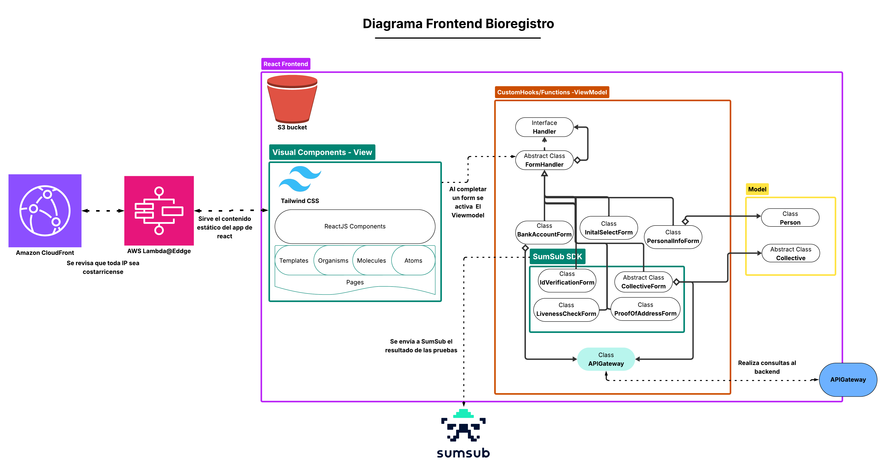

# Caso-3-Diseno

## 1. Planeamiento

En esta sección se detallan los aspectos relacionados con la comprensión del problema, la forma en que se dividirá el trabajo dentro del equipo, los hitos en los que se estructura el desarrollo del proyecto y los mecanismos que permitirán evaluar si se está avanzando conforme a lo planificado.

### 1.1 Estructura del Equipo, Stakeholders, Key Players

#### Estructura Interna

El equipo de trabajo consiste de 5 integrantes:

- Santiago Chaves Garbanzo
- Anthony Fuentes
- Luis David Blanco
- Gabriel Gutiérrez
- Jefferson Salas Cordero

Todos tenemos asignaciones distintas dentro del proyecto, pero como vamos a trabajar con metodología Kanban, cualquiera puede hacerse cargo de cualquier tarea. Basta con elegirla en ClickUp y ponerse a trabjar.

Además, una pieza muy importante en el proyecto será Rodrigo Núñez, el cuál actuará como Product Owner de Data Pura Vida, y consultor de diseño de software en caso de que tengamos algún tipo de duda.

#### Stakeholders y Key Players:

Se identificaron los principales actores que influyen o se ven afectados por el desarrollo de la plataforma. A continuación, se presenta una matriz que los muestra:


Como se puede observar, los principales interesados en que el proyecto avance son el Product Owner y el equipo de trabajo, ya que están comprometidos con lograr que el producto final cumpla con los objetivos planteados desde el inicio.

La población general, aunque no tiene un alto nivel de poder dentro del proyecto, demuestra un gran interés. Una plataforma de este tipo promovería la transparencia en el acceso a datos y aportaría a un Costa Rica con mayor disponibilidad de información para todos (incluso aunque parte del contenido sea privado).

Por otro lado, el actor con mayor poder es el gobierno, al ser quien financia el proyecto. Su interés se considera moderado, posiblemente por cierto escepticismo respecto al impacto que la plataforma podría tener sobre su reputación.

Finalmente, aquellos actores que incurren en prácticas como el lavado de dinero o evasión fiscal son los menos interesados, ya que el sistema ofrecería mayor visibilidad sobre los datos, lo cual podría exponer dichas irregularidades.

Ahora bien, ya que se conocen los stakeholders principales se puede evidenciar que los key players son tanto el Product Owner, como el Equipo de trabajo, ya que serán los encargados de que el proyecto tenga exito.

#### Sistemas y Ecosistemas de Software Existentes:

En Costa Rica no existe ningún sistema ni ecosistema previo que funcione como antecedente directo de Data Pura Vida, por lo que no se anticipan problemas de integración con plataformas existentes. Si bien existen herramientas puntuales, como el API del TSE para consultas por cédula, estas no representan un obstáculo, ya que los requerimientos del proyecto contemplan la capacidad del sistema para aceptar datos provenientes de APIs externas.

### 1.2 Gestión de la Comunicación y Documentación del proyecto

Para la comunicación interna del equipo se utilizará Slack. A través de esta herramienta se coordinará la asignación de tareas en ClickUp, y también se notificará cuando una tarea haya sido finalizada. Antes de marcarla como completada, la tarea deberá pasar al estado de "Esperando Aprobación" en ClickUp, para que Rodrigo pueda revisarla y aprobarla.

Además, se utilizará Discord para realizar al menos una reunión semanal, en la cual se discutirán avances generales del proyecto. En caso de surgir dudas más complejas, se invitará al profesor para que pueda brindar orientación.

La documentación principal del proyecto se mantendrá en el README del repositorio de GitHub Chagui05/Caso-3-Diseno. En ese archivo se incluirán todos los detalles relevantes. Si existieran anexos, como la hoja de requerimientos o la entrevista con el profesor, se agregarán al mismo repositorio en archivos separados con nombres descriptivos, y se hará referencia a ellos desde el README. Toda la documentación será escrita en formato Markdown.

### 1.3 Entendimiento del problema

Para entender adecuadamente el problema, el equipo realizó una entrevista al Product Owner, basada en una serie de preguntas que surgieron tras revisar la especificación del proyecto. Las respuestas obtenidas fueron registradas en el archivo RespuestaEntrevista, y permitieron extraer información clave, como por ejemplo:

- La plataforma debe permitir el registro de personas físicas primero, y luego dar la posibilidad de vincularlas como administradoras de organizaciones.
- La validación de cuentas puede involucrar múltiples métodos: revisión manual, validaciones automatizadas y uso de servicios externos como SumSub.
- La inclusión de IBAN y datos de tarjetas en el registro busca filtrar usuarios no comprometidos y evitar registros superficiales.
- Se recomienda restringir el acceso por IP solo a la sección de registro, o permitir el registro de IPs confiables para quienes estén en el extranjero.
- Los datos cargados (sin importar el origen) deben convertirse a un formato unificado tras aplicar el proceso ETDL (relacional, documental, etc.).
- El sistema debe validar estructura, formato y contenido de los datasets, considerando reglas como formatos de fechas, booleanos y tipos de datos.
- El motor de visualización de dashboards debe permitir a los usuarios crear sus propios paneles, compartirlos y gestionarlos.
- La arquitectura de backend puede ser definida libremente por el equipo (monolítica o microservicios), según convenga al diseño general.
- Se permite la integración con herramientas de IA, siempre que se respeten los criterios de autorización definidos por la administración de la plataforma.
- El portal web de backoffice será administrado por una organización gubernamental registrada dentro del sistema, actuando como custodio de la información.

A partir de esta información, se desarrollaron los siguientes diagramas de flujo que ilustran las tareas clave identificadas dentro del sistema:

- Diagrama de registro:

El siguiente diagrama presenta una visión general del proceso de registro en nuestra plataforma. No incluye detalles técnicos ni especificaciones sobre los campos dinámicos que varían según el tipo de entidad registrada; su objetivo es ilustrar de forma abstracta y comprensible cómo se estructura el flujo de registro dentro del sistema.


- Diagrama de Ingesta y configuración de un dataset

Subir y configurar un dataset en la plataforma no es nada trivial, por eso se armaron estos dos diagramas que separan el proceso en dos partes.

El primer diagrama muestra cómo se le pide al usuario que suba el dataset: qué datos tiene que dar, qué información se necesita para la IA, y cómo se valida el archivo que subió (formato, estructura, nombres de columnas, etc.).


El segundo diagrama arranca una vez que el dataset ya fue validado. Ahí se definen cosas como si el conjunto de datos va a ser público, privado o de pago, y qué métodos de acceso y cobro se van a aplicar.


Es importante aclarar que en el diagrama II no se detalla paso a paso lo que hace el motor ETDL, pero sí se deja claro que va a encargarse de tareas como: detectar duplicados, relacionar datos con otros ya cargados, ajustar el modelo según las conexiones que encuentre, y aplicar automáticamente un flujo con extracción, transformación, limpieza, detección de contexto, modelado y carga con ayuda de AI.

#### Componentes del Sistema

Con el fin de lograr una arquitectura modular, segura y mantenible, el sistema se divide en macrocomponentes. Cada uno aborda un conjunto específico de requerimientos funcionales y no funcionales. En esta sección se listan los componentes y sus principales responsabilidades. La implementación técnica y subdivisión de estos se detalla más adelante en el documento.

##### Bioregistro

Este módulo gestiona el proceso de incorporación de personas físicas y jurídicas a la plataforma. Abarca desde el llenado de formularios hasta la validación de identidad y la emisión de credenciales digitales. Debe cumplir con regulaciones AML y estándares avanzados de identidad digital.

Requerimientos:

- El componente debe permitir el registro de personas físicas, jurídicas, instituciones, cámaras, grupos y empresas.
- El formulario de registro debe adaptarse dinámicamente según el tipo de entidad seleccionada.
- El registro de usuarios debe estar asegurado con MFA y biometría, cumpliendo estándares de identidad digital avanzada.
- El componente debe solicitar y capturar información personal, societaria, legal y tributaria según el tipo de entidad.
- El componente debe revisar que cuando se van a asignar personas físicas a la organización al crearla, efectivamente formen parte de dicho conjunto.
- El registro debe pasar por una etapa de validación interna manual para el registro de empresas
- El componente debe implementar validación automática por inteligencia artificial de los documentos subidos.
- El componente debe exigir a los representantes legales el registro como individuos con: identidad digital, biometría, prueba de vida y autenticación multifactor (MFA).
- Cada organización debe recibir llaves de seguridad que le permitan delegar o revocar accesos a sus usuarios.
- Un usuario debe poder administrar múltiples organizaciones desde una única cuenta.
- El componente debe capturar datos preliminares de cuentas IBAN y/o tarjetas de crédito como parte del registro.
- El componente debe enviar una notificación por correo electrónico cuando un registro sea aprobado.
- El componente debe exigir documentos específicos según el tipo de entidad: cédulas físicas o jurídicas, actas, RTN, dirección, etc.
- El componente debe permitir registrar direcciones IP institucionales (listas blancas) para permitir acceso autorizado.
- El componente debe permitir únicamente IPs costarricenses en el registro
- El sistema debe proteger las claves generadas mediante un esquema de llave tripartita, distribuidas entre Data Pura Vida y dos custodios.

##### La Bóveda

La Bóveda es el almacén central de datos del sistema, diseñado para ser seguro, escalable y auditable. Unifica todos los datos cargados, sin importar su formato de origen, y permite relaciones entre datasets. Cifra la información en tránsito y reposo, controla el acceso por roles y entidades, y mantiene trazabilidad completa del uso y movimientos de los datos. Está pensada para soportar millones de registros con alto rendimiento y cumplir estándares de gobierno de datos.

Requerimientos:

- La Bóveda tiene que almacenar los datos en un solo formato, por más de que las fuentes externas sean de distintos tipos (relacionales, documentales, csv, excel)
- La Bóveda debe permitir especificar columnas que relacionan un dataset con otros datasets del ecosistema.
- La Bóveda debe de estar monitoreada en todo momento para detectar movimientos sospechosos, para dar contenido de uso de un dataset, y para asegurar trazabilidad y diagnóstico rápido de fallas.
- Debe ser resiliente, auditable y alineado con estándares de gobierno de datos.
- Debe permitir crecimiento dinámico sin perder eficiencia.
- Debe escalar a millones de registros y miles de usuarios concurrentes.
- Mantener trazabilidad de datos usados, no usados y descartados.
- Todos los datos cargados deben estar protegidos mediante cifrado, incluso frente al personal técnico ("ingenieros de la plataforma").
- Cifrar toda la data en tránsito y en reposo, dejando trazabilidad auditable.
- Permitir almacenamiento masivo de datos estructurados y semiestructurados.
- Controlar accesos lógicos por entidad, usuario o tipo de dato.
- Implementar control de acceso a nivel de rol (RBAC) y a nivel de fila (RLS) o equivalentes.

##### Centro de Carga

Este módulo permite a los usuarios cargar sus datasets a la plataforma. Desde acá pueden definir qué datos desean cifrar, especificar el formato de origen y configurar otros parámetros clave para asegurar que la carga se procese correctamente.

Requerimientos:

- Permitir a los usuarios decidir qué datos compartir dentro del ecosistema.
- Requerir que cada dataset tenga un nombre único.
- Soportar múltiples métodos de carga de datos: archivos Excel, CSV, JSON, APIs y conexiones directas a bases de datos SQL y NoSQL.
- Requerir nombre, descripción y metadata útil para IA sobre las columnas del dataset.
- Permitir configurar los parámetros de conexión de forma cifrada para cada medio de carga.
- Los parámetros de conexión de bases de datos y APIs deben almacenarse de forma cifrada.
- Permitir configurar si el dataset es público o privado, gratuito o pagado, permanente o con disponibilidad temporal.
- El sistema de permisos debe prevenir accesos no autorizados a datasets privados o pagos.
- Asignar permisos de acceso a los datasets privados.
- Permitir definir montos de acceso para datasets con modelo de cobro.
- Restringir acceso a datos por tiempo, volumen o frecuencia de consulta.
- Indicar si la carga es única o recurrente, completa o por deltas.
- Configurar parámetros para carga por deltas: campos diferenciales, frecuencia (timed pull) o mediante callbacks.
- Habilitar control granular de acceso por institución, persona o grupo.

##### Motor de Transformación

Este módulo es clave para garantizar que los datasets se almacenen correctamente en la Bóveda. Se encarga de recibir datos desde distintas fuentes, validar que el formato coincida con el indicado en el formulario de ingesta y, en caso contrario, rechazar la carga. Una vez superada esta validación, aplica todo el proceso de ETDL y mapea los datos al formato interno de la Bóveda.

Requerimientos:

- Validar el formato, estructura y contenido de cada dataset cargado sea correcto, o bien adaptarlo al interno de la Bóveda (formatos de fecha, booleans, etc.).
- Validar el formato, estructura y contenido de cada dataset cargado coincida con lo especificado en el proceso de carga.
- Automatizar el proceso de carga mediante un motor de IA que aplique un flujo ETDL (extracción, transformación, limpieza, detección de contexto, modelado y carga).
- Aplicar IA para normalizar, rediseñar modelos de datos y vincularlos automáticamente.
- Detectar duplicidades, optimizar relaciones y ajustar el modelo de datos automáticamente según las interrelaciones detectadas.
- Monitorear el proceso completo con métricas de transferencia, carga, limpieza, eliminación, modelado, volumen, datos omitidos, datos consultados y tasa de éxito.
- El sistema debe ser capaz de procesar cargas recurrentes y automatizadas sin intervención manual.
- Soportar cargas delta con identificación de cambios.
- Realizar merges eficientes sin pérdida de integridad.

##### Centro de Visualización y Consumo

Este módulo está compuesto por 3 subcomponentes clave:

1. **Generador de dashboards**: permite a los usuarios diseñar y crear gráficos de forma rápida y amigable para visualizar cualquier dataset.

Requerimientos:

- El sistema debe permitir la construcción de dashboards personalizados de forma manual.
- El sistema debe permitir construir dashboards manualmente o mediante prompts inteligentes que generen visualizaciones automáticas.
- El sistema debe permitir representar visualmente los datos en tablas, gráficos, conteos, tendencias y predicciones.
- El sistema debe permitir a los usuarios guardar sus dashboards personalizados.
- El sistema debe permitir compartir dashboards con otros usuarios o hacerlos públicos dentro de la plataforma.
- La interfaz de construcción de dashboards debe ser segura, intuitiva y con capacidad de respuesta en tiempo real.

2. **Visualización y Consumo**: ofrece una interfaz para revisar esas visualizaciones y realizar análisis de datos directamente sobre los dashboards.

Requerimientos:

- El sistema debe permitir visualizar todos los datasets accesibles como una fuente consolidada.
- El sistema debe bloquear toda exportación directa de datos y gráficos desde el portal.
- El sistema debe mostrar datos de forma preliminar en modo de construcción de dashboard y luego con datos reales al ejecutar consultas
- El sistema debe deshabilitar temporalmente el acceso a datasets cuando se superen los límites de consumo.
- El sistema debe registrar todas las transacciones y consumos de datos en un historial accesible para cada usuario.
- El sistema debe mostrar métricas de uso: volumen de datos consultados, número de consultas realizadas, tiempo restante o límites alcanzados.
- El sistema no debe permitir en ningún momento la descarga directa de datasets o gráficos generados.
- La visualización de datos debe realizarse exclusivamente dentro del portal, sin opciones de exportación, captura o embedding externo.
- Los límites de consumo deben aplicarse en tiempo real, sin permitir bypasses o reintentos abusivos.

3. **Consumo para IA**: Este subcomponente es el regulador de consumo de IA, define límites y los métodos de ingesta disponibles desde el sistema para los usuarios.

Requerimientos:

- El sistema debe permitir el acceso sistema a sistema únicamente para alimentar modelos de IA aprobados.
- La entrega de datos para modelos de IA debe ser monitoreada, registrada y limitada a contextos aprobados explícitamente por Data Pura Vida.
- El sistema debe ofrecer plataformas limitadas y controladas para esta alimentación de IA. Solo permitirá 2 por usuario.
- El sistema debe minimizar al máximo el riesgo de descargas indirectas mediante presunción de uso en IA.
- Los datos deben ser envíados en un formato que no permita poder ser desencriptado para otro uso que no sea alimentar IA (por ejemplo uso de embeddings).

##### Marketplace

Este módulo está enfocado en ofrecer una interfaz amigable que permita a los usuarios encontrar datasets de forma eficiente, con descripciones claras y navegación fluida. Además, incluye una sección adicional para buscar dashboards creados por otros usuarios, facilitando el descubrimiento y reutilización de visualizaciones dentro de la plataforma.

Requerimientos:

- La experiencia de compra de datasets debe ser fluida, transparente y accesible desde los dashboards personales.
- Incluir un módulo de compra donde se visualicen datasets disponibles bajo acceso pagado.
- Permitir seleccionar un dataset, visualizar precio, términos de uso, duración del acceso y condiciones de cobro.
- Soportar múltiples métodos de pago: tarjeta de crédito, débito y otros mecanismos nacionales compatibles.
- Mostrar confirmaciones de transacción y activar el acceso según condiciones (tiempo, volumen, frecuencia).
- El sistema debe mostrar opciones para renovar o ampliar los paquetes de acceso en caso de superar el límite.

##### Backoffice Administrativo

Este módulo concentra las herramientas de backoffice necesarias para la gestión integral de la plataforma. Su enfoque está en el control, la seguridad, la gobernanza de datos y la trazabilidad completa de las operaciones.

Requerimientos:

- Administrar usuarios: validación de identidad, membresía y roles.
- Gestionar reglas de carga de datos (formatos, estructuras, validaciones).
- Configurar conexiones externas (APIs, BDs, callbacks).
- Activar, desactivar y supervisar objetos de datos, pipelines y flujos.
- Revocar o regenerar llaves de seguridad (simétricas, asimétricas, tri-partitas).
- Administrar custodios de llaves y flujos de confirmación mancomunada.
- Auditar operaciones por usuario, fecha, acción y resultado.
- Generar reportes de uso, calidad, integración y anomalías.
- Monitorear el estado operativo de servicios y tareas.
- Extraer evidencias para procesos legales bajo autorización.
- Gestionar permisos y accesos mediante RBAC.
- Debe ofrecer una interfaz robusta y segura solo para personal autorizado.
- Debe permitir gestión flexible pero estricta de accesos y configuraciones.

#### Prototipado

Se desarrolló un prototipo funcional de la página del Bioregistro Verde con el objetivo principal de probar el comportamiento de los formularios dinámicos. Este prototipo no incluye procesos de prueba de vida ni captura de datos biométricos, y tampoco recolecta la información final que se almacenará en el sistema definitivo. Su propósito es demostrar, a alto nivel, cómo el formulario se adapta dinámicamente según las selecciones del usuario.

A continuación las imágenes del flujo de recolección de data de una persona física:


Además, se adjunta el proceso de registar compañía pública:


Si deseá probar el prototipo visite el siguiente [link](https://gentle-signup-wizard.lovable.app/).

### 1.4 Customer Journeys

Este Service Blueprint representa el recorrido completo de un ciudadano dentro del ecosistema Data Pura Vida, desde el descubrimiento de la plataforma hasta la creación, publicación y monitoreo de un dashboard personalizado con datos públicos.

El diagrama detalla no solo las acciones del usuario, sino también los touchpoints del sistema, los procesos internos (backstage) y las herramientas de soporte involucradas en cada etapa. Además, se integran las emociones del usuario para identificar oportunidades de mejora en la experiencia.

Las líneas de interacción, visibilidad e interacción interna permiten visualizar claramente los límites entre lo que el ciudadano ve, lo que ocurre detrás del sistema y las herramientas tecnológicas que lo sustentan.

Este blueprint se organiza en **seis** fases principales:

1. Conciencia: El ciudadano conoce la existencia de la plataforma.

2. Ingreso: Accede y se autentica de forma segura.

3. Exploración: Navega los datasets disponibles.

4. Creación: Construye un dashboard visual con datos abiertos.

5. Publicación: Comparte su dashboard con otros usuarios.

6. Monitoreo: Consulta métricas de visualización y uso.b


Este Service Blueprint representa el recorrido completo de una empresa dentro del ecosistema Data Pura Vida, desde el descubrimiento de la plataforma hasta la publicación y monitoreo de un dataset privado con fines de monetización.

Este blueprint se organiza en siete fases principales:

1. Conciencia: La empresa conoce la plataforma y sus posibilidades de monetización.

2. Registro: Se registra como entidad jurídica mediante un proceso validado.

3. Carga de datos: Sube su dataset en formatos compatibles como archivos o APIs.

4. Configuración: Define permisos, privacidad, cifrado y condiciones de acceso.

5. Validación de valor: Evalúa la calidad y el potencial del dataset con ayuda de IA.

6. Publicación: Hace público el dataset con opciones de pago o acceso controlado.

7. Monitoreo: Supervisa ingresos, visualizaciones y transacciones en tiempo real.


**Fases principales:**

1. Registro: Un representante oficial crea una cuenta institucional y sube los documentos requeridos.
2. Validación: La plataforma aplica validaciones automáticas y manuales con ayuda de IA.
3. Configuración: La institución decide qué datos compartir y con qué restricciones.
4. Carga: Se conecta una base de datos externa para carga automatizada.
5. Publicación: El dataset queda disponible para actores autorizados mediante pago.
6. Seguimiento: La institución consulta métricas de acceso y consumo.


### 1.5 Plan de ejecución del proyecto

#### Plan de Diseño

El proyecto se estructura en cinco hitos principales que marcarán su progreso:

- Planeamiento del Proyecto
- Supuestos del Proyecto
- Stack Tecnológico
- Diseño de los Componentes
- Validación de los requerimientos

Cada uno de estos hitos cuenta con un plazo definido para su ejecución, lo cual se puede observar en el siguiente diagrama de Gantt:


Dentro de cada hito se contemplan varias tareas. Cada integrante del equipo debe seleccionar una tarea según su disponibilidad. Un hito se considera finalizado únicamente cuando todas sus tareas han sido completadas y se encuentran en el tablero de completado en ClickUp.

Además, como se indicó anteriormente, se realizarán reuniones semanales para verificar que el proyecto avance conforme al plan establecido.

Además, como se dijo previamente, se harán reuniones semanales para verificar que el proyecto se esté realizando según lo dice el plan.

#### Plan de Ejecución para Desarrolladores

Este plan indica cómo avanzar progresivamente en la construcción del sistema, desde preparar el entorno hasta desplegar y probar los módulos principales. No detalla cómo funciona cada módulo, sino cómo se implementan y conectan entre sí, con sus respectivos entregables por etapa.

##### 1. Preparación del Entorno de Desarrollo

**Objetivo:** Sentar las bases para que todo el equipo trabaje de forma coordinada, segura y replicable.

**Actividades:**

- Establecer repositorio con control de versiones.
- Configurar ambientes separados para desarrollo, pruebas y producción.
- Montar infraestructura local (contenedores, redes internas, secretos).
- Habilitar flujos básicos de CI/CD y documentación técnica inicial.

**Entregables:**

- Repositorio con estructura base.
- Manual de instalación local y buenas prácticas.
- Plantilla de CI/CD con al menos una validación básica.
- Ambiente de desarrollo replicable con un comando (ej. Docker Compose).

##### 2. Implementación del Bioregistro

**Objetivo:** Habilitar la incorporación de personas físicas y jurídicas a la plataforma.

**Actividades:**

- Crear formulario de registro adaptativo por tipo de entidad.
- Implementar simulaciones de validación automática y revisión manual.
- Gestionar jerarquías usuario–organización y generación de llaves.
- Activar sistema de notificaciones y control geográfico básico.

**Entregables:**

- Flujo funcional de registro completo.
- Formulario con lógica adaptativa por entidad.
- Simulación de validaciones automáticas y manuales.
- Sistema de emisión de llaves y notificación por correo.

##### 3. Habilitar el Centro de Carga de Datos

**Objetivo:** Permitir a los usuarios cargar datasets desde distintas fuentes.

**Actividades:**

- Desarrollar interfaz de carga de archivos (CSV, Excel, JSON).
- Capturar metadatos básicos (nombre, descripción, privacidad, etc.).
- Simular conexión con bases de datos externas.
- Almacenar cargas en espacio temporal con trazabilidad.

**Entregables:**

- Módulo de carga funcional con validaciones mínimas.
- Interfaz para configuración de metadatos y privacidad.
- Log de cargas realizadas para trazabilidad.
- Cargas almacenadas provisionalmente.

##### 4. Desarrollar el Motor de Transformación

**Objetivo:** Procesar los datos cargados, limpiarlos y convertirlos a un formato interno.

**Actividades:**

- Validar estructura y contenido de cada carga.
- Aplicar lógica básica de transformación (normalización, fechas, duplicados).
- Generar versiones limpias de los datos.
- Conectar a almacenamiento de datos validado (La Bóveda).

**Entregables:**

- Flujo de transformación activo con trazabilidad.
- Reportes de validación y errores por dataset.
- Datos transformados almacenados de forma estructurada.
- Métricas básicas del proceso (tiempo, éxito, errores).

##### 5. Configurar La Bóveda

**Objetivo:** Consolidar y proteger los datos procesados para su consumo posterior.

**Actividades:**

- Crear repositorio único para los datasets internos.
- Implementar segmentación de acceso por rol, entidad y tipo de dato.
- Establecer cifrado básico en tránsito y reposo.
- Documentar relaciones entre datasets si aplica.

**Entregables:**

- Sistema de almacenamiento central con control de accesos.
- Datasets organizados y protegidos.
- Trazabilidad de acceso a cada dataset.
- Esquema inicial de relaciones entre datasets (si corresponde).

##### 6. Activar la Visualización y los Dashboards

**Objetivo:** Permitir a los usuarios explorar datos mediante gráficos sin exportarlos.

**Actividades:**

- Crear constructor básico de dashboards con tablas y gráficos.
- Activar vistas previas con datos ficticios y reales.
- Controlar consumo (frecuencia, volumen, consultas).
- Habilitar compartir dashboards con otros usuarios.

**Entregables:**

- Módulo visual con constructor de dashboards funcional.
- Dashboards guardables y compartibles.
- Lógica de límites de uso aplicada.
- Registro de interacciones y consultas realizadas.

##### 7. Simular el Consumo para Modelos de IA

**Objetivo:** Simular acceso regulado a datasets por sistemas externos autorizados.

**Actividades:**

- Definir reglas de uso y límites por usuario y contexto.
- Habilitar endpoints simulados para "entrenamiento" de IA.
- Registrar y auditar cada consulta o consumo.
- Aplicar restricciones estrictas para evitar abuso.

**Entregables:**

- API simulada para consumo por IA.
- Sistema de seguimiento y límites aplicado.
- Log de accesos con usuario, contexto y volumen consultado.
- Validación de cumplimiento de reglas definidas.

##### 8. Prototipar el Marketplace de Datos

**Objetivo:** Permitir explorar, adquirir y acceder a datasets bajo condiciones.

**Actividades:**

- Crear buscador y navegador de datasets públicos y pagos.
- Mostrar precios, términos y opciones de compra.
- Simular proceso de adquisición y activación de accesos.
- Gestionar historial de compras y permisos vigentes.

**Entregables:**

- Interfaz funcional del marketplace.
- Flujo de compra simulado con activación de acceso.
- Historial de transacciones por usuario.
- Permisos temporales aplicados tras cada compra.

##### 9. Activar el Backoffice Administrativo

**Objetivo:** Brindar herramientas de gestión y supervisión al equipo administrador.

**Actividades:**

- Crear panel seguro para personal autorizado.
- Visualizar registros, cargas y actividad por componente.
- Permitir aprobación/rechazo de registros y cargas.
- Generar reportes y estadísticas de uso.

**Entregables:**

- Panel de administración con control de usuarios y datos.
- Visualización de actividad y estado del sistema.
- Herramientas para revisión y auditoría básica.
- Generación de reportes automáticos.

##### 10. Pruebas Integradas y Simulación de Casos Reales

**Objetivo:** Asegurar que todo funcione de forma integrada.

**Actividades:**

- Simular flujos completos: registro → carga → transformación → consumo.
- Usar casos reales o sintéticos para testear extremos del sistema.
- Validar reglas de permisos, límites y visualización.
- Documentar fallos, mejoras y tiempos de respuesta.

**Entregables:**

- Casos de prueba documentados.
- Resultados de pruebas con observaciones.
- Validación de flujos completos con usuarios simulados.
- Lista de bugs o ajustes para corregir.

##### 11. Despliegue Controlado y Evaluación

**Objetivo:** Publicar la plataforma en un entorno accesible para validación final.

**Actividades:**

- Preparar un entorno de pruebas compartido (local o nube).
- Desplegar todos los módulos de forma conectada.
- Habilitar usuarios de prueba para feedback externo.
- Preparar una demo pública o privada para presentación.

**Entregables:**

- Versión desplegada en entorno de pruebas.
- Acceso limitado para usuarios externos (testers/docentes).
- Feedback recolectado para iteración.
- Material de presentación o demo funcional lista.

### 1.6 WBS del sistema

Como parte del análisis inicial del sistema **Data Pura Vida**, se realizó una descomposición de alto nivel para identificar los límites del sistema y los actores involucrados. A continuación, se presenta el diagrama de contexto basado en las técnicas descritas para la identificación del sistema y sus límites:


Esta representación facilita el entendimiento general del sistema y servirá como base para la posterior descomposición en subsistemas, componentes funcionales y diseño arquitectónico detallado.

#### Propósito del diagrama

- **Identificación de límites del sistema:** El diagrama establece una frontera clara entre lo que está dentro y fuera del alcance del desarrollo, lo cual es crucial para evitar ambigüedades durante el diseño detallado.

- **Visualización de los actores externos:** Permite entender quiénes interactúan con el sistema y con qué propósito.

- **Detección de puntos de integración:** Ayuda a anticipar necesidades de interoperabilidad, seguridad, formatos de intercambio de datos y protocolos de comunicación.

#### Consideraciones adicionales

Este diagrama será utilizado como punto de partida para:

- La descomposición en subsistemas o módulos funcionales, agrupando responsabilidades afines.

- La definición de casos de uso y escenarios de interacción.

- La elaboración de la arquitectura técnica, donde se identificarán servicios, componentes y flujos de datos internos.

En resumen, este modelo de contexto es una herramienta clave para asegurar un entendimiento compartido del dominio del problema y sentar las bases de una solución técnica coherente, escalable y alineada con los objetivos del proyecto.

### 1.7 Evaluación de Riesgos

#### Metodología ISO 31000

La evaluación de riesgos sigue los principios de **ISO 31000** para la gestión de riesgos del proyecto Data Pura Vida.

#### Marco de Evaluación:

La evaluación de riesgos utiliza una matriz de probabilidad versus impacto basada en criterios específicos del proyecto Data Pura Vida y su contexto de diseño de sistemas complejos.

#### Escala de probabilidad:

- Muy Alta (100%) : Es prácticamente seguro que el riesgo ocurrirá durante el proyecto (9 de cada 10 proyectos similares)
- Alta (80%) : Es muy probable que el riesgo se materialice (7-8 de cada 10 casos)
- Medios (60%) : Hay una posibilidad moderada de que ocurra (5-6 de cada 10 casos)
- Baja (40%) : Es poco probable pero posible que suceda (3-4 de cada 10 casos)
- Muy Baja (20%) : Es muy poco probable que se materialice (1-2 de cada 10 casos)

#### Escala de Impacto:

- Muy Alto (100%) : Falla completa del proyecto, rediseño total necesario, o retraso superior a 4 semanas
- Alto (80%) : Compromete objetivos principales del proyecto, retraso de 2-4 semanas, o afecta múltiples componentes críticos
- Medio (60%) : Afecta la calidad del diseño o genera retraso de 1-2 semanas, requiere trabajo adicional significativo
- Bajo (40%) : Impacto menor en cronograma (3-7 días) o calidad, se puede resolver con ajustes menores
- Muy Bajo (20%) : Impacto mínimo (menos de 3 días), no afecta objetivos principales del proyecto

#### Riesgos para el Diseño de Data Pura Vida

| ID      | Categoría         | Riesgo                                               | Descripción Detallada                                                                                                                                                                           | Probabilidad        | Impacto             | Clasificación   | Estrategia     | Plan de Respuesta                                                                                                                                                                                                                                                                                                                                                                                                                  |
| ------- | ----------------- | ---------------------------------------------------- | ----------------------------------------------------------------------------------------------------------------------------------------------------------------------------------------------- | ------------------- | ------------------- | --------------- | -------------- | ---------------------------------------------------------------------------------------------------------------------------------------------------------------------------------------------------------------------------------------------------------------------------------------------------------------------------------------------------------------------------------------------------------------------------------- |
| **R01** | **Diseño**        | **Complejidad arquitectónica del ecosistema**        | Diseñar una arquitectura que integre efectivamente portal web, API backend, datalake, backoffice y múltiples sistemas de seguridad requiere experiencia en arquitecturas distribuidas complejas | **Muy Alta (100%)** | **Muy Alto (100%)** | **🔴 EXTREMO**  | **MITIGAR**    | **Prevención:** Definir máximo 5 patrones arquitectónicos (Semana 1), crear ADRs (Architecture Decision Records) para cada decisión, revisión arquitectónica obligatoria cada viernes 1h con validación técnica<br>**Contingencia:** Crear spike de 16h para diseñar arquitectura simplificada (3 capas: Frontend-API-Data), eliminar microservicios y usar monolito modular, reducir integraciones complejas a APIs REST estándar |
| **R02** | **Alcance**       | **Subestimación del alcance del diseño**             | El tiempo asignado puede ser insuficiente para diseñar completamente todos los componentes técnicos con el nivel de detalle requerido para un sistema de esta magnitud                          | **Muy Alta (100%)** | **Medio (60%)**     | **🟠 ALTO**     | **MITIGAR**    | **Prevención:** Planning Poker diario 30min, re-estimación miércoles, time tracking obligatorio en ClickUp, descomponer tareas en máximo 8h cada una<br>**Contingencia:** Si desvío > 150% en 3 tareas: reducir nivel de detalle en diagramas de secuencia (de completos a conceptuales), simplificar especificaciones APIs (menos endpoints), priorizar componentes críticos primero, redistribuir trabajo en 1 día               |
| **R03** | **Documentación** | **Inconsistencias en la documentación técnica**      | Generar documentación técnica coherente entre arquitectura de alto nivel, especificaciones de APIs, modelos de datos, diagramas de seguridad y patrones de integración                          | **Alta (80%)**      | **Alto (80%)**      | **🟠 ALTO**     | **MITIGAR**    | **Prevención:** Templates estándar GitHub, peer review obligatorio, checklist calidad por componente<br>**Contingencia:** Auditoría documental semanal viernes 2h, refactoring inmediato de documentos inconsistentes, responsable: Santiago Chaves                                                                                                                                                                                |
| **R04** | **Tiempo**        | **Cronograma optimista para la complejidad**         | El tiempo asignado puede ser insuficiente para diseñar completamente todos los componentes técnicos con el nivel de detalle requerido para un sistema de esta magnitud                          | **Muy Alta (100%)** | **Medio (60%)**     | **🟠 ALTO**     | **MITIGAR**    | **Prevención:** Re-estimación semanal con burndown charts, escalación automática si > 20% desvío, buffer de 2 días por semana<br>**Contingencia:** Redistribuir tareas inmediatamente, asignar 2 personas a componentes críticos (Bio Registro y La Bóveda), reducir documentación detallada a documentación funcional, completar diseño básico de todos los componentes                                                           |
| **R05** | **Técnico**       | **Complejidad del motor de transformación**                | Especificar técnicamente un motor que procese automáticamente múltiples formatos, detecte duplicados, relacione datos y aplique transformaciones inteligentes es altamente complejo             | **Media (60%)**     | **Muy Alto (100%)** | **🟠 ALTO**     | **MITIGAR**    | **Prevención:** Spike 16h Apache Spark + PySpark (Luis David), prototipo 3 casos (CSV→PostgreSQL, JSON→S3, API→DynamoDB), validar 10MB en <30min<br>**Contingencia:** Motor simplificado con AWS Glue + transformaciones predefinidas, o integración Talend Open Studio (setup 1 semana)                                                                                                                                           |
| **R06** | **Seguridad**     | **Diseño de sistema de cifrado tripartito**          | Especificar correctamente un sistema de llaves criptográficas divididas entre tres custodios, incluyendo protocolos de recuperación y validación mancomunada                                    | **Baja (40%)**      | **Muy Alto (100%)** | **🟠 ALTO**     | **TRANSFERIR** | **Prevención:** Consulta expertos criptografía (8h consultoría), documentar estándares FIPS 140-2, validación externa con especialista<br>**Contingencia:** Implementar cifrado HSM tradicional AWS KMS, esquema dual en lugar de tripartito, mantiene seguridad pero reduce complejidad                                                                                                                                           |
| **R07** | **Integración**   | **Interfaces entre componentes mal definidas**       | Riesgo de que las especificaciones de APIs, contratos de datos y protocolos de comunicación entre portal, backend y datalake no sean completamente compatibles                                  | **Media (60%)**     | **Alto (80%)**      | **🟠 ALTO**     | **MITIGAR**    | **Prevención:** Contratos OpenAPI 3.0 obligatorios, reuniones sync bi-semanales martes/viernes, diagramas de secuencia por flujo<br>**Contingencia:** Workshop alineación 4h si incompatibilidades detectadas, rediseño contratos en 2 días, validación cruzada inmediata                                                                                                                                                          |
| **R08** | **Escalabilidad** | **Arquitectura no preparada para la carga esperada** | El diseño puede no contemplar adecuadamente el manejo de millones de registros, miles de usuarios concurrentes y procesamiento de grandes volúmenes de datos                                    | **Baja (40%)**      | **Medio (60%)**     | **🟡 MODERADO** | **MITIGAR**    | **Prevención:** Definir límites técnicos concretos por componente (Bio Registro: 100 req/min, La Bóveda: 10GB/día), especificar patrones de escalabilidad (load balancers, auto-scaling), calcular capacidad mínima requerida<br>**Contingencia:** Rediseñar arquitectura con clustering activo/pasivo, implementar sharding en diseño de BD, especificar CDN y caching layers, definir estrategia de particionamiento horizontal  |
| **R09** | **Recursos**      | **Disponibilidad limitada del Product Owner**        | El Product Owner puede no estar disponible para validar decisiones arquitectónicas críticas o para resolver ambigüedades en los requerimientos técnicos                                         | **Media (60%)**     | **Bajo (40%)**      | **🟡 MODERADO** | **ACEPTAR**    | **Prevención:** Agenda fija martes/viernes, decisiones escritas en Slack, timeboxing 24h para respuestas<br>**Contingencia:** Escalación a stakeholders si > 48h sin respuesta, decisiones técnicas por equipo con validación posterior, documentar en GitHub para trazabilidad                                                                                                                                                    |
| **R10** | **Coordinación**  | **Diseños de componentes desconectados**             | Los diferentes integrantes del equipo pueden diseñar sus componentes sin suficiente coordinación, resultando en interfaces incompatibles o duplicación de funcionalidades                       | **Media (60%)**     | **Medio (60%)**     | **🟡 MODERADO** | **MITIGAR**    | **Prevención:** Sincronización semanal viernes 1h, documentación centralizada GitHub, daily stand-ups 15min<br>**Contingencia:** Workshop alineación medio día si interfaces incompatibles, rediseño coordinado 3 días máximo, matriz de dependencias actualizada                                                                                                                                                                  |

### 1.8 Definición de KPIs

#### KPIs por Hito del Proyecto

##### Hito 1: Planeamiento del Proyecto

**Período**: 18-22 Mayo 2025 (Semana W20)

| KPI                              | Métrica                            | Objetivo | Método de Recolección                              |
| -------------------------------- | ---------------------------------- | -------- | -------------------------------------------------- |
| **Cumplimiento de cronograma**   | % de tareas completadas a tiempo   | 100%     | ClickUp - estado de tareas vs. fechas planificadas |
| **Completitud de documentación** | % de entregables documentados      | 100%     | Revisión de README y archivos en GitHub            |
| **Participación del equipo**     | % de integrantes activos en tareas | 100%     | ClickUp - asignación y progreso de tareas          |
| **Validación del Product Owner** | % de entregables aprobados         | 100%     | Estado "Aprobado" en ClickUp                       |

##### Hito 2: Supuestos del Proyecto

**Período**: 25-31 Mayo 2025 (Semana W21)

| KPI                            | Métrica                              | Objetivo | Método de Recolección                            |
| ------------------------------ | ------------------------------------ | -------- | ------------------------------------------------ |
| **Cumplimiento de cronograma** | % de tareas completadas a tiempo     | 100%     | ClickUp - comparación fecha planificada vs. real |
| **Calidad de supuestos**       | Número de supuestos validados con PO | 100%     | Documentación de validaciones en Slack/GitHub    |
| **Identificación de riesgos**  | Número de riesgos documentados       | ≥10      | Matriz de riesgos actualizada                    |

##### Hito 3: Stack Tecnológico

**Período**: 1-7 Junio 2025 (Semana W22)

| KPI                               | Métrica                                       | Objetivo | Método de Recolección                        |
| --------------------------------- | --------------------------------------------- | -------- | -------------------------------------------- |
| **Cumplimiento de cronograma**    | % de tareas completadas a tiempo              | 100%     | ClickUp - estado vs. cronograma              |
| **Decisiones tecnológicas**       | % de tecnologías seleccionadas y justificadas | 100%     | Documentación técnica en GitHub              |
| **Factibilidad técnica**          | Prototipos de concepto funcionando            | ≥2       | Repositorio con ejemplos funcionales         |
| **Compatibilidad con requisitos** | % de requisitos cubiertos por stack           | 100%     | Matriz de trazabilidad requisitos-tecnología |

##### Hito 4: Diseño de los Componentes

**Período**: 8-14 Junio 2025 (Semana W23)

| KPI                               | Métrica                                   | Objetivo | Método de Recolección                 |
| --------------------------------- | ----------------------------------------- | -------- | ------------------------------------- |
| **Cumplimiento de cronograma**    | % de tareas completadas a tiempo          | 100%     | ClickUp - seguimiento diario          |
| **Cobertura de componentes**      | % de componentes diseñados vs. requeridos | 100%     | Documentación de arquitectura         |
| **Calidad del diseño**            | Revisiones aprobadas por PO               | 100%     | Estados de aprobación en ClickUp      |
| **Integración entre componentes** | % de interfaces definidas                 | 100%     | Diagramas de integración documentados |

##### Hito 5: Validación de los Requerimientos

**Período**: 15-21 Junio 2025 (Semana W24)

| KPI                            | Métrica                           | Objetivo | Método de Recolección             |
| ------------------------------ | --------------------------------- | -------- | --------------------------------- |
| **Cumplimiento de cronograma** | Entrega a tiempo                  | 100%     | Fecha de entrega final            |
| **Cobertura de requisitos**    | % de requisitos validados         | 100%     | Matriz de trazabilidad completa   |
| **Calidad de documentación**   | Checklist de atributos completado | 100%     | Revisión contra checklist oficial |
| **Aprobación final**           | Validación del Product Owner      | 100%     | Confirmación formal de aceptación |

#### KPIs Transversales del Proyecto

##### Gestión y Comunicación

| KPI                         | Métrica                        | Objetivo | Frecuencia de Medición |
| --------------------------- | ------------------------------ | -------- | ---------------------- |
| **Comunicación efectiva**   | Respuestas en Slack < 24h      | 90%      | Semanal                |
| **Reuniones semanales**     | Asistencia a reuniones         | 100%     | Semanal                |
| **Actualización de tareas** | Tareas actualizadas en ClickUp | Diario   | Diario                 |
| **Resolución de bloqueos**  | Tiempo promedio de resolución  | <48h     | Semanal                |

##### Calidad y Riesgos

| KPI                        | Métrica                             | Objetivo | Frecuencia de Medición |
| -------------------------- | ----------------------------------- | -------- | ---------------------- |
| **Gestión de riesgos**     | % de riesgos con plan de mitigación | 100%     | Semanal                |
| **Incidencias críticas**   | Número de riesgos materializados    | 0        | Semanal                |
| **Calidad de entregables** | % de entregables sin retrabajos     | 90%      | Por hito               |

#### Mecanismos de Recolección y Cálculo

##### Herramientas de Monitoreo

1. **ClickUp**: Seguimiento automático de tareas, tiempos y estados
2. **Slack**: Métricas de comunicación y tiempo de respuesta
3. **GitHub**: Commits, documentación y versiones
4. **Reuniones semanales**: Revisión manual de KPIs y ajustes


## 2. Supuestos del proyecto

### 2.1 Estándares y Regulaciones

Para el proyecto "Data Pura Vida", la revisión de estándares y regulaciones nacionales e internacionales es crucial para garantizar la legalidad, seguridad, privacidad y gobernanza de los datos. A continuación, se detalla la relevancia de cada una de las normativas mencionadas y cómo se aplican a los requerimientos de la plataforma:

#### 1. Ley 8968 (Costa Rica) - Ley de Protección de la Persona frente al Tratamiento de sus Datos Personales

Esta es la normativa nacional fundamental que rige la protección de datos personales en Costa Rica. "Data Pura Vida" debe cumplir íntegramente con sus disposiciones, dado que el sistema manejará una gran cantidad de datos personales de personas físicas y jurídicas.

##### Aplicación a los Requerimientos de la Plataforma:

##### Bioregistro:

##### ARTÍCULO 5.- Principio de consentimiento informado:\*\*REST, GraphQL,

El principio del consentimiento de información se regie por dos puntos importantes, a continuación, se mencionan los dos puntos y su aplicación dentro de la plataforma:

**Punto 1 - Obligación de informar**
Durante el proceso de registro en **Bio Registro Verde**, el sistema debe presentar de forma destacada y fácil de entender la siguiente información:

- La existencia de la base de datos **Data Pura Vida**.

- La finalidad clara de la recolección de datos (ej. validar identidad para operar en el ecosistema, permitir compartir/consumir datos, etc.).

- Los destinatarios de los datos (ej. otros usuarios del ecosistema con los que el usuario decida compartir, la administración de "Data Pura Vida").

- La obligatoriedad de ciertos datos (ej. cédula, información tributaria) y las consecuencias de no proporcionarlos (ej. imposibilidad de completar el registro o acceder a ciertas funcionalidades).

- Los derechos ARCO (Acceso, Rectificación, Cancelación y Oposición) y cómo ejercerlos dentro del portal. Esta información debe estar disponible antes de que el usuario envíe sus datos.

  **Punto 2 - Otorgamiento del consentimiento**
  El consentimiento para el tratamiento de datos debe ser expreso. "Bio Registro Verde" debe implementar un mecanismo de aceptación clara y explícita, como:

- Un checkbox de "Acepto los Términos y Condiciones y la Política de Privacidad" que el usuario debe marcar activamente.

- La documentación de este consentimiento debe almacenarse de forma segura, vinculada al registro del usuario.

- La autenticación avanzada (identidad digital, biometría, prueba de vida, MFA) y la validación documental automatizada por IA refuerzan la seguridad del proceso de consentimiento, asegurando que la persona que da el consentimiento es quien dice ser.

##### ARTÍCULOS 6 y 7 - Principio de calidad de la información; y Derechos que le asisten a la persona( Derechos ARCO ):

Estos principios garantizan que los datos sean apropiados y que los usuarios mantengan el control sobre su información.

**Aplicación a la Plataforma:**

Los datos solicitados (información personal, societaria, legal y tributaria) deben ser estrictamente necesarios y pertinentes para la creación y operación de una cuenta dentro del ecosistema **Data Pura Vida**.

La implementación de IA para verificar la completitud y validez de los documentos subidos (cédulas, actas, registros tributarios) es clave para asegurar la veracidad y exactitud de los datos, cumpliendo con el Artículo 6 (Principio de Calidad de la Información). Esto también ayuda a evitar la recolección de datos fraudulentos.

El portal debe ofrecer mecanismos claros y accesibles para que los usuarios puedan acceder, rectificar o solicitar la eliminación de sus datos personales, directamente desde su perfil o mediante un proceso de solicitud documentado, en cumplimiento con el Artículo 7 (Derechos ARCO). Esto incluye la posibilidad de actualizar información o cerrar cuentas.

##### ARTÍCULO 9 - Categorías particulares de los datos:

Aunque los requerimientos actuales del "Bio Registro Verde" no mencionan explícitamente la recolección de "datos sensibles" (como salud, origen racial, etc.), si el alcance de la plataforma evolucionara para incluirlos, "Data Pura Vida" deberá implementar garantías adicionales y obtener un consentimiento aún más explícito y específico para el tratamiento de estas categorías, según lo exige el Artículo 9 (Datos Sensibles).

##### ARTÍCULO 10 - Seguridad de los Datos:

Este artículo impone la obligación de proteger los datos de carácter personal y evitar su alteración, destrucción accidental o ilícita, pérdida, tratamiento o acceso no autorizado, así como cualquier otra acción contraria a esta ley al responsable de la base de datos.

Los requerimientos de seguridad del **Bioregistro** son una respuesta directa al Artículo 10 ( Seguridad de los datos):

- El uso de autenticación avanzada (identidad digital, biometría, prueba de vida, MFA) son medidas de seguridad lógicas para controlar el acceso.

- La asignación y protección de llaves de seguridad criptográficas (simétricas y asimétricas), incluyendo el sistema de llave tripartita, son medidas de seguridad lógicas esenciales para proteger la integridad y confidencialidad de la identidad y datos asociados.

- La restricción de acceso al portal solo desde direcciones IP ubicadas en Costa Rica, o mediante listas blancas de IPs institucionales, es una medida de seguridad lógica que limita el acceso geográfico y fortalece la protección contra accesos no autorizados.

- El cifrado de datos en reposo y en tránsito y el control de acceso estricto para ingenieros (para evitar acceso a datos en claro) son vitales para cumplir con el deber de confidencialidad y proteger la información sensible.

##### Feliz Compartiendo Datos:

##### ARTÍCULO 4.- Autodeterminación informativa:

La capacidad de los usuarios para gestionar sus datasets es central para este principio.

La sección **Feliz Compartiendo Datos** encarna el Artículo 4 (Autodeterminación Informativa) al permitir a los usuarios:

- Decidir qué datos compartir dentro del ecosistema
- Configurar la visibilidad del dataset (público o privado).
- Definir el modelo de acceso (gratuito o pagado).
- Establecer control granular sobre el acceso por institución, persona o grupo de actores.

Estas funcionalidades garantizan que el titular mantenga el control sobre el uso y la difusión de su información.

##### ARTÍCULO 6 - Principio de calidad de la información:

La Ley 8968 exige que la recolección y uso de datos sea proporcional a la finalidad.

Los requerimientos de **Feliz Compartiendo Datos** se alinean con el Artículo 6 (Principio de Calidad de la Información) al promover la minimización y el propósito limitado:

- La opción de seleccionar campos específicos a cifrar dentro del dataset permite a los usuarios proteger solo la información sensible, sin necesidad de cifrar todo, lo que se alinea con la minimización del tratamiento de datos sensibles.

- La capacidad de restringir acceso a datos por límites de tiempo, volumen o frecuencia de consulta asegura que el acceso y uso de los datos se realice únicamente para la finalidad acordada y bajo las condiciones definidas por el titular.

##### ARTÍCULO 14 - Transferencia de datos personales, regla general:

Si bien la "comercialización" dentro del ecosistema se enfoca en el acceso y consumo interno, el Artículo 20 es una consideración preventiva. Si la plataforma habilitara en el futuro transferencias a entidades o servicios fuera de Costa Rica (por ejemplo, para alimentar modelos de IA en la nube en otros países), se deberían cumplir las condiciones establecidas por este artículo, que incluyen el consentimiento del titular y garantías de seguridad adecuadas para los datos transferidos.

##### Descubriendo Costa Rica:

##### ARTÍCULOS 4 y 10 - Autodeterminación informativa; Seguridad de los datos:

La protección de la autodeterminación informativa y la seguridad son cruciales en la visualización.

La sección **Descubriendo Costa Rica** refuerza el Artículo 4 (Autodeterminación Informativa) y el Artículo 11 (Seguridad de los datos) al:

- Impedir la descarga directa de datos en cualquier momento y bloquear exportaciones de gráficos y contenidos. Esta medida es fundamental para mantener el control del titular sobre la información y prevenir usos no autorizados fuera del entorno seguro de la plataforma.

- Al obligar a la visualización exclusivamente dentro del portal, "Data Pura Vida" implementa una medida de seguridad lógica que reduce el riesgo de fugas de datos y asegura que el uso de la información esté bajo la gobernanza y protección de la Ley 8968. Esto también apoya el principio de limitación de la finalidad.

##### Backend API y Datalake: Aplicación de la Ley 8968 (Costa Rica)

##### Artículo 10 y 30 - Seguridad de los datos; Faltas graves:

Estos son el muy importantes para la infraestructura de seguridad.

Los requerimientos del Backend API y el Datalake son directamente aplicables al Artículo 10 (Seguridad de los datos) y al Artículo 30 (Faltas Graves):

La exigencia de que "Data Pura Vida" implemente medidas técnicas y organizativas para asegurar la protección de los datos se refleja en:

- La protección de la API mediante whitelist de IPs, validación de tokens y MFA.

- Los módulos separados para gestión de credenciales, firmas y cifrado de datos.

- La trazabilidad, cumplimiento legal y control de cada transacción, lo que demuestra un enfoque proactivo en la gestión de la seguridad.

- La implementación de RBAC (Role-Based Access Control) y RLS (Row-Level Security) en el Datalake, junto con el cifrado de datos sensibles en reposo y en tránsito, son medidas de seguridad robustas para proteger la confidencialidad e integridad de la información, previniendo accesos indebidos.

- La prohibición explícita de que ingenieros o personal técnico accedan a los datos en claro o sin autorización refuerza el principio de "conocimiento necesario" y el deber de confidencialidad del Artículo 10.

La auditoría detallada de todas las operaciones realizadas en el sistema (por usuario, acción, fecha y efecto) y el historial de consumo de datos son esenciales para:

- Demostrar el cumplimiento con la Ley 8968 ante la PRODHAB o en caso de una auditoría.

- Permitir la trazabilidad necesaria para la rendición de cuentas y la identificación de cualquier actividad irregular, ayudando a prevenir faltas graves como el tratamiento no autorizado de datos.

- Facilitar la extracción de evidencias para procesos legales o regulatorios.

#### 2. GDPR (General Data Protection Regulation)

Aunque es una regulación de la Unión Europea, el GDPR tiene un alcance extraterritorial. Si "Data Pura Vida" procesa datos de ciudadanos o residentes de la UE, o si ofrece bienes y servicios a ellos, entonces el GDPR es aplicable, independientemente de dónde se encuentre el servidor o la empresa. Dado que Costa Rica es un destino turístico y centro de negocios internacional, es muy probable que haya interacción con datos de la UE. Además, el GDPR ha influenciado muchas leyes de privacidad a nivel mundial, por lo que su cumplimiento a menudo supera los requisitos de otras normativas locales.

##### Aplicación a los Requerimientos de la Plataforma:

##### Bio Registro Verde:

**Bases Legales para el Tratamiento:** El registro debe establecer claramente la base legal para el procesamiento de cada tipo de dato (consentimiento, obligación legal, interés legítimo, etc.) según lo establece el GDPR (artículos 6 y 7). El consentimiento debe ser libre, específico, informado e inequívoco, y fácilmente revocable.

**Privacy by Design and by Default:** El diseño del sistema debe integrar la privacidad desde el inicio (por ejemplo, el cifrado de datos, el control granular de acceso, la minimización de datos por defecto), como exige el artículo 25 del GDPR.

**Derechos de los Interesados:** El GDPR otorga derechos robustos a los interesados (data subjects):

- **Derecho a la Información:** Transparencia sobre el procesamiento de datos (artículos 13 y 14 del GDPR).

- **Derecho de Acceso:** Los usuarios deben poder acceder a sus datos personales (Artículo 15).

- **Derecho de Rectificación:** Corrección de datos inexactos (Artículo 16).

- **Derecho de Supresión ("Derecho al Olvido"):** Eliminación de datos bajo ciertas condiciones (Artículo 17).

- **Derecho a la Limitación del Tratamiento:** Restringir el procesamiento de datos (Artículo 18).

- **Derecho a la portabilidad de los Datos:** Permite a los usuarios r recibir y transmitir sus datos en un formato estructurado (artículo 20).

- **Derecho de Oposición:** Oponerse al tratamiento de sus datos (Artículo 21).

- **Derechos en relación con Decisiones Automatizadas y Perfilado:** El uso de IA debe considerar el derecho a no ser objeto de decisiones basadas únicamente en procesamiento automatizado (artículo 22).

##### Feliz Compartiendo Datos:

**Transferencias Internacionales de Datos:** Si los datos pudieran ser accedidos o transferidos fuera del Espacio Económico Europeo, deben cumplirse los requisitos del Capítulo V del GDPR (artículos 44 al 50), incluyendo garantías como cláusulas tipo o reglas corporativas vinculantes.

**Evaluación de Impacto de Protección de Datos (DPIA):** Para el procesamiento de datos de alto riesgo (como la combinación de grandes volúmenes de datos sensibles, uso de IA para perfilado), una DPIA sería obligatoria bajo el GDPR (Artículo 35).

##### Backend API y Datalake:

**Oficial de Protección de Datos (DPO):** Si se cumple con los criterios (ej. procesamiento a gran escala de categorías especiales de datos o monitoreo sistemático de interesados), Data Pura Vida debería designar un Oficial de Protección de Datos (DPO) (Artículo 37).

**Notificación de Violaciones de Seguridad:** En caso de una brecha de seguridad que afecte datos personales, el GDPR exige la notificación a la autoridad de control en un plazo de 72 horas y, en ciertos casos, también a los interesados (Artículos 33 y 34). Esto implica un robusto sistema de monitoreo y respuesta a incidentes.

#### 3. ISO/IEC 27001 - Sistemas de Gestión de la Seguridad de la Información (SGSI)

Relevancia para **Data Pura Vida**: Aunque no es una ley obligatoria, la ISO/IEC 27001 es un estándar internacional que proporciona un marco para establecer, implementar, mantener y mejorar continuamente un Sistema de Gestión de la Seguridad de la Información (SGSI). Obtener la certificación ISO 27001 demostraría un compromiso serio con la seguridad de la información y la protección de activos, generando confianza en un ecosistema de datos.

##### Aplicación a los Requerimientos de la Plataforma:

La ISO 27001 se basa en la identificación y gestión de riesgos de seguridad de la información. Esto es fundamental para "Data Pura Vida", dada la sensibilidad y el volumen de los datos. Se debe realizar una evaluación de riesgos exhaustiva para determinar las medidas de seguridad necesarias.

Estan los controles de seguidad ubicadas en el anexo A de ISO 27001/ISO 27002 en la cual se ubican el estándar para un conjunto de controles que son relevantes para todos los requerimientos de la plataforma:

- **A.5 Políticas de seguridad de la información:** Definir políticas claras para el uso y acceso de datos.
- **A.6 Organización de la seguridad de la información:** Definir roles y responsabilidades (ej. PM, roles del Backoffice).
- **A.6.2.3 Tratamiento de la seguridad en contratos con terceras personas:** Gestión de la seguridad con terceros si se utilizan servicios externos.
- **A.7 Gestión de activos:** Clasificación de la información (público/privado, gratuito/pagado), y protección de activos.
- **A.8 Seguridad de los recursos humanos:** Seguridad antes, durante y después del empleo (fundamental para el personal de Data Pura Vida, incluyendo ingenieros y personal de backoffice).
- **A.10.6 Gestión de seguridad de redes:** Protección de la información en redes.
- **A.10.10 Monitoreo:** Gestión de logs (auditoría), monitoreo de sistemas, gestión de vulnerabilidades.
- **A.11 Control de acceso:** Implementación de RBAC, RLS, MFA, validación de tokens, whitelists de IPs, y la asignación/revocación de llaves de seguridad. La "llave tripartita" es un control de seguridad avanzado.
- **A.12.3 Controles criptográficos:** El uso de cifrado para datos en reposo y en tránsito, y el cifrado de campos específicos, son controles clave.
- **A.13 Gestión de incidentes de seguridad de la información:** Proceso para detectar, reportar, responder y aprender de los incidentes (crucial para notificar brechas como exige GDPR).
- **A.14.1 Aspectos de seguridad de la información de la gestión de la continuidad del negocio:** Planes de respaldo y recuperación.
- **A.15 Cumplimiento:** Identificación y cumplimiento de requisitos legales y contractuales.

**Mejora Continua (Ciclo PDCA):** ISO 27001 promueve un ciclo de Planificar-Hacer-Verificar-Actuar (PDCA), lo que se alinea con la necesidad de monitoreo continuo de métricas, auditorías y revisión de la dirección para garantizar la mejora continua de la seguridad y el cumplimiento normativo.

#### 4. OECD Data Governance

La OCDE establece principios fundamentales de gobernanza de datos que sirven como referencia para proyectos como Data Pura Vida, orientados a maximizar el uso y la compartición responsable de datos, mientras se protege la privacidad y se fortalece la confianza.

##### Principios Fundamentales de la OCDE

##### Enfoque Integral (Whole-of-Government)

- Promueve la participación de todos los actores (públicos y privados) y la coherencia entre sectores y niveles de gobierno.

##### Equilibrio de Beneficios y Riesgos

- Reconoce la necesidad de equilibrar los beneficios del acceso y uso de datos con los riesgos asociados (privacidad, seguridad, propiedad intelectual).

##### Diversidad de Datos y Respeto a Derechos

- Reconoce distintos niveles de sensibilidad y riesgo de los datos, y garantiza derechos como el acceso, la rectificación y la autodeterminación informativa.

##### Fortalecimiento de Capacidades y Confianza

- Fomenta la cultura de datos, el desarrollo de infraestructura y el establecimiento de relaciones de confianza entre actores.

##### Recomendaciones de la OCDE Aplicables

La OCDE ha emitido siete recomendaciones que sirven como marco para la gobernanza de datos y que deben integrarse a Data Pura Vida:

- Acceso a datos de investigación financiados públicamente (2006).
- Acceso y uso de información del sector público (2008).
- Protección de privacidad y flujos transfronterizos de datos (2013).
- Gobernanza de datos de salud (2016).
- Estrategias de gobierno digital (2014).

##### Aplicación a los Requerimientos de la Plataforma

##### Bio Registro Verde

Aplica el enfoque integral al registrar a todos los actores relevantes con autenticación avanzada (MFA, biometría, prueba de vida).

Implementa controles criptográficos (llaves simétricas y asimétricas) y segmentación de acceso por roles, siguiendo los estándares de confianza y seguridad.

##### Feliz Compartiendo Datos

Permite la clasificación de datasets (públicos, privados, gratuitos o pagados) y la definición de controles de acceso granular, balanceando beneficios de compartición con protección de derechos.

Soporta múltiples formatos de carga y mecanismos de conexión, fomentando la interoperabilidad.

##### Descubriendo Costa Rica

Limita la descarga directa y exportación de datos, asegurando que el acceso a datos se haga solo en entornos seguros y controlados.

Construcción de dashboards personalizables con visibilidad granular, respetando la autonomía de los usuarios y el principio de minimización.

##### Backend API y Datalake

Implementación de MFA, whitelists de IPs y control de acceso estricto para proteger la confidencialidad y cumplir con las recomendaciones de seguridad de la OCDE.

Uso de IA para normalización, relación de datos y detección de duplicidades, reforzando la calidad y eficiencia de la gobernanza de datos.

La implementación de **Data Pura Vida** no solo debe enfocarse en la funcionalidad, sino que debe tener la privacidad y seguridad integradas desde el diseño. El cumplimiento de la Ley 8968 es mandatorio para operar en Costa Rica. La incorporación de principios del GDPR y ISO 27001 garantizará un nivel de protección de datos de clase mundial y facilitará la confianza, mientras que las directrices de la OCDE proporcionarán la base para una gobernanza de datos efectiva y una promoción responsable del intercambio y uso de la información.

#### 5. Checklist para el Equipo de Desarrollo de "Data Pura Vida"

Este checklist tiene como objetivo presentar los requisitos legales y de seguridad de **Data Pura Vida** en acciones concretas para el equipo de desarrollo, asegurando el cumplimiento con la Ley 8968, GDPR, ISO/IEC 27001 y los principios de la OCDE.

##### Datalake

###### Cifrado de Datos:

- [ ] Implementar cifrado en reposo para todos los datos sensibles en el Datalake.
- [ ] Implementar cifrado en tránsito para todas las comunicaciones hacia y desde el Datalake.
- [ ] Asegurar que los campos específicos marcados como sensibles puedan ser cifrados a nivel de campo.

###### Control de Acceso:

- [ ] Configurar RBAC (Role-Based Access Control) para todos los usuarios y servicios que interactúan con el Datalake, otorgando el mínimo privilegio necesario.
- [ ] Implementar RLS (Row-Level Security) para asegurar que los usuarios solo puedan ver las filas de datos a las que tienen autorización explícita.
- [ ] Asegurar que ningún ingeniero o personal técnico pueda acceder a los datos en claro sin autorización.

###### Calidad y Gobernanza de Datos:

- [ ] Implementar mecanismos de validación de datos en el punto de entrada para asegurar la calidad y exactitud.
- [ ] Desarrollar y aplicar algoritmos de IA para normalización, relación de datos y detección de duplicidades.

###### Auditoría y Trazabilidad:

- [ ] Implementar auditoría detallada de todas las operaciones de CRUD (Crear, Leer, Actualizar, Borrar) en el Datalake, registrando usuario, acción, fecha, hora y efecto.
- [ ] Mantener un historial de consumo de datos por parte de los usuarios y servicios.

##### Backend API

###### Seguridad de la API:

- [ ] Proteger la API con whitelist de IPs (si aplica, para IPs institucionales o de Costa Rica).
- [ ] Implementar un robusto sistema de validación de tokens (ej. JWT) para todas las solicitudes.
- [ ] Exigir Multi-Factor Authentication (MFA) para el acceso a la API para usuarios administrativos o con privilegios elevados.

###### Gestión de Credenciales y Criptografía:

- [ ] Desarrollar módulos separados para la gestión de credenciales, firmas y cifrado de datos.
- [ ] Implementar el sistema de llave tripartita para la protección de identidades y datos asociados.

###### Registro y Monitoreo:

- [ ] Asegurar la trazabilidad y registro de cada transacción que pase por la API.
- [ ] Implementar monitoreo continuo de la API para detectar actividades anómalas o intentos de acceso no autorizado.

###### Transferencia de Datos:

- [ ] Si hay transferencia de datos fuera de Costa Rica, asegurar que se cumplen las garantías de seguridad.

##### Interfaz de Usuario (UI) - Bio Registro Verde

###### Consentimiento Informado (Ley 8968 Artículo. 5, GDPR Artículos. 6 y 7):

- [ ] Diseñar una sección clara y destacada en el registro para informar sobre:

  - La existencia de "Data Pura Vida" y su finalidad.
  - Los destinatarios de los datos.
  - La obligatoriedad de ciertos datos y sus consecuencias.
  - Los derechos ARCO y cómo ejercerlos.

- [ ] Implementar un checkbox explícito de "Acepto los Términos y Condiciones y la Política de Privacidad" que el usuario debe marcar activamente.
- [ ] Almacenar de forma segura la documentación del consentimiento vinculada al registro del usuario.

###### Autenticación y Validación:

- [ ] Integrar identidad digital, biometría o prueba de vida en el proceso de autenticación inicial.
- [ ] Implementar MFA para el acceso de los usuarios a sus cuentas.
- [ ] Integrar validación documental automatizada por IA para verificar la completitud y validez de documentos (ej. cédulas, etc.).

###### Derechos ARCO (Acceso, Rectificación, Cancelación y Oposición) (Ley 8968 Artículo. 7, GDPR Artículos. 15-21):

- [ ] Proporcionar un mecanismo claro y accesible en el perfil del usuario para:

  - Acceder a sus datos personales.
  - Rectificar datos inexactos.
  - Solicitar la eliminación de datos (Derecho al Olvido), con la lógica de negocio asociada.

- [ ] Si aplica, ofrecer opciones para limitar el tratamiento y ejercer la portabilidad de datos.
- [ ] Considerar el derecho a oponerse a decisiones basadas únicamente en procesamiento automatizado si la IA afecta decisiones legales significativas sobre el usuario.

###### Privacidad de Datos (Ley 8968 Artículo. 6, GDPR Artículo. 25):

- [ ] Asegurar que sistema integre la privacidad desde el inicio (ej. el cifrado de datos, el control granular de acceso, la minimización de datos por defecto).

##### Interfaz de Usuario (UI) - Feliz Compartiendo Datos

###### Autodeterminación Informativa (Ley 8968 Artículo. 4):

- [ ] Desarrollar funcionalidades para que el usuario pueda:
      Decidir qué datasets compartir.

  - Configurar la visibilidad del dataset (público/privado).
  - Definir el modelo de acceso (gratuito/pagado).
  - Establecer control granular sobre el acceso por institución, persona o grupo de actores.

- [ ] Permitir la selección de campos específicos a cifrar dentro del dataset compartido.

- [ ] Habilitar la capacidad de restringir el acceso a datos por límites de tiempo, volumen o frecuencia de consulta.

###### Interoperabilidad (Principios OCDE):

- [ ] Soportar múltiples formatos de carga y mecanismos de conexión para datasets.

##### Interfaz de Usuario (UI) - Descubriendo Costa Rica

###### Seguridad en Visualización (Ley 8968 Artículo. 10):

- [ ] Bloquear la descarga directa de datos desde los dashboards o visualizaciones.
- [ ] Impedir la exportación de gráficos y contenidos a formatos externos.
- [ ] Asegurar que la visualización de datos solo sea posible dentro del entorno seguro del portal.

###### Control Granular y Personalización:

- [ ] Permitir la construcción de dashboards personalizables por los usuarios.
- [ ] Asegurar que la visibilidad granular aplicada en "Feliz Compartiendo Datos" se refleje correctamente en las visualizaciones.

##### Seguridad General y Operaciones

###### Políticas y Procedimientos (ISO 27001 A.5, A.6, A.8):

- [ ] Colaborar con el equipo de PM/Seguridad para la implementación de las políticas de seguridad de la información.
- [ ] Asegurar que el personal de desarrollo (ingenieros, backoffice) cumpla con los controles de seguridad antes, durante y después del empleo.

###### Controles de Acceso Lógico (ISO 27001 A.11):

- [ ] Restringir el acceso al portal solo desde direcciones IP ubicadas en Costa Rica o a través de listas blancas de IPs institucionales.

###### Monitoreo y Gestión de Incidentes (ISO 27001 A.10.10, A.13, GDPR Artículos. 33 y 34):

- [ ] Implementar monitoreo de sistemas y gestión de logs para todas las plataformas.
- [ ] Desarrollar un proceso claro y automatizado para la detección, reporte y respuesta a incidentes de seguridad.
- [ ] Preparar la capacidad técnica para notificar brechas de seguridad a la autoridad de control (PRODHAB, DPA de la UE) y a los interesados dentro de los plazos establecidos (ej. 72 horas para GDPR).

##### Cifrado General (ISO 27001 A.12.3):

- [ ] Asegurar el uso de cifrado para todos los datos en reposo y en tránsito a través de la plataforma.

###### Pruebas de Seguridad:

- [ ] Realizar pruebas de penetración y escaneos de vulnerabilidades de forma regular.
- [ ] Incluir pruebas de seguridad en el ciclo de vida de desarrollo de software.

###### Continuidad del Negocio (ISO 27001 A.14.1):

- [ ] Implementar planes de respaldo y recuperación para todos los componentes críticos del sistema.

##### Gobernanza de Datos y Cumplimiento

###### Auditoría Interna y Externa:

- [ ] Estar preparado para auditorías internas y externas para demostrar el cumplimiento con la Ley 8968, GDPR e ISO 27001.
- [ ] Asegurar la disponibilidad de evidencias (logs, configuraciones, políticas) para procesos legales o regulatorios.

###### Documentación:

- [ ] Mantener una documentación actualizada de la arquitectura de seguridad, controles implementados y flujos de datos.

### 2.2 Prácticas de Manejo de Código

Para garantizar que el código fuente de Data Pura Vida sea seguro, mantenible y escalable, se adoptan tres marcos principales de buenas prácticas:

#### 1. OWASP Secure Coding Practices

Basados en los estándares de OWASP Top 10 y OWASP ASVS:

- Validación de entradas:

  - Se realiza con el objetivo de que solo los datos parametrizados correctamente entren al workflow de Data Pura Vida.
  - Se evita que malformaciones de datos entren en las bases de datos y realicen un efecto en cadena de malfuncionamientos.

- Control de acceso y privilegios mínimos:

  - El objetivo es asegurar que cada usuario solo tenga acceso a los recursos estrictamente necesarios para cumplir su función.
  - Se evitará la acumulación de privilegios innecesarios a lo largo del tiempo mediante revisiones periódicas.
  - Todas las solicitudes serán validadas en el backend, independientemente de su origen.
  - En lugar de depender exclusivamente de roles (RBAC) también se hara el uso de ABAC (Attribute-Based Access Control).

- Almacenamiento y transmisión segura:
  - Todos los datos sensibles serán cifrados en tránsito mediante TLS 1.3 y en reposo mediante AES-256.
  - **TLS 1.3 (Transport Layer Security):** protocolo criptográfico utilizado para proteger los datos en tránsito entre el cliente y el servidor. Asegura la confidencialidad e integridad de la información, evitando ataques de MITM(Man in the middle). - **AES-256 (Advanced Encryption Standard):** algoritmo de cifrado simétrico que se usa para proteger los datos almacenados en el sistema. Utiliza una clave de 256 bits, lo que lo hace extremadamente resistente a ataques de fuerza bruta. Es uno de los estándares más seguros y reconocidos a nivel mundial.
    - El sistema implementará gestión segura de llaves y almacenamiento segmentado para evitar accesos no autorizados, incluso desde el personal técnico.
- Manejo seguro de errores:

  - Los mensajes de error visibles para el usuario serán genéricos, evitando revelar información del sistema.
  - Los errores serán registrados en logs internos enmascarados, permitiendo análisis posterior sin comprometer datos sensibles.

- Protección ante dependencias vulnerables:

  - Se integrará un escaneo automatizado de dependencias y librerías de terceros en el pipeline de CI/CD.
  - Las versiones serán actualizadas de forma periódica y se restringirá el uso de paquetes sin mantenimiento o con vulnerabilidades conocidas.

- Autenticación robusta:
  - El sistema implementará OAuth2 para autorización y JWT como mecanismo de sesión segura.
    - **OAuth2 (Open Authorization 2.0):** es un protocolo de autorización que permite a una aplicación acceder a recursos en nombre del usuario sin necesidad de compartir sus credenciales.
    - **JWT (JSON Web Token):** es un formato compacto y seguro para transmitir información entre partes como un objeto JSON firmado. Se usa para manejar sesiones de forma segura, ya que contiene los datos del usuario y sus permisos codificados y firmados digitalmente, lo que permite validar su autenticidad sin necesidad de consultar una base de datos en cada petición.
  - Además, toda cuenta que acceda a áreas críticas deberá utilizar autenticación multifactor (MFA), y se exigirá prueba de vida y biometría en el registro de representantes legales.

#### 2. Clean code

El proyecto aplicará los principios fundamentales de Clean Code propuestos por Robert C. Martin y enriquecidos con buenas prácticas reconocidas de la industria, con el objetivo de asegurar un código legible, mantenible y confiable.

**Principios clave aplicados:**

- **Funciones pequeñas y específicas:** Cada función debe realizar una sola tarea de forma clara.

- **Nombres claros y semánticos:** Variables, funciones y clases deben ser autodescriptivas.

- **Evitar código innecesario:** Se eliminará código muerto o comentarios obvios.

- **Regla del Boy Scout:** Dejar el código más limpio de como se encontró.

- **Manejo explícito de errores:** Nunca se deben silenciar excepciones.

- **Evitar condicionales complejos:** Preferir polimorfismo sobre if o switch.

- **Separación vertical:** Agrupar código relacionado en bloques visuales cercanos.

- **Ley de Demeter:** Cada clase solo debe conocer sus dependencias directas.

**Implementación concreta en el proyecto:**

- **Uso de linters y formatters:** Se utilizaran para validar estilo de código en cada lenguaje usado (ESLint, SonarQube, entre otros).

- **Refactorización continua:** Esta práctica será integrada como una actividad habitual dentro del flujo de trabajo del equipo.

- **Validaciones reutilizables:** Se implementarán middlewares específicos para validar tokens, estructura de datos y permisos, evitando duplicación de lógica (principio DRY: Don’t Repeat Yourself).

- **Inyección de dependencias:** Los servicios críticos como cifrado, autenticación y conexión a base de datos se gestionarán por inyección de dependencias, lo que facilita el testing y desacopla las capas del sistema.

- **Controladores REST claros:** Los endpoints de la API seguirán convenciones semánticas (`GET /datasets`, `POST /register`, etc.) y estarán separados en archivos por entidad, facilitando su lectura y mantenimiento.

- **Nombres de funciones como verbos y de clases como sustantivos:**
  Por ejemplo: `validateInput()`, `encryptDataset()`, `DatasetUploader`, `IbanVerifier`.

- **Uso de constantes centralizadas:** Valores como `MAX_UPLOAD_SIZE_MB`, `SUPPORTED_FORMATS`, `DEFAULT_LANGUAGE` estarán definidos en archivos de configuración o constantes globales.

- **Errores bien definidos y gestionados:** Todos los errores tendrán estructuras estandarizadas `({code, message, details})` y serán manejados con `try/catch` en backend, registrando trazas seguras en logs sin exponer detalles internos al usuario.

Estas prácticas no solo mejoran la calidad del software, sino que también reducen los costos de mantenimiento, facilitan las auditorías de seguridad y mejoran la experiencia del equipo de desarrollo durante todo el ciclo de vida del sistema.

#### 3. The Twelve-Factor App

El desarrollo de Data Pura Vida también se alinea con los principios del manifiesto Twelve-Factor App, con el objetivo de garantizar una arquitectura moderna, portable, escalable y apta para despliegues en la nube o entornos híbridos. A continuación se detallan los factores aplicados:

1. **Código base:** El código está centralizado en un único repositorio de GitHub con control de versiones. Cada microservicio o módulo mantiene su propio namespace lógico.

2. **Dependencias explícitas:** Se utiliza un package manager en cada stack (como npm, pip, o cargo) y un archivo de lock (package-lock.json, Pipfile.lock, etc.) para gestionar y auditar todas las dependencias.

3. **Configuración separada:** Variables sensibles como claves de API, cadenas de conexión y llaves criptográficas se mantienen fuera del código, gestionadas mediante variables de entorno y servicios seguros de secretos (como AWS Secrets Manager o .env en desarrollo).

4. **Servicios externos como recursos:** Todas las bases de datos, colas, y almacenamiento externo se consideran recursos gestionados a través de URLs o credenciales inyectadas dinámicamente, lo que permite su intercambio sin afectar el código.

5. **Construcción, ejecución y publicación desacopladas:** Se definen pipelines de CI/CD que separan claramente la fase de build (npm run build), la fase de ejecución (node app.js) y el entorno de despliegue (Docker/OCI).

6. **Procesos sin estado:** El backend es stateless. Toda la sesión del usuario se gestiona mediante JWT y los archivos temporales se almacenan en servicios externos como S3, no en disco local.

7. **Vinculación de puertos:** Cada componente expone sus servicios por medio de puertos estándar (PORT=3000) facilitando integración y despliegue en contenedores.

8. **Concurrencia:** Se utilizan workers y multiprocesamiento para escalar horizontalmente los módulos de procesamiento intensivo, como el motor de validación ETDL y el generador de dashboards.

9. **Descarte rápido:** Las apps manejan señales del sistema operativo (SIGTERM, SIGINT) y liberan recursos como conexiones o archivos abiertos. Esto permite ciclos de despliegue seguros y rápidos.

10. **Entornos de desarrollo y producción iguales:** Se utilizan contenedores (Docker) para asegurar que el código se ejecute de forma idéntica en desarrollo, staging y producción.

11. **Logs como streams:** Los logs no se almacenan en archivos, sino que se emiten a stdout/stderr y se redirigen a herramientas de agregación como Elastic Stack o Grafana Loki.

12. **Procesos administrativos como tareas one-off:** Scripts de migración, pruebas y carga inicial de datos se ejecutan como procesos independientes (npm run seed, python manage.py migrate), no embebidos en el ciclo de vida principal de la app.

#### Buenas Prácticas Complementarias de Codificación Segura

| Objetivo                      | Práctica                                       | Aplicación                                                                       |
| ----------------------------- | ---------------------------------------------- | -------------------------------------------------------------------------------- |
| **Visibilidad y detección**   | Logs + monitoreo en tiempo real                | Uso de Prometheus y Alertmanager para monitoreo                                  |
| **Seguridad en dependencias** | Escaneo continuo y alertas automáticas         | GitHub Dependabot activado                                                       |
| **Gestión de secretos**       | Manejo seguro de claves, tokens y credenciales | Uso de servicios como AWS Secrets Manager o archivos .env con acceso restringido |
| **Protección de endpoints**   | CORS y rate-limiting                           | Configuración estricta de origen cruzado (CORS) y límites de solicitudes por IP  |

#### Validación automatizada de código

Con el fin de reforzar las prácticas de codificación segura, mantenible y coherente, el proyecto Data Pura Vida adoptará una estrategia de validación automatizada. Esta estrategia abarcará tanto el estilo y la calidad del código como la seguridad y el cumplimiento de reglas internas de desarrollo.

**1. Linter personalizado y estilización de código:**

- Se usará `ESLint` como base para código en Node.js, incorporando lo siguiente:

  - Principios de Clean Code.

  - Recomendaciones OWASP para codificación segura.

  - Reglas adicionales generadas con ayuda de una IA especializada en refactorización.

- Además, se incluirá `Prettier` para formateo del código. Las reglas podrán ser vistas en archivos con los siguientes formatos:

  - `/.config/lint/eslintrc.js`

  - `/docs/estandares-codigo.md`

- A continuación, un ejemplo de un archivo `.eslintrc.js` que funciona para un proyecto Node.js:

```js
module.exports = {
  root: true,
  env: {
    node: true,
    es2021: true,
  },
  extends: [
    "eslint:recommended",
    "plugin:security/recommended", // OWASP rules
    "airbnb-base", // Airbnb style guide
    "plugin:prettier/recommended",
  ],
  plugins: ["security", "prettier"],
  parserOptions: {
    ecmaVersion: 12,
    sourceType: "module",
  },
  rules: {
    // --- Clean Code ---
    "no-unused-vars": ["warn", { argsIgnorePattern: "^_" }],
    "no-console": "warn",
    "prefer-const": "error",
    "no-magic-numbers": [
      "warn",
      { ignore: [0, 1, -1], enforceConst: true, detectObjects: false },
    ],
    "consistent-return": "error",
    "no-else-return": "error",

    // --- Seguridad (OWASP & buenas prácticas) ---
    "security/detect-object-injection": "warn",
    "security/detect-non-literal-fs-filename": "warn",
    "security/detect-eval-with-expression": "error",
    "security/detect-buffer-noassert": "error",

    // --- Legibilidad y mantenibilidad ---
    "max-lines": [
      "warn",
      { max: 300, skipBlankLines: true, skipComments: true },
    ],
    "max-depth": ["warn", 4],
    complexity: ["warn", 10],
    camelcase: "error",
    "newline-before-return": "warn",

    // --- Estilo general (Airbnb + Prettier) ---
    "prettier/prettier": [
      "error",
      {
        printWidth: 100,
        semi: true,
        singleQuote: true,
        trailingComma: "es5",
        arrowParens: "always",
      },
    ],

    // --- Reglas adaptadas al proyecto Data Pura Vida ---
    "no-param-reassign": ["error", { props: true }],
    "import/order": [
      "warn",
      {
        groups: [
          ["builtin", "external"],
          "internal",
          "parent",
          "sibling",
          "index",
        ],
        "newlines-between": "always",
      },
    ],
  },
  overrides: [
    {
      files: ["*.test.js", "*.spec.js"],
      env: {
        jest: true,
      },
    },
  ],
};
```

**2. Análisis de calidad y seguridad del código:**

- Se integrará `SonarQube` para análisis estático continuo del código.
- Su uso será para detectar usos inseguros de variables de entorno, errores de autenticación, entre otros.

**3. Validación de dependencias:**

- Se hará uso de `Dependabot` para revisar librerías vulnerables.
- En estas validaciones se revisan versiones desactualizadas o inseguras de paquetes, licencias incompatibles con el proyecto, paquetes abandonados, entre otros.

### 2.3 Sistema de Versionamiento

Para el versionamiento de los distintos componentes de Data Pura Vida manejaremos un solo repositorio en GitHub, utilizando un enfoque inspirado en Git Flow, adaptado para flujos modernos con automatización CI/CD, de la siguiente forma:

- main: rama estable lista para production.

- dev: rama de integración en ella se corren los tests

- feature/\*: son ramas efímeras en las que se desarrolla una característica en específico

- fix/\*: son ramas efímeras en las que se solventan hotfixes o bugs.

Todo cambio realizado en las ramas de feature y hotfix, una vez estén listos, se deben fusionar a la rama dev, donde se ejecutarán las pruebas correspondientes. Luego, cuando todo esté aprobado, se harán merge a la rama main para que se realice el despliegue a producción.

#### Versionado

Se seguirá un esquema de versionado semántico usando la notación MAJOR.MINOR.PATCH, por ejemplo: 2.3.1. Esto permitirá comunicar de forma clara el tipo de cambios introducidos:

MAJOR: Se incrementa cuando hay cambios incompatibles con versiones anteriores.

MINOR: Se incrementa al agregar funcionalidades nuevas que mantienen compatibilidad.

PATCH: Se incrementa al aplicar correcciones de errores menores o mejoras no disruptivas.

Ejemplos:

Cambiar la estructura del modelo de datos → 2.0.0

Agregar una nueva funcionalidad al generador de dashboards → 2.1.0

Corregir un bug en la visualización de gráficos → 2.1.1

#### Estructura del repositorio

A continuación, esta será la estructura del repositorio:

```bash
/data-pura-vida/
├── components/
│   ├── bioregistro-verde/
│   ├── la-boveda/
│   ├── ingestor/
│   ├── motor-de-transformacion/
│   ├── centro-de-visualizacion-y-consumo/
│   │   ├── generador-de-dashboards/
│   │   ├── consumo-para-ia/
│   │   └── visualización-consumo/
│   ├── marketplace/
│   └── backoffice/
├── shared/
│   ├── utils/
│   └── auth/
├── infra/
│   └── terraform/
├── .github/
│   └── workflows/
└── docker-compose.yml
```

- En la carpeta de components estarán albergados todos los componentes del sistema, junto con sus subcomponentes.

- El el directorio de shared se encontrarán librerias y herramientas comunes a todos los componentes.

- En terraform/ estará la estructura para el despliegue en AWS, todo cambio al app para poder verse reflejado en el cloud provider debe pasar por acá.

ejemplos de archivos en terraform son:

```hcl

# provider.tf, para poner la metada del cloud provider
provider "aws" {
  region = "us-east-1"
}

# s3.tf, para crear un bucket de S3
resource "aws_s3_bucket" "react_app_bucket" {
  bucket = "mi-bucket-react-app-unique-1234"
  acl    = "public-read"
}

# eks.tf, para crear un cluster de EKS
module "eks" {
  source          = "terraform-aws-modules/eks/aws"
  cluster_name    = "mi-cluster-eks"
  cluster_version = "1.27"

  subnets         = ["subnet-12345", "subnet-67890"] # las subnets donde va el cluster
  vpc_id          = "vpc-abcde123"

  node_groups = {
    default = {
      desired_capacity = 2
      max_capacity     = 3
      min_capacity     = 1

      instance_type = "t3.medium"
    }
  }
}

```

- En .github/ estarán ubicados los pipelines de GitHub Actions. Definirá las reglas de despliegue del app, por ejmplo, cuando se haga un push a main de cierto componente, se encargará de prepararlo y hacer su deploy al cloud provider. A continuación un ejemplo de un pipeline que monta un microservicio en EKS:

```yaml
name: Deploy-Microservice

on:
  push:
    branches:
      - main

jobs:
  build-and-deploy:
    runs-on: ubuntu-latest
    steps:
      - uses: actions/checkout@v3

      - name: Set up AWS CLI
        uses: aws-actions/configure-aws-credentials@v2
        with:
          aws-access-key-id: ${{ secrets.AWS_ACCESS_KEY_ID }}
          aws-secret-access-key: ${{ secrets.AWS_SECRET_ACCESS_KEY }}
          aws-region: us-east-1

      - name: Terraform Init and Apply
        working-directory: ./terraform/bioregistro-verde
        run: |
          terraform init
          terraform apply -auto-approve

      - name: Build Docker image
        run: |
          docker build -t ${{ secrets.ECR_REPO_URI }}/bioregistro-verde:latest .
          aws ecr get-login-password | docker login --username AWS --password-stdin ${{ secrets.ECR_REPO_URI }}
          docker push ${{ secrets.ECR_REPO_URI }}/bioregistro-verde:latest

      - name: Deploy to EKS
        run: |
          helm upgrade --install bioregistro-verde ./charts/bioregistro-verde \
          --set image.repository=${{ secrets.ECR_REPO_URI }}/bioregistro-verde \
          --set image.tag=latest
```

### 2.4 Sistemas de Terceros

Durante el desarrollo e integración de la plataforma Data Pura Vida, se contempla el uso de múltiples sistemas de terceros que habilitan funciones clave como autenticación, verificación de identidad, procesamiento inteligente y orquestación de datos. A continuación, se describen los principales:

#### Protocolos de Autenticación

- OAuth2: Protocolo estándar utilizado para autorización segura entre frontend, backend y terceros que acceden a APIs protegidas.
- JWT (JSON Web Token): Para transmisión segura de credenciales y validación de sesiones, especialmente en dashboards y servicios personalizados.
- MFA: Autenticación multifactor implementada mediante servicios externos como Google Authenticator o Auth0, fortaleciendo el inicio de sesión y la gestión de cuentas.

#### Verificación de Identidad y Seguridad

- SumSub: Plataforma externa para verificación de identidad (KYC), validación documental automática y prueba de vida para personas físicas o representantes institucionales.

#### Proveedor de Nube

- AWS: Plataforma seleccionada para el despliegue de componentes, incluyendo servicios de hosting, bases de datos, colas de eventos, control de accesos, API Gateway, y otros servicios específicos como S3, Lambda, DynamoDB, etc.

#### Inteligencia Artificial y Recomendaciones

- Hugging Face / GPT Recommender: Integraciones exploradas para generar recomendaciones de datasets mediante modelos preentrenados de lenguaje natural.

#### Orquestación y Flujos de Datos

- Google Cloud Workflows y BigQuery: Se valorará el uso de servicios de Google para tareas específicas de integración de datos y análisis en el datalake, incluyendo procesamiento por lotes, consultas distribuidas y automatización de flujos de datos complejos.

### 2.5 Aspectos de Calidad/SLA

Para garantizar que **Data Pura Vida** funcione exitosamente como ecosistema nacional de datos de Costa Rica, se establecen cinco aspectos de calidad fundamentales con implementaciones técnicas específicas que guiarán el diseño y operación del sistema.


#### **2.5.1 Escalabilidad**

La escalabilidad es la capacidad del sistema para manejar un crecimiento progresivo de usuarios, datos y transacciones sin que se degrade el rendimiento o la calidad del servicio.

Data Pura Vida debe comenzar con las instituciones públicas principales y crecer gradualmente hasta servir a miles de usuarios simultáneos, incluyendo ciudadanos, empresas, organizaciones sociales y entidades gubernamentales. El sistema debe soportar desde datasets iniciales de unas pocas instituciones hasta volúmenes masivos de información nacional.

**Capacidades de crecimiento requeridas:**

- Soporte para miles de usuarios trabajando al mismo tiempo sin ralentización
- Almacenamiento que puede expandirse desde gigabytes hasta terabytes de información
- Procesamiento capaz de manejar cientos de datasets nuevos diariamente durante períodos de alta actividad
- Cobertura nacional con tiempos de respuesta rápidos desde cualquier provincia

**Configuraciones técnicas específicas para escalabilidad:**

**Balanceador de Carga y Gateway:**
El sistema utilizará un balanceador de carga configurado en la infraestructura cloud de AWS con parámetros específicos para garantizar distribución eficiente del tráfico:

- Configuración en 2 zonas de disponibilidad con verificaciones de salud cada 60 segundos
- Capacidad de 500 solicitudes por segundo por instancia con escalado automático hasta 6 instancias
- Tiempo límite de 30 segundos para solicitudes normales, 600 segundos para cargas de datasets grandes
- Terminación SSL con TLS 1.3 y certificados renovados cada 6 meses

**Gestión de Conexiones y Concurrencia:**
Para manejar múltiples usuarios simultáneos, se implementará un sistema de agrupación de conexiones a base de datos:

- Agrupación con mínimo 3 conexiones activas, máximo 12 conexiones por servicio
- Tiempo límite de conexión de 45 segundos, tiempo límite de adquisición de 90 segundos
- Tiempo límite inactivo de 60 segundos para liberar conexiones no utilizadas
- Tiempo límite de conexión de 10 segundos para establecimiento de nuevas conexiones

**Estrategia de Caché Multicapa:**
El almacenamiento temporal de datos frecuentemente accedidos mejorará el rendimiento mediante:

- **Nivel 1 - Caché de Aplicación**: Caché en memoria con tiempo de vida de 15 minutos
- **Nivel 2 - Caché Distribuido**: Tecnología de caché distribuido a definir en Stack Tecnológico
- **Nivel 3 - Caché de Base de Datos**: Optimización a nivel de base de datos
- Tiempo de vida específico por tipo de dato: usuarios (2 horas), metadatos de datasets (8 horas), validaciones (48 horas)

**Procesamiento de Datos con Inteligencia Artificial:**
Para el Motor ETDL (Extracción, Transformación y Carga) que utiliza inteligencia artificial, se configurarán colas de procesamiento:

- Cola tipo FIFO (Primero en Entrar, Primero en Salir) para garantizar orden en procesamiento
- Tiempo límite de visibilidad de 30 minutos (tiempo máximo de procesamiento por dataset)
- Retención de mensajes de 7 días para reintento de fallos
- Tamaño de lote de 5 mensajes por procesamiento para eficiencia
- Máximo 3 datasets procesándose simultáneamente para evitar sobrecarga

**Control de Concurrencia para Inteligencia Artificial:**
Dado que modificar el diseño de modelos concurrentemente es peligroso, se implementarán semáforos y procesamiento asíncrono:

- Semáforo único para modificaciones concurrentes del modelo de datos
- Solo 1 modificación de esquema simultánea permitida
- Tiempo límite de 60 minutos para operaciones de modificación de modelo
- Cola de espera para modificaciones pendientes con prioridad FIFO

**Mecanismos de escalabilidad:**

El sistema utilizará escalado automático, que significa que cuando detecta mayor actividad, automáticamente asigna más recursos computacionales (servidores adicionales) para mantener el rendimiento. Cada componente puede crecer independientemente según su demanda específica, y el sistema se optimiza continuamente basándose en los patrones de uso reales de los costarricenses.


#### **2.5.2 Mantenibilidad**

La mantenibilidad se refiere a la facilidad con que el sistema puede ser actualizado, corregido y mejorado a lo largo del tiempo sin interrumpir el servicio a los usuarios.

Un sistema nacional debe poder evolucionar constantemente. Las regulaciones cambian, las necesidades del país se transforman, y la tecnología avanza. Data Pura Vida debe adaptarse a estos cambios sin afectar su operación diaria.

**Compromisos de mantenibilidad:**

- Resolución de problemas críticos en máximo cuatro horas
- Implementación de mejoras sin interrumpir el servicio a usuarios
- Capacidad de revertir cambios problemáticos en menos de quince minutos
- Monitoreo proactivo que detecta problemas antes de que afecten a los usuarios

**Configuraciones técnicas específicas para mantenibilidad:**

**Sistema de Monitoreo Integrado:**
La observabilidad es la capacidad de entender el estado interno del sistema basándose en los datos que produce:

- **Métricas**: Retención de 15 días con resolución de 30 segundos para métricas críticas
- **Registros**: Retención de 30 días con compresión automática después de 3 días
- **Trazas**: Seguimiento de solicitudes entre componentes para depuración
- **Alertas**: 25 reglas configuradas para diferentes umbrales críticos del sistema
- **Herramientas**: Stack de monitoreo a definir en Stack Tecnológico

**Integración Continua y Despliegue Continuo:**
La práctica de integrar código frecuentemente y desplegarlo automáticamente incluye:

- **GitHub Actions**: Pipelines automatizados según la estructura definida en .github/workflows/
- **Terraform**: Infraestructura como código para despliegue en AWS según /infra/terraform/
- **Estrategia de Despliegue**: Estrategia de despliegue seguro a definir en Stack Tecnológico
- Pruebas automáticas con cobertura mínima del 70% antes de despliegue
- Construcción y empaquetado de aplicaciones con etiquetado por commit SHA
- Verificación de salud automática con tiempo límite de 5 minutos antes de activación

**Migraciones de Base de Datos:**
Los scripts que permiten evolucionar la estructura de la base de datos de forma controlada:

- Scripts de migración versionados con nomenclatura estándar
- Reversión automática si la migración falla
- Validación con verificación de suma de comprobación en cada despliegue
- Respaldo automático antes de cada migración crítica
- **Herramienta**: Sistema de migración a definir según tecnología de base de datos seleccionada

**Estrategia de Reversión:**

- Reversión automática a revisión anterior en caso de fallo
- Tiempo límite configurado a 10 minutos máximo para reversión completa
- Preservación de últimas 5 revisiones para reversión selectiva
- Scripts de reversión semiautomáticos para cambios de base de datos

**Estrategias de mantenimiento:**

El sistema utiliza una arquitectura modular, lo que significa que cada componente puede actualizarse independientemente sin afectar los demás. Los despliegues son automatizados con validación previa, y existe documentación que se actualiza automáticamente. El sistema incluye observabilidad completa, que es la capacidad de monitorear en tiempo real el rendimiento, errores y patrones de uso.

#### **2.5.3 Reutilización**

La reutilización maximiza el aprovechamiento de cada funcionalidad desarrollada, permitiendo que sea utilizada en múltiples componentes del sistema para optimizar recursos y garantizar consistencia.

Con recursos públicos limitados, cada desarrollo debe aprovecharse al máximo. Cuando se crea una funcionalidad para validar documentos costarricenses, esta debe servir para todo el sistema, no solo para una parte específica.

**Componentes reutilizables principales:**

- Sistema de autenticación unificado que permite un solo acceso para toda la plataforma
- Validadores específicos para documentos costarricenses (cédulas, IBAN, registros tributarios)
- Biblioteca de componentes visuales que garantiza interfaces consistentes
- Herramientas de cifrado estandarizadas para protección de datos
- APIs (interfaces de programación) comunes para integraciones con sistemas externos

**Configuraciones técnicas específicas para reutilización:**

**Librerías Compartidas según estructura del repositorio:**
Basándose en el directorio /shared/ definido en el README:

- **shared/utils/**: Utilidades comunes para todos los componentes
- **shared/auth/**: Sistema de autenticación unificado usando OAuth2 y JWT

**OAuth2 (Autorización Abierta 2.0) y JWT (Token Web JSON):**
OAuth2 es un protocolo de autorización que permite a aplicaciones obtener acceso limitado a cuentas de usuario:

- Configuración con proveedores Google y Microsoft según requerimientos
- Alcances: 'openid', 'profile', 'email' para información básica del usuario
- URI de redirección configurado según ambiente de despliegue

JWT es un estándar para transmitir información de forma segura entre partes como un objeto JSON firmado:

- Expiración de 8 horas con renovación automática si el usuario está activo
- Emisor específico 'data-pura-vida' con audiencia configurada para 'web', 'mobile', 'api'
- Algoritmo de firma RS256 para validación de integridad con rotación de claves mensual

**Autenticación Multifactor (MFA):**
Método de autenticación que requiere múltiples formas de verificación de identidad:

- **TOTP (Contraseña de Un Solo Uso Basada en Tiempo)**: Ventana de 3 períodos (90 segundos) para flexibilidad
- **Integración con SumSub**: Según sistemas de terceros definidos para KYC (Conoce a Tu Cliente)
- **Biometría**: Integración para prueba de vida en representantes legales
- 8 códigos de respaldo generados automáticamente con posibilidad de regeneración
- Códigos QR de 256x256 píxeles para mejor compatibilidad con dispositivos móviles

**Plantillas de Infraestructura con Terraform:**
Según directorio /infra/terraform/:

- Módulos reutilizables para cada componente en /components/
- Variables configurables para nombre, imagen, CPU y memoria
- 2 réplicas por defecto con escalado automático configurado hasta 6 réplicas
- Solicitudes de recursos de 250m CPU y 256Mi memoria por defecto
- Límites de recursos de 1 CPU y 1Gi memoria máximo
- Verificaciones de salud automáticas en endpoint /health con tiempo límite de 10 segundos

**Beneficios de la reutilización:**

- Desarrollo significativamente más rápido al aprovechar funcionalidades ya construidas y probadas
- Experiencia de usuario consistente en todos los componentes
- Mantenimiento simplificado donde un cambio se propaga automáticamente
- Mejora continua de la calidad a medida que los componentes se refinan con el uso

#### **2.5.4 Eficiencia**

La eficiencia busca optimizar el uso de recursos computacionales y financieros para ofrecer el mejor rendimiento posible con el menor costo operativo, utilizando responsablemente los recursos públicos.

El sistema debe proporcionar respuestas rápidas y una experiencia fluida mientras utiliza los recursos de manera inteligente, evitando desperdicios y optimizando costos.

**Objetivos de eficiencia:**

- Tiempos de respuesta que los usuarios perciban como instantáneos para operaciones comunes
- Uso óptimo de la capacidad de los servidores, manteniendo un balance eficiente
- Almacenamiento inteligente con compresión automática para reducir costos
- Escalado dinámico que ajusta recursos según la demanda real

**Configuraciones técnicas específicas para eficiencia:**

**Optimización de Consultas de Base de Datos:**
Optimización específica para La Bóveda, que debe almacenar datos en formato unificado independientemente del origen (relacional, documental, CSV, Excel):

- **Particionado automático**: Organización por fecha para datasets históricos
- **Índices optimizados**: Para búsquedas de texto completo en español (Costa Rica)
- **Relaciones entre datasets**: Índices para columnas que relacionan datasets del ecosistema
- **Trazabilidad completa**: Índices para auditoría de datos usados, no usados y descartados

**Estrategia de Almacenamiento AWS:**
Según proveedor cloud definido (AWS), se utilizarán servicios específicos de almacenamiento:

- **Almacenamiento activo**: Para datos activos frecuentemente accedidos
- **Almacenamiento tibio**: Para datos de acceso ocasional
- **Almacenamiento frío**: Para archivo a largo plazo
- **Almacenamiento de archivo**: Para archivo permanente
- **Políticas de ciclo de vida**: Migración automática según antigüedad y patrones de acceso

**Estrategia de Compresión específica para datasets:**

- **LZ4**: Compresión rápida para datasets recientes (< 7 días) con proporción 2:1
- **ZSTD**: Compresión alta para datasets archivados (> 30 días) con proporción 5:1
- **BZIP2**: Máxima compresión para almacenamiento frío (> 1 año) con proporción 8:1
- Migración automática según políticas de ciclo de vida de AWS

**Gestión de Recursos:**
Orquestación de contenedores según arquitectura seleccionada:

- **Núcleos de CPU**: 12 en solicitudes totales, 24 núcleos de CPU en límites
- **Memoria**: 24Gi en solicitudes totales, 48Gi memoria en límites
- **Escalado automático**: Configurado por componente según tecnología seleccionada
- **Disparadores de escalado**: CPU mayor a 75% o Memoria mayor a 85%
- **Comportamiento de escalado**: Máximo 1 instancia por escalado hacia arriba cada 2 minutos, máximo 1 por escalado hacia abajo cada 5 minutos

**Estrategias de optimización:**

El sistema implementa caché multicapa, que mantiene los datos más consultados en memoria de acceso rápido para respuestas inmediatas. Utiliza consultas optimizadas diseñadas para ser eficientes incluso con millones de registros, y compresión automática que reduce el espacio de almacenamiento sin pérdida de información. Incluye balanceo de carga inteligente que distribuye las consultas entre múltiples servidores para evitar sobrecargas.

#### **2.5.5 Claridad y Gestión de Complejidad**

La claridad asegura que un sistema técnicamente sofisticado sea comprensible y fácil de usar tanto para usuarios finales como para desarrolladores que lo mantienen.

Data Pura Vida debe ocultar su complejidad técnica detrás de interfaces simples e intuitivas. Los usuarios no deben necesitar conocimiento técnico para aprovechar sus capacidades.

**Principios de claridad:**

- Interfaces consistentes con navegación predecible y uniforme en toda la plataforma
- Mensajes comprensibles que explican claramente qué está ocurriendo, especialmente en casos de error
- Documentación automática que se mantiene actualizada sin intervención manual
- Configuración organizada de forma lógica y comprensible

**Configuraciones técnicas específicas para claridad:**

**Diseño de APIs (Interfaces de Programación):**
API RESTful (Transferencia de Estado Representacional) es un estilo arquitectónico para diseñar interfaces web que permite la comunicación entre sistemas de forma sencilla:

- **Endpoints semánticos**: /api/v1/datasets, /api/v1/users, /api/v1/dashboards
- **Métodos HTTP**: GET (consultar), POST (crear), PUT (actualizar completo), PATCH (actualizar parcial), DELETE (eliminar)
- **Códigos de Estado**: 200 (OK), 201 (Creado), 400 (Solicitud Incorrecta), 401 (No Autorizado), 404 (No Encontrado)
- **Tipo de Contenido**: application/json para intercambio de datos
- **Versionado**: /api/v1/ como prefijo para mantener compatibilidad hacia atrás

**Manejo de Errores Estructurado:**

- **Código semántico**: DATASET_NOT_FOUND, INVALID_CEDULA_FORMAT, UNAUTHORIZED_ACCESS
- **Mensaje descriptivo**: En español para usuarios finales costarricenses
- **Detalles técnicos**: Campo específico con error y valor esperado
- **ID de Correlación**: Para seguimiento y depuración entre componentes
- **Marca de Tiempo**: Formato ISO 8601 para consistencia internacional

**Categorías de Error específicas para Costa Rica:**

- **Errores de validación**: Formato de cédula costarricense, IBAN nacional, RTN
- **Errores de autenticación**: MFA, biometría, prueba de vida
- **Errores de autorización**: Permisos RBAC (Control de Acceso Basado en Roles), acceso por IP costarricense
- **Errores de lógica de negocio**: Reglas específicas del ecosistema nacional de datos

**Organización del Código:**
Según estructura del repositorio definida:

```
/data-pura-vida/
├── components/               # Cada componente independiente
│   ├── bioregistro-verde/   # Máximo 200 líneas por archivo
│   ├── la-boveda/           # Separación clara de responsabilidades
│   ├── motor-de-transformacion/ # Funciones específicas para ETDL
│   └── centro-de-visualizacion-y-consumo/
├── shared/                  # Código reutilizable
│   ├── utils/              # Utilidades comunes
│   └── auth/               # Autenticación centralizada
```

**Estándares de Código Limpio:**

- **Funciones**: Máximo 50 líneas, una responsabilidad específica
- **Clases**: Principio de responsabilidad única, máximo 300 líneas
- **Variables**: Nombres autodescriptivos en español/inglés según contexto
- **Complejidad ciclomática**: Máximo 15 por función (moderadamente complejo)
- **Documentación**: JSDoc para funciones públicas, comentarios en español para lógica compleja

**Gestión de Configuración:**
Configuración específica por ambiente:

- **Desarrollo**: Configuración local con bases de datos de prueba
- **Pruebas**: Ambiente de pruebas en AWS con datos simulados
- **Producción**: Ambiente productivo con datos reales costarricenses
- **Gestión de secretos**: Servicios AWS para credenciales sensibles
- **Variables de ambiente**: Configuración específica por ambiente sin valores fijos en código

**Gestión de complejidad:**

El sistema utiliza separación de responsabilidades, donde cada componente tiene una función específica y bien definida. Implementa abstracciones útiles que ocultan la complejidad técnica detrás de interfaces simples, y aplica patrones reconocibles con soluciones consistentes para problemas similares. Incluye escalamiento gradual que presenta funcionalidades básicas primero y avanzadas después.

**Implementación práctica:**

Las APIs (interfaces de programación) utilizan nomenclatura semánticamente clara que explica exactamente qué hacen. El manejo de errores es estructurado, proporcionando mensajes que incluyen qué ocurrió y cómo solucionarlo. La arquitectura se organiza en capas claras que separan presentación, lógica de negocio y datos.

#### **2.5.6 Métricas y SLAs Específicos**

**Métricas de Rendimiento alineadas con requerimientos**

**SLAs de Tiempo de Respuesta:**

- **Endpoints de API**: 95% de operaciones completadas en menos de 800ms
- **Generación de Tableros**: Menos de 5 segundos para gráficos simples
- **Carga de Datasets**: Máximo 30 minutos para procesamiento ETDL
- **Operaciones de Búsqueda**: Menos de 3 segundos para búsquedas en español

**Tiempos de Procesamiento ETDL específicos:**

- **Datasets pequeños** (menor a 1MB): máximo 10 minutos de procesamiento
- **Datasets medianos** (1-10MB): máximo 30 minutos
- **Datasets grandes** (10-100MB): máximo 2 horas
- **Datasets extra-grandes** (mayor a 100MB): máximo 8 horas con procesamiento por lotes

**SLAs de Disponibilidad para ecosistema nacional**

**Disponibilidad del Sistema:**

- **Sistema general**: 99.5% tiempo activo anual (máximo 43.8 horas inactivo/año)
- **Bio Registro Verde**: 99.7% tiempo activo (componente crítico para acceso)
- **La Bóveda**: 99.6% tiempo activo (almacenamiento central de datos)
- **Centro Visualización**: 99.0% tiempo activo (menor criticidad, más tolerante a fallas)
- **Ventana de mantenimiento**: Domingos 02:00-06:00 GMT-6 (horario costarricense)

**Planificación de Capacidad específico para Costa Rica**

**Proyecciones de Crecimiento basadas en adopción nacional:**

**Año 1 (Instituciones públicas principales):**

- 25,000 usuarios registrados (funcionarios públicos y ciudadanos early adopters)
- 5,000 datasets (datos de ministerios principales, TSE, BCCR)
- 2TB almacenamiento (documentos básicos, bases de datos institucionales core)
- 5M llamadas de API mensuales

**Año 3 (Sector privado integrado):**

- 100,000 usuarios (empresas medianas, algunas cámaras, organizaciones)
- 25,000 datasets (expansión gradual con datos comerciales selectos)
- 12TB almacenamiento (crecimiento orgánico con sector privado)
- 25M llamadas de API mensuales

**Año 5 (Ecosistema en maduración):**

- 250,000 usuarios (adopción amplia pero no total)
- 75,000 datasets (ecosistema robusto pero en crecimiento)
- 50TB almacenamiento (volumen significativo de datos históricos)
- 100M llamadas de API mensuales

#### **Aseguramiento de Calidad específica para Costa Rica**

**Puertas de Calidad de Código:**

- **Cobertura mínima**: 70% para código nuevo, 75% objetivo general
- **Validaciones nacionales**: 85% cobertura para validadores de cédula, IBAN, RTN
- **Cumplimiento de seguridad**: Cumplimiento básico Ley 8968, consideración GDPR e ISO 27001
- **Internacionalización**: Soporte principal para español costarricense

**Pruebas de Rendimiento específico:**

- **Pruebas de carga**: 500 usuarios concurrentes (estimación conservadora)
- **Pruebas de restricción geográfica**: Validación de acceso preferencial desde IPs costarricenses
- **Recuperación ante desastres**: Tiempo de recuperación máximo 8 horas
- **Integridad de datos**: 98% integridad en transferencias entre componentes (tolerancia a errores menores)

## 3. Stack Tecnológico

En cada una documentar versiones de frameworks, SDKs, lenguajes y herramientas utilizadas, así como sus restricciones y licencias

### Frontend

- **React.js**: Un framework de javascript especializado en web apps
- **Vite**: Empaquetador de react.
- **Tailwind CSS**: Librería para acelerar la creación de estilos mediante utilidades predefinidas.
- **Axios**: Libreria de javascript que permite hacer llamadas a rest APIs.
- **Formik + Yup**: Dos librerías de Javascript que harán la escritura de formularios más simple. Formik para la estructura de formularios, Yup para validación
- **Cognito**: Servicio de AWS que será usado para el registro de personas.
- **Plotly**: Librería para gráficos interactivos y avanzados con soporte para fuentes dinámicas y control total. Presione [aquí](https://www.chartjs.org/docs/latest/samples/information.html) para ver los gráficos que ofrecen.
- **AWS S3:** Servicio de almacenamiento escalable donde se alojan los archivos estáticos de la aplicación React (HTML, CSS, JS, imágenes, etc.).
- **AWS Cloudfront:** Red de distribución de contenido (CDN) que entrega los archivos desde S3 con baja latencia y alta velocidad, mejorando el rendimiento y la disponibilidad global.

### Backend

- **Python**: Lenguaje de programación versatil, con variedad de librerías y frameworks especializados en ETL e IA.
- **FastAPI**: Framework asíncrono en Python ideal para construir APIs rápidas y escalables.
- **RabbitMQ**: Broker de mensajería para comunicación asíncrona entre módulos backend.
- **EKS**: Servicio de Kubernetes gestionado por AWS para despliegue escalable y seguro del backend.
- **Apache Spark**: Framework especializado en procesamiento distribuido para ETL, validación y transformación de datos (usando PySpark).
- **Apache Airflow**:Orquestador de workflows para automatizar y monitorear procesos ETL con Spark, asegurando orden, trazabilidad y escalabilidad.
- **Helm**: Herramienta para gestionar despliegues Kubernetes mediante plantillas dinámicas.
- **Docker**: Será usado para crear imágenes de los distintos módulos del backend.

### Data

- **PostgreSQL:** Almacenamiento relacional de datos estructurados, ideal para usuarios y clientes.
- **DynamoDB:** Base de datos NoSQL para gestionar metadatos dinámicos y de alto rendimiento.
- **AWS S3:** Almacenamiento de objetos escalable y seguro para grandes volúmenes de datos no estructurados, como archivos.
- **AWS Glue:** Servicio ETL gestionado para la transformación y preparación de datos en flujos automatizados.\*tentativo, puede que prefiramos implementar nuestro propio cluster de spark en EKS organizado con airflow.
- **AWS SageMaker:** Plataforma integral para crear, entrenar y desplegar modelos de machine learning de forma segura y escalable.
- **AWS KMS (Key Management Service):** Servicio de administración de claves criptográficas para cifrar y proteger datos sensibles en todos los servicios de AWS.

### AI

- **Hugging Face Transformers:** Uso de modelos preentrenados (ej. all-mpnet-base-v2) para generar embeddings semánticos de texto.
- **LangChain:** Orquestación de agentes inteligentes y manejo de flujos de lenguaje natural.
- **OpenAI (GPT-4):** Procesamiento de lenguaje natural, generación de texto y clasificación semántica.
- **Amazon SageMaker**: Entrenamiento, ajuste fino y despliegue de modelos personalizados de machine learning.
- **Hugging face**: para modelos ya entrenados que nos puedan servir (all-mpnet-base-v2 genera embeddings que podría servir para entrenar IA)


### Sistemas de Terceros

- **SumSub:** Sistema para poder realizar las comprobaciones KYC, AML y sdk para realizar pruebas de vida.
- **AWS:** Será nuestro cloud provider, y usaremos distintos servicios como S3, Glue, Cognito, etc.
- **Stripe:** Sistema que permite manejar los pagos dentro de nuestro sitio web.
- **Hugging Face:** Fuente para usar módelos de IA ya entrenados.

### Cloud

#### **Proveedor Principal**

- **Amazon Web Services (AWS)**: Plataforma de computación en la nube para toda la infraestructura de Data Pura Vida.

#### Servicios de Computación

- **Amazon EKS:** Kubernetes gestionado para contenedores del backend
- **AWS Lambda:** Funciones serverless para procesos específicos

#### **Servicios de Red**

- **AWS Application Load Balancer:** Balanceador de carga
- **Amazon CloudFront:** CDN para contenido estático
- **AWS VPC:** Red privada virtual para aislar recursos

#### **Servicios de Gestión**

- **AWS IAM:** Gestión de identidades y permisos
- **AWS CloudWatch:** Monitoreo y métricas (ya definido en DevOps)
- **AWS CloudTrail:** Auditoría de acciones

### DevOps y Testing

#### Infraestructura como Código (IaC)

- **AWS CloudFormation:** plantilla oficial de AWS para definir infraestructura como código.

- **Terraform:** herramienta para definir y aprovisionar la infraestructura en AWS mediante archivos .tf, asegurando consistencia entre ambientes y facilitando el versionamiento y rollback de cambios.

- **Helm:** gestor de paquetes para Kubernetes que permite definir despliegues mediante chart templates reutilizables, simplificando el despliegue de servicios backend.

#### Integración y Despliegue Continuo (CI/CD)

- **Github:** Para guardar codigo y control de versiones.

- **AWS CodePipeline:** herramienta nativa de AWS para construir pipelines de integración y despliegue continuo.

- **GitHub Actions:** seguirá siendo utilizado como integrador externo, especialmente para validar PRs, ejecutar linters, y disparar eventos hacia CodePipeline mediante webhooks.

#### Observabilidad y Monitoreo

- **AWS CloudWatch:** permite monitorear y supervisar toda la infraestructura desplegada en AWS, como RDS, DynamoDB y S3. Dado que todo el alojamiento en la nube se realizará en AWS, no es necesario utilizar otras herramientas externas como DataDog o Prometheus.

- **Grafana + CloudWatch + Prometheus:** para dashboards visuales personalizados directamente desde CloudWatch Metrics para los servicios de AWS, y Prometheus para los microservicios en EKS.

#### Pruebas Automatizadas

- **Pytest:** framework de pruebas para Python usado en pruebas unitarias para el backend.

- **Jest :** para pruebas unitarias de componentes React en el frontend.

- **Gatling:** para hacer pruebas de carga en la aplicación antes de poder pasarla a producción.

- **Postman + Newman:** se usarán para pruebas manuales y automáticas de la API REST. Newman permite integrar las colecciones en el CI.

#### Validación de Código y Estilo

- **ESLint:** verificación automática de estilo y seguridad en el frontend, con reglas personalizadas ancladas en el repositorio (.eslintrc.js).

- **Amazon CodeGuru Reviewer:** analiza código Python, detectando problemas de rendimiento y vulnerabilidades usando machine learning.

- **SonarQube:** se usará para realizar análisis estático del código backend y frontend, identificando automáticamente bugs, vulnerabilidades y malas prácticas. Estará integrado al pipeline de CI/CD para bloquear pull requests con problemas críticos y generar reportes de calidad y seguridad.

#### Seguridad

- **AWS Secrets Manager:** gestión segura de claves API, credenciales y tokens con rotación automática y control de acceso granular.

- **Dependabot:** para monitoreo de paquetes vulnerables desde GitHub. Se integra con CodePipeline para ejecutar pruebas de validación al actualizar dependencias.

## 4. Diseño de los componentes

En esta sección se detallará el diseño de los componentes previamente definidos en la sección de planeamiento. A cada uno se le aplicará un análisis de frontend, backend y datos, según corresponda. Además, existe la posibilidad de incluir prototipos en forma de pruebas de concepto. También se especificará cómo se llevará a cabo el proceso de pruebas e integración, despliegue y mantenimiento.

Antes de comenzar cabe por dejar en claro algunas especificaciones generales que se verán a lo largo de todo el diseño de los componentes:

- Todos los microservicios del backend estarán desplegados en un cluster de EKS.

- Se tendrá un API general para todo el backend, para poder acceder a las funcionalidades de todos los microservicios se debde consultar a dicha API (será RESTful). Además, estará construida en FastAPI, para favorecernos de sus características asincrónicas que la hacen sumamente rápida y apta para manejar carga pesada. Estará desplegada en el cluster de EKS, como un deployment con N replicas (Antes de pasar a producción se le realizarán pruebas de carga con Gatling, para poder determinar exactamente cuantas replicas ocupará).

### 4.1. Bioregistro 

Este componente es el punto de entrada al sistema, tiene como propósito registrar distintos tipos de usuarios y adaptarse dinámicamente a sus requerimientos de autenticación.

Los tipos de usuarios que se podrán registrar en la plataforma son los siguientes :

- **Usuarios con Cédula Física**: Esto incluye a cualquier persona física que tenga cédula costarricense.

- **Usuarios con Cédula Jurídica**: Esta capa incluye una amplia variedad de colectivos que pueden aportar datasets de valor.
  - **Empresas privadas**: Incluye PYMES y Sociedades Anónimas (S.A).
  - **Empresas públicas y entes estatales**: Abarca instituciones autónomas, empresas estatales, empresas municipales, y Ministerios.
  - **Cámaras y gremios**: Incluye cámaras empresariales y gremios profesionales o técnicos.
  - **Universidades y centros académicos**: Comprende universidades públicas y privadas, así como sus escuelas, facultades y centros de investigación.

Asimismo, se adjunta una descripción de que es cada uno de los colectivos listados junto con que aporte pueden dar a Data Pura Vida,que información se les va a solicitar para poder garantizar que son empresas verdaderas y solicitadas por sus representantes reales (Cabe aclarar que todo documento PDF debe venir con firma digital):

#### **Empresas privadas**

Organizaciones con fines de lucro que operan en sectores diversos. Se dividen principalmente en:

**PYMES (Pequeñas y Medianas Empresas)**:
Empresas de menor escala que operan en comercio, manufactura ligera, servicios digitales, turismo, entre otros. Dentro de ellas pueden haber subdivisiones.

- **Actividad diaria**: ventas, atención al cliente, manejo de inventario, facturación, pagos, operaciones locales.
- **Datos potenciales**: consumo local, comportamiento de clientes, tiempos de entrega, cadenas de distribución.
- **Documentos necesarios para Identificarla**:
  - Certificación de personería jurídica: Contiene la información de la empresa como su nombre, cédula jurídica, tipo de sociedad, nombre del representante.
  - Cédula del representante legal: Debe coincidir con el de la certificación de personería jurídica.
  - Nombre y Apellido del representante.
  - Cédula jurídica: Debe coincidir con la certificación de personería jurídica.
  - Correo Institucional: correo electrónico del encargado de la institución.
  - Acta Constitutiva y Estatutos: Es un acta que establece la existencia legal de la empresa.
  - Constancia de incripción en el PYME: Demuestra que está registrada en el MEIC y cumple los requisitos para ser PYME.
  - Departamento a Registrar: Se debe registrar a que departamento de la empresa pertenece el registro.


**Sociedades Anónimas (S.A.)**
Empresas grandes con estructura formal, juntas directivas y accionistas. Comunes en construcción, industria, finanzas o tecnología.
- **Actividad diaria**: operación por departamentos, contratación de proveedores, desarrollo de productos, comercio exterior.
- **Datos potenciales**: operaciones financieras, productividad, logística, desempeño empresarial.
- **Documentos necesarios para Identificarla**:
  - Certificación de personería jurídica: Contiene la información de la empresa como su nombre, cédula jurídica, tipo de sociedad, nombre del representante.
  - Cédula jurídica: Debe coincidir con la certificación de personería jurídica.
  - Cédula del representante legal: Debe coincidir con el de la certificación de personería jurídica.
  - Nombre y Apellido del representante.
  - Correo Institucional: correo electrónico del encargado de la institución.
  - Estatutos sociales: Documento que establece la organización, funcionamiento, objeto social, entre otra información valiosa sobre la empresa.
  - Certificado de Registro Mercantil: Documento que certifica la inscripción de la empresa en el Registro Mercantil.
  - Certificado de Existencia: Documento legal que certifica la existencia de la empresa.
  - Departamento a Registrar: Se debe registrar a que departamento de la empresa pertenece el registro.


#### **Empresas públicas y entes estatales**

Entidades que operan con fondos públicos y ofrecen servicios esenciales.

**Instituciones autónomas**

Ejemplos: CCSS, ICE, INS, TSE.
- **Actividad diaria**: prestación de servicios de salud, energía, seguros, agua, telecomunicaciones.
- **Datos potenciales**: cobertura geográfica, consumo, atención médica, reclamos ciudadanos.
- **Documentos necesarios para Identificarla**:
  - Cédula Jurídica: adjuntar la cédula jurídica con el formato "4-000-NNNNNN"
  - Nota oficial con membrete institucional: Nombre completo de la persona que actuará como representante de la institución, con firma digital de un funcionario autorizado.
  - Cédula del representante legal: Debe coincidir con el de la certificación de personería jurídica.
  - Nombre y Apellido del representante.
  - Correo Institucional: correo electrónico del encargado de la institución.
  - Acta de Resolución Interna: Un acta firmada que describa la resolución dada internamente en el ente estatal.
  - Departamento a Registrar: Se debe registrar a que departamento de la empresa pertenece el registro.

**Empresas estatales**
Ejemplos: RECOPE, RACSA.
- **Actividad diaria**: importación, distribución de bienes estratégicos, operación con entes reguladores.
- **Datos potenciales**: consumo nacional, logística, demanda energética.
- **Documentos necesarios para Identificarla**:
  - Cédula Jurídica: adjuntar la cédula jurídica con el formato "3-NNN-NNNN"
  - Certificación de personería jurídica: Contiene la información de la empresa como su nombre, cédula jurídica, nombre del representante.
  - Nota oficial con membrete institucional: Nombre completo de la persona que actuará como representante de la institución, con firma digital de un funcionario autorizado.
  - Cédula del representante legal: Debe coincidir con el de la certificación de personería jurídica.
  - Nombre y Apellido del representante del órgano.
  - Correo Institucional: correo electrónico del encargado de la institución.
  - Acta de Resolución Interna: Un acta firmada que describa la resolución dada internamente en el ente estatal.
  - Departamento a Registrar: Se debe registrar a que departamento de la empresa pertenece el registro.

**Empresas municipales**
Entidades creadas por municipalidades para servicios locales, un ejemplo es la ESPH (Empresa de Servicios Públicos de Heredia).
- **Actividad diaria**: recolección de residuos, parqueo, mantenimiento urbano, servicios culturales.
- **Datos potenciales**: desarrollo cantonal, planificación urbana, gestión ambiental.
- **Documentos necesarios para Identificarla**:
  - Cédula Jurídica: adjuntar la cédula jurídica.
  - Certificación de personería jurídica: Contiene la información de la empresa como su nombre, cédula jurídica, nombre del representante.
  - Nota oficial con membrete institucional: Nombre completo de la persona que actuará como representante de la institución, con firma digital de un funcionario autorizado.
  - Cédula del representante legal: Debe coincidir con el de la certificación de personería jurídica.
  - Nombre y Apellido del representante.
  - Correo Institucional: correo electrónico del encargado de la institución.
  - Acuerdo Municipal: Un acta firmada que describa la resolución dada internamente en el ente municipal.


#### **Órganos del Poder Ejecutivo**
Ejemplos: MEP, MINAE, MOPT
- **Actividad diaria**: Formulación e implementación de políticas públicas, ejecución de programas nacionales, regulación sectorial, gestión presupuestaria y administrativa.
- **Datos potenciales**: Indicadores educativos, ambientales, de infraestructura y transporte; estadísticas de cobertura, acceso y calidad de servicios; y datos geoespaciales y sectoriales según competencia del ministerio.
- **Documentos necesarios para Identificarla**:
  - Oficio firmado por jefatura autorizada: Documento firmado por la jefatura con la autorización.
  - Cédula del representante legal: Cédula del representante del órgano.
  - Correo Institucional: correo electrónico del encargado de la institución.
  - Nombre y Apellido del representante del órgano.


#### **Cámaras y gremios**

Organizaciones que agrupan empresas o profesionales.

**Cámaras empresariales**
Ejemplos: Cámara de la Construcción, Cámara de Tecnologías de Información, Cámara de Exportadores de Flores.
- **Actividad diaria**: representación del sector, capacitaciones, generación de estudios y estadísticas.
- **Datos potenciales**: empleo, productividad, retos sectoriales, inversión.
- **Documentos necesarios para Identificarla**:
  - Certificación de personería jurídica: Contiene la información de la empresa como su nombre, cédula jurídica, nombre del representante.
  - Cédula Jurídica: adjuntar la cédula jurídica, que coincida con la de la certificación de personería jurídica.
  - Carta firmada por el comité o jefatura: Oficio que demuestre autorización de la cámara empresarial.
  - Cédula del representante legal: Debe coincidir con el de la certificación de personería jurídica.
  - Nombre y Apellido del representante.
  - Correo Institucional: correo electrónico del encargado de la institución.

**Gremios profesionales o técnicos**
Ejemplos: colegios de médicos, ingenieros, abogados.
- **Actividad diaria**: certificación profesional, formación continua, vigilancia del ejercicio profesional.
- **Datos potenciales**: matrícula, servicios ofrecidos, formación, cobertura geográfica.
- **Documentos necesarios para Identificarla**:
  - Certificación de personería jurídica: Contiene la información de la empresa como su nombre, cédula jurídica, nombre del representante.
  - Cédula Jurídica: adjuntar la cédula jurídica, que coincida con la de la certificación de personería jurídica.
  - Acta de asamblea constitutiva: Oficio que demuestre autorización de la cámara empresarial.
  - Cédula del representante legal: Debe coincidir con el de la certificación de personería jurídica.
  - Nombre y Apellido del representante.
  - Correo Institucional: correo electrónico del encargado de la institución.

#### **Universidades y centros académicos**

Instituciones de educación superior, tanto públicas como privadas, dedicadas a la formación profesional, la investigación científica y la extensión social. Dentro de estas operan subdivisiones como facultades, escuelas y centros de investigación (CI).

**Universidades públicas y privadas**
- **Actividad diaria**: matrícula, gestión de carreras, proyectos de investigación y extensión.
- **Datos potenciales**: rendimiento académico, estadísticas de graduación, impacto social.
- **Documentos necesarios para Identificarla**:
  - Cédula Jurídica: adjuntar la cédula jurídica, que coincida con la de la certificación de personería jurídica.
  - Nombramiento Interno: Carta que oficializa el encargado de hacer el registro en la plataforma.
  - Carta de la Unidad Interna: Oficio que da la autorización del unidad interna de la universidad:
  - Unidad Interna: Escuela, Facultad, Centro de Investigación.
  - Nombre de la unidad: Ingresar nombre específico.
  - Cédula del representante legal: Debe coincidir con el de la certificación de personería jurídica.
  - Nombre y Apellido del representante.
  - Correo Institucional: correo electrónico del encargado de la institución.

#### Diseño del Frontend

##### Plataforma de Autenticación

Primero se describirá cómo se realizará en el frontend el proceso de registro e inicio de sesión para personas físicas, ya que los conjuntos no tienen un inicio de sesión propio, sino que solo cuentan con creación de cuenta, la cual es manejada posteriormente por personas físicas que la agregan a su cuenta personal.

Dado que la plataforma será alojada en AWS, usaremos AWS Cognito para el registro y posterior inicio de sesión de las personas en la plataforma. Del servicio se utilizarán las siguientes características:

- Uso de JWT Tokens para autorizar el acceso a las APIs en EKS.
- Uso de Cognito User Pools que registren email, teléfono, cédula, nombre y apellidos.
- Uso de choice-based authentication para que los usuarios elijan cómo iniciar sesión (contraseña, Email OTP o SMS OTP).
- Uso del AuthFlow de USER_PASSWORD_AUTH, que incluirá un MFA obligatorio con Email OTP o SMS OTP.
- Uso del SDK de Cognito para agilizar este proceso. Sin embargo, el formulario de registro será manejado programáticamente por nosotros, ya que el estándar que ofrece Cognito no se adapta a nuestro caso de uso.

No hay que dejar de lado que un paso muy importante en nuestro sistema es la captura de imagen de la cédula y la prueba de vida, para comprobar que la persona que solicita la cuenta sea real. Por lo tanto, en el flujo de registro de una persona física, este paso se realizará antes de autorizar el registro en el sistema por medio de cognito.

Para implementar esta lógica se usará el sistema de terceros SumSub, ya que provee herramientas para:

- Verificación de ID (cédula en nuestro caso).
- Prueba de vida y detección de deepfake.
- Prueba de dirección, para verificar que la dirección física del usuario sea real.
- Revisión de AML.
- Revisión de KYC.

Para realizar todas estas tareas en nuestro frontend se utilizará el WebSDK que SumSub provee para React, que cuenta con todas las herramientas necesarias para implementar las opciones mencionadas.

El proceso de registro de las empresas será distinto, ya que requiere realizar tres tareas principales:

- Validación y completitud de los datos.
- Validación de personas asignadas.
- Asignación de llaves tripartitas.

Por ello no se usará Cognito para las empresas. Sin embargo, para la validación SumSub ofrece una solución de KYB (Know Your Business), que permite:

- Revisar el registro nacional para seleccionar la empresa.
- Verificar al encargado del registro mediante prueba de vida y verificación de cédula.
- Generar cuestionarios personalizados donde se pueden adjuntar documentos legales que SumSub aprobará.

Por lo tanto, la validación de empresas también será implementada con SumSub. El almacenamiento de información y la delegación de llaves tripartitas serán discutidos más adelante en la sección del backend.

Por otro lado, cabe aclarar que para poder llevar a cabo las validaciones con SumSub es necesario dirigirse a la página de SumSub y ahí generar flows. Los desarrolladores tendrán que crear estos flows con base en las especificaciones dadas sobre que información se le debe solicitar a cada tipo de usuario (los distintos tipos de jurídico y el físico)  que fue especificada previamente en este subcapítulo.

##### Arquitectura de Cliente

Nuestra arquitectura de cliente consistirá en Client Side Rendering con rendering estático, con una única capa dedicada a la web. Esta decisión se toma porque los bundles de React generados en el build de cada proyecto serán almacenados en un bucket de S3, el cual será servido a los clientes mediante el CDN provisto por CloudFront.

Por otro lado, uno de los requerimientos de este módulo es que solo puede ser accedido con IPs Costarricenses (El registro), por lo que cuando se desee acceder a la página de registro Cloudfront ejecutará un Lambda@Edge Function que revisará la IP del usuario y en caso de no ser de Costa Rica, no servirá dicha ruta del App.

Además, para acceder al backend se utilizará una única API, desarrollada en FastAPI. Se entrará en más detalles de dicha API más adelante.


##### Patrones de Diseño de Objetos

A Continuación el diagrama de clases del frontend del Bioregistro:



- **Caja Verde**: La caja verde representa el patrón de Chain of Responsability. Está asociado a los distintos tipos de forms que existen en el sistema, y gracias a la naturaleza del CoR, permite declararlos dinámicamente. Inclusive, permite que si en un futuro se desea agregar otra capa, sea sumamente sencillo.
- **Cajas Celeste**: Las cajas celestes representan el strategy pattern, ya que por medio de herencia se aisla los distintos tipos de forms para colectivos, y de colectivos.
- **Caja Roja**: Esta caja roja cumple dos funciones, de Singleton y de Facade. De singleton porque de esta manera solo existe una instancia que se conecta al API en todo momento. Además funciona como Facade ya que aisla toda la lógica de conexión con el API del backend en una sola clase.


##### Componentes Visuales

**Patrones y Principios**

- **Responsive Design**: Aunque el enfoque principal de nuestro sistema está en el uso desde web desktop, es importante implementar un diseño responsivo para que los usuarios puedan realizar el registro, prueba de vida y verificación de cédula de forma cómoda desde la cámara de sus celulares. Este diseño responsivo se logrará aprovechando las opciones que ofrece Tailwind CSS para distintos tamaños de pantalla, utilizando prefijos como sm:, md:, lg:, y xl:, que permiten adaptar los estilos según el dispositivo.

- **SOLID**:
  - Single Responsibility: Cada componente en el bioregistro solo tendrá una responsabilidad. Por ejemplo, el formulario que detecta si es persona física o un conjunto solo emplea esa tarea, o los componentes de verificación de SumSub son distintos y cada uno hace su propia tarea: uno para la prueba de vida, otro para la verificación de id, y así para todo componente.
  - Open Closed Principle: Los componentes de registro son dinámicos y están separados, gracias a esto, si en un futuro se desea agregar otro tipo de organización, tan solo se debe desarrollar dicho componente y de ahí la conexión con el resto del flujo será directa.
  - Liskov Substitution Principle: La herencia debe ser utilizada solo cuando es necesaria. Por ejemplo, para los formularios de documentos para empresas si es valioso usar una superclase, pero no tiene sentido agruparlos en una clase madre con el formulario de prueba de vida.
  - Interface Segregation Principle: No usaremos una interfáz enorme para agrupar a todo tipo de formulario, solo si es necesario se definirán, y cuando se haga se haŕan lo más específicas posibles. Por ejemplo, una interfáz madre para los procesos de SumSub que ocupen uso de camara.
  - Dependency Inversion Principle: Las clases nunca deben depender de implementaciones, deben usar las intefaces. Por ejemplo, la clase que agrupe los formularios para registro de organizaciones debe poder permitir cualquier tipo de cuestionario de documentos, independientemente de con que colectivo se este trabajando.

- **Dry principle**: En la medida de lo posible se usará la menor cantidad de código repetido. Dos ejemplos de esto son: gracias a que usaremos atomic design, componentes como botones o labels serán reutilizado no solo en el bioregistro, pero en todo el sistema; y otro ejemplo es que tanto en el registro de colectivos como de personas se pide prueba de vida, entonces se utilizará la misma clase para manejar ambas tareas.

- **Separation of Concern**: Se cumple este principio ya que las distintas capas del frontend estarán bien definidas. En la capa de datos solo se gestionarán los objetos como personas y colectivos. Luego por medio de CustomHooks se gestionará la lógica del ViewModel, por ejemplo, las funciones como GetLivenessCheck o AttachPDF. Y Finalmente la capa de Vista se dedicará a tan solo eso, hacer el render de los componentes.

- **Atomic Design**: Este es un patrón muy común en React, y se verá reflejado porque los componentes serán creados empezando por átomos, como bótones e inputs; Luego con moléculas, que por ejemplo podría ser un item de formulario que tenga un label, botón e input; Para después crear Organismos como los Formularios Completo; Para que después se junten todos en una página que será la que finalmente renderize todo.

- **MVVM**: Estamos usando React, así que MVC no era una opción, y el flujo que tenemos planeado de comunicación entre hooks y componentes se adapta a un MVVM. Se aplicará de la siguiente forma:
  - Model: Lo implementaremos en la conexión con la API (serán funciones), y también en los objetos que luego se insertarán en la base de datos (no vamos a poner la lógica de negocio acá, como recomiendan empresas como Microsoft, para que nuestra app no viole el principio de responsabilidad única ni la separación de responsabilidades) como los distintos tipos de organización, o las personas físicos.
  - View: Será toda la parte visual de los componentes, que van a seguir atomic design.
  - ViewModel: Se implementará en los custom hooks reutilizables que gestionan la lógica de negocio.


**Toolkits y Standards**:

- **Vite**: Se usará como servidor local para el desarrollo, y también para hacer el bundle de la aplicación.
- **React Router**: Herramienta que permite manejar un app de react por medio de rutas.
- **ESlint**: Se usará para mantener un estándar de código y evitar errores comunes.


##### Estructura de Carpetas

``` bash
frontend/
├── public/                   #Assets como imagenes
├── src/
│   ├── api/                  #Acá estarán las funciones del API
│   ├── model/                #Acá se almacenarán las clases del modelo
│   │   ├── Person
│   │   └── Collective
│   ├── components/           #Atomic Design
│   │   ├── atoms/            #Componentes más básicos
│   │   │   ├── Button.jsx
│   │   │   └── Icon.jsx
│   │   │
│   │   ├── molecules/
│   │   │   └── FormItem.jsx
│   │   │
│   │   ├── organisms/
│   │   │   ├── PersonalInfoForm.jsx
│   │   │   └── ProofOfAddressForm.jsx
│   │   │
│   │   └── templates/
│   │       ├── CollectiveForm.jsx
│   │       └── PersonForm.jsx
│   │
│   ├── hooks/                 #ViewModel
│   │   ├── useLivenessCheck.jsx
│   │   └── useIdVerification.jsx
│   │
│   ├── contexts/              #Contexto del form, que datos han sido registrados
│   │   └── FormContext.jsx
│   │
│   ├── pages/                 #Uso de las templates lista para formar una página completqa
│   │   ├── MainRegister.jsx
│   │   └── VerifyEmail.jsx
│   │
│   ├── styles/               #Tailwind
│   │   └──globals.css        #Configuración de Tailwind
│   │
│   ├── utils/                #Funciones DRY
│   │
│   └── App.tsx               #Punto de Entrada
│
│
└── tests/
    ├── unit/
    └── integration/
```

##### Diagrama del Front

#### Diseño del backend

#####


#### Diseño de los Datos


### Diagrama General del Frontend

Este si es general de todos los componentes

### Diagrama General del Backend

Este si es general de todos los componentes


## 5. Validación de los requerimientos

- Validar que el diseño cubre todos los requerimientos funcionales y no funcionales del sistema
- Identificar ventajas y desventajas del diseño, proponiendo mitigaciones a los riesgos y limitaciones
