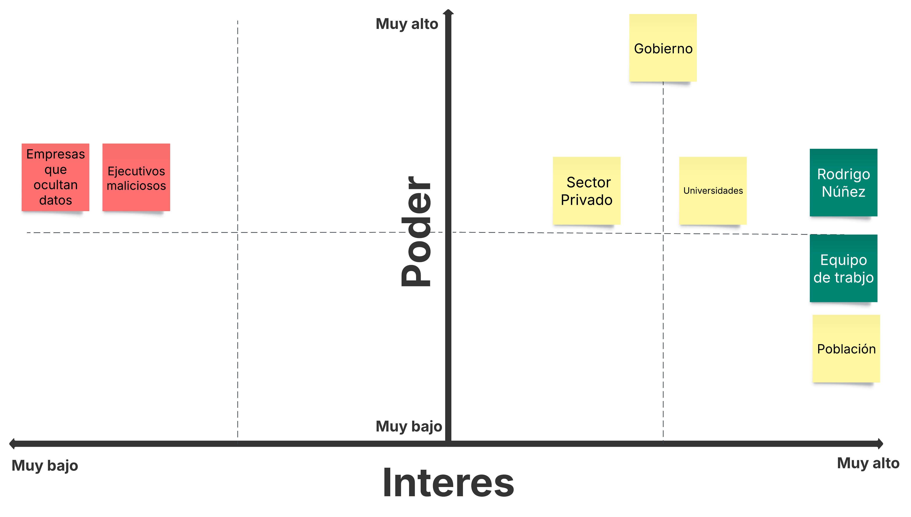

# Caso-3-Diseno

## 1. Planeamiento

En esta sección se detallan los aspectos relacionados con la comprensión del problema, la forma en que se dividirá el trabajo dentro del equipo, los hitos en los que se estructura el desarrollo del proyecto y los mecanismos que permitirán evaluar si se está avanzando conforme a lo planificado.

### 1.1 Estructura del Equipo, Stakeholders, Key Players

#### Estructura Interna 

El equipo de trabajo consiste de 5 integrantes:
- Santiago Chaves Garbanzo
- Anthony Fuentes
- Luis David Blanco
- Gabriel Gutiérrez
- Jefferson Salas Cordero

Todos tenemos asignaciones distintas dentro del proyecto, pero como vamos a trabajar con metodología Kanban, cualquiera puede hacerse cargo de cualquier tarea. Basta con elegirla en ClickUp y ponerse a trabjar.

Además, una pieza muy importante en el proyecto será Rodrigo Núñez, el cuál actuará como Product Owner de Data Pura Vida, y consultor de diseño de software en caso de que tengamos algún tipo de duda.

#### Stakeholders y Key Players:

Se identificaron los principales actores que influyen o se ven afectados por el desarrollo de la plataforma. A continuación, se presenta una matriz que los muestra:

Como se puede observar, los principales interesados en que el proyecto avance son el Product Owner y el equipo de trabajo, ya que están comprometidos con lograr que el producto final cumpla con los objetivos planteados desde el inicio.

La población general, aunque no tiene un alto nivel de poder dentro del proyecto, demuestra un gran interés. Una plataforma de este tipo promovería la transparencia en el acceso a datos y aportaría a un Costa Rica con mayor disponibilidad de información para todos (incluso aunque parte del contenido sea privado).

Por otro lado, el actor con mayor poder es el gobierno, al ser quien financia el proyecto. Su interés se considera moderado, posiblemente por cierto escepticismo respecto al impacto que la plataforma podría tener sobre su reputación.

Finalmente, aquellos actores que incurren en prácticas como el lavado de dinero o evasión fiscal son los menos interesados, ya que el sistema ofrecería mayor visibilidad sobre los datos, lo cual podría exponer dichas irregularidades.

Ahora bien, ya que se conocen los stakeholders principales se puede evidenciar que los key players son tanto el Product Owner, como el Equipo de trabajo, ya que serán los encargados de que el proyecto tenga exito.

#### Sistemas y Ecosistemas de Software Existentes:

En Costa Rica no existe ningún sistema ni ecosistema previo que funcione como antecedente directo de Data Pura Vida, por lo que no se anticipan problemas de integración con plataformas existentes. Si bien existen herramientas puntuales, como el API del TSE para consultas por cédula, estas no representan un obstáculo, ya que los requerimientos del proyecto contemplan la capacidad del sistema para aceptar datos provenientes de APIs externas.

### 1.2 Gestión de la Comunicación y Documentación del proyecto

Para la comunicación interna del equipo se utilizará Slack. A través de esta herramienta se coordinará la asignación de tareas en ClickUp, y también se notificará cuando una tarea haya sido finalizada. Antes de marcarla como completada, la tarea deberá pasar al estado de "Esperando Aprobación" en ClickUp, para que Rodrigo pueda revisarla y aprobarla.

Además, se utilizará Discord para realizar al menos una reunión semanal, en la cual se discutirán avances generales del proyecto. En caso de surgir dudas más complejas, se invitará al profesor para que pueda brindar orientación.

La documentación principal del proyecto se mantendrá en el README del repositorio de GitHub Chagui05/Caso-3-Diseno. En ese archivo se incluirán todos los detalles relevantes. Si existieran anexos, como la hoja de requerimientos o la entrevista con el profesor, se agregarán al mismo repositorio en archivos separados con nombres descriptivos, y se hará referencia a ellos desde el README. Toda la documentación será escrita en formato Markdown.

### 1.3 Entendimiento del problema

Para entender adecuadamente el problema, el equipo realizó una entrevista al Product Owner, basada en una serie de preguntas que surgieron tras revisar la especificación del proyecto. Las respuestas obtenidas fueron registradas en el archivo RespuestaEntrevista, y permitieron extraer información clave, como por ejemplo:

- La plataforma debe permitir el registro de personas físicas primero, y luego dar la posibilidad de vincularlas como administradoras de organizaciones.
- La validación de cuentas puede involucrar múltiples métodos: revisión manual, validaciones automatizadas y uso de servicios externos como SumSub.
- La inclusión de IBAN y datos de tarjetas en el registro busca filtrar usuarios no comprometidos y evitar registros superficiales.
- Se recomienda restringir el acceso por IP solo a la sección de registro, o permitir el registro de IPs confiables para quienes estén en el extranjero.
- Los datos cargados (sin importar el origen) deben convertirse a un formato unificado tras aplicar el proceso ETDL (relacional, documental, etc.).
- El sistema debe validar estructura, formato y contenido de los datasets, considerando reglas como formatos de fechas, booleanos y tipos de datos.
- El motor de visualización de dashboards debe permitir a los usuarios crear sus propios paneles, compartirlos y gestionarlos.
- La arquitectura de backend puede ser definida libremente por el equipo (monolítica o microservicios), según convenga al diseño general.
- Se permite la integración con herramientas de IA, siempre que se respeten los criterios de autorización definidos por la administración de la plataforma.
- El portal web de backoffice será administrado por una organización gubernamental registrada dentro del sistema, actuando como custodio de la información.

A partir de esta información, se desarrollaron los siguientes diagramas de flujo que ilustran las tareas clave identificadas dentro del sistema:

  
- Diagrama de registro:

El siguiente diagrama presenta una visión general del proceso de registro en nuestra plataforma. No incluye detalles técnicos ni especificaciones sobre los campos dinámicos que varían según el tipo de entidad registrada; su objetivo es ilustrar de forma abstracta y comprensible cómo se estructura el flujo de registro dentro del sistema.

- Diagrama de Ingesta y configuración de un dataset

Subir y configurar un dataset en la plataforma no es nada trivial, por eso se armaron estos dos diagramas que separan el proceso en dos partes.

El primer diagrama muestra cómo se le pide al usuario que suba el dataset: qué datos tiene que dar, qué información se necesita para la IA, y cómo se valida el archivo que subió (formato, estructura, nombres de columnas, etc.).

El segundo diagrama arranca una vez que el dataset ya fue validado. Ahí se definen cosas como si el conjunto de datos va a ser público, privado o de pago, y qué métodos de acceso y cobro se van a aplicar.

Es importante aclarar que en el diagrama II no se detalla paso a paso lo que hace el motor ETDL, pero sí se deja claro que va a encargarse de tareas como: detectar duplicados, relacionar datos con otros ya cargados, ajustar el modelo según las conexiones que encuentre, y aplicar automáticamente un flujo con extracción, transformación, limpieza, detección de contexto, modelado y carga con ayuda de AI.

#### Componentes del Sistema

Con el fin de lograr una arquitectura modular, segura y mantenible, el sistema se divide en macrocomponentes. Cada uno aborda un conjunto específico de requerimientos funcionales y no funcionales. En esta sección se listan los componentes y sus principales responsabilidades. La implementación técnica y subdivisión de estos se detalla más adelante en el documento.

#### bioregistro verde

Este módulo gestiona el proceso de incorporación de personas físicas y jurídicas a la plataforma. Abarca desde el llenado de formularios hasta la validación de identidad y la emisión de credenciales digitales. Debe cumplir con regulaciones AML y estándares avanzados de identidad digital.

Requerimientos:

- El componente debe permitir el registro de personas físicas, jurídicas, instituciones, cámaras, grupos y empresas.
- El formulario de registro debe adaptarse dinámicamente según el tipo de entidad seleccionada.
- El registro de usuarios debe estar asegurado con MFA y biometría, cumpliendo estándares de identidad digital avanzada.
- El componente debe solicitar y capturar información personal, societaria, legal y tributaria según el tipo de entidad.
- El componente debe revisar que cuando se van a asignar personas físicas a la organización al crearla, efectivamente formen parte de dicho conjunto.
- El registro debe pasar por una etapa de validación interna manual para el registro de empresas
- El componente debe implementar validación automática por inteligencia artificial de los documentos subidos.
- El componente debe exigir a los representantes legales el registro como individuos con: identidad digital, biometría, prueba de vida y autenticación multifactor (MFA).
- Cada organización debe recibir llaves de seguridad que le permitan delegar o revocar accesos a sus usuarios.
- Un usuario debe poder administrar múltiples organizaciones desde una única cuenta.
- El componente debe capturar datos preliminares de cuentas IBAN y/o tarjetas de crédito como parte del registro.
- El componente debe enviar una notificación por correo electrónico cuando un registro sea aprobado.
- El componente debe exigir documentos específicos según el tipo de entidad: cédulas físicas o jurídicas, actas, RTN, dirección, etc.
- El componente debe permitir registrar direcciones IP institucionales (listas blancas) para permitir acceso autorizado.
- El componente debe permitir únicamente IPs costarricenses en el registro
- El sistema debe proteger las claves generadas mediante un esquema de llave tripartita, distribuidas entre Data Pura Vida y dos custodios.

#### La Bóveda

La Bóveda es el almacén central de datos del sistema, diseñado para ser seguro, escalable y auditable. Unifica todos los datos cargados, sin importar su formato de origen, y permite relaciones entre datasets. Cifra la información en tránsito y reposo, controla el acceso por roles y entidades, y mantiene trazabilidad completa del uso y movimientos de los datos. Está pensada para soportar millones de registros con alto rendimiento y cumplir estándares de gobierno de datos.

Requerimientos:

- La Bóveda tiene que almacenar los datos en un solo formato, por más de que las fuentes externas sean de distintos tipos (relacionales, documentales, csv, excel)
- La Bóveda debe permitir especificar columnas que relacionan un dataset con otros datasets del ecosistema.
- La Bóveda debe de estar monitoreada en todo momento para detectar movimientos sospechosos, para dar contenido de uso de un dataset, y para asegurar trazabilidad y diagnóstico rápido de fallas.
- Debe ser resiliente, auditable y alineado con estándares de gobierno de datos.
- Debe permitir crecimiento dinámico sin perder eficiencia.
- Debe escalar a millones de registros y miles de usuarios concurrentes.
- Mantener trazabilidad de datos usados, no usados y descartados.
- Todos los datos cargados deben estar protegidos mediante cifrado, incluso frente al personal técnico ("ingenieros de la plataforma").
- Cifrar toda la data en tránsito y en reposo, dejando trazabilidad auditable.
- Permitir almacenamiento masivo de datos estructurados y semiestructurados.
- Controlar accesos lógicos por entidad, usuario o tipo de dato.
- Implementar control de acceso a nivel de rol (RBAC) y a nivel de fila (RLS) o equivalentes.

#### Módulo de Ingesta de dato / posibles nombres: El Ingestor, Centro de Carga, Dock de Datos

Este módulo permite a los usuarios cargar sus datasets a la plataforma. Desde acá pueden definir qué datos desean cifrar, especificar el formato de origen y configurar otros parámetros clave para asegurar que la carga se procese correctamente.

Requerimientos: 

- Permitir a los usuarios decidir qué datos compartir dentro del ecosistema.
- Requerir que cada dataset tenga un nombre único.
- Soportar múltiples métodos de carga de datos: archivos Excel, CSV, JSON, APIs y conexiones directas a bases de datos SQL y NoSQL. 
- Requerir nombre, descripción y metadata útil para IA sobre las columnas del dataset.
- Permitir configurar los parámetros de conexión de forma cifrada para cada medio de carga.
- Los parámetros de conexión de bases de datos y APIs deben almacenarse de forma cifrada.
- Permitir configurar si el dataset es público o privado, gratuito o pagado, permanente o con disponibilidad temporal.
- El sistema de permisos debe prevenir accesos no autorizados a datasets privados o pagos.
- Asignar permisos de acceso a los datasets privados.
- Permitir definir montos de acceso para datasets con modelo de cobro.
- Restringir acceso a datos por tiempo, volumen o frecuencia de consulta.
- Indicar si la carga es única o recurrente, completa o por deltas.
- Configurar parámetros para carga por deltas: campos diferenciales, frecuencia (timed pull) o mediante callbacks.
- Habilitar control granular de acceso por institución, persona o grupo.

#### Módulo de transformación de datos / posibles nombres: Motor de Transformación, Procesador ETDL

Este módulo es clave para garantizar que los datasets se almacenen correctamente en la Bóveda. Se encarga de recibir datos desde distintas fuentes, validar que el formato coincida con el indicado en el formulario de ingesta y, en caso contrario, rechazar la carga. Una vez superada esta validación, aplica todo el proceso de ETDL y mapea los datos al formato interno de la Bóveda.

Requerimientos: 

- Validar el formato, estructura y contenido de cada dataset cargado sea correcto, o bien adaptarlo al interno de la Bóveda (formatos de fecha, booleans, etc.).
- Validar el formato, estructura y contenido de cada dataset cargado coincida con lo especificado en el proceso de carga.
- Automatizar el proceso de carga mediante un motor de IA que aplique un flujo ETDL (extracción, transformación, limpieza, detección de contexto, modelado y carga).
- Aplicar IA para normalizar, rediseñar modelos de datos y vincularlos automáticamente.
- Detectar duplicidades, optimizar relaciones y ajustar el modelo de datos automáticamente según las interrelaciones detectadas.
- Monitorear el proceso completo con métricas de transferencia, carga, limpieza, eliminación, modelado, volumen, datos omitidos, datos consultados y tasa de éxito.
- El sistema debe ser capaz de procesar cargas recurrentes y automatizadas sin intervención manual.
- Soportar cargas delta con identificación de cambios.
- Realizar merges eficientes sin pérdida de integridad.

#### Centro de Visualización y Consumo

Este módulo está compuesto por 3 subcomponentes clave:

1. **Generador de dashboards**: permite a los usuarios diseñar y crear gráficos de forma rápida y amigable para visualizar cualquier dataset.

Requerimientos:
- El sistema debe permitir la construcción de dashboards personalizados de forma manual.
- El sistema debe permitir construir dashboards manualmente o mediante prompts inteligentes que generen visualizaciones automáticas.
- El sistema debe permitir representar visualmente los datos en tablas, gráficos, conteos, tendencias y predicciones.
- El sistema debe permitir a los usuarios guardar sus dashboards personalizados.
- El sistema debe permitir compartir dashboards con otros usuarios o hacerlos públicos dentro de la plataforma.
- La interfaz de construcción de dashboards debe ser segura, intuitiva y con capacidad de respuesta en tiempo real.

2. **Visualización y Consumo**: ofrece una interfaz para revisar esas visualizaciones y realizar análisis de datos directamente sobre los dashboards.

Requerimientos:
- El sistema debe permitir visualizar todos los datasets accesibles como una fuente consolidada.
- El sistema debe bloquear toda exportación directa de datos y gráficos desde el portal.
- El sistema debe mostrar datos de forma preliminar en modo de construcción de dashboard y luego con datos reales al ejecutar consultas
- El sistema debe deshabilitar temporalmente el acceso a datasets cuando se superen los límites de consumo.
- El sistema debe registrar todas las transacciones y consumos de datos en un historial accesible para cada usuario.
- El sistema debe mostrar métricas de uso: volumen de datos consultados, número de consultas realizadas, tiempo restante o límites alcanzados.
- El sistema no debe permitir en ningún momento la descarga directa de datasets o gráficos generados.
- La visualización de datos debe realizarse exclusivamente dentro del portal, sin opciones de exportación, captura o embedding externo.
- Los límites de consumo deben aplicarse en tiempo real, sin permitir bypasses o reintentos abusivos.

3. **Consumo para IA**: Este subcomponente es el regulador de consumo de IA, define límites y los métodos de ingesta disponibles desde el sistema para los usuarios. 

Requerimientos:

- El sistema debe permitir el acceso sistema a sistema únicamente para alimentar modelos de IA aprobados.
- La entrega de datos para modelos de IA debe ser monitoreada, registrada y limitada a contextos aprobados explícitamente por Data Pura Vida.
- El sistema debe ofrecer plataformas limitadas y controladas para esta alimentación de IA. Solo permitirá 2 por usuario. 
- El sistema debe minimizar al máximo el riesgo de descargas indirectas mediante presunción de uso en IA.
- Los datos deben ser envíados en un formato que no permita poder ser desencriptado para otro uso que no sea alimentar IA (por ejemplo uso de embeddings).

#### Marketplace

Este módulo está enfocado en ofrecer una interfaz amigable que permita a los usuarios encontrar datasets de forma eficiente, con descripciones claras y navegación fluida. Además, incluye una sección adicional para buscar dashboards creados por otros usuarios, facilitando el descubrimiento y reutilización de visualizaciones dentro de la plataforma.

Requerimientos:

- La experiencia de compra de datasets debe ser fluida, transparente y accesible desde los dashboards personales.
- Incluir un módulo de compra donde se visualicen datasets disponibles bajo acceso pagado.
- Permitir seleccionar un dataset, visualizar precio, términos de uso, duración del acceso y condiciones de cobro.
- Soportar múltiples métodos de pago: tarjeta de crédito, débito y otros mecanismos nacionales compatibles.
- Mostrar confirmaciones de transacción y activar el acceso según condiciones (tiempo, volumen, frecuencia).
- El sistema debe mostrar opciones para renovar o ampliar los paquetes de acceso en caso de superar el límite.
 

#### Backoffice Administrativo

Este módulo concentra las herramientas de backoffice necesarias para la gestión integral de la plataforma. Su enfoque está en el control, la seguridad, la gobernanza de datos y la trazabilidad completa de las operaciones. 

Requerimientos:

- Administrar usuarios: validación de identidad, membresía y roles.
- Gestionar reglas de carga de datos (formatos, estructuras, validaciones).
- Configurar conexiones externas (APIs, BDs, callbacks).
- Activar, desactivar y supervisar objetos de datos, pipelines y flujos.
- Revocar o regenerar llaves de seguridad (simétricas, asimétricas, tri-partitas).
- Administrar custodios de llaves y flujos de confirmación mancomunada.
- Auditar operaciones por usuario, fecha, acción y resultado.
- Generar reportes de uso, calidad, integración y anomalías.
- Monitorear el estado operativo de servicios y tareas.
- Extraer evidencias para procesos legales bajo autorización.
- Gestionar permisos y accesos mediante RBAC.
- Debe ofrecer una interfaz robusta y segura solo para personal autorizado.
- Debe permitir gestión flexible pero estricta de accesos y configuraciones.

### 1.4 Customer Journeys
Este Service Blueprint representa el recorrido completo de un ciudadano dentro del ecosistema Data Pura Vida, desde el descubrimiento de la plataforma hasta la creación, publicación y monitoreo de un dashboard personalizado con datos públicos.

El diagrama detalla no solo las acciones del usuario, sino también los touchpoints del sistema, los procesos internos (backstage) y las herramientas de soporte involucradas en cada etapa. Además, se integran las emociones del usuario para identificar oportunidades de mejora en la experiencia.

Las líneas de interacción, visibilidad e interacción interna permiten visualizar claramente los límites entre lo que el ciudadano ve, lo que ocurre detrás del sistema y las herramientas tecnológicas que lo sustentan.

Este blueprint se organiza en **seis** fases principales:

1. Conciencia: El ciudadano conoce la existencia de la plataforma.

2. Ingreso: Accede y se autentica de forma segura.

3. Exploración: Navega los datasets disponibles.

4. Creación: Construye un dashboard visual con datos abiertos.

5. Publicación: Comparte su dashboard con otros usuarios.

6. Monitoreo: Consulta métricas de visualización y uso.b

Este blueprint representa el recorrido completo de una empresa desde que conoce la plataforma Data Pura Vida hasta que publica y monetiza un conjunto de datos privado. 

El diagrama incluye una fase clave denominada “Validación de valor”, donde la empresa analiza el potencial del dataset antes de publicarlo. Esta etapa intermedia refuerza la decisión estratégica de monetización al mostrar métricas de calidad, vistas previas y recomendaciones automáticas generadas por IA, asegurando que los datos ofrecidos sean realmente útiles para otros actores del ecosistema.

**Fases principales:**

1. Registro: Un representante oficial crea una cuenta institucional y sube los documentos requeridos.
2. Validación: La plataforma aplica validaciones automáticas y manuales con ayuda de IA.
3. Configuración: La institución decide qué datos compartir y con qué restricciones.
4. Carga: Se conecta una base de datos externa para carga automatizada.
5. Publicación: El dataset queda disponible para actores autorizados mediante pago.
6. Seguimiento: La institución consulta métricas de acceso y consumo.

#falta la imagen

### 1.5 Plan de ejecución del proyecto 

El proyecto se estructura en cinco hitos principales que marcarán su progreso:

- Planeamiento del Proyecto
- Supuestos del Proyecto
- Stack Tecnológico 
- Diseño de los Componentes
- Validación de los requerimientos

Cada uno de estos hitos cuenta con un plazo definido para su ejecución, lo cual se puede observar en el siguiente diagrama de Gantt:

Dentro de cada hito se contemplan varias tareas. Cada integrante del equipo debe seleccionar una tarea según su disponibilidad. Un hito se considera finalizado únicamente cuando todas sus tareas han sido completadas y se encuentran en el tablero de completado en ClickUp.

Además, como se indicó anteriormente, se realizarán reuniones semanales para verificar que el proyecto avance conforme al plan establecido.

Además, como se dijo previamente, se harán reuniones semanales para verificar que el proyecto se esté realizando según lo dice el plan.
### 1.6 WBS del sistema 
Creación de WBS del sistema

### 1.7  Evaluación de Riesgos
Evaluación de riesgos utilizando metodologías reconocidas como ISO 31000 o NIST RMF o otras tablas similares simplificadas

### 1.8 KPIs 
Definición de KPIs clave y mecanismos para su recolección y cálculo en cada milestone. Uno puede ser que se cumplan con los hitos en la fecha establecida

## 2. Supuestos del proyecto

### 2.1 Estándares y Regulaciones
Revisión de estándares y regulaciones nacionales/internacionales, incluyendo Ley 8968 (Costa Rica), GDPR, ISO/IEC 27001, OECD Data Governance y similares

### 2.2 Prácticas de Manejo de Código
Definir prácticas de manejo de códio (OWASp, Clean Code, Twelve-Factor App), y como las implemtaremos

### 2.3 Sistema de Versionamiento
que sistema de versionamiento se usará y ramas  (Git Flow, GitHub Actions, Terraform,)

### 2.4 Sistemas de Teceros
Con que sistemas de terceros se interactuará: apis, protocolos de autenticación (OAuth2, JWT)

### 2.5 Aspectos de Calidad/SLA
Hacer Enfasis en que será Escalabilidad y Mantenibilidad, Reutilización y Eficiencia y Claridad y Gestión de Complejidad

## 3. Stack Tecnológico 
En cada una documentar versiones de frameworks, SDKs, lenguajes y herramientas utilizadas, así como sus restricciones y licencias  

 - Herramientas para Frontend, Backend, Data
 - Herramientas para AI
 - que sistemas de Terceros, Cloud y Protocolos se usarán 
 - Herramientas para testing y DevOps

## 4. Diseño de los componentes
A conitnuación cada una de estas secciones fue sacada del punto 7 de los documentos del repo del profe, hace falta aplicar cada uno de estos para todos los componentes del sistema
### Análisis del Componente
### Diseño de la Arquitectura
 - Diseño del Frontend
  - Que sistema de autenticación se usará
  - Como se llevará a cabo el KYC, y la verificación de identidad
  - Arquitectura del Client, N-Layer, Client Server, etc.
  - Componentes Visuales.
  - Patrones y Principios
  - Toolkkits y Standards 
  - Estructura de carpetas del sistema
 - Diseño del Backend
  - Definir porque el sistema tiene alta disponibilidad y como
  - Definir porque tiene monitoreo y como 
  - Definir modelo de seguridad detallado: encriptación, auditoría, logging seguro.
  - REST, GraphQL, gRPC, Monolithic, or Monolithic-MVC?
  - Serverless, Cloud, On-Premise, or Hybrid?
  - Service vs. Microservices?
  - Event-Driven, Queues, Brokers, Producer/Consumer, Pub/Sub?
  - API Gateway (Security & Scalability)?
  - El de arquitectura considera donde sea necesario prácticas y patrones para AI. Unidad 8.
 - Diseño de los Datos
  - Como funcionará el proceso ETDL 
  - Usar como base el proyecto anterior 
  - El diseño de datos considera donde sea necesario prácticas y patrones para AI. Unidad 8.

### Prototipado 
No hace falta implementarlo todo, seguramente solo una prueba de concepto para algunos

### Implementación de Componentes
No hace falta implementarlo todo, seguramente solo una prueba de concepto para algunos
solo si aplica:
 - Incluir guías de integración (how to) y ejemplos de código funcional para los servicios principales
 - Incorporar pruebas de concepto, prototipos o ejemplos que guíen la futura ejecución y validen elecciones tecnológicas

### Pruebas e Integración
Solo explicar como se hará

solo si aplica:
 - Incluir guías de integración (how to) y ejemplos de código funcional para los servicios principales
 - Incorporar pruebas de concepto, prototipos o ejemplos que guíen la futura ejecución y validen elecciones tecnológicas
   
### Despliegue y Mantenimiento
Solo explicar como se hará, tal véz una prueba de concepto

### Diagrama General del Frontend
Este si es general de todos los componentes

### Diagrama General del Backend
Este si es general de todos los componentes

## 5. Validación de los requerimientos
- Validar que el diseño cubre todos los requerimientos funcionales y no funcionales del sistema
- Identificar ventajas y desventajas del diseño, proponiendo mitigaciones a los riesgos y limitaciones
