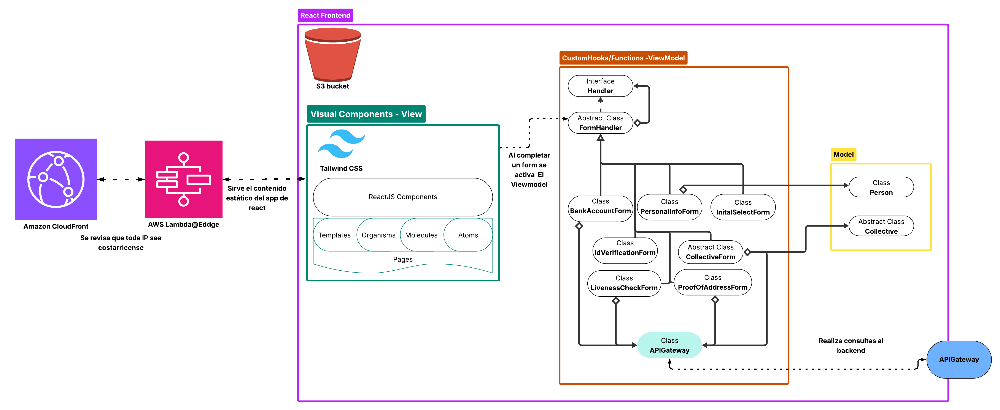
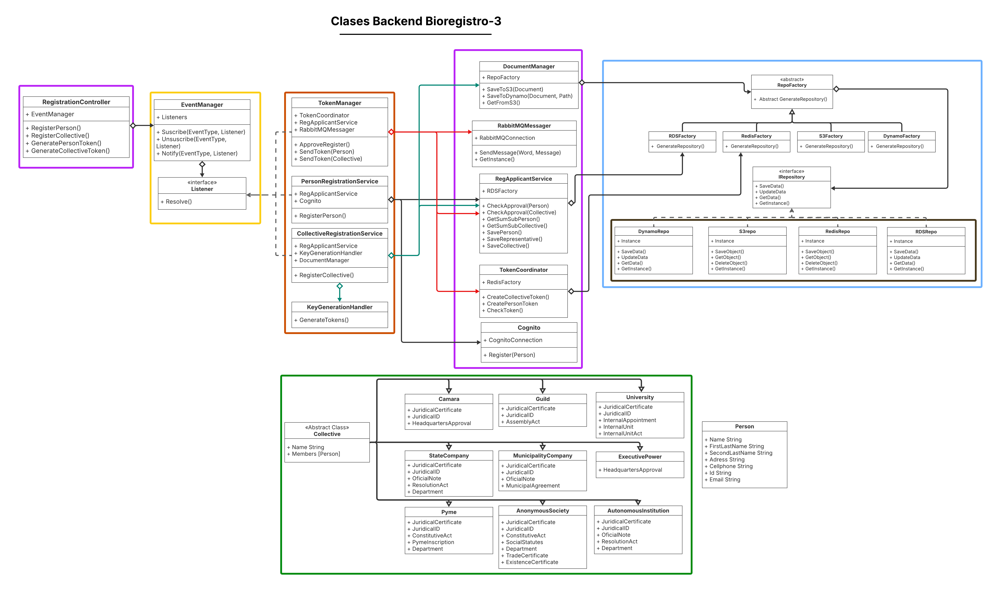
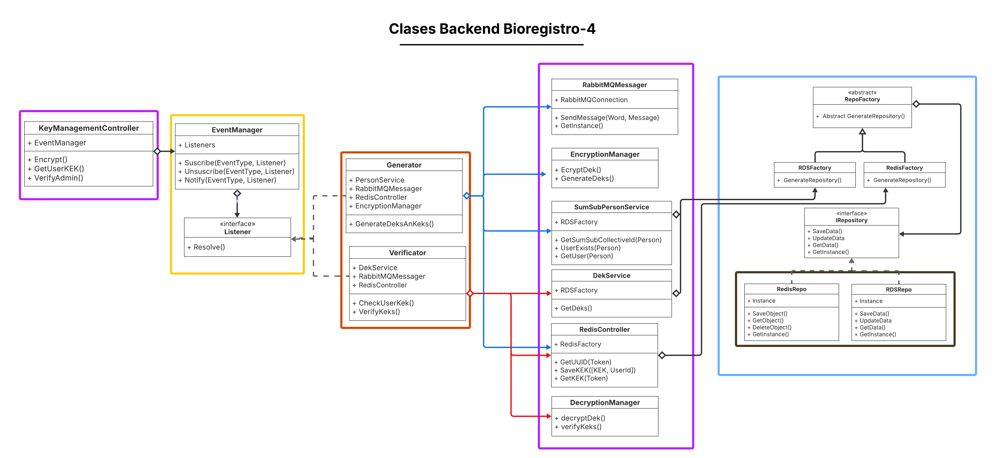
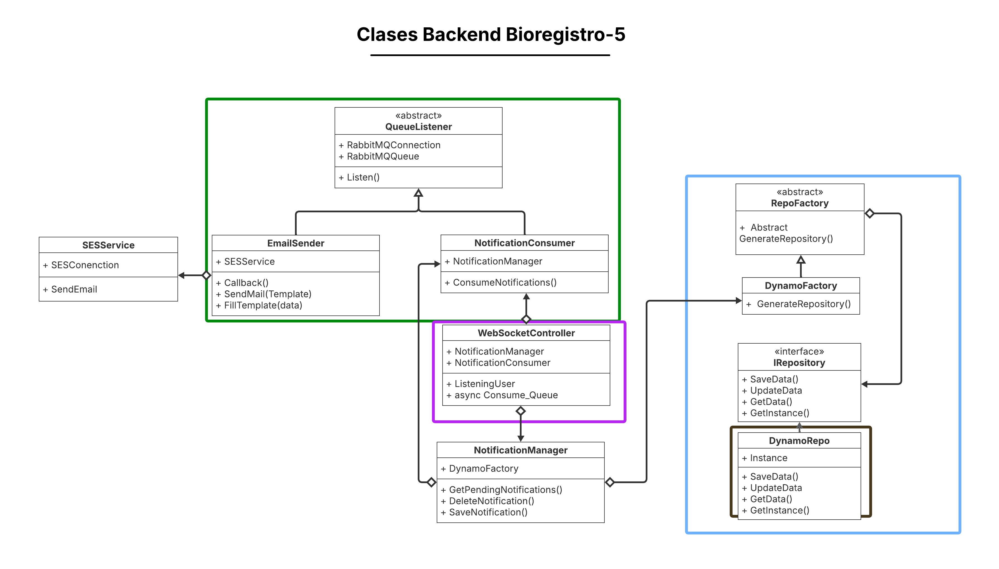
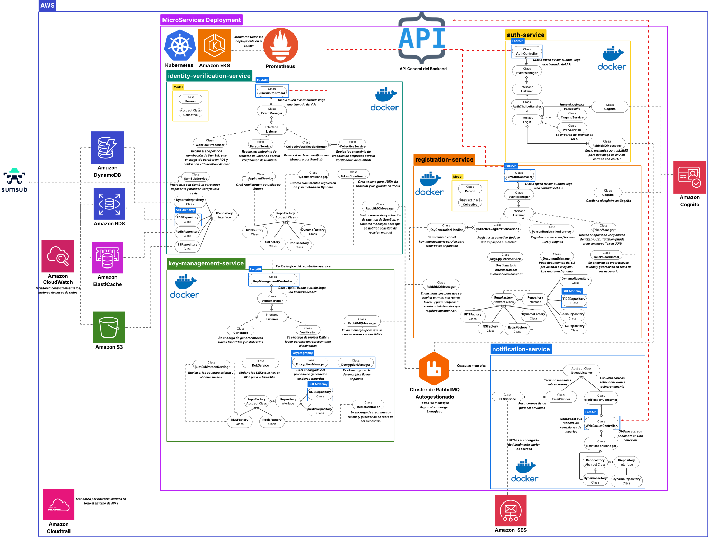

# 4.1. Bioregistro

Este componente es el punto de entrada al sistema, tiene como propósito registrar distintos tipos de usuarios y adaptarse dinámicamente a sus requerimientos de autenticación.

Los tipos de usuarios que se podrán registrar en la plataforma son los siguientes :

- **Usuarios con Cédula Física**: Esto incluye a cualquier persona física que tenga cédula costarricense.

- **Usuarios con Cédula Jurídica**: Esta capa incluye una amplia variedad de colectivos que pueden aportar datasets de valor.
  - **Empresas privadas**: Incluye PYMES y Sociedades Anónimas (S.A).
  - **Empresas públicas y entes estatales**: Abarca instituciones autónomas, empresas estatales, empresas municipales, y Ministerios.
  - **Cámaras y gremios**: Incluye cámaras empresariales y gremios profesionales o técnicos.
  - **Universidades y centros académicos**: Comprende universidades públicas y privadas, así como sus escuelas, facultades y centros de investigación.

Asimismo, se adjunta una descripción de que es cada uno de los colectivos listados junto con que aporte pueden dar a Data Pura Vida,que información se les va a solicitar para poder garantizar que son empresas verdaderas y solicitadas por sus representantes reales (Cabe aclarar que todo documento PDF debe venir con firma digital):

### **Empresas privadas**

Organizaciones con fines de lucro que operan en sectores diversos. Se dividen principalmente en:

**PYMES (Pequeñas y Medianas Empresas)**:
Empresas de menor escala que operan en comercio, manufactura ligera, servicios digitales, turismo, entre otros. Dentro de ellas pueden haber subdivisiones.

- **Actividad diaria**: ventas, atención al cliente, manejo de inventario, facturación, pagos, operaciones locales.
- **Datos potenciales**: consumo local, comportamiento de clientes, tiempos de entrega, cadenas de distribución.
- **Documentos necesarios para Identificarla**:
  - Certificación de personería jurídica: Contiene la información de la empresa como su nombre, cédula jurídica, tipo de sociedad, nombre del representante.
  - Cédula del representante legal: Debe coincidir con el de la certificación de personería jurídica.
  - Nombre y Apellido del representante.
  - Cédula jurídica: Debe coincidir con la certificación de personería jurídica.
  - Correo Institucional: correo electrónico del encargado de la institución.
  - Acta Constitutiva y Estatutos: Es un acta que establece la existencia legal de la empresa.
  - Constancia de incripción en el PYME: Demuestra que está registrada en el MEIC y cumple los requisitos para ser PYME.
  - Departamento a Registrar: Se debe registrar a que departamento de la empresa pertenece el registro.

**Sociedades Anónimas (S.A.)**
Empresas grandes con estructura formal, juntas directivas y accionistas. Comunes en construcción, industria, finanzas o tecnología.

- **Actividad diaria**: operación por departamentos, contratación de proveedores, desarrollo de productos, comercio exterior.
- **Datos potenciales**: operaciones financieras, productividad, logística, desempeño empresarial.
- **Documentos necesarios para Identificarla**:
  - Certificación de personería jurídica: Contiene la información de la empresa como su nombre, cédula jurídica, tipo de sociedad, nombre del representante.
  - Cédula jurídica: Debe coincidir con la certificación de personería jurídica.
  - Cédula del representante legal: Debe coincidir con el de la certificación de personería jurídica.
  - Nombre y Apellido del representante.
  - Correo Institucional: correo electrónico del encargado de la institución.
  - Estatutos sociales: Documento que establece la organización, funcionamiento, objeto social, entre otra información valiosa sobre la empresa.
  - Certificado de Registro Mercantil: Documento que certifica la inscripción de la empresa en el Registro Mercantil.
  - Certificado de Existencia: Documento legal que certifica la existencia de la empresa.
  - Departamento a Registrar: Se debe registrar a que departamento de la empresa pertenece el registro.

### **Empresas públicas y entes estatales**

Entidades que operan con fondos públicos y ofrecen servicios esenciales.

**Instituciones autónomas**

Ejemplos: CCSS, ICE, INS, TSE.

- **Actividad diaria**: prestación de servicios de salud, energía, seguros, agua, telecomunicaciones.
- **Datos potenciales**: cobertura geográfica, consumo, atención médica, reclamos ciudadanos.
- **Documentos necesarios para Identificarla**:
  - Cédula Jurídica: adjuntar la cédula jurídica con el formato "4-000-NNNNNN"
  - Nota oficial con membrete institucional: Nombre completo de la persona que actuará como representante de la institución, con firma digital de un funcionario autorizado.
  - Cédula del representante legal: Debe coincidir con el de la certificación de personería jurídica.
  - Nombre y Apellido del representante.
  - Correo Institucional: correo electrónico del encargado de la institución.
  - Acta de Resolución Interna: Un acta firmada que describa la resolución dada internamente en el ente estatal.
  - Departamento a Registrar: Se debe registrar a que departamento de la empresa pertenece el registro.

**Empresas estatales**
Ejemplos: RECOPE, RACSA.

- **Actividad diaria**: importación, distribución de bienes estratégicos, operación con entes reguladores.
- **Datos potenciales**: consumo nacional, logística, demanda energética.
- **Documentos necesarios para Identificarla**:
  - Cédula Jurídica: adjuntar la cédula jurídica con el formato "3-NNN-NNNN"
  - Certificación de personería jurídica: Contiene la información de la empresa como su nombre, cédula jurídica, nombre del representante.
  - Nota oficial con membrete institucional: Nombre completo de la persona que actuará como representante de la institución, con firma digital de un funcionario autorizado.
  - Cédula del representante legal: Debe coincidir con el de la certificación de personería jurídica.
  - Nombre y Apellido del representante del órgano.
  - Correo Institucional: correo electrónico del encargado de la institución.
  - Acta de Resolución Interna: Un acta firmada que describa la resolución dada internamente en el ente estatal.
  - Departamento a Registrar: Se debe registrar a que departamento de la empresa pertenece el registro.

**Empresas municipales**
Entidades creadas por municipalidades para servicios locales, un ejemplo es la ESPH (Empresa de Servicios Públicos de Heredia).

- **Actividad diaria**: recolección de residuos, parqueo, mantenimiento urbano, servicios culturales.
- **Datos potenciales**: desarrollo cantonal, planificación urbana, gestión ambiental.
- **Documentos necesarios para Identificarla**:
  - Cédula Jurídica: adjuntar la cédula jurídica.
  - Certificación de personería jurídica: Contiene la información de la empresa como su nombre, cédula jurídica, nombre del representante.
  - Nota oficial con membrete institucional: Nombre completo de la persona que actuará como representante de la institución, con firma digital de un funcionario autorizado.
  - Cédula del representante legal: Debe coincidir con el de la certificación de personería jurídica.
  - Nombre y Apellido del representante.
  - Correo Institucional: correo electrónico del encargado de la institución.
  - Acuerdo Municipal: Un acta firmada que describa la resolución dada internamente en el ente municipal.

### **Órganos del Poder Ejecutivo**

Ejemplos: MEP, MINAE, MOPT

- **Actividad diaria**: Formulación e implementación de políticas públicas, ejecución de programas nacionales, regulación sectorial, gestión presupuestaria y administrativa.
- **Datos potenciales**: Indicadores educativos, ambientales, de infraestructura y transporte; estadísticas de cobertura, acceso y calidad de servicios; y datos geoespaciales y sectoriales según competencia del ministerio.
- **Documentos necesarios para Identificarla**:
  - Oficio firmado por jefatura autorizada: Documento firmado por la jefatura con la autorización.
  - Cédula del representante legal: Cédula del representante del órgano.
  - Correo Institucional: correo electrónico del encargado de la institución.
  - Nombre y Apellido del representante del órgano.

### **Cámaras y gremios**

Organizaciones que agrupan empresas o profesionales.

**Cámaras empresariales**
Ejemplos: Cámara de la Construcción, Cámara de Tecnologías de Información, Cámara de Exportadores de Flores.

- **Actividad diaria**: representación del sector, capacitaciones, generación de estudios y estadísticas.
- **Datos potenciales**: empleo, productividad, retos sectoriales, inversión.
- **Documentos necesarios para Identificarla**:
  - Certificación de personería jurídica: Contiene la información de la empresa como su nombre, cédula jurídica, nombre del representante.
  - Cédula Jurídica: adjuntar la cédula jurídica, que coincida con la de la certificación de personería jurídica.
  - Carta firmada por el comité o jefatura: Oficio que demuestre autorización de la cámara empresarial.
  - Cédula del representante legal: Debe coincidir con el de la certificación de personería jurídica.
  - Nombre y Apellido del representante.
  - Correo Institucional: correo electrónico del encargado de la institución.

**Gremios profesionales o técnicos**
Ejemplos: colegios de médicos, ingenieros, abogados.

- **Actividad diaria**: certificación profesional, formación continua, vigilancia del ejercicio profesional.
- **Datos potenciales**: matrícula, servicios ofrecidos, formación, cobertura geográfica.
- **Documentos necesarios para Identificarla**:
  - Certificación de personería jurídica: Contiene la información de la empresa como su nombre, cédula jurídica, nombre del representante.
  - Cédula Jurídica: adjuntar la cédula jurídica, que coincida con la de la certificación de personería jurídica.
  - Acta de asamblea constitutiva: Oficio que demuestre autorización de la cámara empresarial.
  - Cédula del representante legal: Debe coincidir con el de la certificación de personería jurídica.
  - Nombre y Apellido del representante.
  - Correo Institucional: correo electrónico del encargado de la institución.

### **Universidades y centros académicos**

Instituciones de educación superior, tanto públicas como privadas, dedicadas a la formación profesional, la investigación científica y la extensión social. Dentro de estas operan subdivisiones como facultades, escuelas y centros de investigación (CI).

**Universidades públicas y privadas**

- **Actividad diaria**: matrícula, gestión de carreras, proyectos de investigación y extensión.
- **Datos potenciales**: rendimiento académico, estadísticas de graduación, impacto social.
- **Documentos necesarios para Identificarla**:
  - Cédula Jurídica: adjuntar la cédula jurídica, que coincida con la de la certificación de personería jurídica.
  - Nombramiento Interno: Carta que oficializa el encargado de hacer el registro en la plataforma.
  - Carta de la Unidad Interna: Oficio que da la autorización del unidad interna de la universidad:
  - Unidad Interna: Escuela, Facultad, Centro de Investigación.
  - Nombre de la unidad: Ingresar nombre específico.
  - Cédula del representante legal: Debe coincidir con el de la certificación de personería jurídica.
  - Nombre y Apellido del representante.
  - Correo Institucional: correo electrónico del encargado de la institución.

### Llaves Tripartita

Una parte fundamental del sistema es la gestión tripartita de llaves. Se adoptó un esquema de tres claves: una asignada al representante designado por la empresa para su registro, otra para cada usuario secundario de la empresa, y una tercera bajo control de Data Pura Vida.
El mecanismo se basa en la comparación de una Data Encryption Key (DEK), la cual es cifrada con una Key Encryption Key (KEK) específica para cada parte involucrada.
Los detalles sobre cuándo, dónde y cómo se utiliza este esquema se ampliarán en la sección de definición del backend, pero por ahora esta descripción representa la visión de alto nivel.

## Diseño del Frontend

### Plataforma de Autenticación

Primero se describirá cómo se realizará en el frontend el proceso de registro e inicio de sesión para personas físicas, ya que los conjuntos no tienen un inicio de sesión propio, sino que solo cuentan con creación de cuenta, la cual es manejada posteriormente por personas físicas que la agregan a su cuenta personal.

Dado que la plataforma será alojada en AWS, usaremos AWS Cognito para el registro y posterior inicio de sesión de las personas en la plataforma. Del servicio se utilizarán las siguientes características:

- Uso de JWT Tokens para autorizar el acceso a las APIs en EKS.
- Uso de Cognito User Pools que registren email, teléfono, cédula, nombre y apellidos.
- Uso de choice-based authentication para que los usuarios elijan cómo iniciar sesión (contraseña, Email OTP o SMS OTP).
- Uso del AuthFlow de USER_PASSWORD_AUTH, que incluirá un MFA obligatorio con Email OTP o SMS OTP.
- Uso del SDK de Cognito para agilizar este proceso. Sin embargo, el formulario de registro será manejado programáticamente por nosotros, ya que el estándar que ofrece Cognito no se adapta a nuestro caso de uso.

No hay que dejar de lado que un paso muy importante en nuestro sistema es la captura de imagen de la cédula y la prueba de vida, para comprobar que la persona que solicita la cuenta sea real. Por lo tanto, en el flujo de registro de una persona física, este paso se realizará antes de autorizar el registro en el sistema por medio de cognito.

Para implementar esta lógica se usará el sistema de terceros SumSub, ya que provee herramientas para:

- Verificación de ID (cédula en nuestro caso).
- Prueba de vida y detección de deepfake.
- Prueba de dirección, para verificar que la dirección física del usuario sea real.
- Revisión de AML.
- Revisión de KYC.

Para realizar todas estas tareas en nuestro frontend se utilizará el WebSDK que SumSub provee para React, que cuenta con todas las herramientas necesarias para implementar las opciones mencionadas.

El proceso de registro de las empresas será distinto, ya que requiere realizar tres tareas principales:

- Validación y completitud de los datos.
- Validación de personas asignadas.
- Asignación de llaves tripartitas.

Por ello no se usará Cognito para las empresas. Sin embargo, para la validación SumSub ofrece una solución de KYB (Know Your Business), que permite:

- Revisar el registro nacional para seleccionar la empresa.
- Verificar al encargado del registro mediante prueba de vida y verificación de cédula.
- Generar cuestionarios personalizados donde se pueden adjuntar documentos legales que SumSub aprobará.

Por lo tanto, la validación de empresas también será implementada con SumSub. El almacenamiento de información y la delegación de llaves tripartitas serán discutidos más adelante en la sección del backend.

Por otro lado, cabe aclarar que para poder llevar a cabo las validaciones con SumSub es necesario dirigirse a la página de SumSub y ahí generar flows. Los desarrolladores tendrán que crear estos flows con base en las especificaciones dadas sobre que información se le debe solicitar a cada tipo de usuario (los distintos tipos de jurídico y el físico) que fue especificada previamente en este subcapítulo.

### Arquitectura del Cliente

Nuestra arquitectura de cliente consistirá en Client Side Rendering con rendering estático, con una única capa dedicada a la web. Esta decisión se toma porque los bundles de React generados en el build de cada proyecto serán almacenados en un bucket de S3, el cual será servido a los clientes mediante el CDN provisto por CloudFront.

Por otro lado, uno de los requerimientos de este módulo es que solo puede ser accedido con IPs Costarricenses (El registro), por lo que cuando se desee acceder a la página de registro Cloudfront ejecutará un Lambda@Edge Function que revisará la IP del usuario y en caso de no ser de Costa Rica, no servirá dicha ruta del App.

Además, para acceder al backend se utilizará una única API, desarrollada en FastAPI. Se entrará en más detalles de dicha API más adelante.

### Patrones de Diseño de Objetos

A Continuación el diagrama de clases del frontend del Bioregistro:


- **Caja Verde**: La caja verde representa el patrón de Chain of Responsability. Está asociado a los distintos tipos de forms que existen en el sistema, y gracias a la naturaleza del CoR, permite declararlos dinámicamente. Inclusive, permite que si en un futuro se desea agregar otra capa, sea sumamente sencillo.
- **Cajas Celeste**: Las cajas celestes representan el strategy pattern, ya que por medio de herencia se aisla los distintos tipos de forms para colectivos, y de colectivos.
- **Caja Roja**: Esta caja roja cumple dos funciones, de Singleton y de Facade. De singleton porque de esta manera solo existe una instancia que se conecta al API en todo momento. Además funciona como Facade ya que aisla toda la lógica de conexión con el API del backend en una sola clase.

### Componentes Visuales

**Patrones y Principios**

- **Responsive Design**: Aunque el enfoque principal de nuestro sistema está en el uso desde web desktop, es importante implementar un diseño responsivo para que los usuarios puedan realizar el registro, prueba de vida y verificación de cédula de forma cómoda desde la cámara de sus celulares. Este diseño responsivo se logrará aprovechando las opciones que ofrece Tailwind CSS para distintos tamaños de pantalla, utilizando prefijos como sm:, md:, lg:, y xl:, que permiten adaptar los estilos según el dispositivo.

- **SOLID**:

  - Single Responsibility: Cada componente en el bioregistro solo tendrá una responsabilidad. Por ejemplo, el formulario que detecta si es persona física o un conjunto solo emplea esa tarea, o los componentes de verificación de SumSub son distintos y cada uno hace su propia tarea: uno para la prueba de vida, otro para la verificación de id, y así para todo componente.
  - Open Closed Principle: Los componentes de registro son dinámicos y están separados, gracias a esto, si en un futuro se desea agregar otro tipo de organización, tan solo se debe desarrollar dicho componente y de ahí la conexión con el resto del flujo será directa.
  - Liskov Substitution Principle: La herencia debe ser utilizada solo cuando es necesaria. Por ejemplo, para los formularios de documentos para empresas si es valioso usar una superclase, pero no tiene sentido agruparlos en una clase madre con el formulario de prueba de vida.
  - Interface Segregation Principle: No usaremos una interfáz enorme para agrupar a todo tipo de formulario, solo si es necesario se definirán, y cuando se haga se haŕan lo más específicas posibles. Por ejemplo, una interfáz madre para los procesos de SumSub que ocupen uso de camara.
  - Dependency Inversion Principle: Las clases nunca deben depender de implementaciones, deben usar las intefaces. Por ejemplo, la clase que agrupe los formularios para registro de organizaciones debe poder permitir cualquier tipo de cuestionario de documentos, independientemente de con que colectivo se este trabajando.

- **Dry principle**: En la medida de lo posible se usará la menor cantidad de código repetido. Dos ejemplos de esto son: gracias a que usaremos atomic design, componentes como botones o labels serán reutilizado no solo en el bioregistro, pero en todo el sistema; y otro ejemplo es que tanto en el registro de colectivos como de personas se pide prueba de vida, entonces se utilizará la misma clase para manejar ambas tareas.

- **Separation of Concern**: Se cumple este principio ya que las distintas capas del frontend estarán bien definidas. En la capa de datos solo se gestionarán los objetos como personas y colectivos. Luego por medio de CustomHooks se gestionará la lógica del ViewModel, por ejemplo, las funciones como GetLivenessCheck o AttachPDF. Y Finalmente la capa de Vista se dedicará a tan solo eso, hacer el render de los componentes.

- **Atomic Design**: Este es un patrón muy común en React, y se verá reflejado porque los componentes serán creados empezando por átomos, como bótones e inputs; Luego con moléculas, que por ejemplo podría ser un item de formulario que tenga un label, botón e input; Para después crear Organismos como los Formularios Completo; Para que después se junten todos en una página que será la que finalmente renderize todo.

- **MVVM**: Estamos usando React, así que MVC no era una opción, y el flujo que tenemos planeado de comunicación entre hooks y componentes se adapta a un MVVM. Se aplicará de la siguiente forma:
  - Model: Lo implementaremos en la conexión con la API (serán funciones), y también en los objetos que luego se insertarán en la base de datos (no vamos a poner la lógica de negocio acá, como recomiendan empresas como Microsoft, para que nuestra app no viole el principio de responsabilidad única ni la separación de responsabilidades) como los distintos tipos de organización, o las personas físicos.
  - View: Será toda la parte visual de los componentes, que van a seguir atomic design.
  - ViewModel: Se implementará en los custom hooks reutilizables que gestionan la lógica de negocio.

**Toolkits y Standards**:

- **Vite**: Se usará como servidor local para el desarrollo, y también para hacer el bundle de la aplicación.
- **React Router**: Herramienta que permite manejar un app de react por medio de rutas.
- **ESlint**: Se usará para mantener un estándar de código y evitar errores comunes.

### Estructura de Carpetas

```txt
frontend/
├── public/                   #Assets como imagenes
├── src/
│   ├── api/                  #Acá estarán las funciones del API
│   ├── model/                #Acá se almacenarán las clases del modelo
│   │   ├── Person
│   │   └── Collective
│   ├── components/           #Atomic Design
│   │   ├── atoms/            #Componentes más básicos
│   │   │   ├── Button.jsx
│   │   │   └── Icon.jsx
│   │   │
│   │   ├── molecules/
│   │   │   └── FormItem.jsx
│   │   │
│   │   ├── organisms/
│   │   │   ├── PersonalInfoForm.jsx
│   │   │   └── ProofOfAddressForm.jsx
│   │   │
│   │   └── templates/
│   │       ├── CollectiveForm.jsx
│   │       └── PersonForm.jsx
│   │
│   ├── hooks/                 #ViewModel
│   │   ├── useLivenessCheck.jsx
│   │   └── useIdVerification.jsx
│   │
│   ├── contexts/              #Contexto del form, que datos han sido registrados
│   │   └── FormContext.jsx
│   │
│   ├── pages/                 #Uso de las templates lista para formar una página completqa
│   │   ├── MainRegister.jsx
│   │   └── VerifyEmail.jsx
│   │
│   ├── styles/               #Tailwind
│   │   └──globals.css        #Configuración de Tailwind
│   │
│   ├── utils/                #Funciones DRY
│   │
│   └── App.tsx               #Punto de Entrada
│
│
└── tests/
    ├── unit/
    └── integration/
```

### Diagrama del Frontend

A continuación se presenta el diagrama del frontend de Bioregistro. En él se muestra cómo el contenido estático generado por React se almacena en un bucket de S3, donde residen todos los componentes visuales, su ViewModel a través de funciones y custom hooks, y las clases modelo como Person y Collective.

También se indica que los componentes visuales están estilizados con Tailwind CSS. La interacción con el backend se realiza mediante el módulo apiConnector.

Finalmente, se incluye una Lambda@Edge function que, antes de que CloudFront entregue el HTML, verifica si la IP de acceso corresponde a Costa Rica, como parte de un filtro geográfico.



## Diseño del backend

### Microservicios

A continuación se dará una explicación de todos los microservicios correspondientes al Bioregistro.

**1. identity-verification-service**

Este servicio se encarga de gestionar todo el flujo de autenticación a través de la plataforma SumSub.

Para personas físicas, realiza los siguientes procesos:

- Verificación de cédula.
- Prueba de vida y detección de deepfakes.
- Verificación de dirección física.

Para colectivos, se utilizará la funcionalidad Full KYB 2.0 de SumSub que es una verificación por IA y por personas física que incluye:

- Consulta al Registro Nacional para identificar el colectivo.
- Revisión de documentos legales según el tipo de entidad.
- Revisión de que representantes trabajen en dicha empresa.

Ahora bien dentro de él existirán los siguientes componentes:

- SumSubController: Expone los endpoints del servicio para que el API General pueda acceder a él, estos serán:
  - /sumsub/person/token: Para mandar al crear el Applicant Id en SumSub.
  - /sumsub/person/webhook: Para recibir aprobaciones de personas desde SumSub.
  - /sumsub/collective/token: Para mandar al crear el Applicant Id en SumSub.
  - /sumsub/collective/check-documents/collective-type : Manda los documentos legales de SumSub a Auto-KYB para verificarlos. Existe un endpoint por cada tipo de colectivo.
  - /sumsub/collective/manual-verification: Para que los colectivos tengan la opción de solicitar una verificación manual.
  - /sumsub/collective/webhook: Para recibir aprobaciones de colectivos desde SumSub.
- CollectiveService: Se encarga de abstraer las llamadas a los workflows de SumSub según el tipo de colectivo, y hacer el registro del applicant.
- PersonService: Se encarga de registrar las personas en SumSub y generar UUIDs para los usuarios.
- WebHookProcessor: Se encarga de procesar los resultados de las respuestas de SumSub.
- CollectiveVerificationRouter: Middleware que se encarga de ver si se hace verifación manual o por medio de SumSub a los colectivos.

A continuación se muestra el flujo completo de interacción entre frontend y este componente para verificar una persona física:

1. La persona inicia el proceso de verificación:

- Frontend llama a: POST /sumsub/person/token:
  ```json
  {
    "email": "email de la persona",
    "Nombre": "nombre de la persona",
    "Apellido1": "Primer apeliido de la persona",
    "Apellido2": "Segundo apellido de la persona",
    "Telefono": "telefono de la persona",
    "direccion": "dirección donde vive la persona"
  }
  ```
- El SumSubController dirige la carga al PersonService que se encargará de registrar el Applicant en SumSub y enviarle un UUID interno. Obtendrá de respuesta el Id interno de SumSub que se usará para realizar la verificación.

  - También en la tabla de SumSubApplicants se registrará el UUID interno, una fila llamada Approved en False, y todas las credenciales dadas. Esto permitirá que cuando las personas traten de registrarse solo puedan una ves este flag sea cambiado a True (Más detalles sobre el registro serán explicados en el registration-service).

- Se retorna al frontend:
  ```json
  {
    "SumSubId": "id-de-sumsub",
    "InternalId": "uuid-del-sistema"
  }
  ```

2. El sdk de SumSub realiza la prueba de vida, la verificación de id, y la prueba de dirección física:

- En este punto el proceso puede durar desde minutos a horas, por lo que se detiene el proceso.

3. Llamada al Webhook desde SumSub:

- Una vez SumSub haya finalizado el proceso de verificación procedera a llamar al endpoint (En el dashboard de SumSub se puede configurar una uri hacia donde mandar las verificaciones) del webhook por medio de una solicitud POST a /sumsub/person/webhook con la siguiente información:

  ```json
  {
    "event": "applicantApproved",
    "applicantId": "sumsub-uuid",
    "externalUserId": "uuid-interno-del-sistema",
    "timestamp": "2025-06-06T15:00:00Z"
  }
  ```

- Se envía dicha información a WebHookProcessor para que empiece el proceso de aprobación:

  - Se pone el estado en SumSubApplicants como approved en True.
  - Se genera un token UUID, el cual será guardado en Redis junto al UUID del usuario en SumSubApplicants, de la siguiente forma:

    ```python
    import redis
    import uuid

    r = redis.Redis(host='localhost', port=6379, db=0)

    token = str(uuid.uuid4())
    sumsub_id = "abc123" #Este id viene desde el webhook

    r.setex(f"registration_token:{token}", 86400, sumsub_id) #Para que persista por 24 horas
    ```

  - Ya que se tiene el token se envía un mensaje por medio de RabbitMQ al Notification Service para que envíe un correo con un link al registro, que lleve de query parameter el token:
    ```txt
    https://data-pura-vida.com/register/person?token=<token_uuid>
    ```
  - Más adelante, en el registration-service se dirá como se manejará el registro con base en dicho token de redis.

4. El proceso de verificación fue exitoso, se continua a registro.

Ahora, se muestra el flujo completo de interacción entre frontend y este componente para verificar un colectivo:

1. La persona representante del colectivo inicia el proceso de verificación:

- Frontend llama a: POST /sumsub/collective/token:
  ```json
  {
    "email": "persona@ejemplo.com"
  }
  ```
- El SumSubController dirige la carga al CollectiveService que se encargará de registrar el Applicant en SumSub y enviarle un UUID interno. Obtendrá de respuesta el Id interno de SumSub que se usará para realizar la verificación.

- Se retorna al frontend:
  ```json
  {
    "SumSubId": "id-de-sumsub",
    "InternalId": "uuid-del-sistema"
  }
  ```

2. El sdk de SumSub realiza la búsqueda de Colectivo en el registro nacional

3. El usuario adjunta al formulario los documentos legales según el tipo de colectivo, y los representantes que ya deben de estar previamente registrados en el sistema (Cabe aclarar que el administrador de la empresa que está haciendo la gestión del registro también debe de estar registrado en el sistema de Data Pura Vida)

- El frontend lo envía por medio de /sumsub/collective/check-documents/collective-type

  ```json
  {
    "applicantId": "sumsub-uuid",
    "Representatives": "[Lista de objetos de tipo PersonaFísica]",
    "Admin": "{Objeto de tipo PersonaFisica correspondiente al que está gestionando el registro del colectivo}",
    "Documents": "[Los documentos legales según el tipo de colectivo]"
  }
  ```

- El SumSubController dirige la ejecución al CollectiveService.

- Primero se revisará que ya el colectivo no haya sido registrado en el sistema.

- Despues se checkeará si los usuarios insertados en Representatives y Admin efectivamente existen en la base de datos de RDS. En dado caso se insertan registros a SumSubCollectiveApplicant, la cúal guardará el UUID del sistema, el Id del administrador, y el estado de aprobación del colectivo. Y también se guardarán en SumSubCollective un FK a los representantes en Representatives y al registro en SumSubCollectiveApplicant.

- Luego se encargará de enviar a los WorkFlows de SumSub la información de las empresas.

- También se encarga de subir los documentos legales a un S3 Bucket bajo un directorio que tenga como nombre el UUID. Dicha interacción se hace por medio del uso de Boto3 en python.

- En este punto el proceso puede durar desde minutos a horas, por lo que se detiene el registro de empresa en el frontend.

4. Llamada al Webhook desde SumSub:

- Una vez SumSub haya finalizado el proceso de verificación procederá a llamar al endpoint del webhook por medio de una solicitud POST a /sumsub/collective/webhook con la siguiente información:

  ```json
  {
    "event": "applicantApproved",
    "applicantId": "sumsub-uuid",
    "externalUserId": "uuid-interno-del-sistema",
    "timestamp": "2025-06-06T15:00:00Z"
  }
  ```

- Se envía dicha información a WebHookProcessor para que empiece el proceso de aprobación:

  - Se pone el estado en SumSubCollectiveApplicant como approved en True.
  - Se genera un token UUID, el cual será guardado en Redis junto al UUID del colectivo en SumSubCollectiveApplicant, de la siguiente forma:

    ```python
    import redis
    import uuid

    r = redis.Redis(host='localhost', port=6379, db=0)

    token = str(uuid.uuid4())
    sumsub_id = "abc123" #Este id viene desde el webhook

    r.setex(f"collective-register:{token}", 86400, sumsub_id) #Para que persista por 24 horas
    ```

- Ya que se tiene el token se envía un mensaje por medio de RabbitMQ al Notification Service para que envíe un correo con un link a la creación de llaves tripartitas, que lleve de query parameter el token:

  ```txt
  https://data-pura-vida.com/collective-register?token=<token_uuid>
  ```

  - Más adelante, en el registration-service se dirá como se manejará el registro con base en dicho token de redis.

4. El proceso de verificación fue exitoso, se continua a creación de las llaves tripartita.

Ahora bien, en el caso de colectivos, puede suceder que SumSub no encuentre al colectivo en sus bases de datos. Si esto ocurre, se habilita una opción de revisión manual, la cual envía un mensaje al notification-service a través de RabbitMQ. Este servicio notificará a los administradores, quienes podrán completar la verificación manual desde el portal web del backoffice.

Previamente fue mencionado, pero a modo de aclaración cabe decir que los templates de revisión serán creados desde el SumSub Dashboard. con base en la información listada al inicio del capítulo. Posteriormente en el código podrán ser llamados de esta forma por medio de un request al API similar a este:

```python
import requests
import time
import hmac
import hashlib
import base64

flow_name = "kyb_legal_doc_flow"

ts = str(int(time.time()))
sig_data = ts + 'POST' + '/resources/applicants?levelName=' + flow_name
signature = base64.b64encode(
    hmac.new(SECRET_KEY.encode(), sig_data.encode(), digestmod=hashlib.sha256).digest()
).decode()

headers = {
    "X-App-Token": APP_TOKEN,
    "X-App-Access-Sig": signature,
    "X-App-Access-Ts": ts,
    "Content-Type": "application/json"
}

data = {
    "externalUserId": external_user_id,
    "info": {
        "companyName": "Colectivo Pura Vida S.A.",
        "registrationNumber": "CR-123456789",
        "country": "CR",
        "email": "legal@colectivopv.cr"
    }
}
response = requests.post(
    f"https://api.sumsub.com/resources/applicants?levelName={flow_name}",
    headers=headers,
    json=data
)
```

**2. auth-service**

Este servicio es un facade de autenticación sobre Cognito, por el cuál los usuarios deberán pasar siempre antes de iniciar sesión. En el habrán los siguientes componentes:

- AuthController: Expone los endpoints del servicio para que el API General pueda acceder a él, estos serán:
  - /auth/login: Para realizar el login por medio de contraseña
  - /auth/login/otp: Para realizar el login por medio de OTP
  - /auth/login/mfa: Para realizar el login por medio de MFA
  - /auth/login/mfa/resend Para poder reenviar los tokens MFA en caso de ser necesario
  - /auth/login/verify-mfa Para poder revisar que el MFA sea satisfactorio
  - /auth/logout: Para la gestión del Logout de la aplicación
- CognitoService: Se encarga de abstraer las llamadas de signup, login, challenge y refresh.
- MFAService: Lógica para MFA (enviar y validar OTP por SMS/email).
- AuthChoiceHandler: Implementa lógica de choice-based auth (elegir entre OTP o pass).

A continuación se muestra el flujo completo de inicio de sesión con MFA en la arquitectura:

1. El usuario inicia sesión:

- Frontend llama a: POST /auth/login:

  ```json
  {
    "identifier": "santi@gmail.com",
    "authMethod": "password", // o "otp"
    "password": "****" // solo si es método "password"
  }
  ```

- AuthController recibe el request y llama a AuthChoiceHandler para enrutar según authMethod.

2. Verificación de credenciales (si es con contraseña)

- Si authMethod es "password":
  - AuthChoiceHandler llama a CognitoService.initiateAuth()
  - Cognito verifica credenciales.
    - Si están bien pero MFA está activado, responde con un Session y un ChallengeName: SMS_MFA o similar.
    - Si el usuario no tiene MFA activado, responde con el JWT Token directamente.

3. El frontend reacciona a la respuesta

- Si recibe ChallengeName y Session, el frontend muestra pantalla MFA.
- Luego procede a enviar una llamada a /auth/login/mfa para que el MFAService envié un mensaje por medio de rabbitMQ al notification-service. Para que así se envíe un correo electrónico con el pin.

4. Usuario envía su código MFA

- Frontend llama a: POST /auth/login/veriyf-mfa con:

  ```json
  {
    "code": "123456",
    "session": "eyJraWQiOi...",
    "identifier": "santi@gmail.com",
    "deliveryMethod": "email"
  }
  ```

- AuthController pasa a MFAService.verifyCode()
  - Llama a CognitoService.respondToAuthChallenge()
  - Si todo bien, devuelve los JWT tokens (ID, access, refresh).

5. Tokens son devueltos al frontend

- Frontend los guarda y los manda en cada request siguiente al backend.

Ahora bien, en caso de que el usuario decida iniciar sesión por medio de OTP el proceso es similar lo que cambia es que el primer request pide "OTP", y el sistema va a generar uno que se enviará por medio de SMS al usuario para que posteriormente pueda iniciar sesión.

Cabe aclarar que las interacciones entre los componentes de este microservicio se realizarán por medio de REST APIs. Por lo que cada uno de ellos estará escritos en FastAPI y recibirá las solicitudes por medio de dicha interfáz. Para cada componente se tendrá un archivo con los endpoints y la lógica del api, y otros con la lógica de negocio de cada uno.

**3. registration-service**

Ahora bien, el registration-service es el encargado de registrar tanto personas como colectivos en el sistema.

Con respecto al registro de personas se encarga de cargarlas a Cognito y también en la base de datos del bioregistro en RDS, mientras que con colectivos solo se registra en RDS, y los documentos legales que se habían guardado previamente en un S3 Bucket, se pasan al bucket oficial de documentos legales llamado "collective_data".

En el habrán los siguientes componentes:

- RegistrationController: Expone los endpoints del servicio para que el API General pueda acceder a él, estos serán:
- /register/person: Registro de una persona física.
- /register/collective: Registro de una organización/colectivo.
- /register/collective/key-generation: Endpoint para llamar al KeyGenerationHandler.
- /register/check-token: Revisa el token UUID generado por el identity-verification-service.
- /register/person/generate-token: Genera un nuevo token UUID para poder registrar al usuario en el sistema.
- /register/collective/generate-token: Genera un nuevo token UUID para poder registrar al colectivo en el sistema.
- TokenManager: Este componente se encargará de operar con los tokens.
- PersonRegistrationService: Este componente se encargará del crear el usuario en cognito y rds.
- CollectiveRegistrationService: Este componente se encargará del crear el usuario en rds, dynamo y cargar documentos al bucket adecuado.
- KeyGenerationHandler: Este componentes se encarga de comunicarse con el microservicio de key-management-service para crear las llaves tripartita

A continuación se presenta el flujo de registro de una persona física:

1. Verificación de token UUID:

- Apenas el usuario entra al sitio web de registro (Si lo hace de forma correcta fue siguiendo el link que se envió a su correo en el identity-verification-service)

- Se hace un POST con /register/check-token, y se pasa el control a TokenManager para que se verifica si el query parameter de token: registration_token:<TOKEN_UUID> existe.

- En dado caso se usa como clave en redis con el prefijo de registration_token, y si retorna un UUID de la tabla de SumSubApplicant signfica que ya el usuario fue aprobado. Si no retorna nada significa que o bien el UUID Token cumplió su TTL de 24 horas, o que se está intentando ingresar al registro de manera no oficial.

- Se retorna al frontend:

  ```json
  {
    "status": "approved"
  }
  ```

2. El usuario registra su contraseña en el frontend

- Hace un POST a /register/person:

  ```json
  {
    "token": "El mismo Token UUID de redis",
    "Password": "Contraseña del usuario"
  }
  ```

- Solo se solicita el password porque las credenciales ya habían sido obtenidas por medio del identity-verification-service. Si se volvieran a pedir, estariamos arriesgando que un usuario use credenciales reales en el identity-verification-service, pero en este servicio invente información.

- Primero se hace el registro del usuario en la cognito pool, y se extrae el UUID usado en dicha pool, para usarlo también en RDS, de esta forma se guarda simetría entre ambos sistemas. Se hace de la siguiente forma:

  ```Python
  import boto3

  client = boto3.client('cognito-idp', region_name='us-east-1')

  #Se crea el usuario en cognito
  response = client.admin_create_user(
      UserPoolId='user-pool-id',
      Username='correo@ejemplo.com',
      UserAttributes=[
          {'Name': 'email', 'Value': 'correo@ejemplo.com'},
          {'Name': 'email_verified', 'Value': 'true'},
      ],
      MessageAction='SUPPRESS'
  )

  #Se registra su contraseña
  client.admin_set_user_password(
      UserPoolId='user-pool-id',
      Username='correo@ejemplo.com',
      Password='LaContraseniaQuePidioElUsuario123',
      Permanent=True
  )

  # Se extrae el UUID generado por Cognito
  sub = next(attr['Value'] for attr in response['User']['Attributes'] if attr['Name'] == 'sub')
  ```

3. Registro en el Sistema

- Una vez se obtiene el UUID de Cognito, también se obtiene el UUID de la tabla de SumSubApplicant volviendo a sacarlo de redis con el token por medio del TokenManager.

- Ahora con la información de SumSubApplicant y el UUID de Cognito se registra el usuario en la tabla de PersonaFisica.

4. Proceso de registro de persona física exitoso.

Otro proceso posible es el de creación de un nuevo token en caso de que el TTL haya muerto (el proceso de solicitar un nuevo token como colectivo es el mismo, solo cambia el path):

1. Desde el Frontend el usuario hace:

- POST /register/person/generate-token

  ```json
  {
    "email": "correo con el que se gestionó la verificación"
  }
  ```

- Esto lo enruta al TokenManager.

2. Verificación de Aprobación

- Con base en el correo que se envió desde el frontend se revisa la tabla de SumSubApplicant, para ver si en verdad existe un registro con dicha información, y en todo caso que realmente esté Aprobado.

- En caso de estar aprobado el TokenManager crea otro token en redis y se conecta al notification-service por medio de RabbitMQ y solicita el envío de un nuevo correo.

3. Ya el usuario puede volver a intentar con el nuevo correo.

Finalmente se presenta el flujo de registro de un Colectivo:

1. Verificación de token UUID:

- Apenas el usuario administrador del colectivo entra al sitio web de registro (Si lo hace de forma correcta fue siguiendo el link que se envió a su correo en el identity-verification-service)

- Se hace un POST con /register/check-token, y se pasa el control a TokenManager para que verifice si el query parameter de token: collective-register:<TOKEN_UUID> existe.

- En dado caso puede ser usado como clave en redis con el prefijo de registration_token, y si retorna un UUID de la tabla de SumSubApplicant signfica que ya el usuario fue aprobado. Si no retorna nada significa que o bien el UUID Token cumplió su TTL de 24 horas, o que se está intentando ingresar al registro de manera no oficial.

- Se retorna al frontend:

  ```json
  {
    "status": "approved"
  }
  ```

2. Se llama a la creación de KEKs (Key Encryption Key) y DEKs parciales

- Hace un POST a /register/collective/key-generation

  ```json
  {
    "token": "El mismo Token UUID de redis"
  }
  ```

- Se enruta al KeyGenerationHandler que llamará por medio de su REST API al key-management-service. Se le enviará el token UUID de redis para que haga la gestión de llaves tripartita.

- Se espera como valor de retorno:

  ```json
  {
    "admin_dek": "La DEK asignada al administrador del colectivo",
    "dpv_dek": "La DEK asignada a data pura vida",
    "representatives_dek": "[IdDelRepresentate : DEK del representante]"
  }
  ```

- Cabe aclarar que cada DEK es un dictionary (en el key-management-service se muestra de que consiste), que debe ser guardado en postgres como JSONB.

3. Registro de información:
   Desde el frontend se hace

- POST /register/collective

- Se procede a hacer el registro de toda la información correspondiente al colectivo.

- Se crean los registros correspondientes a los representantes en la tabla de Representantes, en ella se guardan sus respectivas DEKs.

- Se crea el registro del colectivo en la tabla de Colectivo con su respectiva DEK.

- Se crea el registro en DEKDataPuraVida con la DEK del sistema y una referencia al colectivo que le corresponde.

- Se pasan todos los documentos del S3 Bucket temporal (Se conoce el directorio ya que es el mismo UUID de la tabla SumSubCollectiveApplicant) a "collective_data". Además se guarda referencia a dicha información en DynamoDB, y se usa el mismo Id que el usado en RDS para guardar el Colectivo para mantener simetría.

- Se crea un rol de IAM para que el colectivo pueda acceder a los datasets que suba, más explicación sobre como sirve esto se verá en el componente de la bóveda:

  - Se crea el json sobre el rol:

    ```json
    {
      "RoleName": "DPV_DataAccess_Colectivo1234",
      "AssumeRolePolicyDocument": {
        "Version": "2012-10-17",
        "Statement": [
          {
            "Effect": "Allow", # esta política significa que es un rol de permisión
            "Principal": {
              "Federated": "cognito-identity.amazonaws.com" # El rol se asgina a suarios federados que vienen de cognito
            },
            "Action": "sts:AssumeRoleWithWebIdentity", # Es para que un usuario obtenga dicho rol temporalmente mediante su JWT Token de sts con duración limitada
            "Condition": {
              "StringEquals": {
                "cognito-identity.amazonaws.com:aud": "REGION:IDENTITY_POOL_ID" # Solo se puede usar el token si viene de ese cognito pool
              }
            }
          }
        ]
      },
      "Description": "Rol para acceder al dataset de Empresas 2024 en DPV"
    }
    ```

  - Se crea el rol en IAM de aws:

    ```python
    import boto3
    import json

    iam = boto3.client('iam')

    role_name = 'DPV_DataAccess_Colectivo1234'

    policy_document = {
        "Version": "2012-10-17",
        "Statement": [
            {
                "Effect": "Allow",
                "Action": [
                    "redshift-data:ExecuteStatement",         # Ejecutar SELECTs y otros SQL
                    "lakeformation:GetDataAccess",            # Permiso de LakeFormation para consultar datos
                ],
                "Resource": "*"
            }
        ]
    }
    response = iam.create_role(
        RoleName=role_name,
        AssumeRolePolicyDocument=json.dumps(assume_role_policy),
        Description="Rol para acceder a dataset Empresas 2024"
    )

    print("Rol creado:", response['Role']['Arn'])
    ```

Esos fueron los flujos principales del microservicio de registration-service

Cabe aclarar que las interacciones entre los componentes de este microservicio se realizarán por medio de REST APIs. Por lo que cada uno de ellos estará escritos en FastAPI y recibirá las solicitudes por medio de dicha interfáz. Para cada componente se tendrá un archivo con los endpoints y la lógica del api, y otros con la lógica de negocio de cada uno.

**4. key-management-service**

El key-management-service es un componente clave del bioregistro, ya que se encarga de la creación y distribución de las llaves en el esquema tripartito.

Durante el registro de una empresa, el servicio genera una Key Encryption Key (KEK) para cada parte involucrada: una para los representantes, otra para el administrador de la empresa, y una tercera para Data Pura Vida.

Estas KEKs se envían directamente a los usuarios y no se almacenan en la base de datos del sistema, lo cual desacopla el proceso de encriptación del acceso a los datasets de la empresa, permitiendo así client-side encryption.

En el habrán los siguientes componentes:

- KeyManagementController: Expone los endpoints del servicio para que el API General y otros microservicios puedan acceder a él, estos serán:
- /encrypt/collective: Recibe el Token UUID desde el registration-service.
- /encrypt/verify/user: Por medio de este endpoint el usuario representante manda su kek para su aprobación.
- /encrypt/verify/admin: Por medio de este endpoint el usuario administrador manda su kek para aprobar a un representante.
- EncryptionManager: Este componente se encarga del proceso de encripción.
- DecryptionManager: Este componente se encarga del proceso de desencriptado.
- Generator: Este componente se encarga de generar las DEKs y KEKs.
  - Verificator: Se encarga de verificar a un representante.

A continuación algunos flujos del microservicio que muestrán cuando y donde se usa. Primeramente, el proceso de generación de KEKs y DEKs.

1. Llega el request a creación desde el registration-service:

- Por medio de POST /encrypt/collective

  ```json
  {
    "token": "El mismo Token UUID de redis"
  }
  ```

- el KeyManagementController pasa el control al Generator.

- Con dicho token se saca el UUID que se encuentra en redis por medio de: collective-register:<TOKEN_UUID>.

2. El UUID es obtenido exitosamente

- Ya con dicho UUID, se busca en la tabla de SumSubCollectiveApplicant para poder encontrar cual es la empresa y cual es el usuario administrador. De ahí también se revisa en SumSubCollective para verificar cuales son los usuarios representantes a los que se les desea asignar una KEK.

- Se obtienen los Ids de los usuarios representantes en la tabla de PersonaFísica, y el del administrador de la empresa.

3. Creación de keys

- El Generator llama al EncryptionManager por medio del API de FastAPI que posee y le envía los representantes para que sepa cuantas KEKs/DEKs debe generar:

  ```json
  {
    "representatives": "[Los ids en la base de datos de dichos usuarios]"
  }
  ```

- Cabe aclarar que el proceso de encripción a utilizar es un AES-GCM, que posee la robustes de AES y además da un tag que dice la validez de la encripción, para evitar que se hagan modificaciones (es como un checksum)

  ```Python
  from cryptography.hazmat.primitives.ciphers import Cipher, algorithms, modes
  from cryptography.hazmat.backends import default_backend
  import os
  import base64

  # Función para cifrar la DEK con un KEK usando AES-GCM
  def encrypt_dek_with_kek(dek: bytes, kek: bytes):
      iv = os.urandom(12)  # de 96 bits
      encryptor = Cipher(
          algorithms.AES(kek),
          modes.GCM(iv),
          backend=default_backend()
      ).encryptor()

      ciphertext = encryptor.update(dek) + encryptor.finalize()

      return { # se pasan a base64 para poder ser transmitidos en htttp
          'iv': base64.b64encode(iv).decode(),
          'ciphertext': base64.b64encode(ciphertext).decode(),
          'tag': base64.b64encode(encryptor.tag).decode()
      }

  def generar_tripleta_deks(representatives):

      # 1. Generación de clave maestra
      dek = os.urandom(32)  # se usan 256 bits

      # 2. Se crean KEKs para la empresa y data pura vida
      kek_empresa = os.urandom(32)
      kek_dpv = os.urandom(32)

      # 3. Cifrar la DEK con cada KEK
      data_empresa = {
          "dek": encrypt_dek_with_kek(dek, kek_empresa),
          "kek": kek_empresa
      }

      data_dpv = {
          "dek": encrypt_dek_with_kek(dek, kek_dpv),
          "kek": kek_dpv
      }

      # 4. Se crean las distintas keks y deks para los representantes
      data_representatives = []
      for elem in representatives:
          kek = os.urandom(32)
          data_representatives = {
              "id" = elem,
              "kek" = kek,
              "dek" = encrypt_dek_with_kek(dek, kek)
          }

      # 5. Se retorna los resultados
      return {
          'representantes': data_representatives,
          'empresa': data_empresa,
          'dpv': data_dpv,
      }
  ```

- Esta return lo obtiene el controller del EncryptionManager y genera un jsondump al cual le aplica codificación en base64 para que pueda ser pasado por medio de http.

4. Distribución y Guardado:

- Ya con el resultado del EncryptionManager el Generator se encarga de generar un mensaje por medio de RabbitMQ al notification-service para que envie por correo a los usuarios tanto representantes como el admin su kek.

- Ya que se distribuyeron las KEKs se devuelven los DEKs al registration service para que así pueda terminar el registro.

5. finalizó el proceso de creación de llaves tripartitas

Ahora, el otro punto importante en el key-management-service es el proceso de verificación de KEKs para poder aprobar un usuario representante.

1. Interacción del usuario representante:

- Desde el frontend hace un POST /encrypt/verify/user

  ```json
  {
    "user_kek": "kek del usuario en base64"
  }
  ```

- Luego de esto el KeyManagementController enruta al Verificator para que se encargue de primero que todo obtener el id del usuario de la tabla de Representantes, y crea una entrada en redis (del mismo modo que con los tokens UUID en el registration-service) con un TTL de 48 horas:

  ```redis
    check_kek:<TOKEN_UUID> : [<ID_DEL_USUARIO>, <KEK_DEL_USUARIO>]
  ```

- Posteriormente se envía un mensaje por RabbitMQ al notification-service para que envíe un mensaje "push" a las notificaciones dentro del portal web al administrador de la empresa que diga "El usuario <USUARIO> está esperando su aprobación>", además en dicho mensaje se adjunta el TOKEN_UUID, para que posteriormente se vuelva enviar desde el frontend.

2. Interacción del administrador

- Desde el frontend hace un POST /encrypt/verify/user

  ```json
  {
    "admin_kek": "kek del usuario en base64",
    "token": "token uuid en redis"
  }
  ```

- Luego de esto el KeyManagementController enruta al Verificator para que se encargue de obtener todo de redis por medio del token.

- Una vez se obtiene la kek del usuario representante se saca la kek de Data pura vida desde DEKDataPuraVida para así empezar el proceso de validación de keks.

  ```python
  from cryptography.hazmat.primitives.ciphers import Cipher, algorithms, modes
  from cryptography.hazmat.backends import default_backend
  import base64

  def decrypt_dek_with_kek(encrypted_data: dict, kek: bytes):

      iv = base64.b64decode(encrypted_data['iv'])
      ciphertext = base64.b64decode(encrypted_data['ciphertext'])
      tag = base64.b64decode(encrypted_data['tag'])

      decryptor = Cipher(
          algorithms.AES(kek),
          modes.GCM(iv, tag),
          backend=default_backend()
      ).decryptor()

      return decryptor.update(ciphertext) + decryptor.finalize()}


  def verify_keks(kek_user, kek_admin, kek_dpv, dek_user, dek_admin, dek_dpv ):

      dek1 = decrypt_dek_with_kek(dek_user, base64.b64decode(kek_user))
      dek2 = decrypt_dek_with_kek(dek_admin, base64.b64decode(kek_admin))
      dek3 = decrypt_dek_with_kek(dek_dpv, base64.b64decode(kek_dpv))

      if dek1 == dek2 == dek3:
          print("Aprobado test tripartita")
      else:
          print("Falló el test tripartita")
  ```

3. En caso de que las tres llaves coincidan entonces se aprueba la validación y se actualiza el estado del representante en Postgres a Aprobado. Además se comunica con rabbitMQ y el notification-service para que envie un correo al usuario para que sepa que su kek fue aprobado.

Esos fueron los flujos principales del microservicio de key-management-service.

Cabe aclarar que las interacciones entre los componentes de este microservicio, cuando no se hizo explicita en la explicación, es porque se realizarán por medio de REST APIs. Por lo que cada uno de ellos estará escrito en FastAPI y recibirá las solicitudes por medio de dicha interfáz. Para cada componente se tendrá un archivo con los endpoints y la lógica del api, y otros con la lógica de negocio de cada uno.

**5. notification-service**

Este componente es el encargado de desacoplar la lógica de notificación a usuarios, ya sea por medio de correos electrónicos o notificaciones internas de la aplicación, del resto del microservicio.

No expone ninguna interfaz HTTP para comunicarse con otros microservicios; todo su tráfico se gestiona exclusivamente a través de colas en RabbitMQ. Las colas que utilizará son las siguientes:

- manual-verification: Por acá se reciben mensajes para poder notificar al backoffice que deben aprobar manualmente una empresa.
- register: Para enviar correos con el link al registro una vez identity-verification-service haya terminado la validación de usuarios.
- mfa-mail: Por esta cola se reciben solicitudes de generar correos con el pin para MFA.
- send-token: Para poder reenviar un token_uuid del identity-verification-service.
- send-kek: Para enviar por correo las keks.
- verify-kek: Para enviar una notificación a traves de las notificaciones dentro de la página, para que un administrador apruebe un usuario.
- approve-dek: Para notificarle al key-management-service que apruebe el estado del usuario en Representantes a Approve.

Cabe aclarar que los componentes del bioregistro no publicarán mensajes directamente en las cola, se usará una estructura de exchange como la siguiente:


De esta forma se desacopla aún más la comunicación entre los otros componentes y notification-service, para que así en caso de ser necesarias modificaciones a la aquitectura en un futuro, el proceso sea más flexible.

Ahora bien, para realizar el envío de correos electrónicos se usará AWS SES, y se habilitará en us-east-1 y se le configurará un dominio especial del equipo de soporte de data pura vida.

Una vez configurado AWS SES desde la consola de aws se tendrán que definir plantillas en html para los distintos tipos de correo. A continuación de la estructura para un correo de register:

```html
<!DOCTYPE html>
<html>
  <head>
    <meta charset="utf-8" />
    <title>Confirmación de Registro</title>
  </head>
  <body style="font-family: Arial, sans-serif;">
    <h2>¡Bienvenido/a a Data Pura Vida!</h2>
    <p>Hola {{ nombre }},</p>
    <p>Tu proceso de verificación ha sido aprobado exitosamente.</p>
    <p>Podés ingresar al sistema usando el siguiente enlace:</p>
    <p>
      <a
        href="{{ link }}"
        style="padding: 10px 15px; background-color: #008f39; color: white; text-decoration: none;"
        >Acceder a la plataforma</a
      >
    </p>
    <p>Gracias por confiar en nosotros.</p>
    <p>— El equipo de Data Pura Vida</p>
  </body>
</html>
```

Luego, una vez seleccionada la plantilla html se enviará el correo de la siguiente manera:

```python
import boto3
from botocore.exceptions import ClientError

def render_verification_email(nombre, link):
    template = env.get_template("verification_approved.html")
    return template.render(nombre=nombre, link=link)

def send_email(to_address, subject, body_html, body_text):
    client = boto3.client('ses', region_name='us-east-1')
    try:
        response = client.send_email(
            Source='supporteam@datapuravida.com',
            Destination={'ToAddresses': [to_address]},
            Message={
                'Subject': {'Data': subject},
                'Body': {
                    'Text': {'Data': body_text},
                    'Html': {'Data': body_html}
                }
            }
        )
        print("Correo enviado:", response['MessageId'])
        return response
    except ClientError as e:
        print("Error al enviar correo:", e.response['Error']['Message'])
        raise
```

En cuanto al manejo de notificaciones dentro de la aplicación web, el flujo en el notification-service será el siguiente:

1. Cuando llega un mensaje a las colas manual-verification o verify-kek:

- Existe un webhook en la API de FastAPI que a su vez consume mensajes de esas colas.

- Si el usuario está activo (conectado vía WebSocket), el webhook envía la notificación directamente a través de la conexión abierta.

- Si el usuario no está activo, el webhook no puede enviar la notificación en tiempo real, por lo que guarda el mensaje en una tabla DynamoDB llamada "Notifications".

- Cuando el usuario se conecta, el webhook consulta la tabla "Notifications" para verificar si hay notificaciones pendientes para ese usuario.

- En caso de encontrar notificaciones, las recupera, las envía al usuario y luego las elimina de DynamoDB. Si no hay notificaciones, no se realiza ninguna acción adicional.

### Diagramas de Clases

En esta sección se presentarán los distintos diagramas de clase correspondientes a cada microservicio descrito en la sección anterior. Para cada uno se explicará además cuales patrones de diseño fueron implementados. Además, cabe aclarar que en algunos microservicios aparecerán clases que ya se habían utilizado en otros. A nivel del diagrama, estas clases se muestran duplicadas para mayor claridad, pero en el código serán reutilizadas.

**1. identity-verification-service**

Primeramente, los patrones de diseño orientados a objetos utilizados son los siguientes:

- Morado: Representa un facade.
- Amarillo: Representa un observer.
- Naranja: Representa un dependency injection.
- Verde: Representa un strategy.
- Celeste: Muestra un factory.
- Café: Representa un singleton.

Ahora bien, las clases están organizadas de la siguiente manera:

El punto de entrada es el SumSubController, que actúa como facade para que otros microservicios y el API general del backend se comuniquen con este microservicio. Este controlador delega las llamadas a un observer mediante el EventManager, encargado de notificar a la lógica de negocio correspondiente según el tipo de llamada realizada al SumSubController.

Dentro de esa lógica se encuentran el WebHookProcessor, PersonService y CollectiveService, que reciben como dependencias los servicios de la segunda capa de facade.

En esta segunda capa se encuentran:

- RabbitMQMessager: abstrae el envío de mensajes al exchange del bioregistro.
- SumSubService: encapsula toda la comunicación con el sistema externo de SumSub.
- ApplicantService: se encarga de las operaciones sobre los aplicantes en RDS.
- TokenManager: gestiona la generación de tokens y su almacenamiento en Redis.
- DocumentManager: cambia dinámicamente entre S3Factory y DynamoFactory para guardar documentos.

Finalmente, existe una capa de repositorios gestionada mediante el patrón Factory. Además, cada conexión se maneja utilizando el patrón Singleton.


**2. auth-service**

Primeramente, los patrones de diseño orientados a objetos utilizados son los siguientes:

- Morado: Representa un facade.
- Amarillo: Representa un observer.
- Naranja: Representa un dependency injection.
- Verde: Representa un strategy.

Ahora bien, las clases tienen un funcionamiento muy simple, el punto de entrada es AuthController, que actúa como facade para que el API general pueda acceder al microservicio. Luego el EventManager se encarga de distribuir según lo que se pidio al AuthController. En este caso es el AuthChoiceHandler el que escucha, y decide cual es el tipo de login que se solicitó. Luego están las clases de MFAService y CognitoService que se encargan de comunicarse con Cognito


**3. registration-service**

Primeramente, los patrones de diseño orientados a objetos utilizados son los siguientes:

- Morado: Representa un facade.
- Amarillo: Representa un observer.
- Naranja: Representa un dependency injection.
- Verde: Representa un strategy.
- Celeste: Muestra un factory.
- Café: Representa un singleton.

Ahora bien, las clases están organizadas de la siguiente manera:

El punto de entrada es el RegistrationController, que actúa como facade para que otros microservicios y el API general del backend se comuniquen con este microservicio. Este controlador delega las llamadas a un observer mediante el EventManager, encargado de notificar a la lógica de negocio correspondiente según el tipo de llamada realizada al RegistrationController.

Dentro de esa lógica se encuentran el TokenManager, PersonRegistrationService y CollectiveRegistrationService, que reciben como dependencias los servicios de la segunda capa de facade.

En esta segunda capa se encuentran:

- RabbitMQMessager: abstrae el envío de mensajes al exchange del bioregistro.
- Cognito: encapsula toda la comunicación con Cognito.
- RegApplicantService: se encarga de las operaciones sobre los aplicantes en RDS.
- TokenCoordinator: gestiona la generación de tokens y su almacenamiento en Redis.
- DocumentManager: cambia dinámicamente entre S3Factory y DynamoFactory para guardar y traer documentos.

Finalmente, existe una capa de repositorios gestionada mediante el patrón Factory. Además, cada conexión se maneja utilizando el patrón Singleton.



**4. key-management-service**

Primeramente, los patrones de diseño orientados a objetos utilizados son los siguientes:

- Morado: Representa un facade.
- Amarillo: Representa un observer.
- Naranja: Representa un dependency injection.
- Celeste: Muestra un factory.
- Café: Representa un singleton.

Ahora bien, las clases están organizadas de la siguiente manera:

El punto de entrada es el KeyManagementController, que actúa como facade para que otros microservicios y el API general del backend se comuniquen con este microservicio. Este controlador delega las llamadas a un observer mediante el EventManager, encargado de notificar a la lógica de negocio correspondiente según el tipo de llamada realizada al KeyManagementController.

Dentro de esa lógica se encuentran el Generator y Verificator, que reciben como dependencias los servicios de la segunda capa de facade.

En esta segunda capa se encuentran:

- RabbitMQMessager: abstrae el envío de mensajes al exchange del bioregistro.
- SumSubPersonService: encapsula las llamadas a las tablas de personas en RDS.
- EncryptionManager: se encarga de las operaciones de encripcion de DEkS y creacion de KEKs.
- DecryptionManager: se encarga de las operaciones Desencripcion de DEKs.
- DekService: gestiona el acceso a DEKs parciales en RDS.
- RedisController: Controla las operaciones de extraccion de UUIDs, guardado y salvado de KEKs.

Finalmente, existe una capa de repositorios gestionada mediante el patrón Factory. Además, cada conexión se maneja utilizando el patrón Singleton.



**5. notification-service**

Primeramente, los patrones de diseño orientados a objetos utilizados son los siguientes:

- Morado: Representa un facade.
- Celeste: Muestra un factory.
- Verde: Representa un strategy.

Ahora bien, las clases están organizadas de la siguiente manera:

Se cuenta con una clase abstracta QueueListener que provee la lógica y conexión a RabbitMQ. Esta clase es reutilizada por dos componentes principales:

- EmailSender: escucha mensajes destinados a ser reenviados por correo electrónico a través de AWS SES utilizando el SESService.
- NotificationConsumer: detecta la llegada de nuevas notificaciones que deben mostrarse dentro de la aplicación.

Además, existe una capa encargada de escuchar conexiones de usuarios al frontend para enviar notificaciones en tiempo real mediante el WebSocketController. En segundo plano, el NotificationConsumer verifica si llegan nuevas notificaciones. Si el usuario está conectado, se le muestran inmediatamente; de lo contrario, se almacenan en DynamoDB a través del NotificationManager, para que en la próxima conexión el WebSocketController se las muestre.

Finalmente, existe una capa de repositorios gestionada mediante el patrón Factory. Cada conexión es manejada utilizando el patrón Singleton.



### Servicios en AWS

A continuación se presentan todos los servicios AWS con los que se operará en los microservicios del Bioregistro, además se listarán las configuraciones de hardware para cada uno

**EKS**
Será el lugar donde estarán contenerizados los distintos microservicios.

- **Configuración de Hardware:**
  - **Versión de Kubernetes:** 1.29 (o la más reciente compatible).
  - **Tipo de nodo:** Amazon EC2.
  - **Tipo de instancia:** t3.medium (2 vCPU, 4 GB RAM) o superior.

**RDS**
Base de datos relacional para almacenar datos estructurados de la aplicación. Se entrará en más detalle en el diseño de los datos.

- **Configuración de Hardware:**
  - **Motor:** PostgreSQL (o MySQL, MariaDB según necesidad).
  - **Versión:** PostgreSQL 15 (o la más reciente estable compatible).
  - **Tipo de instancia:** db.t3.medium (2 vCPU, 4 GB RAM) o superior.
  - **Almacenamiento:** General Purpose SSD (gp3) con tamaño escalable según la carga.
  - **Multi-AZ:** Activado para alta disponibilidad.

**DynamoDB**
Base de datos NoSQL escalable para almacenamiento de datos con acceso rápido y flexible. Se entrará en más detalle en el diseño de los datos.

- **Configuración:**
  - **Modo de capacidad:** On-Demand.
  - **Streams:** Habilitados para replicación o integración con otros servicios.

**S3**
Almacenamiento de objetos para archivos, backups y datos estáticos.

- **Configuración:**
  - **Versionado:** Activado para control de versiones y recuperación de datos.
  - **Lifecycle policies:** Para transición a almacenamiento más barato (Glacier) o eliminación automática.

**AWS SES**
Servicio para envío de correos electrónicos confiables y escalables.

- **Configuración:**
  - **Región:** us-east-1.
  - **Identidad verificada:** Dominios y correos electrónicos verificados.
  - **Políticas de envío:** Limitaciones y tasas configuradas para evitar bloqueos.
  - **Autenticación:** SPF, DKIM y DMARC configurados para mejorar entregabilidad.

**Amazon ElastiCache (Redis)**
Se usará para albergar el servicio de redis. Se entrará en más detalle en el diseño de los datos.

- **Configuración de Hardware:**
  - **Modo de cluster:** Cluster mode enabled para sharding o disabled para despliegues pequeños.
  - **Versión:** Redis 7.x o la más reciente estable compatible.
  - **Tipo de instancia:** cache.t3.medium (2 vCPU, 4 GB RAM) o superior.
  - **Multi-AZ:** Activado para alta disponibilidad (opcional).
  - **Seguridad:** VPC privada, grupos de seguridad restrictivos y cifrado en tránsito y en reposo activados.

### Sistema de Monitoreo

El monitoreo del componente Bioregistro se implementará siguiendo una estrategia de observabilidad integral que permita supervisar en tiempo real el comportamiento, rendimiento y seguridad del microservicio. Esta estrategia se alinea con las tecnologías definidas en el stack tecnológico del proyecto.

**Arquitectura de Observabilidad**
El sistema de monitoreo se estructurará en tres pilares fundamentales que trabajarán de manera coordinada para proporcionar visibilidad completa del componente:

**1. Métricas y Rendimiento**
AWS CloudWatch será el servicio central para recopilar y almacenar métricas operacionales del Bioregistro. Se monitorizarán aspectos críticos como:

- **Métricas de negocio:** Cantidad de registros procesados por tipo de entidad (personas físicas vs jurídicas), tasa de éxito en validaciones documentales, tiempo promedio del proceso completo de registro, y cantidad de llaves tripartitas generadas diariamente.
- **Métricas de infraestructura:** Utilización de recursos del pod en EKS (CPU, memoria, red), latencia de las conexiones a bases de datos PostgreSQL y DynamoDB, y throughput de solicitudes HTTP procesadas.
- **Métricas de integración:** Disponibilidad y tiempo de respuesta de servicios externos como SumSub y Cognito, tasa de fallos en llamadas a APIs externas, y volumen de datos intercambiados con sistemas de terceros.

**Prometheus** complementará a **CloudWatch** recopilando métricas específicas del microservicio a través de un endpoint dedicado. Esto permitirá obtener métricas más granulares sobre el comportamiento interno de la aplicación, como contadores de operaciones específicas, histogramas de distribución de tiempos, y gauges para valores instantáneos.

**2. Visualización y Dashboards**
**Grafana** se utilizará como plataforma principal de visualización, integrándose tanto con CloudWatch como con Prometheus para crear dashboards interactivos que permitan:

- **Dashboard operacional:** Vista en tiempo real del estado general del Bioregistro, mostrando registros activos, distribución geográfica de solicitudes (verificando cumplimiento de restricción de IPs costarricenses), y estado de salud de todos los componentes.
- **Dashboard de validaciones:** Monitoreo específico del proceso de validación documental, incluyendo éxito/fallo de verificaciones con SumSub, tiempos de procesamiento de IA para validación de documentos, y distribución de tipos de documentos procesados.
- **Dashboard de seguridad:** Seguimiento de eventos relacionados con seguridad como intentos de acceso no autorizados, generación y uso de llaves criptográficas, y auditoría de accesos a datos sensibles según requerimientos de la Ley 8968.

**3. Logs y Trazabilidad**
El sistema de logging aprovechará **CloudWatch Logs** para centralizar todos los registros generados por el Bioregistro. Se implementará un esquema de logging estructurado que facilite:

- **Trazabilidad completa:** Cada transacción tendrá un identificador único de correlación que permitirá seguir su flujo desde el inicio del registro hasta la emisión de credenciales digitales.
- **Auditoría regulatoria:** Logs específicos para cumplimiento normativo, registrando accesos a datos personales, modificaciones de información sensible, y ejercicio de derechos ARCO por parte de los usuarios.
- **Diagnóstico de problemas:** Niveles de log diferenciados (INFO, WARN, ERROR) con contexto suficiente para identificar rápidamente la causa raíz de cualquier incidencia.

**Sistema de Alertas y Notificaciones**
Se configurará un sistema proactivo de alertas utilizando CloudWatch Alarms que notificará al equipo de operaciones cuando se detecten condiciones anómalas:
**Alertas críticas (respuesta inmediata requerida):**

- Fallo total del servicio o indisponibilidad del endpoint de health check
- Tasa de error superior al 20% en ventana de 5 minutos
- Fallo en la conexión con servicios críticos (Cognito, SumSub, bases de datos)
- Detección de múltiples intentos de acceso desde IPs no autorizadas

**Alertas de advertencia (revisión prioritaria):**

- Degradación del rendimiento con latencias superiores a 3 segundos
- Uso de recursos por encima del 80% de capacidad
- Incremento inusual en validaciones fallidas
- Acumulación de tareas en cola de procesamiento manual

**Alertas informativas (seguimiento regular):**

- Resumen diario de métricas operacionales
- Reporte semanal de tendencias y patrones
- Notificaciones de mantenimiento programado

**Monitoreo de Cumplimiento y Seguridad**
Dado el carácter sensible de los datos manejados por el Bioregistro, se implementarán controles específicos de monitoreo para garantizar el cumplimiento normativo:

- **Seguimiento de consentimientos:** Monitoreo del ciclo de vida de los consentimientos otorgados por usuarios, incluyendo fechas de otorgamiento, actualizaciones y revocaciones.
- **Auditoría de accesos:** Registro detallado de todos los accesos a datos personales, identificando quién accedió, cuándo, desde dónde y con qué propósito.
- **Monitoreo de retención de datos:** Seguimiento automatizado de los períodos de retención de datos según las políticas establecidas, con alertas para datos próximos a expirar.
- **Verificación de cifrado:** Monitoreo continuo del estado de cifrado de datos en tránsito y reposo, asegurando que no existan brechas de seguridad.

**Health Checks y Disponibilidad**
El microservicio implementará múltiples niveles de verificación de salud que serán monitoreados continuamente:

- **Liveness probe:** Verificación básica de que el servicio está activo y respondiendo, ejecutada cada 10 segundos por Kubernetes.
- **Readiness probe:** Verificación comprehensiva de que todas las dependencias están disponibles y el servicio puede procesar solicitudes, incluyendo conectividad con bases de datos, servicios externos y disponibilidad de recursos.
- **Deep health checks:** Verificaciones periódicas más exhaustivas que validan la integridad de configuraciones, certificados SSL, y correcta operación de funciones críticas.

**Análisis y Mejora Continua**
El sistema de monitoreo no solo detectará problemas, sino que proporcionará insights para la mejora continua:

- Análisis de tendencias: Identificación de patrones en el uso del sistema para optimizar recursos y predecir necesidades futuras.
- Detección de anomalías: Uso de las capacidades de CloudWatch para identificar comportamientos inusuales que podrían indicar problemas emergentes.
- Reportes de capacidad: Proyecciones basadas en datos históricos para planificar el crecimiento de la infraestructura.
- Optimización de costos: Análisis del uso de recursos para identificar oportunidades de optimización sin comprometer el rendimiento.

### Modelo de seguridad detallado

El módulo de Bioregistro maneja información altamente sensible relacionada con personas naturales y jurídicas (incluyendo representantes legales, personas con poder legal, etc.). Su backend será asegurado mediante un conjunto de mecanismos orientados a prevenir accesos no autorizados, garantizar integridad, confidencialidad, trazabilidad y disponibilidad continua de los datos.

**1. Control de Acceso Granular**

**OAuth2 + JWT:** Toda operación sobre el bioregistro requerirá un token válido con permisos específicos. Estas herramientas serán implementado en el frontend por parte de AWS Cognito, pero su flujo de trabajo seguirá en el backend.

**RBAC (Role Based Access):** Se le otorgará permisos a los usuarios según el rol que desempeñen dentro del sistema; esto con el fin de limitar acceso a solo los recursos necesarios y evitar privilegios excesivos. Existiran 4 tipos de roles:

| Rol del Usuario | Descripción                                                      | Permisos sobre recursos del Bioregistro |
| --------------- | ---------------------------------------------------------------- | --------------------------------------- |
| `bio:viewer`    | Visualiza registros existentes                                   | Lectura en PostgreSQL y DynamoDB        |
| `bio:editor `   | Crea y modifica registros, sin aprobarlos                        | Lectura y escritura parcial             |
| `bio:approver`  | Aprueba, certifica o valida registros                            | Escritura total + validación cruzada    |
| `bio:admin`     | Gestión completa del módulo, incluyendo usuarios y configuración | Acceso total y eliminación              |

- La equivalencia de estos roles en la base de datos se puede mapear de la siguiente manera:
  - Viewer: Son los usuarios en la tabla llamada AccesoDataset.
  - Editor: Esto hace referencia a los representantes de los colectivos, ubicados en la tabla de Representantes.
  - Approver: Hace referencia a los administradores del colectivo, se ubican en la tabla de cada colectivo.

**Asociacion de RBAC a las bases de datos del sistema:**

- **PostgreSQL:** Usado para almacenar entidades estructuradas.

  - Personas físicas/jurídicas, Certificados, Estados de validación, Trazas de auditoría
  - Se usan los roles exactamente como en la tabla anterior.
  - En la capa de acceso, se verifica el rol antes de ejecutar consultas SQL.

- **DynamoDB:** Usado para gestionar metadatos dinámicos y documentos JSON no estructurados.
  - Información adjunta, Historial de verificación, Pruebas de vida o firmas electrónicas.
  - En cada tabla DynamoDB, los accesos se segmentan con políticas AWS IAM condicionales según el rol (Condition: "bio:role" == "approver").

Ejemplo flujo autenticación:

```json
{
  "sub": "uuid",
  "email": "usuario@dominio.com",
  "custom:role": "bio:editor"
}
```

**AWS Identity and Access Management (IAM):** Permite definir de manera segura quién puede acceder a qué recursos y con qué nivel de permisos dentro del entorno en la nube. La implementación se hará con con políticas por rol, usando etiquetas.

| Caso de uso                            | Acción permitida                | Servicio AWS    | Rol asociado                 |
| -------------------------------------- | ------------------------------- | --------------- | ---------------------------- |
| **Consulta de certificados validados** | `Vdynamodb:GetItem`, `Query`    | DynamoDB        | `bio:viewer`, `bio:approver` |
| **Carga de archivos adjuntos**         | `s3:PutObject`, `GetObject`     | Bucket S3       | `bio:editor`, `bio:approver` |
| **Lectura de llaves privadas**         | `secretsmanager:GetSecretValue` | Secrets Manager | `bio:admin`                  |
| **Acceso a logs de auditoría**         | `logs:FilterLogEvents`          | CloudWatch Logs | `bio:admin`, `bio:approver`  |

Ejemplo politica por rol:

```json
{
  "Version": "2012-10-17",
  "Statement": [
    {
      "Effect": "Allow",
      "Action": ["dynamodb:PutItem", "dynamodb:GetItem"],
      "Resource": "arn:aws:dynamodb:::table/bioregistro_certificados"
    },
    {
      "Effect": "Allow",
      "Action": ["s3:PutObject"],
      "Resource": "arn:aws:s3:::bio-adjuntos/*"
    }
  ]
}
```

**3. Validación de entradas**

Para proteger el backend del Bioregistro, se implementarán validaciones estrictas de datos en todas las capas de entrada. Estas validaciones estarán directamente integradas en los endpoints de la API desarrollados con FastAPI, usando las capacidades de tipado y validación de Pydantic, reforzadas con validadores personalizados.

La aplicación de esto sucede en los siguientes eventos:

- En todos los endpoints RESTful del Bioregistro (registro, modificación, eliminación, consulta).
- En validaciones internas antes de realizar operaciones sobre la base de datos.

**Validaciones estructurales:**

- Uso de tipos estrictos: `str`, `int`, `EmailStr`, `UUID`, `datetime`.
- Validaciones de longitud y formato (Regex).

Ejemplo de validación estructural:

```python
from pydantic import BaseModel, Field, EmailStr
class RegistroResidente(BaseModel):
    cedula: str = Field(..., regex=r'^\d{9}$')
    nombre: str = Field(..., max_length=60)
    correo: EmailStr
    telefono: str = Field(..., regex=r'^\d{8}$')
    fechaNacimiento: str
```

**Prevención de Inyecciones:**

- **SQL Injection:** al usar ORMs o query builders con `SQLALCHEMY`, evitando la concatenación de strings en queries. -**NoSQL Injection:** validación de claves primarias/secundarias con tipos y formatos válidos.

**Validadores personalizados:**
Se emplearán funciones decoradoras (@validator) para definir reglas de negocio complejas

ejemplo:

```python
from pydantic import validator
class Registro(BaseModel):
    fechaNacimiento: datetime
    fechaDefuncion: Optional[datetime]

    @validator("fechaDefuncion")
    def check_fechas(cls, v, values):
        if v and "fechaNacimiento" in values and v < values["fechaNacimiento"]:
            raise ValueError("La fecha de defunción no puede ser anterior a la fecha de nacimiento.")
        return v
```

**4. Auditoría y Registro de Actividades**
Se hará con el objetivo de monitorear en tiempo real y registrar de forma persistente todos los accesos, modificaciones y acciones críticas sobre los datos del Bioregistro, tanto por parte de usuarios humanos como de servicios automatizados.

**Acciones que se auditarán**

- Inicios y cierres de sesión con Cognito
- Accesos exitosos y fallidos a endpoints sensibles del backend
- Cambios de configuración y roles dentro del sistema
- Accesos o intentos de acceso a recursos restringidos
- Uso de claves KMS para cifrado/descifrado de datos sensibles
- Acciones administrativas sobre recursos de AWS vinculados al Bioregistro

**Implementación Técnica**

#### Middleware de FastAPI

Se desarrollará un middleware de auditoría personalizado que capture metadatos clave en cada interacción:

- IP de origen
- Usuario autenticado
- Timestamp
- Endpoint accedido
- Método HTTP
- Código de respuesta (status code)
- Rol del usuario

Los registros se almacenarán en DynamoDB, aprovechando su alto rendimiento y consulta eficiente para logs estructurados.

Ejemplo:

```json
{
  "PK": "user#1234",
  "SK": "log#2025-06-05T17:42:13Z",
  "endpoint": "/residente/456",
  "action": "UPDATE",
  "statusCode": 403,
  "ip": "190.10.25.6",
  "role": "PersonalAutorizado"
}
```
#### AWS CloudWatch

Se tiene una visualización en tiempo real de los logs generados por el backend. Se realiza la creación de alarmas automatizadas para eventos sospechosos o violaciones de políticas como las siguientes:

- Más de 5 intentos fallidos de autenticación en 60 segundos.
- Acceso masivo a datos de residentes por un mismo usuario.
- Actividades fuera del horario laboral.

#### Integración con AWS CloudTrail

Para capturar eventos directamente desde el entorno AWS, se utilizará AWS CloudTrail como complemento de auditoría. Este registra todas las llamadas a la API de AWS, incluyendo:

- Uso de AWS KMS
- Acceso a buckets S3 con documentos biométricos
- Cambios a roles, políticas y grupos de IAM

Beneficios:

- Trazabilidad completa de acciones en servicios críticos del backend
- Integración con AWS KMS para detectar uso indebido de claves
- Compatible con otros servicios de AWS para ejecutar consultas avanzadas sobre logs

**5. Cifrado de Datos**
El módulo Bioregistro maneja información sensible relacionada con la identidad de los residentes, como números de identificación, datos biométricos y documentos oficiales. Por ello, se implementa lo siguiente:

| Tipo de Cifrado         | Descripción                                                                                                     | Aplicación en el Bioregistro                                                                                                              | Herramientas/Protocolos Usados                         | Caso de Uso                                                                                                                                                                         |
| ----------------------- | --------------------------------------------------------------------------------------------------------------- | ----------------------------------------------------------------------------------------------------------------------------------------- | ------------------------------------------------------ | ----------------------------------------------------------------------------------------------------------------------------------------------------------------------------------- |
| **Cifrado en Tránsito** | Protege los datos mientras se transmiten entre el cliente y el servidor. Evita intercepciones o manipulaciones. | Aplicado en todas las solicitudes HTTP entre frontend y backend, y entre backend y servicios como Amazon Cognito, PostgreSQL y RabbitMQ.. | TLS 1.3, HTTPS obligatorio con AWS Certificate Manager | La adopción de HTTPS obligatorio será gestionada mediante certificados válidos y renovables (por ejemplo, con AWS Certificate Manager).                                             |
| **Cifrado en Reposo**   | Protege los datos almacenados en bases de datos o archivos para evitar acceso no autorizado.                    | Aplica al almacenamiento de cédulas, datos biométricos y documentos subidos a S3 o PostgreSQL.                                            | AES-256, PostgreSQL TDE, S3 + SSE-KMS                  | Para almacenamiento de documentos e imágenes biométricas en Amazon S3, se aplicará cifrado del lado del servidor (SSE) con claves gestionadas por AWS Key Management Service (KMS). |

**Uso de AWS KMS para Gestión de Claves**

AWS KMS permitirá la centralización del manejo de claves de cifrado, incluyendo:

- Rotación automática de claves
- Control de acceso por política granular
- Auditoría completa mediante integración con AWS CloudTrail
- Cada operación de cifrado y descifrado queda registrada, permitiendo trazabilidad sobre qué usuario accedió a qué recurso, cuándo y con qué clave.

**Protección Extendida**

Se combinará cifrado del lado del cliente con el cifrado del lado del servidor, especialmente en flujos sensibles como subida de documentos biométricos desde el frontend. Esto permite que los datos ya lleguen cifrados a S3, agregando una capa adicional de defensa en caso de vulneración de acceso al bucket.

**Verificación de Implementación**

Se integran pruebas automáticas en los pipelines de CI para asegurar que:

- Ninguna transmisión ocurra por HTTP.
- Los datos almacenados no estén en texto plano.
- Las operaciones de cifrado sean exitosas y rastreables en CloudWatch.

Estas medidas aseguran la confidencialidad de los datos personales y fortalecen la postura de cumplimiento del proyecto con respecto a normativas como la Ley 8968 de Protección de la Persona frente al tratamiento de sus datos personales y estándares como ISO/IEC 27001.

**6. Protección contra Abuso y Ataques**

| Categoría                         | Estrategia                                                               | Herramienta / Tecnología              | Caso de uso                                                                                     |
| --------------------------------- | ------------------------------------------------------------------------ | ------------------------------------- | ----------------------------------------------------------------------------------------------- |
| **Limitación de tráfico**         | Aplicar límites de solicitudes por IP por endpoint y método.             | AWS API Gateway + FastAPI Middleware  | Evitar que un usuario o bot consulte masivamente los datos de residentes en un corto periodo.   |
| **Bloqueo por patrones**          | Identificación de IPs con comportamiento malicioso y bloqueo automático. | AWS WAF                               | Bloqueo de IPs que intenten manipular repetidamente URLs como `/residente/1234/edit`            |
| **Protección contra bots**        | Detección de bots mediante análisis de headers y frecuencia.             | Middleware personalizado + WAF        | Evita scraping automático de datos personales o intentos de acceso automatizado al registro.    |
| **Protección DoS/Brute Force**    | Prevención de ataques de denegación de servicio o fuerza bruta en login. | AWS Shield + CloudWatch               | Resguarda el endpoint de autenticación Cognito usado por el personal autorizado.                |
| **Validación profunda de inputs** | Inspección de JSON y parámetros de URL para detectar inyecciones         | Pydantic + validadores personalizados | Prevenir que usuarios maliciosos inserten comandos o scripts en campos como nombre o dirección. |

**7. Gestión de Secretos con AWS Secrets Manager**

Se usará AWS Secrets Manager como proveedor principal para almacenar, cifrar y rotar automáticamente los secretos necesarios del backend. Este servicio permite:

- Cifrado automático con AWS KMS de los valores sensibles.
- Control de acceso detallado mediante políticas IAM por recurso.
- Auditoría completa con AWS CloudTrail.
- Integración directa desde FastAPI usando AWS SDK (boto3).

| Nombre del Secreto                 | Contenido                                             | Servicio                | Rotación Automática   |
| ---------------------------------- | ----------------------------------------------------- | ----------------------- | --------------------- |
| `bioregistro/db_credentials`       | Usuario y contraseña para acceder a PostgreSQL        | PostgreSQL              | Activada cada 30 días |
| `bioregistro/jwt_signing_key`      | Llave privada para firmar JWT                         | FastAPI auth middleware | Solo lectura          |
| `bioregistro/rabbitmq_credentials` | Usuario y contraseña para conectarse a RabbitMQ       | RabbitMQ (eventos)      |                       |
| `bioregistro/s3_upload_token`      | Token temporal para subida de archivos desde frontend | S3 + Cognito            | 12h de disponibilidad |

Ejemplo de acceso seguro desde FastAPI

```py
import boto3
import json

def get_secret(secret_name):
    client = boto3.client("secretsmanager", region_name="us-east-1")
    response = client.get_secret_value(SecretId=secret_name)
    return json.loads(response['SecretString'])

db_creds = get_secret("bioregistro/db_credentials")
DB_USER = db_creds["username"]
DB_PASS = db_creds["password"]
```

Ejemplo de politicas de secretos con AWS IAM

```json
{
  "Effect": "Allow",
  "Principal": {
    "AWS": "arn:aws:iam::123456789012:role/bioregistro-backend-role"
  },
  "Action": "secretsmanager:GetSecretValue",
  "Resource": "*"
}
```

**8. Procedimiento de Recuperación ante Incidente**

1. Detección del incidente mediante alertas de CloudWatch.
2. Validación del último snapshot válido en RDS o versión del objeto en S3.
3. Restauración automática desde consola de AWS Backup, RDS o S3.
4. Notificación y verificación de consistencia posterior al recovery.
5. Registro de incidente en CloudWatch Logs.

### Elementos de alta disponibilidad

**1. Replicación y Multi-AZ en Bases de Datos**

Para asegurar la continuidad operativa del sistema en caso de fallos, se configuró una topología Master-Slave en Amazon RDS con PostgreSQL, la cual opera en la región us-east-1 y se distribuye automáticamente entre múltiples zonas de disponibilidad. Esta configuración está activa en todo momento y permite realizar un failover automático hacia una réplica en caso de que el nodo principal presente fallas.

**2. Almacenamiento Seguro y Distribuido**

El almacenamiento de documentos legales y biométricos se realiza en Amazon S3, mientras que DynamoDB se configura con respaldo continuo mediante Point-in-Time Recovery. Estos mecanismos se activan cada vez que se cargan o modifican datos, y garantizan una recuperación confiable en caso de pérdidas o errores.

| Recurso    | Tecnología    | Implementación                             | Activación            | Ubicación                 |
| ---------- | ------------- | ------------------------------------------ | --------------------- | ------------------------- |
| Documentos | **Amazon S3** | Versionado y replicación cruzada semanal   | Al cargar o modificar | `us-east-1` / `us-west-1` |
| Metadatos  | **DynamoDB**  | Backup continuo con Point-in-Time Recovery | En cada escritura     | `us-east-1`               |

**3. Estrategias Avanzadas de Monitoreo y Alertas**

La supervisión del backend se lleva a cabo en tiempo real gracias a **AWS CloudWatch** y **Prometheus**, que operan dentro del clúster `AWS EKS` donde residen los microservicios. Estas herramientas recogen métricas de uso, disponibilidad e integridad del sistema y emiten alertas inmediatas ante comportamientos inusuales. Grafana nos permite visualizar esta información mediante dashboards.

| Tecnología     | Rol                                                                             | Donde se ejecuta                    | Momento de ejecución                |
| -------------- | ------------------------------------------------------------------------------- | ----------------------------------- | ----------------------------------- |
| **CloudWatch** | Captura métricas y logs de servicios AWS                                        | Servicios AWS                       | En tiempo real y continuo           |
| **Prometheus** | Recoge métricas internas de microservicios a través de endpoints personalizados | Dentro del clúster EKS              | Cada vez que se actualizan métricas |
| **EKS**        | Aloja los microservicios del backend y los componentes de monitoreo             | AWS (región `us-east-1`)            | Siempre activo durante operación    |
| Grafana        | Visualiza datos recolectados para análisis y diagnóstico                        | Conectado a CloudWatch y Prometheus | Monitoreo continuo                  |

**4. Sistema Automatizado de Backups**

Para afrontar pérdidas de información se implementaron respaldos automáticos diarios en **RDS** y **DynamoDB** a las 2:00 a.m. y respaldos cruzados semanales en buckets de **S3** en la región `us-west-1`. Esto se encuenta en ejecución continua desde el backend de AWS y se activa sin intervención manual.

**5. Balanceo de Carga y Escalabilidad**

El tráfico al backend es manejado por un Application Load Balancer de AWS, configurado dentro del clúster de EKS, que distribuye solicitudes entrantes de forma equitativa entre las instancias disponibles. Esta capa de balanceo está activa permanentemente y escala automáticamente cuando se detecta una sobrecarga, garantizando alta disponibilidad incluso cuando hay picos de trafico.

**6. Cifrado y Protección de Accesos**

Todo el backend se envuelve en políticas de seguridad implementadas con AWS KMS. Como fue mencionado en secciones anteriores, se cifra la información en tránsito y en reposo, y mediante roles IAM que limitan el acceso a los servicios según el contexto del microservicio. Estas medidas se aplican durante cualquier operación de lectura o escritura sobre S3, RDS o DynamoDB, y están definidas para ejecutarse en todos los componentes alojados en la región `us-east-1`.

**7. Recuperación Rápida ante Desastres**

En caso de incidentes que afecten la disponibilidad del sistema, la recuperación se realiza automáticamente con el uso de snapshots y versionado en RDS, S3 y DynamoDB. Se activan inmediatamente tras la detección de fallas, que seran alertadas por CloudWatch. Esto permite devolverse al estado original usando los backups de otras regiones.

### Diagrama del backend

A continuación se presenta el diagrama del backend del Bioregistro. En él se evidencia cómo todo el ecosistema de AWS interactúa con los distintos microservicios desplegados en el clúster de Kubernetes provisto por EKS. También se describen los microservicios internos junto a sus distintas clases, los patrones de diseño utilizados, y cómo interactúan entre sí.

Se muestra cómo la contenerización de cada microservicio se realizará utilizando Docker, y cómo el monitoreo interno será gestionado por Prometheus. Además, se destaca que en la capa externa a AWS se encuentra SumSub, utilizado como sistema de terceros.



## Diseño de los Datos

### Topología de Datos

- **Tipo:** Base de Datos Replicada tipo OLTP, Almacenamiento de Objetos, Base de datos documental
  - Vamos a utilizar RDS con PostgreSQL como almacenamiento OLTP de los usuarios y sus distintos tipos. Se usará un módelo master-slave con 2 read replicas en us-east-1 . Además se activará el Multi-AZ failover para permitir pasar el rol de master a una de replica lista para failover, esto nos dará alta disponibilidad. Estos respaldos se harán todos los días a las 2 de la mañana de costa rica y se guaradarán en un S3 bucket de respaldos.
  - Utilizaremos un S3 Bucket como almacenamiento de objetos para guardar PDFs y documentos legales sobre las organizaciones.
  - Usaremos DynamoDB como base de datos documental, en ella se almacenará la metadata correspondiente a los documentos en el S3, y también los distintos datos no estructurados que tienen los distintos colectivos. No utilizaremos los servicios de Global Tables ya que el acceso al sistema es principalmente desde Costa Rica. Por lo que solo usaremos 1 region: us-east-1.
  - Cabe aclarar que el Id para las personas físicas será el mismo en Cognito y RDS, mientras que el Id de los colectivos será el mismo tanto en RDS como en Dynamo.
  - También se implementará el uso de Redis por medio de Amazon Elastic Caché. Se usará el modo Clustered para garantizar mayor escalamiento, y se configurará dentro de la misma VPC de los microservicios del Bioregistro, para que así seolo pueda ser accedida desde ahí.
- **Tecnología Cloud**:

  - RDS
  - DynamoDB
  - CloudWatch: Para el monitoreo de dichos servicios de AWS

- **Polítcias y Reglas**:

  - Single-region: Solo se usará una región para RDS y DynamoDB, us-east-1
  - Backups automáticos: Tanto RDS como Dynamo harán backups automáticos a las 2 de la mañana y lo subirán a un S3.
  - Backups cruzados: Para proteger los respaldos en caso de que la región de aws caiga (poco probable), se cargaran adicionalmente en un S3 Bucket en us-west-1. Esto se hará cada semana los viernes a las 2 de la mañana, ya que su prioridad es menor.
  - Failover Automático: Dynamo tiene nativamente integrado la opción de hace failover. Con RDS se logrará por medio del uso de Multi-AZ.

- **Beneficios**:
  - Mantenernos en una sola región, reduce la latencia entre replicas de las bases de datos y baja el costo de la arquitectura.
  - Tener backups automáticos, con regiones cruzadas permite tener el sistema listo para enfrentar cualquier caída en aws.
  - Postgres es una Base de Datos open source por lo que no hace falta pagar licensias.
  - DynamoDB es de las opciones de BD documental más veloces, además está completamente integrada con el ecosistema de aws, por lo que hacer respaldos o sacarle métricas es muy sencillo.
  - DynamoDB está respaldado por AWS, por lo que ofrece un SLA del 99.999% y es 100% compatible con el resto de nuestros servicios en AWS.

### Tenency, Seguridad y Privacidad

- **Modelo**: Singe-Access-Point

  - En este caso la base de datos para los usarios y organizaciones no será multi-tenant ya que al ser un almacenamiento de registros no es necesario.

  - Para acceder a la base de datos, implementaremos un Singe-Access-Point mediante una clase llamada RDSRepository.

  - No se implementará validación mediante tokens JWT ni se utilizará Multi-Schema en esta base de datos, ya que está lógicamente aislada del resto del sistema, eliminando así cualquier posibilidad de intrusión o acceso no autorizado a datos sensibles o datasets.

  - También usaremos IAM de AWS para que los servicios solo puedan acceder a lo que deben. Por ejemplo solo el microservicio que guarda en la BD puede usar el kms:Encrypt en RDS y Dynamo.

  - La base de datos en RDS no almacenará contraseñas, ya que su propósito no es gestionar el inicio de sesión, sino mantener un registro estructurado de las entidades registradas en la plataforma.

  - El manejo de la encripción de las DEKs está a cargo del key-management-service, sin embargo, a dicha encripción también se le aplicará el encryption at rest.

- **Encripción**:

  - Metadata de las Organizaciones (detallada al inicio del capítulo de Bioregistro).
  - Emails de los usuarios.
  - Información de contacto de usuarios y organizaciones.
  - Configuraciones de pago.

- **Cloud**:

  - Amazon Cognito para el registro de personas físicas.
  - Amazon RDS para PostgreSQL con RLS.
  - Encryption at rest en DynamoDB gracias a AWS KMS
  - Encryption at rest en RDS gracias a AWS KMS
  - Encryption at rest en el S3 Buckets con SSE-S3, para que AWS KMS gestione las claves y cifrado
  - AWS IAM.

- **Beneficios**:
  - Gracias a que solo abrá un single point of acces regulado con AWS IAM, la intrusión de un tercero a la base de datos de usuarios es muy poco probable.
  - En caso de que alguién tenga acceso a la base de datos no podrá hacer nada ya que todo está encriptado.
  - Cognito permite manejar de formar eficiente y agil el registro de personas físicas.

### Conexión a Base de datos

- **Modelo**: Transaccional vía Statements / Store Procedures y ORM

Usaremos SQLAlchemy como ORM para interactuar con PostgreSQL dentro de la aplicación. Además se usarán Store Procedures para operaciones más complejas como registrar a una organización y hacer las relaciones pertinentes con personas físicas.

- **Patrones de POO**:

  - Factory: Usamos el patrón Factory para la creación de las clases RDSFactory, RDSRepository, DynamoFactory, DynamoRepository.

- **Beneficios**:

  - El código es independiente del motor de base de datos relacional, lo que permite cambiarlo fácilmente si es necesario.
  - El desarrollo es más ágil que escribir SQL puro.
  - Se protege contra vulnerabilidades como SQL Injection.
  - Se puede garantizar el cumplimiento de las propiedades ACID.

- **Pool de Conexiones**
  Usaremos el pool integrado en SQLAlchemy (QueuePool), el cual es dinámico. El tamaño base del pool será de 10 conexiones, y podrá escalar hasta 15 conexiones simultáneas.

  - **Beneficios**:
    - La escalabilidad se ajusta bajo demanda.
    - Proporciona mayor estabilidad en ambientes productivos.

- **Drivers**
  Para PostgreSQL utilizaremos el driver nativo psycopg2, integrado con SQLAlchemy, lo cual ofrece mejor rendimiento. Para DynamoDB y S3 emplearemos boto3, un cliente interpretado ampliamente soportado en el ecosistema AWS.

  - **Beneficios**:
    - Aprovechamos lo mejor de cada entorno: para PostgreSQL un driver nativo rápido, y para DynamoDB/S3 un driver interpretado más portátil y flexible.

### Diagrama de Base de Datos

A continuación se presenta el diagrama de base de datos correspondiente al módulo de bioregistro. En él se muestra cómo se gestionan tanto las personas físicas como los colectivos, incluyendo una relación muchos a muchos que permite registrar qué personas representan a cada colectivo. Para clasificar los tipos de colectivo, se utiliza una tabla catálogo.

Aunque en RDS los colectivos comparten una estructura general para mantener la base simple y normalizada, es importante destacar que estos pueden tener campos específicos según su tipo. Por ejemplo, los ministerios no poseen cédula jurídica, a diferencia de otros colectivos. Por esta razón, se decidió almacenar la metadata variable de cada colectivo en DynamoDB, utilizando el mismo id que en RDS. Esto permite extender la información sin preocuparse por rigidez en el schema, manteniendo flexibilidad sin perder trazabilidad entre sistemas.

Además, un aspecto clave es el manejo de las llaves en el esquema tripartito. La KEK del usuario se almacena en una tabla que guarda las claves correspondientes a los representantes de la empresa, junto con un indicador que marca si ya fueron validadas mediante el proceso de aprobación tripartita. Esto permite que, una vez aprobadas, los usuarios no necesiten autenticarse cada vez que acceden a la cuenta empresarial.

Por su parte, la empresa almacena su propia KEK directamente en su tabla correspondiente, mientras que existe una tabla específica que asocia las KEKs de Data Pura Vida con cada empresa registrada.

