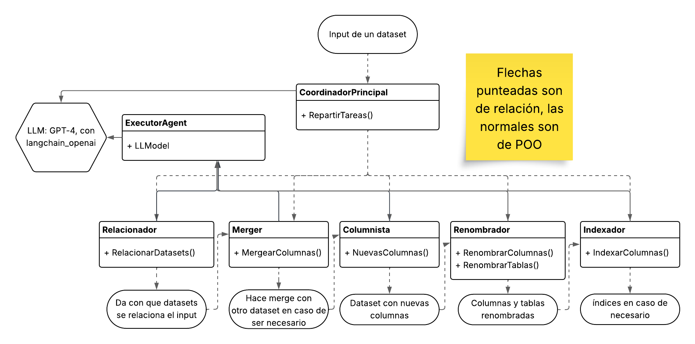
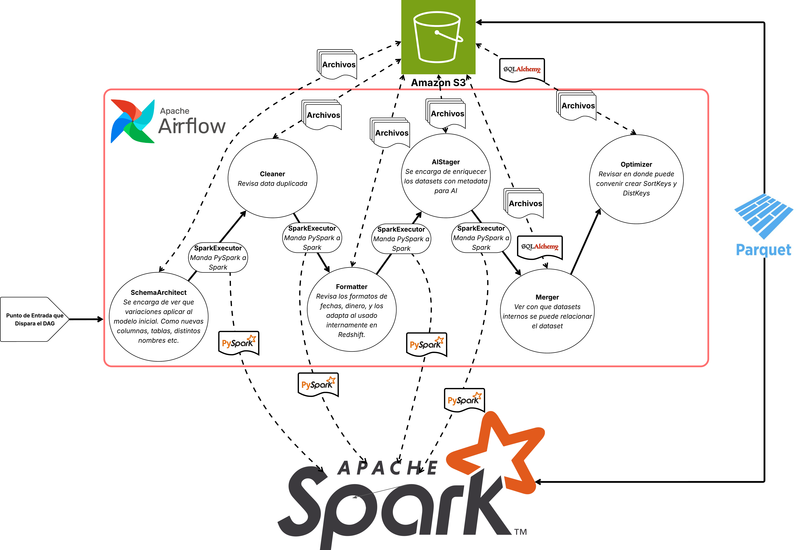
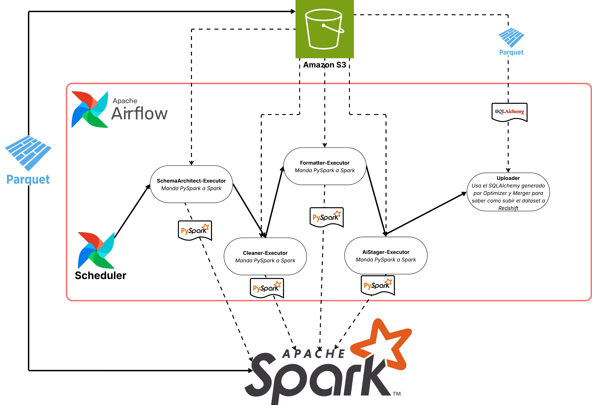
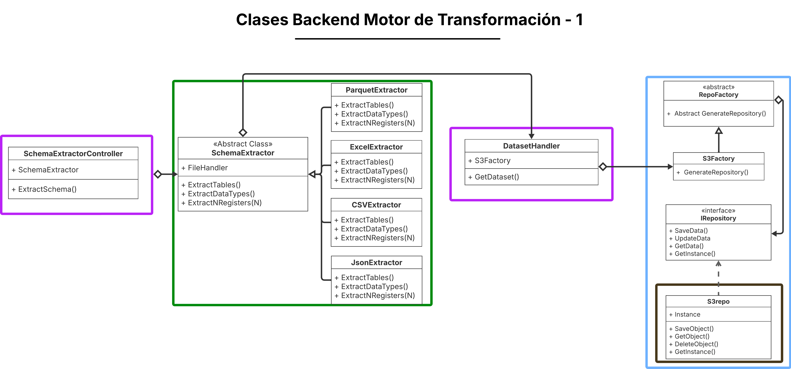
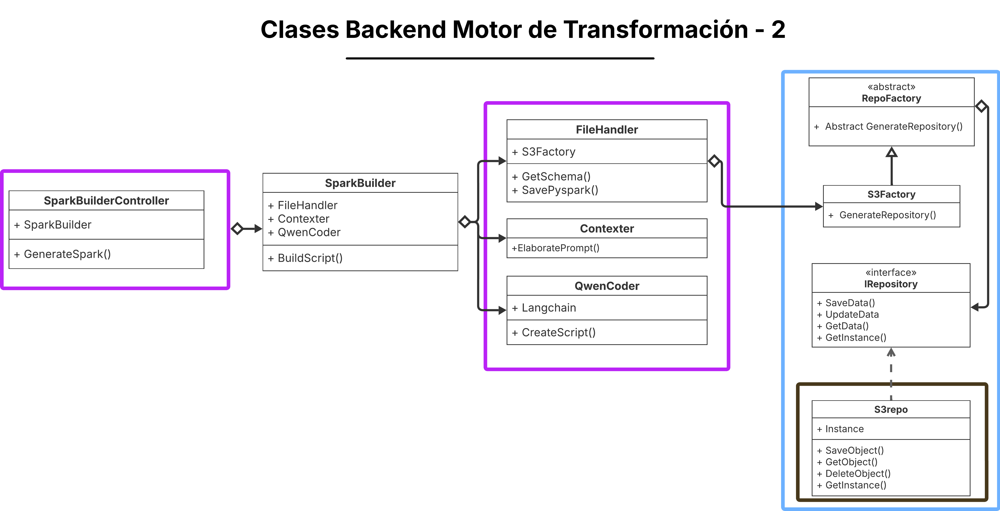
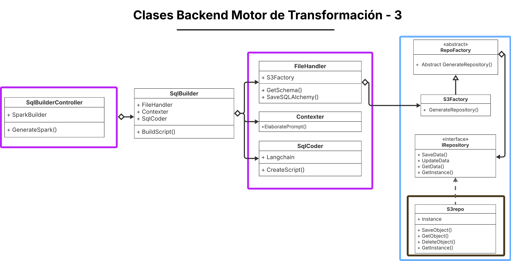
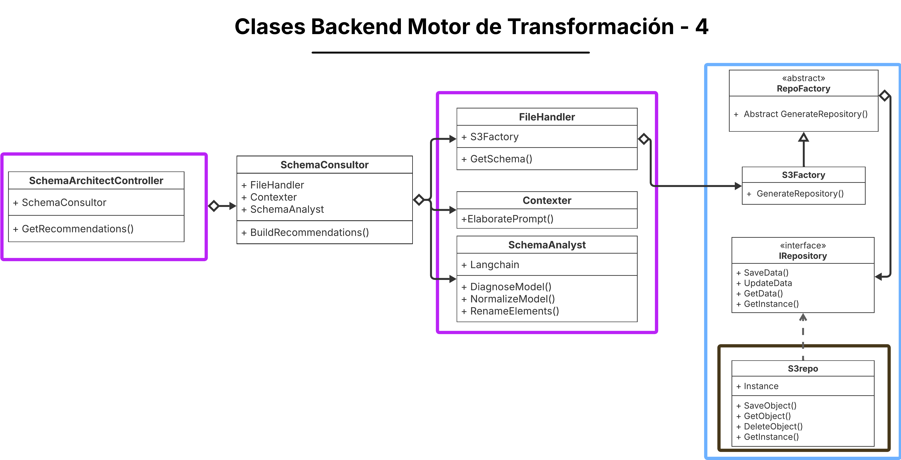
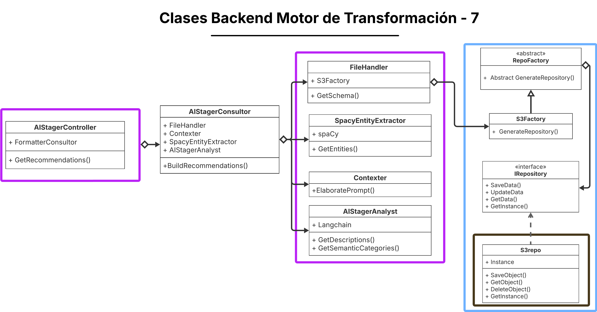
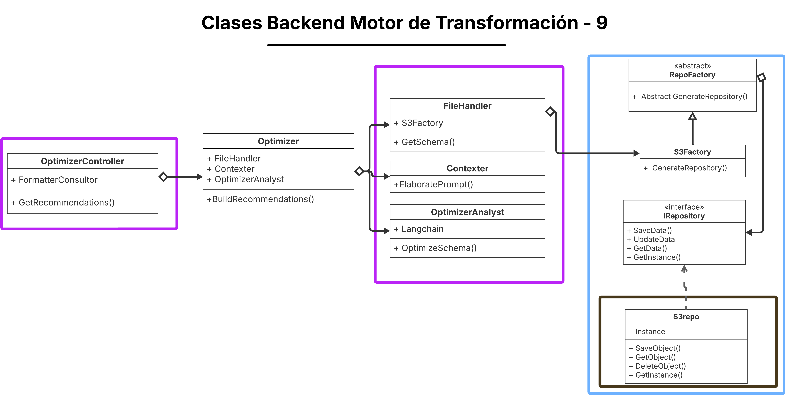

# 4.4 Motor De Transformación

Este componente del sistema representa el punto de conexión entre los datasets inteligentes cargados en un sistema altamente eficiente y la data cruda e ineficiente.

**Procesos involucrados**
Los procesos que ejecuta este componente se dividen en dos partes:

- El primero ocurre justo después de que el Centro de carga notifica que la carga de un dataset en data-temp-storage ha sido finalizada y está lista para transformarse.
- El segundo es responsable de ejecutar las transformaciones necesarias para insertar nueva información en los casos en que haya carga recurrente.

Ambos procesos están fuertemente relacionados, ya que deben mantenerse sincronizados por dataset. La transformación que se generó inicialmente debe ser replicable durante futuras cargas. Para lograrlo, se llevará un registro trazable de cada paso de la primera transformación (esto se detalla más adelante).

Las transformaciones a aplicar no tienen parámetros fijos en la mayoría de los casos. Van a depender completamente de la naturaleza del dataset recibido y de su distribución de registros. Por eso se adopta un enfoque basado en Agentes de IA.

A continuación se muestra un diagrama de clases que presenta una visión general de este enfoque:


En el diagrama se puede ver cómo un orquestador define una cadena de operaciones que serán ejecutadas por distintos agentes. Estos agentes se encargan de analizar los datasets para aplicarles transformaciones como:
- Eliminación de registros duplicados
- Renombramiento de columnas o tablas
- Merging con datasets internos
- Generación de SortKeys y DistKeys para Redshift

Este diagrama no representa la implementación final, ya que nuestro enfoque está basado en tres pilares fundamentales:

- **El coordinador**: El coordinador no será una clase, sino que estará implementado directamente usando Airflow.
- **El ejecutor**:En lugar de tener clases de Python ejecutando cambios directamente, contaremos con un cluster de Spark autogestionado al que se le enviarán los jobs con las instrucciones de transformación.
- **Los analistas**: Aquí sí hablamos de microservicios concretos, cada uno con la responsabilidad de analizar un dataset y sugerir transformaciones. Usaremos LangChain para orquestar el flujo interno. El resultado de cada analista será un archivo o bien de PySpark o SQLAlchemy,los cuales contendrán todas las instrucciones necesarias para llevar a cabo la transformación, y los procedimientos para copiar los datos en Redshift respectivamente. Dichos analistas seguirán un collaborative pattern orienta a IA agents ya que unen fuerzas para lograr transformar un Dataset y subirlo en limpio a Redshift.

A continuación se presenta un grafo que resume este flujo:



Además, se puede evidenciar que en el proceso de Transformación de Datos (TD) dentro de nuestro flujo ETDL, optamos por un enfoque de medallones, donde organizamos los datos en tres categorías:
- **Bronce**: Datos en crudo, sin ninguna transformación. Pueden estar en distintos formatos, desde CSV hasta Parquet.
- **Plata**: : Datos parcialmente transformados y estandarizados, todos en un mismo formato (en nuestro caso, Parquet).
- **Oro**: Datos completamente limpios, modelados y cargados en Redshift, listos para ser consultados con BI.


Por otro lado el segundo proceso, encargado de replicar transformaciones sobre datasets recurrentes, es más sencillo. Usaremos la funcionalidad de Airflow con Crons para coordinar la ejecución periódica.

El job aplicará directamente los mismos archivos de PySpark que fueron generados en la creación inicial del dataset.

A continuación se presenta un diagrama que representa este flujo:

  


## Diseño del Backend
A continuación, se presentará la sección de Diseño del Backend. En esta se detallan los microservicios correspondientes a cada uno de los cinco Analistas, junto con la configuración de Airflow (incluyendo los DAGs definidos), la integración con Spark y todos los componentes que intervienen en el proceso de llevar los datos limpios hasta Redshift.


### Microservicios del Componente

Un detalle importante a aclarar es que este proceso de transformación irá dejando los resultados de cada etapa en un bucket S3 bajo la ruta /silver-data/nombre-del-dataset. Esto permite mantener trazabilidad sobre cada paso del flujo, posibilita realizar rollbacks si fuera necesario, y garantiza la persistencia tanto del schema esperado como de los archivos de transformación de Spark y de Inserción con SQLAlchemy. De esta manera, si en el futuro se desea volver a actualizar el dataset, las transformaciones ya estarán disponibles están listas para reutilizarse, funcionando como una especie de "caché lógica".

**1. schema-extractor**

Este microservicio se encarga de, según el tipo de archivo fuente, extraer su esquema y los top N registros por cada tabla o agrupación. Para ello utiliza pandas y genera como resultado un archivo JSON con la estructura inferida.

Se invoca muchas veces a lo largo del proceso de transformación, ya que antes de llamar a cualquier analista, es necesario entender la estructura del dataset. Fue aislado en un servicio independiente para desacoplar completamente esta lógica del procesamiento específico de cada analista.

 - **SchemaExtractorController**: Expone el endpoint RESTful del microservicio.
  - `/extract-schema/`: Al llamarlo, se genera un JSON con la estructura del dataset solicitado.
- **SchemaExtractor**: Se encarga de extraer el esquema desde los datos crudos. Utiliza distintos strategies según el formato de entrada (CSV, JSON, Parquet, etc.).

El flujo principal sería el siguiente:

1. La consulta llega al SchemaExtractorController:
- El nodo de airflow correspondiente llama a `POST /extract-schema`
```json
{
  "s3path": "Path del s3 donde está el dataset",
  "step": "dice a que paso del proceso de transformación pertence",
  "datasetName": "Nombre del dataset",
  "fileType": "CSV|JSON|Parquet|Excel",
  "NRegisters": "Declara cuantos registros por tabla hay que extraer"
}
```
- Dicha información se enruta al SchemaExtractor para que por medio de Pandas extraiga la información del schema de los archivos del dataset. Además se obtienen los top N elementos sobre el mismo.

- Se generará un json con la información mencionada, llamado schema-json. Dicho archivo será súbido al S3 bajo el nombre de "schema-[Numero de step].json".

**2. spark-builder**

Este microservicio también es transversal a todo el motor de transformación. Se encarga de generar un archivo de spark con las instrucciones para realizar transformaciones, con base en la estructura generada en el schema-extractor y las recomendaciones de los analistas.

Funcionará gracias a un agent de IA con base en el modelo de hugging face: Qwen/Qwen2.5-Coder-32B-Instruct.

 - **SparkBuilderController**: Expone el endpoint RESTful del microservicio.
  - `/gen-spark/`: Punto de entrada que provee la información con la que crear el archivo de pyspark.
- **SparkBuilder**: Se encarga de coordinar el enrequicimiento de contexte con el Agente, para que genere un archivo de spark funcional.

El flujo principal sería el siguiente:

1. La consulta llega al SparkBuilderController:
- El nodo de airflow correspondiente llama a `POST /gen-spark`
```json
{
  "s3path": "Path del s3 donde está el schema.json",
  "step": "dice a que paso del proceso de transformación pertence",
  "datasetName": "Nombre del dataset",
  "recomendations": "recomendations.json",
  "fileType": "CSV|JSON|Excel|Parquet"
}
```
- Dicha información es enrutada al SparkBuilder, el cuál podrá dar el contexto de cual es la fuente de los datos, que recomendaciones tiene, que transformaciones debe realizar el archivo de pyspark y donde debe guardarlo.

- Para asegurar que todos los scripts generados en Spark sigan una estructura consistente, se utilizará un archivo .txt que contiene el prompt base. Este prompt especificará las prácticas que deben seguirse durante las transformaciones, como evitar el uso de funciones UDF, para borrar duplicados siempre usar la función de DropDuplicates() de pyspark, etc. Además incluirá el espacio para agregar las recomendaciones de cada caso.

- Cabe aclarar que las transformaciones independientemente del formato de origen serán pasadas a formato parquet.

- Se obtendra el archivo de pyspark con las transformaciones necesarias. Dicho archivo será súbido al S3 bajo el nombre de "transformation-[Numero de step].py".


**3. sql-builder**

Este microservicio también es transversal a todo el motor de transformación. Se encarga de generar un archivo de python con SQLAlchemy, según un input de recomendaciones. Su desarrollo está orientado a la integración con Redshfit, ya que sus resultados serán aplicados en dicho OLAP.

Funcionará gracias a un agent de IA con base en el modelo de hugging face: defog/sqlcoder-7b-2

 - **SqlBuilderController**: Expone el endpoint RESTful del microservicio.
  - `/gen-pysql/`: Punto de entrada que provee la información con la que crear el archivo de python con SQLAlchemy.
- **SqlBuilder**: Se encarga de coordinar el enrequicimiento de contexto con el Agente, para que genere un archivo de python SQLAlchemy.

El flujo principal sería el siguiente:

1. La consulta llega al SqlBuilderController:
- El nodo de airflow correspondiente llama a `POST /gen-pysql`
```json
{
  "s3path": "Path del s3 donde está el schema.json",
  "step": "dice a que paso del proceso de transformación pertence",
  "datasetName": "Nombre del dataset",
  "recomendations": "recomendations.json"
}
```
- Dicha información es enrutada al SqlBuilder, el cuál podrá saber el contexto de cual es el schema de la fuente, que recomendaciones tiene y donde debe guardarlo.

- Para asegurar que todos los scripts generados en SQLAlchemy sigan una estructura consistente, se utilizará un archivo .txt que contiene el prompt base. Este prompt especificará las prácticas que deben seguirse durante el diseño de las consultas, como que cuando tenga que insertar un dataser completo use el comando COPY.

- El producto final del archivo generado por defog/sqlcoder-7b-2 es un script de python SQLAlchemy apto para Redshift.

- Se obtendra el archivo de python y será súbido al S3 bajo el nombre de "SQLAlchemy-[Numero de step].py".


**4. schema-architect**

Este microservicio representa el analista encargado de leer las tablas, columnas y nombres (extraidas por el schema-extractor), aplicar normalización básica y sugerir mejoras estructurales. El resultado final será un json con todas las recomendaciones para que el spark-builder tenga en cuenta.

Funcionará gracias a un agent de IA con base en el modelo de hugging face: Phind/Phind-CodeLlama-34B-v2

Los componentes internos son los siguientes:

- **SchemaArchitectController**: Expone el endpoint RESTful del microservicio.
  - `/suggest-transformations/`: Al llamarlo, se espera obtener las recomendaciones.

- **SchemaConsultor**: Consulta al agente LLM con el esquema extraído para obtener sugerencias de mejoras, normalización o reestructuración.


El flujo principal sería el siguiente:

1. La consulta llega al SchemaArchitectController:
- El nodo de airflow correspondiente llama a `POST /suggest-transformations`
```json
{
  "s3path": "Path del s3 donde está el schema.json",
  "datasetName": "Nombre del dataset",
  "fileType": "CSV|JSON|Excel|Parquet"
}
```
- Dicha información se enruta al SchemaConsultor para que sepa de donde sacar el schema y cual es el archivo de origen.


2. Proceso de consulta:
- Una vez recibido el schema.json mediante Langchain, se realiza una cadena de consultas a Phind/Phind-CodeLlama-34B-v2 de Hugging Face sobre:
  - Diagnóstico del schema: Que tablas/Columnas duplicadas hay, Columnas "mergeables", Relaciones mal establecidas, Mejoras de diseño de base de datos.
  - Normalizado: Se le pregunta que recomienda normalizar llegando hasta 4NF.
 -  Renombrador: Se le pregunta que tablas/columnas pueden tener nombres más explicitos.

- Para cada prompt se tendrá un .txt base al cual simplemente se le añadirá el contexto obtenido por medio del SchemaExtractor para realizar consultas completas:
``` txt
{Contexto sobre que consideramos sobre buen diseño de base de datos, junto con ejemplos}

Dado el siguiente esquema de un archivo {tipo de archivo origen}:

{input del schemaExtractor}

Identifica cualquier problema de modelado evidente:
- Que tablas/Columnas duplicadas hay
- Que columnas y tablas se pueden unir o separar
- Que relaciones están mal establecidas
- Consejos sobre diseño de base de datos con base en el contexto que se le dió

Devuelve un JSON con una lista de observaciones técnicas con este formato:
{
  "mejoras": [
    {"tipo": "renombrar_columna", "tabla": "clientes", "de": "nombre", "a": "nombre_completo"},
    {"tipo": "normalizar_tabla", "tabla": "ordenes", "sugerencia": "mover dirección a tabla direcciones"}
  ]
}
```

- El flujo orquestrado para los prompts es hecho por LangChain de una forma similar a la siguiente:
``` python
from langchain.llms import HuggingFaceHub
from langchain.prompts import PromptTemplate
from langchain.chains import LLMChain
from langchain.schema.runnable import RunnableMap
import os

# Setup del modelo HuggingFace
llm = HuggingFaceHub(
    repo_id="Phind/Phind-CodeLlama-34B-v2",
    model_kwargs={
        "temperature": 0.2,
        "max_new_tokens": 800
    },
    huggingfacehub_api_token=os.environ["HUGGINGFACEHUB_API_TOKEN"]
)

# Cargar prompts base desde archivos de texto
def load_prompt(file):
    with open(f"prompts/{file}", "r") as f:
        return f.read()

diagnose_prompt = PromptTemplate.from_template(load_prompt("diagnose_prompt.txt"))
normalize_prompt = PromptTemplate.from_template(load_prompt("normalize_prompt.txt"))
rename_prompt    = PromptTemplate.from_template(load_prompt("rename_prompt.txt"))

# Cada paso como cadena
diagnose_chain = LLMChain(llm=llm, prompt=diagnose_prompt)
normalize_chain = LLMChain(llm=llm, prompt=normalize_prompt)
rename_chain = LLMChain(llm=llm, prompt=rename_prompt)

# Ejecutar todo en paralelo y devolver los 3 JSONs
schema_consultor = RunnableMap({
    "diagnóstico": diagnose_chain,
    "normalización": normalize_chain,
    "renombramiento": rename_chain
})
```

3. Se obtendrá un reccomendations.json que será devuelto al nodo de airflow que hizo el POST.

**5. cleaner**

Este microservicio actúa como un analista que revisa las tablas del dataset para decidir en cuáles tiene sentido eliminar duplicados. Por ejemplo, si en la tabla usuarios un mismo registro aparece tres veces por un error en el centro de carga, ahí conviene limpiarlos.

En cambio, en una tabla como visitas_web, donde un mismo usuario puede tener múltiples visitas idénticas en apariencia, eliminar duplicados sería incorrecto porque cada fila representa un evento válido.

Funcionará gracias a un agent de IA con base en el modelo de hugging face: Phind/Phind-CodeLlama-34B-v2

Los componentes internos son los siguientes:

- **CleanerController**: Expone el endpoint RESTful del microservicio.
  - `/clean-dataset/`: Al llamarlo, se espera obtener las recomendaciones.
- **CleanerConsultor**: Consulta al agente LLM con el esquema extraído para obtener sugerencias sobre en que tablas hay que eliminar duplicados.

El flujo principal sería el siguiente:

1. La consulta llega al CleanertController:
- El nodo de airflow correspondiente llama a `POST /clean-dataset`
```json
{
  "s3path": "Path del s3 donde está el schema.json",
  "datasetName": "Nombre del dataset",
  "fileType": "CSV|JSON|Excel|Parquet"
}
```
- Dicha información se enruta al CleanerConsultor para que sepa de donde sacar el schema y tenga contexto sobre que hay en cada tabla.

2. Proceso de consulta:
- Una vez recibido el schema.json, mediante Langchain se le consultará al módelo de hugging face, para que analice en que tablas es recomendado eliminar data.
- Se le dará un prompt con la suficiente información para que genere inferencias con sentido.

3. Se obtendrá un reccomendations.json que será devuelto al nodo de airflow que hizo el POST.

**6. formatter**

Este microservicio actúa como un analista que revisa los tipos de datos para dinero, fechas, decimales, y en general aspectos de formato de un dataset. Gracias a él, posteriormente en la base de datos en Redshift se mantendrá un formato unificado para los tipos de dato.

Funcionará gracias a un agent de IA con base en el modelo de hugging face: Phind/Phind-CodeLlama-34B-v2.

Los componentes internos son los siguientes:

- **FormatterController**: Expone el endpoint RESTful del microservicio.
  - `/format-dataset/`: Al llamarlo, se espera obtener las recomendaciones.
- **FormatterConsultor**: Consulta al agente LLM con el esquema extraído para obtener sugerencias sobre que tipos de datos hay que cambiar.

El flujo principal sería el siguiente:

1. La consulta llega al FormatterController:
- El nodo de airflow correspondiente llama a `POST /clean-dataset`
```json
{
  "s3path": "Path del s3 donde está el schema.json",
  "datasetName": "Nombre del dataset",
  "fileType": "CSV|JSON|Excel|Parquet"
}
```
- Dicha información se enruta al FormatterConsultor para que sepa de donde sacar el schema y tenga contexto sobre que hay en cada tabla.

2. Proceso de consulta:
- Una vez recibido el schema.json,  mediante Langchain se le consultará al módelo de hugging face, para que analice en que tablas es modificar tipos de datos.
- Se le dará un prompt con la suficiente información para que genere inferencias con sentido.
- En el prompt se le dirá la lista completa de tipos de datos de uso interno en Redshift, por ejemplo:
  - INTEGER: para enteros.
  - REAL: Para números punto flotante.
  - DATE: Con DD-MM-YYYY, para las fechas.
  - TEXT: Para los campos de strings/texto.
  - ...

3. Se obtendrá un reccomendations.json que será devuelto al nodo de airflow que hizo el POST.

**7. ai-stager**

Este microservicio es el analista más importante desde el punto de vista de posterior anális RAG dentro de Redshift. Se encargará de decir que contenido debe ser agregado a las columnas de CategoriaSemantica y Descripcion sobre todas las tablas del dataset.

Funcionará gracias a un agent de IA con base en el modelo de hugging face: Phind/Phind-CodeLlama-34B-v2. Sin embargo también se usará como ayuda la biblioteca de NLP de spaCy.

Los componentes internos son los siguientes:

- **AIStagerController**: Expone el endpoint RESTful del microservicio.
  - `/enrich-dataset/`: Al llamarlo, se espera obtener las recomendaciones.
- **AIStagerConsultor**: Consulta al agente LLM con el esquema extraído para obtener sugerencias sobre que metadata ponerle a los registros, además de usar spaCy para enriquecer el contexto.

El flujo principal sería el siguiente:

1. La consulta llega al AIStagerController:
- El nodo de airflow correspondiente llama a `POST /enrich-dataset`
```json
{
  "s3path": "Path del s3 donde está el schema.json",
  "datasetName": "Nombre del dataset",
  "fileType": "CSV|JSON|Excel|Parquet"
}
```
- Dicha información se enruta al AIStagerConsultor para que sepa de donde sacar el schema y tenga contexto sobre que hay en cada tabla.

2. Enriquecimiento de consulta:
  - Antes de enviar la información al agente para generar las descripciones y categorías semánticas, se utilizará spaCy para analizar los nombres de tablas, columnas, tipos de datos y los primeros N registros. Este análisis extraerá entidades que enriquecerán el contexto disponible. Aunque spaCy por sí sola podría proporcionar la función de categorización semántica, se empleará solo como una etapa previa al análisis del agente para obtener mejores resultados.

3. Proceso de consulta:
- Una vez recibido el schema.json y el enriquecimiento de Spacy, mediante Langchain se realiza una cadena de consultas a Phind/Phind-CodeLlama-34B-v2 de Hugging Face sobre:
  - Descripción: Con base en los primeros N registros, nombres de tablas, columnas y tipos de datos, el sistema debe identificar patrones y generar descripciones específicas para cada patrón detectado.
  - Categorización Semántica: Utilizando la misma información de la descripción más las entidades extraídas por spaCy, el sistema generará categorías semánticas para todos los registros basándose en los patrones identificados.

- Para cada prompt se tendrá un .txt base al cual simplemente se le añadirá el contexto obtenido por medio del Schema.json y las entidades de spaCy para realizar consultas completas.

4. Se obtendrá un recomendations.json que será devuelto al nodo de airflow que hizo el POST.

**8. merger**

Este microservicio se encarga de obtener información general sobre los datasets que el colectivo ya tiene almacenados, para posteriormente enviar esta información al agente de IA. El agente evaluará si es conveniente remover alguna tabla del proceso de transformación actual y fusionarla con alguna tabla existente en Redshift. A diferencia de los analistas previos, este lo que busca es encontrar sugerencias sobre como debe ser el proceso de inserción a Redshift, no es tanto sobre transformación de datos, es más orientado al diseño.

Funcionará gracias a un agent de IA con base en el modelo de hugging face: Phind/Phind-CodeLlama-34B-v2.

Los componentes internos son los siguientes:

- **MergerController**: Expone el endpoint RESTful del microservicio.
  - `/merge-dataset/`: Al llamarlo, se espera obtener las recomendaciones.
- **RedshiftExtractor**: Extrae información sobre las tablas y sus respectivas columnas, de los datasets del colectivo
- **MergeConsultor**: Consulta al agente LLM con el esquema extraído y la información de Redshift si vale la pena fusionar alguno de los datasets

El flujo principal sería el siguiente:

1. Recepción de Consulta:
- El nodo de airflow correspondiente llama a `POST /enrich-dataset`
```json
{
  "s3path": "Path del s3 donde está el schema.json",
  "datasetName": "Nombre del dataset",
  "fileType": "CSV|JSON|Excel|Parquet"
}
```
- Dicha información se enruta al MergeConsultor para que sepa de donde sacar el schema y tenga contexto sobre que hay en cada tabla.

2. Obtención de contenido de Redshift:
  - El RedshiftExtractor se encargará de traer todos los nombres de Columnas y Tablas de los datasets que tenga el Colectivo en la plataforma:
    - Revisará en RDS la tabla que marca que Datasets pertencen al colectivo, y además la tabla que detalla que tablas de Redshift pertenecen a cada Dataset.
    - Mediante un Script de SQLAlchemy obtendrá todos los resultados.
    - Se genera un archivo json con los schemas obtenidos.
    - Si el colectivo nunca ha subido un dataset, entonces este paso se omite.

3. Proceso de consulta:
- Una vez recibido el schema.json y el schema-redshift.json de los datasets ya subidos, mediante Langchain se le realizara consulta a Phind/Phind-CodeLlama-34B-v2 de Hugging Face sobre:
  - Merge: Se le dará un prompt con un contexto sobre que consideramos un Merge en nuestro sistema, junto con ambos Json con schemas, para que infiera que tablas pueden ser unidas, cuales deben insertarse directamente, cuales deben ser actualizadad.

3. Se obtendrá un recomendations.json que será devuelto al nodo de airflow que hizo el POST.


**9. optimizer**

Este microservicio es el agente final del proceso de Transformación y Diseño. Tendrá que inferir con base en el Schema.json de la última transformación, si vale la pena definir SortKeys y DistKeys a la hora de insertar en Redshift. Al igual que el merger, este analista lo que busca es encontrar sugerencias sobre como debe ser el proceso de inserción a Redshift, no es tanto sobre transformación de datos, es más orientado al diseño.

Funcionará gracias a un agent de IA con base en el modelo de hugging face: Phind/Phind-CodeLlama-34B-v2.

Los componentes internos son los siguientes:

- **OptimizerController**: Expone el endpoint RESTful del microservicio.
  - `/optimize-dataset/`: Al llamarlo, se espera obtener las recomendaciones.
- **OptimizerConsultor**: Consulta al agente LLM con el esquema extraído si vale la penas definir DistKeys, SortKeys, y en caso de que sí, en donde.

El flujo principal sería el siguiente:

1. Recepción de Consulta:
- El nodo de airflow correspondiente llama a `POST /optimize-dataset`
```json
{
  "s3path": "Path del s3 donde está el schema.json",
  "datasetName": "Nombre del dataset",
  "fileType": "CSV|JSON|Excel|Parquet"
}
```
- Dicha información se enruta al OptimizerConsultor para que sepa de donde sacar el schema y tenga contexto sobre que hay en cada tabla.

2. Proceso de consulta:
- Una vez recibido el schema.json, mediante Langchain se le consultará al módelo de hugging face, para que analice en que tablas es crear optimizaciones de búsqueda.
- Se le dará un prompt con la suficiente información para que genere inferencias con sentido.
- Además se le proveeran que criterios de aceptación debe cumplir una columna para poder ser apta para SortKeys y DistKeys.

3. Se obtendrá un recomendations.json que será devuelto al nodo de airflow que hizo el POST.


**10. uploader**

Este microservicio representa el agente final del flujo de Airflow. Su función es desarrollar una estrategia de inserción del dataset a Redshift, utilizando como base el último archivo parquet generado por los procesos de transformación y los archivos de SQLAlchemy creados por el optimizer y merger.

Funcionará gracias a un agent de IA con base en el modelo de hugging face: Phind/Phind-CodeLlama-34B-v2.

Los componentes internos son los siguientes:

- **UploaderController**: Expone el endpoint RESTful del microservicio.
  - `/optimize-dataset/`: Al llamarlo, se espera obtener las recomendaciones.
- **UploaderConsultor**: Consulta al agente LLM con el schema final y los archivos de SQLAlchemy para que sugiera como debe ser el archivo de inserción definitivo.

El flujo principal sería el siguiente:

1. Recepción de Consulta:
- El nodo de airflow correspondiente llama a `POST /optimize-dataset`
```json
{
  "s3path": "Path del s3 donde está el schema.json",
  "datasetName": "Nombre del dataset",
  "fileType": "CSV|JSON|Excel|Parquet"
}
```
- Dicha información se enruta al UploaderConsultor para que sepa de donde sacar el schema y los archivos de SQLAlchemy y tenga contexto sobre que hay en cada tabla.

2. Proceso de consulta:
- Una vez recibido el schema.json y los archivos de SQLAlchemy. mediante Langchain se realiza una cadena de consultas a Phind/Phind-CodeLlama-34B-v2 de Hugging Face sobre:
- Inserción: Define cuales son las tablas que pueden ser insertadas directamente con el comando de COPY.
- Update: Ubica cuales son las tablas que se deben mergear y sugiere como hacerle update a la existente en Redshift. Debe tomar en cuenta técnicas como aprovechar Ids Incrementales para saber solo cuales insertar, y timestamps para saber a cuales registros hacer update.
- Optimizador: Verifica que los SortKeys y DistKeys solo se estén aplicando a tablas nuevas.

3. Se obtendrá un recomendations.json que será devuelto al nodo de airflow que hizo el POST.

**11. schema-enforcer**

Este microservicio es exclusivo a los procesos de carga recurrente, ya que se encarga de revisar que la data traida de la fuente tenga el mismo schema que se uso durante le proceso de transformación. En caso de no coincidir, da las recomendaciones para que más adelante se pueda crear la transformación para que el dataset quedé con el formato necesitado.

Funcionará gracias a un agent de IA con base en el modelo de hugging face: Phind/Phind-CodeLlama-34B-v2.

Los componentes internos son los siguientes:

- **SchemaEnforcerController**: Expone el endpoint RESTful del microservicio.
  - `/enforce-schema/`: Al llamarlo, se espera obtener las recomendaciones.
- **SchemaEnforcerConsultor**: Revisa con base en el schema del schema-extractor viejo y el nuevo, que diferencias hay, y da recomendaciones de como unificar los formatos

El flujo principal sería el siguiente:

1. Recepción de Consulta:
- El nodo de airflow correspondiente llama a `POST /optimize-dataset`
```json
{
  "s3path": "Path del s3 donde está el schema.json",
  "datasetName": "Nombre del dataset",
  "fileType": "CSV|JSON|Excel|Parquet"
}
```
- Dicha información se enruta al SchemaEnforcerConsultor para que sepa de donde sacar el schema viejo y el nuevo.

2. Proceso de consulta:
- Una vez recibido los schema.json mediante Langchain se realizan consultas a Phind/Phind-CodeLlama-34B-v2 de Hugging Face sobre que diferencias nota en ambos Schemas, y en caso de que las haya resaltar cuales son y donde.

3. Se obtendrá un recomendations.json que será devuelto al nodo de airflow que hizo el POST.


### Diagramas de Clases

A continuación se presenta la estructura de clases utilizada por cada uno de los microservicios. Es importante aclarar que, aunque algunas clases se repiten entre diagramas, en realidad son las mismas. Sin embargo, dado que cada microservicio funciona como una unidad aislada, se ha generado un diagrama independiente para cada uno.

Otro punto a destacar es que, aunque en la capa de "consultores" dichas clases realizan una función similar con distintas lógicas (lo que podría interpretarse como un Strategy pattern), esta relación no se refleja explícitamente. Esto se debe a que, dentro de cada microservicio, solo existe un único consultor activo, por lo que no es necesario mostrar dicho diseño.


**1. schema-extractor**

Primeramente, los patrones de diseño orientados a objetos utilizados son los siguientes:

- Morado: Representa un facade.
- Verde: Representa un strategy.
- Celeste: Muestra un factory.
- Café: Representa un singleton.

Ahora bien, las clases están organizadas de la siguiente manera:

El punto de entrada es el SchemaExtractorController, que actúa como facade para que el Airflow se comunique con este microservicio. Este controlador delega las llamadas directamente a un SchemaExtractor dependiendo del tipo de archivo que sea el dataset, se usa strategy para que dentro de esa clase Pandas pueda adaptarse.

Luego para poder acceder a los datasets se usa el DatasetHandler que se encarga de traer los archivos en S3.

Finalmente, existe una capa de repositorios gestionada mediante el patrón Factory. Además, cada conexión se maneja utilizando el patrón Singleton.




**2. spark-builder**

Primeramente, los patrones de diseño orientados a objetos utilizados son los siguientes:

- Morado: Representa un facade.
- Celeste: Muestra un factory.
- Café: Representa un singleton.

Ahora bien, las clases están organizadas de la siguiente manera:

El punto de entrada es el SparkBuilderController, que actúa como facade para que el Airflow se comunique con este microservicio. Este controlador delega las llamadas directamente al SparkBuilder que se encarga de orquestrar la adquisión del schema.json, para poder mediante el Contexter usandoló y las reccomendations crear el prompt para el QwenCoder que hará el script final de PySpark.

Finalmente, existe una capa de repositorios gestionada mediante el patrón Factory. Además, cada conexión se maneja utilizando el patrón Singleton.




**3. sql-builder**

Primeramente, los patrones de diseño orientados a objetos utilizados son los siguientes:

- Morado: Representa un facade.
- Celeste: Muestra un factory.
- Café: Representa un singleton.

Ahora bien, las clases están organizadas de la siguiente manera:

El punto de entrada es el SqlBuilderController, que actúa como facade para que el Airflow se comunique con este microservicio. Este controlador delega las llamadas directamente al SqlBuilder que se encarga de orquestrar la adquisión del schema.json y el reccomendations para con el contexter crear el prompt para el SqlCoder que hará el script final de SQLAlchemy.

Finalmente, existe una capa de repositorios gestionada mediante el patrón Factory. Además, cada conexión se maneja utilizando el patrón Singleton.




**4. schema-architect**

Primeramente, los patrones de diseño orientados a objetos utilizados son los siguientes:

- Morado: Representa un facade.
- Celeste: Muestra un factory.
- Café: Representa un singleton.

Ahora bien, las clases están organizadas de la siguiente manera:

El punto de entrada es el SchemaArchitectController, que actúa como facade para que el Airflow se comunique con este microservicio. Este controlador delega las llamadas directamente al SchemaConsultor que se encarga de orquestrar la adquisión del schema.json para con el contexter crear el prompt para el SchemaAnalyst logre realizar las recomendaciones sobre el dataset sobre modelado, normalización, y nombres significativos.

Finalmente, existe una capa de repositorios gestionada mediante el patrón Factory. Además, cada conexión se maneja utilizando el patrón Singleton.



**5. cleaner**

Primeramente, los patrones de diseño orientados a objetos utilizados son los siguientes:

- Morado: Representa un facade.
- Celeste: Muestra un factory.
- Café: Representa un singleton.

Ahora bien, las clases están organizadas de la siguiente manera:

El punto de entrada es el CleanerController, que actúa como facade para que el Airflow se comunique con este microservicio. Este controlador delega las llamadas directamente al CleanerConsultor que se encarga de orquestrar la adquisión del schema.json para con el contexter crear el prompt para el GarbageAnalyst logre realizar las recomendaciones sobre el dataset con respecto a que en que tablas eliminar registros.

Finalmente, existe una capa de repositorios gestionada mediante el patrón Factory. Además, cada conexión se maneja utilizando el patrón Singleton.


**6. formatter**

Primeramente, los patrones de diseño orientados a objetos utilizados son los siguientes:

- Morado: Representa un facade.
- Celeste: Muestra un factory.
- Café: Representa un singleton.

Ahora bien, las clases están organizadas de la siguiente manera:

El punto de entrada es el FormatterController, que actúa como facade para que el Airflow se comunique con este microservicio. Este controlador delega las llamadas directamente al FormatterConsultor que se encarga de orquestrar la adquisión del schema.json para con el contexter crear el prompt para el FormatAnalyst logre realizar las recomendaciones sobre el dataset con respecto a que tipos de datos o formatos no coinciden con los de Redshift internamente.

Finalmente, existe una capa de repositorios gestionada mediante el patrón Factory. Además, cada conexión se maneja utilizando el patrón Singleton.


**7. ai-stager**
Primeramente, los patrones de diseño orientados a objetos utilizados son los siguientes:

- Morado: Representa un facade.
- Celeste: Muestra un factory.
- Café: Representa un singleton.

Ahora bien, las clases están organizadas de la siguiente manera:

El punto de entrada es el AIStagerController, que actúa como facade para que el Airflow se comunique con este microservicio. Este controlador delega las llamadas directamente al AIStagerConsultor que se encarga de orquestrar la adquisión del schema.json para con el contexter, obtener del SpacyEntityExtractor contexto adicional sobre los registros del sistema. Posteriormente, crear el prompt para el AIStagerAnalyst logre realizar las recomendaciones sobre el dataset con respecto a que campos de Descriptions y CategoríasSemanticas se le puede asignar a los registros del dataset.

Finalmente, existe una capa de repositorios gestionada mediante el patrón Factory. Además, cada conexión se maneja utilizando el patrón Singleton.




**8. merger**
Primeramente, los patrones de diseño orientados a objetos utilizados son los siguientes:

- Morado: Representa un facade.
- Celeste: Muestra un factory.
- Café: Representa un singleton.

Ahora bien, las clases están organizadas de la siguiente manera:

El punto de entrada es el MergerController, que actúa como facade para que el Airflow se comunique con este microservicio. Este controlador delega las llamadas directamente al MergeConsultor que se encarga de orquestrar la adquisión del schema.json para con el contexter, y obtener los Schemas de los datasets del Colectivo. Posteriormente, crear el prompt para que el MergeAnalyst logre realizar las recomendaciones sobre que tablas pueden ser mergeables entre las del dataset y las de Redshift

Finalmente, existe una capa de repositorios gestionado mediante el patrón Factory. Además, cada conexión se maneja utilizando el patrón Singleton.


**9. optimizer**

Primeramente, los patrones de diseño orientados a objetos utilizados son los siguientes:

- Morado: Representa un facade.
- Celeste: Muestra un factory.
- Café: Representa un singleton.

Ahora bien, las clases están organizadas de la siguiente manera:

El punto de entrada es el OptimizerController, que actúa como facade para que el Airflow se comunique con este microservicio. Este controlador delega las llamadas directamente al OptimizerConsultor que se encarga de orquestrar la adquisión del schema.json para con el contexter crear el prompt para que el OptimizerAnalyst logre realizar las recomendaciones sobre que DistKeys y SortKeys usar en redshift.

Finalmente, existe una capa de repositorios gestionada mediante el patrón Factory. Además, cada conexión se maneja utilizando el patrón Singleton.



**10. uploader**

Primeramente, los patrones de diseño orientados a objetos utilizados son los siguientes:

- Morado: Representa un facade.
- Celeste: Muestra un factory.
- Café: Representa un singleton.

Ahora bien, las clases están organizadas de la siguiente manera:

El punto de entrada es el UploaderController, que actúa como facade para que el Airflow se comunique con este microservicio. Este controlador delega las llamadas directamente al UploaderConsultor que se encarga de orquestrar la adquisión del schema.json y los archivos de SQLAlchemy generados por el optimizer y merger, para con el contexter crear el prompt para que el UploaderAnalyst logre desarrollar la estrategia de subida del dataset a Redshift.

Finalmente, existe una capa de repositorios gestionada mediante el patrón Factory. Además, cada conexión se maneja utilizando el patrón Singleton.


**11. schema-enforcer**

Primeramente, los patrones de diseño orientados a objetos utilizados son los siguientes:

- Morado: Representa un facade.
- Celeste: Muestra un factory.
- Café: Representa un singleton.

Ahora bien, las clases están organizadas de la siguiente manera:

El punto de entrada es el SchemaEnforcerController, que actúa como facade para que el Airflow se comunique con este microservicio. Este controlador delega las llamadas directamente al SchemaEnforcerConsultor que se encarga de orquestrar la adquisión de los schema.json, para con el contexter crear el prompt para que el SchemaAnalyst logre ubicar cuales son las diferencias entre ambos.

Finalmente, existe una capa de repositorios gestionada mediante el patrón Factory. Además, cada conexión se maneja utilizando el patrón Singleton.


### Arquitectura de Airflow

Apache Airflow será el coordinador de este componente, por lo que tendrá dos responsabilidades principales:
- Disparar el DAG de transformación inicial.
- Programar los Crons asociados a los datasets con carga recurrente.

Para iniciar el proceso de transformación, habrá un DAG en Airflow que se ejecuta cada 30 segundos y escucha a RabbitMQ en busca de mensajes del centro de carga. Estos mensajes indican cuándo hay un nuevo dataset listo para procesar e incluyen la ruta en S3, el nombre del dataset y su tipo.

Con esta información, se activa el DAG principal de transformación, que está diseñado con parámetros dinámicos para adaptarse a cualquier dataset. El grafo de este DAG sigue la siguiente estructura:

``` txt
(schema-extractor -> schema-architect -> spark-builder) -> execute-spark -> (schema-extractor -> cleaner -> spark-builder) -> execute-spark -> (schema-extractor -> formatter -> spark-builder) -> execute-spark -> (schema-extractor -> ai-stager -> spark-builder) ->  execute-spark -> (merger -> sql-builder) -> (optimizer -> sql-builder) -> (uploader -> sql-builder) -> execute-sql.
```

En la representación del DAG se pueden identificar cuatro etapas de transformación seguidas por tres etapas de cálculo e inserción en Redshift. Cada una de estas fases se ejecuta de forma secuencial, asegurando un flujo ordenado y trazable de los datos.

Por otro lado, el sistema de carga recurrente se apoya en el Scheduler de Airflow. Se implementarán 24 DAGs programados (uno por cada hora del día), además de tres DAG adicionales que corren cada 12, 6 y 3 horas. Todos estos DAGs reutilizan una misma plantilla dinámica, que realiza lo siguiente:

- Consulta la tabla DatasetCrons en RDS.
- Filtra los datasets cuya expresión CRON coincida con la hora de ejecución actual.
- Itera sobre los resultados y lanza, para cada uno, una ejecución específica del DAG de transformación parametrizado.

``` python
TriggerDagRunOperator(
    task_id="trigger_etl",
    trigger_dag_id="etl_pipeline_dag",
    conf=dataset_pipeline("covid_datos", "s3://bronze_data/covid_datos"),
)
```

Este DAG se encargará de aplicar el siguiente Grafo:
``` txt
(schema-extractor -> schema-enforcer -> spark-builder) -> execute-spark -> execute-spark -> execute-spark ->  execute-spark -> execute-sql.
```
Este DAG tiene una estructura más simple, ya que introduce únicamente una fase adicional al inicio: la verificación del esquema del dataset. En esta etapa se compara el dataset de origen con el schema.json previamente almacenado. Si se detectan cambios, el esquema se ajusta.

Una vez validado o actualizado el esquema, el proceso continúa aplicando los scripts de PySpark generados previamente por el motor de transformación, los cuales se encuentran guardados en su ruta correspondiente en S3. Finalmente, se realiza la inserción o actualización de los datos en Redshift con base en lo que se definió también en el uploader.

Un punto adicional a aclarar es que la base de datos interna de Airflow será una pequñeña instancia de Postgres.

Además, para la comunicación de errores en los procesos de un DAG Airflow permite conectar con AWS SES, por lo que en caso de que un paso falle se le enviará un correo a los administradores de la plataforma para que resuelvan manualmente el error.

Finalmente, ya que se usará Airflow autogestionado se optará por la opción de CeleryExecutor, el cual coordina una cola de rabbitMQ entre los nodos workers, para que estos puedan seleccionar DAGs a ejecutar según su disponibilidad. Esta opción permite escalar los workers horizontalmente en caso de ser necesario.


### Arquitectura de Spark

Para utilizar Spark, se adoptará un enfoque autogestionado desplegando el Helm Chart oficial de Bitnami sobre Kubernetes. Inicialmente, se configurarán 9 nodos worker, aunque antes del despliegue definitivo se realizarán pruebas de carga para validar si esta cantidad resulta suficiente o si es necesario escalar horizontalmente.

La ejecución de scripts PySpark se realizará mediante el comando spark-submit, el cual será lanzado desde los nodos de Airflow llamados execute-spark. Estos nodos enviarán las tareas al nodo master de Spark, que se encargará de coordinar la ejecución distribuida, dividiendo automáticamente la carga de trabajo entre los workers del clúster.


### Servicios de AWS

**Amazon EKS (Elastic Kubernetes Service)**

El cluster de Kubernetes opera como el núcleo computacional donde residen todos los microservicios del Motor de Transformación, activándose automáticamente cuando el Centro de Carga notifica la disponibilidad de nuevos datasets para procesar.

**Configuración de Hardware:**

- **Versión de Kubernetes**: 1.29 (alineada con el resto del ecosistema)
- **Tipo de nodos**: Amazon EC2 t3.large (2 vCPU, 8 GB RAM)
- **Escalado**: 3-15 nodos que se expanden durante picos de carga nocturna cuando los datasets programados se procesan en batch
- **Almacenamiento**: EBS gp3 con 100 GB por nodo para checkpoints temporales de Spark
- **Red**: VPC privada que facilita comunicación segura con RDS y Redshift durante las transformaciones


**AWS SES**
Servicio para envío de correos electrónicos confiables y escalables.

- **Configuración:**
  - **Región:** us-east-1.
  - **Identidad verificada:** Dominios y correos electrónicos verificados.
  - **Políticas de envío:** Limitaciones y tasas configuradas para evitar bloqueos.
  - **Autenticación:** SPF, DKIM y DMARC configurados para mejorar entregabilidad.


### Monitoreo

**Prometheus en EKS - Recolección Contextual**

Prometheus opera continuamente dentro del cluster, pero intensifica la recolección de métricas durante ventanas de procesamiento activo, adaptando la frecuencia de scraping según la carga operacional.

**Momentos de alta frecuencia:**
Durante ejecución de jobs Spark masivos, el scrape interval se reduce a 15 segundos para capturar métricas granulares de memory spill, shuffle operations y task failures. Fuera de estas ventanas, vuelve a 60 segundos para optimizar recursos.

**ServiceMonitors adaptativos:**

- **etl-orchestrator**: Intensifica monitoreo cuando coordina múltiples jobs concurrentes, especialmente durante cargas batch nocturnas
- **airflow-scheduler**: Monitoreo continuo con alertas que se activan cuando la cola de tareas supera umbrales definidos dinámicamente según patrones históricos
- **spark-jobs**: Métricas se recolectan solo durante ejecución activa, eliminando overhead cuando no hay procesamiento

**AWS CloudWatch - Monitoreo de Servicios Subyacentes**

CloudWatch captura automáticamente métricas de la infraestructura AWS que soporta las transformaciones, correlacionando performance de aplicación con salud de servicios subyacentes.


**EKS Cluster Health:**

- **Node utilization**: CPU y memoria de nodos correlacionada con número de executors Spark activos
- **Pod startup latency**: Tiempo que toman pods en alcanzar estado Ready durante scaling events
- **API server response time**: Latencia de Kubernetes API durante operaciones de scaling masivo

**AWS X-Ray - Tracing Distribuido**

X-Ray proporciona visibilidad completa del flujo de requests entre microservicios durante transformaciones, identificando bottlenecks específicos en el pipeline ETL.

**Traces instrumentados:**

- **End-to-end ETL flow**: Desde notificación de RabbitMQ hasta confirmación de carga en Redshift, mostrando latencia de cada paso
- **Cross-service calls**: Llamadas entre etl-orchestrator y data-quality-service visualizadas con latencia detallada
- **AWS service interactions**: Latencia de llamadas a Secrets Manager, S3, y KMS durante operaciones críticas
- **Database query performance**: Tiempo específico de queries a RDS correlacionado con carga concurrente

Los traces permiten identificar rápidamente si lentitud proviene de network latency, database contention, o processing logic.

**AWS Config - Compliance Monitoring**

Config monitorea continuamente configuraciones de seguridad y compliance, alertando sobre desviaciones que podrían violar requisitos de la Ley 8968.

**Rules configuradas:**

- **EKS security groups**: Valida que solo puertos necesarios estén abiertos y que tráfico sea restringido a subnets autorizadas
- **S3 bucket encryption**: Asegura que todos los buckets del Motor mantengan cifrado habilitado con keys apropiadas
- **RDS security configurations**: Monitorea que cifrado en tránsito y en reposo permanezca habilitado

Las violaciones activan automáticamente remediation workflows que revierten cambios no autorizados.

**AWS CloudTrail - Auditoría Completa**

CloudTrail registra todas las API calls realizadas por microservicios del Motor, proporcionando trazabilidad completa para auditorías de compliance e investigación de incidentes.

**Eventos auditados:**

- **S3 data access**: Cada lectura/escritura de datos durante transformaciones, incluyendo IP source y timestamp exacto
- **RDS connections**: Establecimiento de conexiones desde pods EKS hacia RDS con identificación precisa de workload

Los logs se integran con sistemas de SIEM gubernamentales cuando se procesan datasets de entidades públicas.

**Grafana - Visualización Contextual del Pipeline**

**Dashboard "ETL Pipeline Flow":**
Combina métricas de Prometheus, CloudWatch y trazas de X-Ray en visualización unificada que muestra datasets fluyendo desde Centro de Carga hasta La Bóveda, con drill-down capability hacia traces específicos cuando hay problemas.

**Dashboard "Security & Compliance":**
Integra datos de Config, CloudTrail y CloudWatch para mostrar postura de seguridad en tiempo real, incluyendo encryption status, access patterns y compliance violations con alertas visuales inmediatas.

**Dashboard "Cost Optimization":**
Correlaciona métricas de utilización de recursos con costos generados, mostrando cost-per-transformation y sugiriendo optimizaciones automáticas basadas en patterns históricos.

### Diagrama del backend

A continuación se presenta el diagrama del backend del Motor de transforamción. En él se evidencia cómo todo el ecosistema de AWS interactúa con los distintos microservicios desplegados en el clúster de Kubernetes provisto por EKS. También se describen los microservicios internos junto a sus distintas clases, los patrones de diseño utilizados, y cómo interactúan con Airflow, para que posteriormente este se encarga de delegar los jobs a spark.

Se muestra cómo la contenerización de cada microservicio se realizará utilizando Docker, y cómo el monitoreo interno será gestionado por Prometheus. Además, se destaca que en la capa externa a AWS donde se encuentra como Hugging Face funciona como fachada para interactuar con los 3 Módelos de inteligencia artificial principales.


