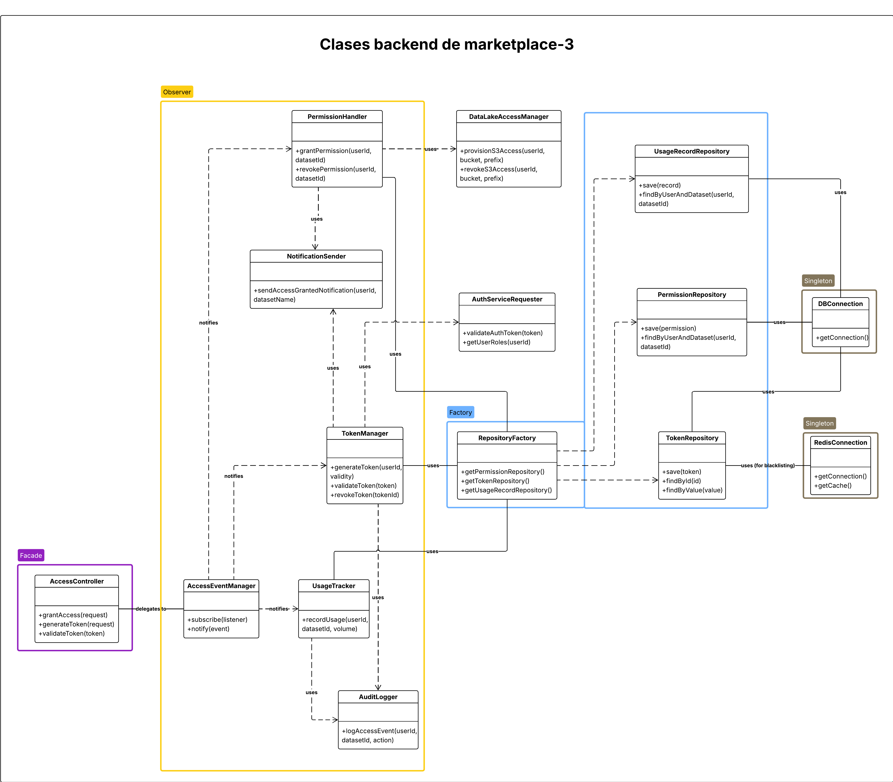
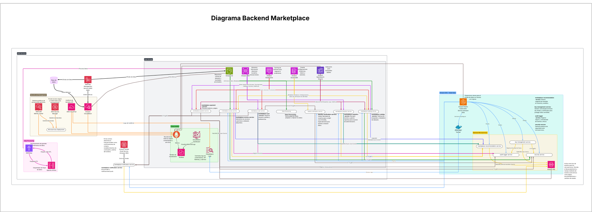
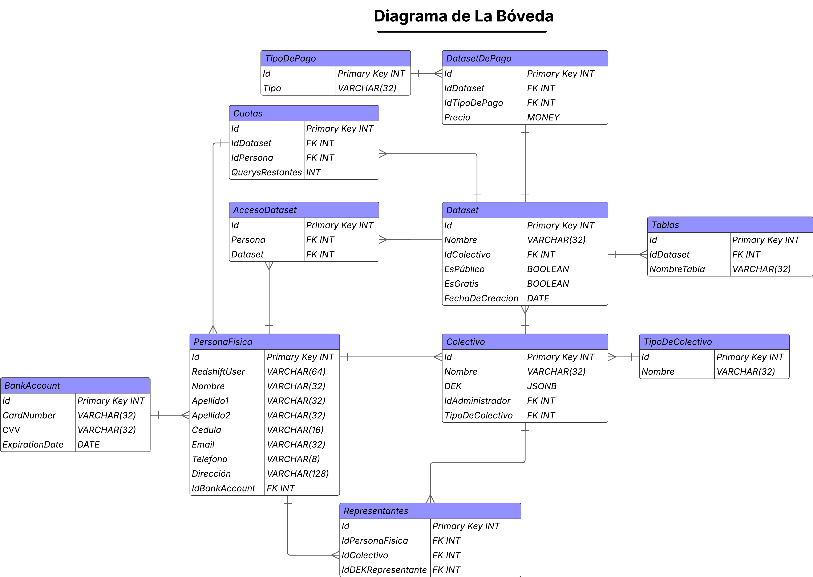

# 4.5 MarketPlace

## Diseño del Frontend

### Arquitectura del Cliente

Nuestra arquitectura de cliente consistirá en Client Side Rendering (CSR) combinado con rendering estático (Static Site Generation), manteniendo una única capa dedicada exclusivamente a la web. Durante el proceso de build, los bundles de React (archivos JavaScript, HTML, CSS y assets) son generados mediante un proceso optimizado y empaquetados para su despliegue. Estos bundles estáticos son almacenados en un bucket de Amazon S3, configurado como origen de almacenamiento de archivos públicos.

Para asegurar un rendimiento óptimo, baja latencia global y alta disponibilidad, estos archivos estáticos son distribuidos a los usuarios finales a través de Amazon CloudFront, el servicio de Content Delivery Network (CDN) de AWS, el cual replica el contenido en múltiples edge locations alrededor del mundo. Este enfoque permite tiempos de carga rápidos, independientemente de la ubicación geográfica de los usuarios.

Toda la comunicación hacia el backend se canaliza a través de una única API centralizada, implementada sobre el framework FastAPI, desplegada y orquestada dentro de un clúster de contenedores en AWS Elastic Kubernetes Service (EKS). De esta forma, el frontend queda completamente desacoplado de la lógica de negocio, consumiendo únicamente servicios expuestos vía HTTP REST, permitiendo escalabilidad, mantenibilidad y control centralizado de las operaciones de negocio.

### Patrones de Diseño de Objetos

El diseño del frontend del componente Marketplace de Data Pura Vida sigue principios sólidos de diseño orientado a objetos, enfocados en lograr una solución altamente flexible, mantenible y escalable a largo plazo. Esta estructura permite que el sistema pueda adaptarse fácilmente a cambios futuros, incorporar nuevas funcionalidades de forma incremental y garantizar una separación clara de responsabilidades en cada módulo. Los patrones aplicados organizan tanto los componentes visuales como la lógica de negocio y comunicación con el backend, favoreciendo el desacoplamiento, la reutilización de código, el aislamiento de funcionalidades y la facilidad de pruebas unitarias. Gracias a esta arquitectura, el desarrollo continuo puede realizarse sin afectar negativamente la estabilidad ni el crecimiento evolutivo del sistema.

#### 1 **Patrón de Strategy**

#### 1 **Patrón de Strategy**

- **Ubicación:** En los filtros de búsqueda de datasets.
- **Descripción:** El frontend permite al usuario aplicar distintos tipos de filtros (por precio, categoría, tipo de dataset, popularidad, fecha de publicación, calificación, entre otros). Cada uno de estos filtros encapsula su propia lógica de ordenamiento o filtrado dentro de clases o funciones específicas que implementan una estrategia concreta. Todos los filtros implementan una interfaz común definida en el sistema, lo que permite que los componentes de búsqueda trabajen de forma genérica sin preocuparse por la lógica interna de cada filtro. De esta manera, el flujo principal de búsqueda permanece estable, mientras que es posible introducir nuevas estrategias de filtrado en el futuro sin modificar el código base existente.
- **Beneficio:** Esta implementación facilita la extensión del sistema de búsqueda, permite escalar la funcionalidad de filtrado conforme evolucionen los requerimientos de negocio, reduce la posibilidad de errores al introducir cambios y mejora la mantenibilidad del código al aislar cada criterio de filtrado de forma independiente.

#### 2️ **Patrón de Singleton**

- **Ubicación:** Cliente HTTP centralizado (ApiConnector o MarketplaceApiClient).
- **Descripción:** En el frontend, toda la comunicación hacia el backend es gestionada por una única instancia del cliente HTTP, implementada como un singleton. Este cliente centralizado es responsable de manejar todas las solicitudes REST hacia la API, asegurando consistencia en la configuración de headers, manejo de autenticación, refresco de tokens, implementación de políticas de reintento, manejo uniforme de errores y control centralizado de los interceptores. Al mantener una única instancia compartida en toda la aplicación, se evita la duplicación de lógica de conexión y se garantiza que todos los módulos del frontend utilicen exactamente los mismos mecanismos de comunicación, seguridad y logging.
- **Beneficio:** Permite simplificar el mantenimiento de las integraciones con el backend, facilita la trazabilidad de los llamados API, centraliza la configuración de seguridad y reduce significativamente los errores relacionados a inconsistencias en las llamadas HTTP realizadas desde diferentes partes de la aplicación.


#### 3️ **Patrón de Observer (Pub-Sub)**

- **Ubicación:** Sistema de notificaciones y actualización de componentes de UI.
- **Descripción:** Dentro del frontend, algunos componentes de la interfaz están suscritos a eventos globales a través de un sistema de publicación-suscripción (Pub-Sub). Estos eventos pueden ser generados por múltiples acciones del usuario o del backend, como la finalización de una compra, la actualización de los datos de un dataset, el cambio en el estado de un pedido o la expiración de accesos. Los componentes suscritos escuchan únicamente los eventos relevantes para su funcionalidad, permitiendo actualizar su estado de forma reactiva sin necesidad de tener dependencias directas entre módulos. Esta lógica es gestionada principalmente mediante Contextos de React, Event Emitters o sistemas de estado global controlado.
- **Beneficio:** Permite un alto grado de desacoplamiento entre los componentes de UI y la lógica de negocio. Facilita la escalabilidad del sistema, ya que nuevos eventos pueden ser integrados sin necesidad de modificar la lógica de los componentes existentes, reduciendo la complejidad, mejorando la mantenibilidad y aumentando la robustez de la interfaz.


#### 4️ **Patrón de Facade**

- **Ubicación:** Módulo de servicios de pago.
- **Descripción:** Las operaciones relacionadas al flujo de pago dentro del Marketplace están centralizadas en un único módulo de servicios que actúa como fachada (Facade). Este módulo es responsable de orquestar todo el proceso de compra, desde la inicialización del pago, validación de transacciones, cálculo y visualización de precios, hasta la confirmación y registro final de la compra. Internamente, este módulo encapsula toda la lógica de integración con proveedores de pago como Stripe (para pagos internacionales) y BAC (para pagos locales), gestionando la comunicación, los formatos de mensajes, validaciones de seguridad, respuesta de los webhooks, tratamiento de errores y actualización del estado de la orden. Los componentes del frontend consumen únicamente métodos simplificados expuestos por esta fachada, sin necesidad de conocer la complejidad interna de cada proveedor externo.
- **Beneficio:** Simplifica enormemente la integración con múltiples servicios de pago, reduce la duplicación de lógica de negocio, encapsula todas las reglas y validaciones específicas en un único lugar, y permite modificar o extender los proveedores de pago en el futuro sin afectar al resto de la aplicación.


#### 5️ Patrón MVVM (Model-View-ViewModel)

- **Ubicación:** Arquitectura general del frontend.
- **Descripción:** El frontend del Marketplace sigue el patrón arquitectónico **Model-View-ViewModel (MVVM)** para separar de forma clara las distintas responsabilidades dentro de la interfaz.  
  - **Model:** Define las estructuras de negocio como `Dataset`, `Order`, `PaymentTransaction` y otros objetos de dominio, centralizando las reglas de validación de datos, transformación de estructuras y representación de entidades que viajan entre el frontend y el backend.
  - **ViewModel:** Implementado mediante **custom hooks** como `useDatasetSearch()`, `useMarketplaceCart()`, `usePayment()`, `useRecommendation()` entre otros. Los ViewModels encapsulan la lógica de negocio específica de cada pantalla o flujo, gestionando el estado de los componentes, control de errores, llamadas al API y cualquier transformación intermedia de datos.
  - **View:** Los componentes visuales desarrollados en React, estructurados bajo el principio de **Atomic Design**, renderizan la información recibida desde los ViewModels y presentan las interfaces interactivas al usuario.
- **Beneficio:** La aplicación logra una alta modularidad y mantenibilidad. Las vistas quedan libres de lógica compleja de negocio, los hooks son fácilmente testeables, los modelos centralizan las estructuras de datos, y el sistema completo permite escalar nuevas funcionalidades de forma ordenada y sin generar dependencias cruzadas innecesarias.


### Estructura de Carpetas del Sistema

El frontend del componente Marketplace sigue una estructura modular claramente organizada, basada en la combinación de los patrones Atomic Design y MVVM, lo cual permite mantener una separación estricta de responsabilidades entre componentes visuales, lógica de negocio y gestión de datos. Esta estructura facilita la escalabilidad, mantenibilidad y extensibilidad del sistema, permitiendo incorporar nuevos módulos de negocio o funcionalidades sin impactar negativamente el código existente. Además, favorece la reutilización de componentes, simplifica las pruebas unitarias y mejora la claridad general del proyecto durante el desarrollo colaborativo.


```plaintext
frontend/
├── public/                     # Archivos estáticos
├── src/
│   ├── api/                    # Lógica de conexión con el backend (Axios + interceptores)
│   │   ├── marketplaceApi.ts   # Endpoints específicos del Marketplace
│   │   └── authApi.ts          # Autenticación general vía Cognito
│   │
│   ├── models/                 # Definición de los modelos de negocio
│   │   ├── Dataset.ts
│   │   ├── Order.ts
│   │   └── Payment.ts
│   │
│   ├── hooks/                  # ViewModels (gestión de estado y lógica de UI)
│   │   ├── useDatasetSearch.ts
│   │   ├── useCart.ts
│   │   └── usePayment.ts
│   │
│   ├── components/             # Componentes visuales según Atomic Design
│   │   ├── atoms/              # Botones, inputs, etiquetas
│   │   ├── molecules/          # Formularios de búsqueda, carritos
│   │   ├── organisms/          # Composición de vistas completas
│   │   └── templates/          # Layouts reutilizables
│   │
│   ├── pages/                  # Rutas principales del sistema
│   │   ├── MarketplaceHome.tsx
│   │   ├── DatasetDetails.tsx
│   │   ├── Cart.tsx
│   │   └── Checkout.tsx
│   │
│   ├── contexts/               # Contexto global de usuario y carrito
│   │   ├── UserContext.tsx
│   │   └── CartContext.tsx
│   │
│   ├── services/               # Lógica externa: pagos, facturación, etc.
│   │   ├── stripeService.ts
│   │   └── invoiceService.ts
│   │
│   ├── utils/                  # Funciones utilitarias comunes
│   └── App.tsx                 # Punto de entrada de la aplicación
│
├── amplify/                    # Configuración de AWS Amplify y Cognito
│   ├── backend/
│   └── aws-exports.js
│
└── tests/                      # Pruebas unitarias e integración
    ├── unit/
    └── integration/
```


### Tecnologías utilizadas en el cliente

| Tecnología    | Descripción                                |
| ------------- | ------------------------------------------ |
| React.js      | Framework principal de construcción de la UI |
| Vite          | Bundler de desarrollo rápido y optimizado  |
| Tailwind CSS  | Framework de estilos responsivos           |
| Axios         | Cliente HTTP centralizado (ApiConnector)   |
| React Context | Manejo de estado global (usuario, carrito) |
| React Router  | Control de rutas y navegación              |
| React Query   | Sincronización eficiente de datos (fetching y caching) |
| Formik + Yup  | Validación y control de formularios complejos |
| Stripe        | Gestión de pagos y facturación internacionales |
| Amplify       | Despliegue estático y automatización CI/CD en AWS |
| Cognito       | Autenticación de usuarios con MFA          |
| Plotly.js     | Visualización de gráficos interactivos     |


### Componentes Visuales

#### Patrones y Principios:

- **Diseño Responsivo:**  
  Desde el inicio del desarrollo, todo el sistema de componentes visuales del Marketplace ha sido diseñado para adaptarse correctamente a múltiples tamaños de pantalla, incluyendo desktops, tablets y dispositivos móviles.  
  Se emplea Tailwind CSS como framework de estilos, el cual permite definir clases responsivas de forma declarativa utilizando breakpoints predefinidos. Las unidades de medida utilizadas son relativas (como `rem`, `%`, `vw` y `vh`) lo que asegura escalabilidad fluida de los elementos visuales según la resolución del dispositivo.  
  Además, los componentes visuales fueron construidos siguiendo el principio mobile-first, permitiendo que la interfaz priorice el correcto renderizado en pantallas reducidas sin sacrificar la experiencia de usuario en dispositivos de escritorio.  
  Esta estructura permite que el Marketplace pueda ser consumido de forma cómoda, accesible y visualmente consistente en todos los dispositivos donde los usuarios acceden a la plataforma.


- **SOLID:**

  - **Single Responsibility Principle (SRP):**  
    Cada componente de React está diseñado para cumplir estrictamente una única responsabilidad visual o de interacción. Los componentes visuales únicamente manejan el renderizado y la presentación de los datos, mientras que toda la lógica de negocio, validación o manipulación de datos se encuentra completamente aislada dentro de los hooks de ViewModel. Esto facilita el mantenimiento, pruebas unitarias y la evolución de cada componente de manera independiente.

  - **Open/Closed Principle (OCP):**  
    Los componentes visuales están preparados para ser extendidos sin necesidad de modificar su código interno. Por ejemplo, los botones (`Button`), tarjetas de datasets (`DatasetCard`) y formularios son altamente parametrizables a través de sus props, lo que permite modificar su comportamiento o presentación externa sin alterar su implementación interna.

  - **Liskov Substitution Principle (LSP):**  
    Las listas de datasets y sus tarjetas de visualización están diseñadas para aceptar distintos tipos de visualizaciones que implementan una misma interfaz de props. Esto permite reemplazar un componente de visualización por otro (por ejemplo, una tarjeta simple por una tarjeta premium o recomendada) sin que el resto de la aplicación requiera cambios.

  - **Interface Segregation Principle (ISP):**  
    Gracias al uso de **Atomic Design**, los componentes exponen únicamente las props estrictamente necesarias para su funcionamiento. No se obliga a los consumidores de los componentes a manejar props innecesarias o irrelevantes, reduciendo así el acoplamiento y simplificando la integración de los componentes.

  - **Dependency Inversion Principle (DIP):**  
    Toda la lógica de negocio reside en los ViewModels implementados como custom hooks. Los componentes visuales no conocen los detalles de cómo se obtiene, manipula o procesa la información. En su lugar, reciben los datos ya preparados por los hooks, manteniéndose completamente desacoplados de la lógica de negocio o del acceso a datos.

- **DRY (Don't Repeat Yourself):** Los componentes son reutilizables (atoms, molecules). Además, las funciones utilitarias en `utils/` centralizan validaciones de pago, cálculos de carrito, formateo de precios, etc.

- **Separación de Responsabilidades:** Los componentes visuales solo presentan la información. Toda la lógica está en hooks como `useDatasetSearch()`, `useCart()`, `usePayment()`. Los modelos (Dataset, Order, Payment) manejan la conexión con la API.

- **Atomic Design:** Implementado en la carpeta `components/`:
  - Atoms: `Button`, `Input`, `Icon`, `Badge`.
  - Molecules: `SearchBar`, `DatasetCard`, `PriceFilter`.
  - Organisms: `DatasetList`, `ShoppingCartPanel`, `PaymentForm`.
  - Templates: `MarketplaceLayout`, `CartLayout`.
  - Pages: `MarketplaceHomePage`, `DatasetDetailsPage`, `CheckoutPage`.

- **MVVM:**
  - Model: Clases de datos y funciones que manejan las llamadas a la API (ejemplo: `DatasetApi`).
  - View: Componentes visuales React organizados por Atomic Design.
  - ViewModel: Hooks como `useCart()`, `usePayment()`, `useDatasetSearch()` que gestionan la lógica de negocio.

#### Herramientas y estándares:

- Tailwind: Framework principal de estilos responsivos.

## Diseño del Backend

### Microservicios

#### marketplace-catalog-service

**Responsabilidad Principal**
Gestión del catálogo de datasets con capacidades avanzadas de búsqueda, indexación y agregación de métricas de calidad.

**Componentes Internos**
- **catalog-metadata-sync-service**: Sincroniza metadatos entre La Bóveda y marketplace cada 15 minutos
- **catalog-search-engine-service**: Gestiona indexación en OpenSearch con soporte multilenguaje
- **catalog-quality-aggregator-service**: Agrega métricas de calidad del Motor de Transformación

**Tecnologías Utilizadas**
- FastAPI para endpoints REST
- OpenSearch para búsqueda y analytics
- Redis para cache de queries frecuentes
- PostgreSQL para metadatos de datasets

**APIs Expuestas**
```
GET /api/v1/catalog/search - Búsqueda avanzada con filtros y faceting
GET /api/v1/catalog/datasets/{id} - Detalles completos de dataset
GET /api/v1/catalog/categories - Listado de categorías con conteos
GET /api/v1/catalog/trending - Datasets trending basados en analytics
GET /api/v1/catalog/recommendations/{user_id} - Recomendaciones personalizadas
```

**Operación**
Activo constantemente con picos durante búsquedas matutinas (8-10 AM) y sincronizaciones nocturnas (2-4 AM). Opera en EKS con pods distribuidos en availability zones para alta disponibilidad.


#### marketplace-payment-service

**Responsabilidad Principal**
Procesamiento de pagos únicos y recurrentes, gestión de suscripciones, detección de fraude y generación automática de facturas.

**Componentes Internos**
- **payment-processor-service**: Procesamiento con validación y fraud detection
- **subscription-billing-service**: Gestión de suscripciones recurrentes y renovaciones
- **invoice-generator-service**: Generación automática de facturas PDF
- **fraud-detection-service**: Risk scoring en tiempo real con ML
- **webhook-handler-service**: Manejo seguro de webhooks de providers

**Integraciones Externas**
- Stripe SDK para pagos internacionales
- Sistema de pagos local costarricense
- Redis para idempotencia de transacciones
- FastAPI para todos los endpoints

**APIs Expuestas**
```
POST /api/v1/payments/initiate - Inicio de proceso de pago
GET /api/v1/payments/{id}/status - Estado de transacción específica
POST /api/v1/subscriptions - Creación de nueva suscripción
PUT /api/v1/subscriptions/{id}/cancel - Cancelación de suscripción
GET /api/v1/invoices - Listado de facturas del usuario
POST /api/v1/payments/webhooks/{provider} - Webhooks de providers
```

**Operación**
Alta disponibilidad 24/7 con picos durante horarios de oficina y finales de mes. Distribuido en pods con affinity a nodos dedicados para cumplir PCI DSS compliance.


#### marketplace-access-service

**Responsabilidad Principal**
Control granular de acceso a datasets, generación de tokens JWT, tracking de uso en tiempo real y auditoría completa de accesos.

**Componentes Internos**
- **access-provisioning-service**: Activación automática post-compra (<30 segundos)
- **token-management-service**: Generación y gestión de JWT tokens con TTL de 24 horas
- **usage-tracking-service**: Monitoreo en tiempo real para billing y rate limiting
- **permission-validator-service**: Validación granular en <50ms por request
- **audit-logger-service**: Logging completo para compliance (retención 7 años)

**Integraciones**
- gRPC clients para La Bóveda y Bioregistro
- PostgreSQL para access records
- RabbitMQ para coordinación de eventos
- OpenSearch para logs de auditoría

**APIs Expuestas**
```
POST /api/v1/access/provision - Provisioning de acceso (interno)
GET /api/v1/access/my-datasets - Datasets accesibles por usuario
POST /api/v1/access/tokens/generate - Generación de access token
DELETE /api/v1/access/tokens/{id} - Revocación de token
GET /api/v1/access/usage - Estadísticas de uso del usuario
```

**Operación**
Ejecuta continuamente con activación intensa post-compra. Opera distribuido para manejar múltiples usuarios simultáneos durante horarios peak.


#### marketplace-user-service

**Responsabilidad Principal**
Gestión de perfiles comerciales, tracking de comportamiento de navegación y preferencias de usuarios con sincronización cross-device.

**Componentes Internos**
- **user-profile-manager-service**: Gestiona perfiles complementando autenticación del Bioregistro
- **user-behavior-tracker-service**: Rastrea navegación para ML de recomendaciones
- **user-preference-engine-service**: Motor de preferencias con clustering de usuarios
- **user-session-manager-service**: Sesiones distribuidas con sincronización cross-device

**Tecnologías Especializadas**
- Redis para sesiones distribuidas
- PostgreSQL para storage de preferencias
- DynamoDB para storage de comportamiento
- FastAPI para APIs de usuario

**APIs Expuestas**
```
POST /api/v1/users/register - Registro de nuevo usuario
GET /api/v1/users/me - Perfil completo del usuario actual
PUT /api/v1/users/me/preferences - Actualización de preferencias
POST /api/v1/users/behavior - Tracking de eventos de comportamiento
GET /api/v1/users/me/recommendations - Recomendaciones personalizadas
```

**Operación**
Activo 24/7 para gestión de sesiones globales, con mayor carga durante horarios laborales de Costa Rica (6 AM - 6 PM UTC-6).


#### marketplace-recommendation-service

**Responsabilidad Principal**
Motor de recomendaciones personalizadas basado en machine learning, análisis de comportamiento y similitud de contenido.

**Componentes Internos**
- **behavioral-ml-service**: Análisis con ML para recommendations personalizadas
- **content-similarity-service**: Cálculo de similaridad entre datasets
- **recommendation-engine-service**: Motor principal que combina multiple enfoques
- **ab-testing-framework-service**: Framework para testing de algoritmos

**Tecnologías de ML**
- Amazon SageMaker para model training y deployment
- Hugging Face Transformers para embeddings semánticos
- Redis para cache de recommendations
- FastAPI para endpoints de recomendaciones

**Estrategias Implementadas**
- **Collaborative Filtering**: Usuarios con preferencias similares
- **Content-Based Filtering**: Similitud de metadatos de datasets
- **Hybrid Ensemble**: Combinación weighted de ambos enfoques

**APIs Expuestas**
```
GET /api/v1/recommendations/personalized - Recomendaciones personalizadas
GET /api/v1/recommendations/similar/{dataset_id} - Datasets similares
GET /api/v1/recommendations/trending - Trending recommendations
POST /api/v1/recommendations/feedback - Feedback de calidad
```

**Operación**
Batch processing nocturno para entrenar modelos, inference en tiempo real <100ms durante navegación activa. Pods optimizados para ML inference desplegados en EKS.


### Diagrama de clases

**marketplace-catalog-service**
Este microservicio se encarga de la gestión del catálogo de datasets, incluyendo la metadata, calidad, y la sincronización con el Datalake.

**Patrones de Diseño Utilizados:**
-	Morado: Facade
-	Amarillo: Observer
-	Celeste: Factory
-	Café: Singleton
-	Verde: Strategy

**Organización de Clases:**
El punto de entrada principal es el CatalogController, que actúa como Facade para las APIs externas del Marketplace (ej., /api/v1/catalog/datasets, /api/v1/catalog/categories). Este controlador delega las operaciones a un Observer central, el CatalogEventManager, encargado de notificar a los módulos de lógica de negocio relevantes.
Dentro de la lógica de negocio, se encuentran:

-	**DatasetManager:** Responsable de la creación, actualización y eliminación de datasets y su metadata. Recibe FileHandler y MetadataValidator como dependencias inyectadas.
-	**QualityAggregator:** Escucha eventos de calidad (quality.metrics.updated) y calcula un score consolidado para cada dataset.
-	**SearchIndexer:** Escucha eventos de actualización de datasets (dataset.updated) y coordina la indexación de los datos en OpenSearch.
Estos módulos de lógica de negocio reciben como dependencias los servicios de la segunda capa de Facade:
-	**MetadataFileHandler:** Se encarga de interactuar con AWS S3 para almacenar y recuperar archivos de metadata asociados a los datasets.
-	**OpenSearchIndexer:** Abstrae la comunicación con OpenSearch para indexar y actualizar documentos de datasets. Utiliza un patrón Strategy para manejar diferentes tipos de indexación (ej., delta vs. completa).
-	**DataQualityService:** Se comunica con el dataset-quality-service (asumido microservicio externo o interno) para obtener métricas de calidad de los datos.

Finalmente, existe una capa de repositorios para la persistencia de datos (PostgreSQL, DynamoDB). Los repositorios son gestionados mediante un patrón Factory, como RepositoryFactory, que provee instancias de DatasetRepository, MetadataRepository, QualityMetricsRepository, etc. Cada conexión a la base de datos es manejada utilizando el patrón Singleton para optimizar los recursos.


**marketplace-payment-service**
Este microservicio gestiona todo el flujo de pagos y suscripciones en el Marketplace.

**Patrones de Diseño Utilizados:**
-	Morado: Facade
-	Amarillo: Observer
-	Verde: Strategy
-	Celeste: Factory
-	Café: Singleton

**Organización de Clases:**
El punto de entrada es el PaymentController, que actúa como Facade para las APIs de pago (/api/v1/payments/initiate, /api/v1/payments/webhook). Este controlador delega las llamadas a un Observer principal, el PaymentEventManager, encargado de notificar a la lógica de negocio según el evento de pago o webhook.
Dentro de la lógica de negocio, se encuentran:

-	**PaymentProcessor:** Orquesta el proceso de pago, interactuando con pasarelas de pago externas. Recibe StripeGateway y BACGateway como dependencias.
-	**SubscriptionManager:** Gestiona la creación, renovación y cancelación de suscripciones.
-	**FraudDetector:** Escucha eventos de pago (payment.initiated, payment.completed) y utiliza un patrón Strategy para aplicar diferentes algoritmos de detección de fraude.
-	**InvoiceGenerator:** Genera facturas a partir de transacciones de pago completadas.
Estos módulos de lógica de negocio reciben como dependencias los servicios de la segunda capa de Facade:
-	**StripeGateway:** Abstrae la comunicación con la API de Stripe.
-	**BACGateway:** Abstrae la comunicación con la API del BAC Credomatic.
-	**NotificationSender:** Se comunica con el notification-service para enviar confirmaciones de pago o alertas.
-	**AccessProvisioner:** Se comunica con el marketplace-access-service para habilitar el acceso a los datasets tras un pago exitoso.

Finalmente, existe una capa de repositorios para la persistencia de datos (PostgreSQL, DynamoDB, Redis). Los repositorios son gestionados mediante un patrón Factory, como RepositoryFactory, que provee instancias de TransactionRepository, SubscriptionRepository, InvoiceRepository, etc. Las conexiones a la base de datos y al cache Redis se manejan utilizando el patrón Singleton.


**marketplace-access-service**
Este microservicio se encarga de gestionar los permisos de acceso a los datasets y la generación de tokens de acceso para los usuarios.

**Patrones de Diseño Utilizados:**
-	Morado: Facade
-	Amarillo: Observer
-	Naranja: Dependency Injection
-	Celeste: Factory
-	Café: Singleton

**Organización de Clases:**
El punto de entrada es el AccessController, que actúa como Facade para las APIs de acceso (/api/v1/access/grant, /api/v1/access/token). Este controlador delega las llamadas a un Observer principal, el AccessEventManager, encargado de notificar a la lógica de negocio según el tipo de solicitud.
Dentro de la lógica de negocio, se encuentran:

-	**PermissionHandler:** Otorga y revoca permisos a los datasets basados en eventos de compra o suscripción.
-	**TokenManager:** Genera, valida y revoca tokens de acceso JWT.
-	**UsageTracker:** Escucha eventos de acceso (dataset.accessed) y registra el uso de los datasets.
Estos módulos de lógica de negocio reciben como dependencias los servicios de la segunda capa de Facade:
-	**AuthServiceRequester:** Se comunica con el security-service para validar tokens y autenticar usuarios.
-	**DataLakeAccessManager:** Se comunica con el Datalake (La Bóveda) para provisionar o revocar el acceso real a los datos en S3.
-	**NotificationSender:** Se comunica con el notification-service para enviar notificaciones de concesión de acceso o revocación.
-	**AuditLogger:** Se comunica con el audit-logger-service (si es un microservicio separado) para registrar eventos de auditoría de acceso.

Finalmente, existe una capa de repositorios para la persistencia de datos (PostgreSQL, Redis). Los repositorios son gestionados mediante un patrón Factory, como RepositoryFactory, que provee instancias de PermissionRepository. Las conexiones a la base de datos y al cache Redis se manejan utilizando el patrón Singleton.



### Servicios AWS

#### Amazon EKS (Elastic Kubernetes Service)
**Propósito**: Orquestación de microservicios del marketplace

**Configuración**:
- **Versión**: Kubernetes 1.29
- **Nodos**: 3-15 nodos t3.large (2 vCPU, 8 GB RAM)
- **Auto-scaling**: CPU/memoria >70% por 5 minutos
- **Almacenamiento**: EBS gp3 50GB por nodo
- **Red**: VPC privada

**Microservicios desplegados**:
- `marketplace-catalog-service`: Gestión del catálogo y búsquedas
- `marketplace-payment-service`: Procesamiento de pagos y suscripciones
- `marketplace-access-service`: Control de acceso a datasets
- `marketplace-notification-service`: Notificaciones del marketplace

#### Amazon S3
**Propósito**: Almacenamiento de objetos

**Buckets**:
- **`dpv-marketplace-assets`**: Thumbnails y previews de datasets
- **`dpv-marketplace-invoices`**: Facturas PDF

**Configuración**:
- Cifrado SSE-S3 automático
- Lifecycle policies a Glacier después de 90 días
- Versionado habilitado

#### AWS Lambda
**Propósito**: Funciones serverless

**Funciones**:
- **`marketplace-webhook-processor`**:
  - Procesa webhooks de Stripe
  - Memoria: 512MB, Timeout: 30s
- **`marketplace-invoice-generator`**:
  - Genera PDFs de facturas
  - Memoria: 1GB, Timeout: 5min
- **`marketplace-search-indexer`**:
  - Actualiza índices de OpenSearch
  - Memoria: 256MB, Timeout: 1min

**Configuración**:
- Rate limiting: 1000 requests/minuto por usuario
- Autenticación vía Cognito
- Caching: 5 minutos para búsquedas

#### Amazon Cognito
**Propósito**: Autenticación y autorización

**Configuración**:
- User Pools para autenticación
- MFA obligatorio
- JWT tokens

**Roles del marketplace**:
- `marketplace:buyer`: Usuarios que pueden comprar
- `marketplace:seller`: Organizaciones que venden datasets

#### AWS Secrets Manager
**Propósito**: Gestión segura de credenciales

**Secrets almacenados**:
- `dpv/marketplace/stripe-keys`: Claves de Stripe
- `dpv/marketplace/db-credentials`: Credenciales de RDS

**Configuración**:
- Cifrado con AWS KMS
- Rotación automática configurada

#### Amazon SES
**Propósito**: Envío de emails

**Configuración**:
- Dominio verificado: `marketplace@datapuravida.cr`
- Templates para confirmaciones, facturas y notificaciones
- Bounce handling automático
- Políticas anti-spam

#### AWS KMS
**Propósito**: Gestión de claves de cifrado

**Claves especializadas**:
- `dpv-marketplace-payments`: Datos de transacciones
- `dpv-marketplace-assets`: Assets y documentos
- `dpv-marketplace-analytics`: Datos de comportamiento

**Configuración**:
- Rotación automática anual
- Políticas de acceso por servicio

### Sistema de Monitoreo
El monitoreo del componente Marketplace de Datos de Data Pura Vida será utilizado para lograr que todo funcione bien, sea seguro y esté siempre disponible.

**Métricas y Rendimiento**
Utilizaremos distintas herramientas para recopilar métricas. Estas métricas se implementarán en puntos clave dentro de los microservicios, con el fin de tener una visión del comportamiento del sistema.

**Métricas de Negocio:**
Las métricas de negocio nos darán una visión de cómo el marketplace está funcionando desde una perspectiva de usuario y valor. Por ejemplo, es crucial saber cuántas veces los usuarios buscan datasets o si los pagos se están procesando correctamente.

-	**Número de búsquedas realizadas:** Esta métrica es fundamental para entender la actividad del catálogo. Esta será recopilada dentro del catalog-search-engine-service, ya que este microservicio gestiona las búsquedas avanzadas en Elasticsearch. Cada vez que el endpoint /api/v1/catalog/search es invocado a través del API Gateway, el catalog-search-engine-service incrementará un contador que reflejará la cantidad de búsquedas.

-	**Transacciones de pago iniciadas y completadas/fallidas:** El seguimiento de las financias es crucial para el componente de marketplace. Esta métrica se rastreará directamente en el payment-processor-service. Este servicio es el encargado de manejar el procesamiento de pagos únicos y emitirá eventos como payment.initiated, payment.completed y payment.failed, que serán contabilizados para obtener esta métrica.

-	**Volumen de datos consultados:** Permite entender el consumo real de los datasets. Esta métrica se capturará en el usage-tracking-service. Este consume eventos dataset.accessed generados por el Datalake o La Bóveda cada vez que un usuario accede a un dataset.


**Métricas de Infraestructura:**
Las métricas de infraestructura nos ayudad a verificar nuestra plataforma, asegurando que los recursos estén disponibles y funcionando de manera eficiente.
-	**Latencia de consultas a bases de datos:** Esta métrica se medirá en cada microservicio que interactúa con una base de datos. Por ejemplo, el user-profile-manager-service (que usa PostgreSQL) y el catalog-metadata-sync-service (que usa PostgreSQL). Estos servicios expondrán un contador o histograma de latencia para las operaciones de base de datos que realizan, como lectura y escritura.

-	**Tamaño de las colas y lag de consumidores:** Estas métricas son importantes en el monitoreo del sistema de mensajería asíncronos. Se obtendrán directamente de los brokers de mensajes y los consumidores. Por ejemplo, el notification-dispatcher-service que consume eventos de RabbitMQ. Los exporters de Prometheus para RabbitMQ se encargarán de recolectar esta información de las colas y los grupos de consumidores.

**Herramientas de Monitoreo**
Estas métricas se utilizarán en las siguientes herramientas:
-	**Prometheus:** Recopilará métricas directamente desde los endpoints /metrics expuestos por cada microservicio. Los exporters de Prometheus para bases de datos (PostgreSQL), Redis y RabbitMQ se usarán para métricas de infraestructura.

-	**AWS CloudWatch:** Para métricas a nivel de infraestructura de AWS (EKS, RDS, S3, KMS) y para métricas de logs.

-	**Grafana:** Será la plataforma de visualización principal, integrando datos de Prometheus y CloudWatch para crear dashboards interactivos y personalizados.


**Logs y Trazabilidad**
Un sistema centralizado de logs y trazabilidad es crucial para diagnosticar problemas en un entorno de microservicios.

-	Centralización de Logs:
    - 	Todos los microservicios configurarán sus aplicaciones para emitir logs estructurados (JSON) a stdout.
    -	También se pueden enviar logs a CloudWatch Logs para integrarse con otras herramientas de AWS y facilitar la consulta con CloudWatch Logs Insights.

-	**Trazabilidad Distribuida:**
    -	Todos los microservicios (ej., marketplace-catalog-service, marketplace-user-service, marketplace-payment-service, marketplace-access-service, marketplace-recommendation-service, marketplace-notification-service, marketplace-analytics-service, y sus microservicios internos) serán instrumentados con OpenTelemetry para generar trazas.
    -	Un OpenTelemetry Collector se desplegará en el cluster para recolectar las trazas y exportarlas a un backend como Jaeger (para visualización y análisis de trazas).
    -	Esto permitirá seguir una solicitud a través de múltiples microservicios (incluyendo llamadas gRPC y HTTP entre ellos) y ver la latencia de cada salto.

-	**Auditoría y Diagnóstico:**
    -	**Elasticsearch:** Proporcionará una interfaz potente para buscar, filtrar y analizar logs estructurados de todos los microservicios, permitiendo una rápida identificación de la causa raíz de problemas.
    -	AWS CloudTrail: Registra todas las llamadas a la API de AWS realizadas por los roles IAM de los microservicios del marketplace, crucial para auditoría de seguridad y cumplimiento.

**Sistema de Alertas y Notificaciones**

**Monitoreo de Cumplimiento y Seguridad**
Dado el manejo de datos sensibles y transacciones financieras, el monitoreo de seguridad es una prioridad.

-	**Auditoría de Accesos:**
    -	**CloudTrail:** Monitorizará todas las llamadas a la API de AWS relacionadas con los recursos utilizados por los microservicios del marketplace (ej., acceso a S3 buckets con datos de logs/analytics, KMS, RDS, EKS).
    -	El audit-logger-service registrará cada acceso a los datasets y cada acción relevante (ej., pagos completados) que ocurran a través de los microservicios de acceso y pago. Estos logs serán inmutables y almacenados en Elasticsearch para auditorías.
    -	**Alertas de Acceso Inusual:** Se configurarán alertas sobre patrones de acceso anómalos a datos sensibles o intentos de acceso no autorizado (401/403 respuestas del API Gateway que enruta a los microservicios del marketplace).

-	**Monitoreo de Cifrado:**
    -	Se verificará que los datos en reposo en el datalake y en bases de datos estén cifrados en KMS. Esto implica monitorear las interacciones de los microservicios que escriben o leen datos sensibles (ej., access-provisioning-service, payment-processor-service, catalog-metadata-sync-service).
    -	Se monitoreará la tasa de errores de las operaciones de cifrado/descifrado en KMS.
    -	Se asegurará que los datos en tránsito estén cifrados (TLS/SSL) entre todos los microservicios del marketplace y con el API Gateway.

-	**Monitoreo de Identidad y Acceso:**
    -	Se auditarán los logs de autenticación del Bioregistro para detectar patrones de ataque de credenciales.
    -	Se monitoreará el uso de tokens JWT y la gestión de estos por el token-management-service dentro del marketplace-access-service.
    -	Se activarán alertas sobre cambios en políticas de IAM o roles asociados a los microservicios del marketplace.

**Health Checks y Disponibilidad**
Cada microservicio implementará liveness y readiness probes de EKS, además de deep health checks.

-	**Liveness Probe:** (ej., HTTP GET a /health) Verifica que el proceso de cada microservicio está corriendo y no está en un estado de deadlock. Si falla, EKS reiniciará el pod.
-	**Readiness Probe:** (ej., HTTP GET a /ready) Verifica que cada microservicio está listo para recibir tráfico, incluyendo la conectividad con sus dependencias críticas (DB, cache, message brokers, APIs externas). Si falla, EKS no enrutará tráfico al pod hasta que esté listo.
-	**Deep Health Checks:** Endpoints más exhaustivos que simulan flujos de negocio críticos (ej., una simulación de compra que involucra marketplace-user-service, marketplace-payment-service, marketplace-access-service; una búsqueda de catálogo que involucra marketplace-catalog-service) para validar la funcionalidad end-to-end y la conectividad a todas las dependencias.

**Análisis y Mejora Continua**
El sistema de monitoreo no solo detectará problemas, sino que también proporcionará inteligencia para la optimización continua.

-	**Análisis de Tendencias:** Identificación de patrones en el tráfico del marketplace, volumen de transacciones, comportamiento del usuario y rendimiento de los datasets para optimizar la asignación de recursos y planificar la capacidad, utilizando datos de todos los microservicios del marketplace recolectados por marketplace-analytics-service.
-	**Detección de Anomalías:** Uso de capacidades de ML en Grafana o CloudWatch para detectar comportamientos inusuales en las métricas (ej., caída repentina en búsquedas, aumento inusual de pagos fallidos) que pueden indicar problemas subyacentes en cualquier microservicio.
-	**Reportes de Capacidad:** Proyecciones de crecimiento basadas en el historial de uso de recursos para planificar el escalado de EKS clusters, bases de datos y sistemas de mensajería para todos los microservicios del marketplace.
-	**Optimización de Costos:** Análisis del uso de recursos de AWS (EKS, RDS, S3, etc.) por cada microservicio para identificar oportunidades de reducción de costos.
-	**Análisis de Embudos de Conversión:** Usar los datos de marketplace-analytics-service (generados a partir de eventos de user-behavior-tracker-service y payment-processor-service) para identificar dónde los usuarios abandonan el flujo de compra o búsqueda, permitiendo mejoras en la UX del portal.
-	**Evaluación de Modelos de ML:** Monitorear el rendimiento de los modelos de recomendación (behavioral-ml-service, content-similarity-service, recommendation-engine-service) y detección de fraude (fraud-detection-service) y la efectividad de las recomendaciones servidas.

### Modelo de Seguridad Detallado

El módulo de Marketplace maneja transacciones financieras, datos de comportamiento de usuarios y acceso a datasets premium. Su backend implementa un modelo de seguridad robusto que previene accesos no autorizados, garantiza integridad financiera y mantiene confidencialidad de transacciones.

#### 1. Control de Acceso Granular

##### RBAC para Marketplace

El sistema valida roles específicos en tiempo real durante cada interacción mediante middleware FastAPI que intercepta requests antes de llegar a endpoints de negocio. Los roles se almacenan cifrados en DynamoDB y se cachean en Redis durante sesiones activas.

| Rol | Descripción | Permisos |
|-----|-------------|----------|
| `marketplace:viewer` | Acceso de solo lectura | Búsqueda, visualización de precios, recomendaciones |
| `marketplace:buyer` | Usuario autorizado para compras | Todo lo anterior + pagos, suscripciones, datasets comprados |
| `marketplace:seller` | Representante de colectivo vendedor | Configurar precios, gestionar ventas, analytics |
| `marketplace:admin` | Administrador completo | Acceso total: pagos, reportes financieros, gestión de fraude |

##### Flujo de Autorización de Transacciones

La autorización se ejecuta síncronamente al iniciar pagos, evaluando eligibilidad de acceso, límites de gasto y scoring de fraude antes del procesamiento con providers externos. El sistema valida:

- **Elegibilidad del dataset:** Verificación de que el usuario puede acceder al dataset solicitado
- **Límites de gasto:** Validación contra límites configurados por usuario y tipo de cuenta
- **Scoring de fraude:** Evaluación en tiempo real usando modelos ML desplegados en SageMaker
- **Logging de seguridad:** Registro asíncrono de eventos sospechosos sin impactar rendimiento

##### Políticas IAM para Recursos AWS

Las políticas se configuran con principio de menor privilegio, otorgando a cada microservicio únicamente permisos específicos necesarios. Las condiciones IAM se evalúan dinámicamente durante operaciones de base de datos, restringiendo acceso a registros del usuario autenticado mediante `LeadingKeys` correspondientes al identificador único obtenido desde tokens Cognito.

#### 2. Cifrado de Datos

##### Cifrado en Tránsito
TLS 1.3 obligatorio para todas las comunicaciones, con certificate pinning para payment providers validado antes de establecer conexiones SSL:

- **Frontend ↔ API Gateway:** HTTPS con certificados AWS Certificate Manager auto-renovables
- **Payment providers:** Certificate pinning que bloquea certificados fraudulentos automáticamente
- **Microservicios internos:** mTLS en EKS service mesh autenticando ambos extremos

##### Cifrado en Reposo
Estrategia diferenciada por sensibilidad de datos con claves KMS específicas y rotación automática:

| Tipo de Dato | Ubicación | Cifrado | Clave KMS | Rotación |
|--------------|-----------|---------|-----------|----------|
| Transacciones | DynamoDB | Nativo KMS | `dpv-marketplace-payments` | 12 meses |
| Suscripciones | PostgreSQL | TDE | `dpv-marketplace-subscriptions` | 12 meses |
| Facturas | S3 | SSE-KMS | `dpv-marketplace-documents` | 12 meses |
| Cache | Redis | Aplicación | `dpv-marketplace-cache` | 30 días |

##### Cifrado de Campo PII
Para datos personalmente identificables, se implementa cifrado a nivel de campo que se ejecuta antes del almacenamiento utilizando contexto específico de transacción. La clave de cifrado se genera dinámicamente para cada operación utilizando AWS KMS con contexto de encriptación específico, nunca almacenándose en texto plano.

#### 3. Auditoría y Logging

##### Eventos Auditados
Sistema de captura en tiempo real con doble escritura en OpenSearch (búsquedas inmediatas) y DynamoDB (almacenamiento largo plazo):

- **Transacciones:** Pagos iniciados/completados/fallidos, reembolsos
- **Acceso:** Datasets comprados/acceso otorgado/revocado
- **Seguridad:** Fraude detectado, comportamiento anómalo, límites excedidos
- **Administrativos:** Suscripciones creadas/canceladas, precios actualizados

##### Implementación de Auditoría
Middleware automático captura eventos mediante decoradores aplicados a funciones críticas, registrando:

- **Parámetros de entrada:** Sanitizados para eliminar información sensible
- **Resultado de operación:** Estado final y datos relevantes
- **Tiempo de ejecución:** Para análisis de rendimiento y detección de anomalías
- **Errores:** Captura completa de excepciones para diagnóstico
- **Contexto de sesión:** IP, user agent, trace ID para trazabilidad completa

Los eventos de alto riesgo disparan alertas inmediatas al equipo de seguridad mediante SNS y SES.

##### Retención Automatizada
Políticas ejecutadas durante ventanas nocturnas moviendo datos históricos a S3 Glacier según regulaciones:

- **Pagos:** 7 años (regulaciones financieras)
- **Comportamiento:** 2 años (protección datos personales)
- **Fraude:** 5 años (investigaciones seguridad)
- **Accesos:** 3 años (auditorías)

#### 4. Protección contra Fraude

##### Detección en Tiempo Real
Motor híbrido ML + reglas de negocio ejecutándose en <200ms durante cada transacción:

**Modelo de Machine Learning:**
- Entrenamiento semanal con datos históricos etiquetados
- Deployment en SageMaker endpoints para inference en tiempo real
- Features incluyen: patrones de gasto, velocidad transaccional, geolocalización, comportamiento histórico

**Reglas de Negocio:**
- **Velocidad transaccional:** >5 transacciones en 1 hora aumenta score en 0.3
- **Montos inusuales:** Transacciones >10x promedio del usuario aumenta score en 0.4
- **Anomalías de comportamiento:** Cambios súbitos en patrones de compra
- **Geolocalización:** Detección de ubicaciones inusuales basada en historial

**Scoring Combinado:** 70% ML + 30% reglas de negocio, con umbral configurable para bloqueo automático.

##### Rate Limiting
Protección granular por usuario e IP utilizando ventanas deslizantes Redis:

| Operación | Límite Usuario | Límite IP | Ventana |
|-----------|----------------|-----------|---------|
| Búsqueda datasets | 100/minuto | 300/minuto | 60 segundos |
| Iniciar pago | 5/minuto | 15/minuto | 60 segundos |
| Ver dataset | 50/minuto | 150/minuto | 60 segundos |
| Generar recomendación | 20/minuto | 60/minuto | 60 segundos |

El sistema aplica el límite más restrictivo entre usuario e IP, registrando violaciones para análisis de patrones de ataque.

#### 5. Gestión de Secretos

##### Credenciales de Payment Providers
AWS Secrets Manager con validación de integridad automática detectando compromisos:

**Funcionalidades:**
- **Validación de integridad:** Verificación de checksums y patrones esperados antes de cada uso
- **Auditoría de acceso:** Registro de qué servicio accedió a qué credencial en qué momento
- **Detección de compromisos:** Alertas automáticas ante modificaciones no autorizadas
- **Acceso controlado:** Solo microservicios autorizados pueden acceder a credenciales específicas

##### Rotación Automática
Calendario Terraform con funciones Lambda especializadas coordinando con providers durante ventanas de mantenimiento:

- **Stripe:** Rotación cada 30 días con coordinación automática para generar nuevas claves antes de invalidar anteriores
- **BAC Credomatic:** Rotación cada 60 días con notificación previa al provider
- **Claves internas:** Rotación cada 90 días para claves de sesión y cache

#### 6. Monitoreo de Seguridad

##### Detección de Anomalías
Queries predefinidas ejecutándose contra OpenSearch con frecuencias diferenciadas:

**Alta Criticidad (cada 30 segundos):**
- Múltiples pagos fallidos (>10 en 5 minutos)
- Intentos de fraude detectados (score >0.8)
- Violaciones masivas de rate limiting (>50 en 1 minuto)

**Criticidad Media (cada 5 minutos):**
- Patrones de gasto inusuales (>$1000 en transacciones individuales)
- Accesos anómalos a datasets premium
- Cambios en configuraciones de precios

Los umbrales se ajustan automáticamente basándose en patrones históricos para reducir falsos positivos.

##### Alertas Críticas
Escalación automática con notificaciones inmediatas:

| Alerta | Umbral | Duración | Acción |
|--------|--------|----------|--------|
| Pico de fraude | >10 scores altos | 5 minutos | Notificar equipo seguridad |
| Sistema de pagos caído | >50 fallos | 2 minutos | Llamar ingeniero de guardia |
| Acceso masivo no autorizado | >100 intentos | 1 minuto | Activar contención automática |

#### 7. Compliance PCI DSS

##### Validación Automática
Verificación antes de procesar operaciones de pago, bloqueando automáticamente operaciones no conformes:

**Controles Verificados:**
- **Cifrado de datos:** Validación de que campos sensibles estén cifrados
- **Control de acceso:** Verificación de permisos para la operación solicitada
- **Seguridad de red:** Confirmación de conexiones TLS válidas
- **Monitoreo:** Validación de que logs de auditoría se estén generando correctamente

##### Reportes Automatizados
Generación mensual con firmas digitales y distribución automática a stakeholders:

**Contenido de Reportes:**
- Volumen total de transacciones procesadas
- Intentos de fraude bloqueados exitosamente
- Score de cumplimiento PCI DSS
- Incidentes de seguridad y su resolución
- Métricas de disponibilidad del sistema de pagos

Los reportes se firman digitalmente para garantizar integridad y se cifran antes del almacenamiento y distribución.

#### 8. Respuesta a Incidentes

##### Clasificación y Escalación Automática
Algoritmos ML determinando severidad y disparando respuestas según tipo de incidente:

**Niveles de Severidad:**
- **CRÍTICO:** Brecha de datos, fraude masivo, sistema de pagos comprometido
- **ALTO:** Múltiples intentos de fraude, acceso no autorizado detectado
- **MEDIO:** Anomalías de comportamiento, violaciones de límites
- **BAJO:** Eventos informativos, mantenimiento programado

##### Contención Automatizada
Medidas automáticas reversibles activándose según tipo de amenaza:

**Fraude de Pagos:**
- Suspensión temporal de procesamiento para usuarios afectados
- Incremento automático de umbrales de detección de fraude
- Notificación inmediata a procesadores de pago

**Ataques Brute Force:**
- Rate limiting agresivo para IPs sospechosas
- Bloqueo temporal automático de direcciones IP atacantes
- Escalación a sistemas de protección DDoS

**Anomalías de Acceso:**
- Re-autenticación forzada para usuarios afectados
- Invalidación de tokens de sesión sospechosos
- Auditoría intensiva de accesos recientes

#### 9. Testing de Seguridad

##### Pruebas Automatizadas
Suite de pruebas ejecutándose en pipeline CI/CD verificando controles de seguridad antes de despliegues:

- **Tests de cifrado:** Validación de que datos sensibles estén protegidos
- **Tests de autenticación:** Verificación de controles de acceso
- **Tests de detección de fraude:** Simulación de transacciones fraudulentas conocidas
- **Tests de rate limiting:** Validación de límites configurados
- **Tests de compliance PCI:** Verificación de cumplimiento de controles

##### Penetration Testing
Pruebas semanales automatizadas simulando vectores de ataque reales:

- **Inyección SQL:** Resistencia a ataques de base de datos
- **Bypass de autenticación:** Intentos de evasión de controles de acceso
- **Manipulación de pagos:** Pruebas de integridad en transacciones
- **Escalación de privilegios:** Validación de controles RBAC
- **Exposición de datos:** Verificación de que información sensible no sea accesible

### Elementos de Alta Disponibilidad

#### 1. Replicación de Base de Datos

##### PostgreSQL Multi-AZ en marketplace-payment-service y marketplace-catalog-service
- **Ubicación**: Instancia principal en us-east-1a, réplica en us-east-1b
- **Aplicación**: Replicación síncrona de transacciones críticas (`MarketplaceOrder`, `PaymentTransaction`, `Subscription`)
- **Activación**: Failover automático en <30 segundos durante fallas del payment-processor-service

##### DynamoDB en marketplace-user-service y marketplace-analytics-service
- **Ubicación**: Replicación automática entre 3 AZs
- **Aplicación**: `UserBehaviorMarketplace`, `MarketplaceSessionData`, `DatasetRecommendationCache` gestionadas por user-behavior-tracker-service
- **Activación**: Sincronización en milisegundos, Point-in-Time Recovery (35 días) en event-ingestion-service

#### 2. Balanceador de Carga

##### Application Load Balancer delante del cluster EKS
- **Ubicación**: Entrada al cluster EKS del marketplace
- **Aplicación**:
  - Weighted round-robin distribuye tráfico entre pods de microservicios
  - Least connections durante picos en marketplace-catalog-service (búsquedas matutinas)
  - Sticky sessions para marketplace-payment-service durante checkout
- **Activación**: Health checks cada 10 segundos en endpoints `/health` de cada microservicio

#### 3. Auto-Scaling

##### EKS Horizontal Pod Autoscaler aplicado a todos los microservicios
- **Ubicación**: Microservicios desplegados en cluster EKS (nodos t3.large: 2 vCPU, 8 GB RAM)
- **Aplicación**:
  - Monitoreo en marketplace-catalog-service, marketplace-payment-service, marketplace-access-service
  - Rango: 3-15 nodos que se expanden automáticamente
  - Métricas: CPU >70%, memoria >80% por 5 minutos
- **Activación**:
  - Scale-up durante picos de búsquedas en catalog-search-engine-service
  - Capacity reservada para marketplace-payment-service durante finales de mes

#### 4. Almacenamiento Resiliente

##### Amazon S3 utilizado por marketplace-analytics-service
- **Ubicación**: Buckets `dpv-marketplace-assets` y `dpv-marketplace-invoices` replicados cross-region a us-west-1
- **Aplicación**:
  - Thumbnails y previews gestionados por catalog-metadata-sync-service
  - Facturas PDF generadas por invoice-generator-service
- **Activación**: Versionado automático, lifecycle policies a Glacier después de 90 días

##### Backups de microservicios críticos
- **marketplace-payment-service**: cada 6 horas (horarios laborales)
- **marketplace-access-service**: cada 24 horas (fines de semana)

#### 5. Motor de Búsqueda

##### OpenSearch Multi-Nodo para catalog-search-engine-service
- **Ubicación**: 2 nodos t3.small.search distribuidos entre AZs con 50GB EBS por nodo
- **Aplicación**:
  - Índices `datasets-marketplace-catalog` y `user-marketplace-searches`
  - Dual-write pattern con índice shadow
- **Activación**: Circuit breaker en marketplace-catalog-service desvía a Redis cuando latencia >500ms

#### 6. Cache Distribuido

##### Redis Cluster compartido entre microservicios
- **Ubicación**: Amazon ElastiCache para Redis en modo cluster distribuido entre AZs
- **Aplicación**:
  - **marketplace-recommendation-service**: cache de recomendaciones personalizadas (TTL: 4h)
  - **marketplace-user-service**: datos de sesión en user-session-manager-service (TTL: 8h)
  - **marketplace-catalog-service**: resultados de búsquedas frecuentes (TTL: 5 min)
- **Activación**: Failover automático en 30 segundos, consistent hashing para redistribución

#### 7. Monitoreo y Auto-Remediación

##### CloudWatch Alarms monitoreando endpoints de microservicios
- **Ubicación**: Endpoints críticos monitoreados cada 30 segundos
- **Aplicación**:
  - `/api/v1/catalog/search` (marketplace-catalog-service)
  - `/api/v1/payments/initiate` (marketplace-payment-service)
  - `/api/v1/access/my-datasets` (marketplace-access-service)
- **Activación**:
  - Error rate >5%: escalado inmediato
  - Latencia >1s: cache warming
  - Auto-restart de pods en fraud-detection-service

#### 8. Recuperación de Desastres

##### Estrategia aplicada por criticidad de microservicio

| Microservicio | RTO | RPO | Aplicación |
|---------------|-----|-----|------------|
| **marketplace-payment-service** | 15 min | 5 min | payment-processor-service con replicación síncrona cross-region |
| **marketplace-user-service** | 2 horas | 4 horas | user-behavior-tracker-service con backup asíncrono |
| **marketplace-analytics-service** | 24 horas | 24 horas | business-metrics-calculator-service con backup diario |

#### 9. Conectividad Redundante

##### Network Architecture en cluster EKS
- **Ubicación**: Pods distribuidos en 3 AZs con route tables independientes
- **Aplicación**:
  - marketplace-payment-service con múltiples rutas a Stripe API
  - API Gateway balanceando entre instancias de marketplace-catalog-service
  - Múltiples NAT Gateways distribuidos geográficamente
- **Activación**: Certificate rotation automática en webhook-handler-service, DNS-based load balancing

#### 10. Kubernetes Self-Healing

##### EKS Configuration aplicada a todos los microservicios del marketplace
- **Ubicación**: Cluster EKS con distribución anti-affinity entre nodos y zones
- **Aplicación**:
  - Resource quotas garantizadas en catalog-search-engine-service y payment-processor-service
  - PodDisruptionBudgets: mínimo 60% pods operacionales durante updates
  - Anti-affinity rules previenen concentración de marketplace-payment-service en un solo nodo
- **Activación**:
  - **Liveness probes**: detectan pods hung en fraud-detection-service
  - **Readiness probes**: validan conectividad a Stripe en subscription-billing-service
  - **Startup probes**: optimizan carga de modelos ML en behavioral-ml-service


### Diagrama del Backend

A continuación, se presenta el diagrama del backend del Marketplace de Datos de Data Pura Vida. En él se evidencia cómo todo el ecosistema de AWS interactúa con los distintos microservicios desplegados en el clúster de Kubernetes provisto por EKS. Se muestra la contenerización de cada microservicio utilizando Docker y cómo el monitoreo interno es gestionado por Prometheus. También se destacan las interacciones con sistemas de terceros como SumSub y Stripe.




## Diseño de los datos

### Topología de Datos

- **Tipo:** OLTP + OLAP + NoSQL + Motor de búsqueda

- Para el componente Marketplace se va a utilizar un arquitectura híbrida para la separación de responsabilidades entre transacciones, analítica y búsqueda. Las operaciones de compra, gestiones de permisos y accesos se maneja con una base de datos `OLTP` en RDS con PostgreSQl. Las consultas de usuario y logs se maneja en `OLAP` para realizar análisis. Para explorar el catálogo de datasets se usa un motor de búsqueda especializado.

- Para `OLTP`se usa la misma instancia de RDS que se utiliza en el componente Bioregistro, extendida con nuevas tablas para:
  - Transacciones de compra de acceso.
  - Historial de accesos por usuario.
  - Registro de renovaciones, paquetes y métodos de pago.
  - Vinculación entre usuarios, organizaciones y datasets adquiridos.

- Para `OLAP`, se usa Amazon Redshift en Serverless, configurado con escalado  automático. Redshift se alimenta por cargas en batch diarias desde Amazon S3 y OpenSearch incluyendo.
  - logs de acceso
  - consultas de usuarios
  - de navegación.
  - Redshift también consulta directamente algunas tablas de PostgreSQL mediante Federated Queries.

- Como sección `NoSQL`, Amazon DynamoDB se usa como backend para estado temporal y comportamiento de usuarios:

  - **SessionData:** sesiones activas por usuario.
  - **UserBehavior:** métricas de navegación en vivo.
  - **RecommendationCache:** resultados de sistemas de recomendación.
  - **NotificationQueue:** notificaciones pendientes y estado de lectura.

Estas tablas incluyen políticas de TTL y activan Streams que alimentan pipelines de entrenamiento en SageMaker o acciones via Lambda.

- Para `tareas asincronicas` se utiliza AWS Lambda para tareas como:
  - Procesamiento de pagos y validación antifraude.
  - Generación de facturas PDF y almacenamiento en S3.
  - Activación de renovaciones automáticas o cancelaciones.
  - Limpieza de sesiones y sincronización de estados en DynamoDB.

- La arquitectura `Event-Driven` se aplica enAmazon EventBridge:
  - `payment.completed`, `dataset.viewed`, `session.expired`, etc.
  - Estos eventos disparan Lambdas, envían notificaciones vía SNS/SES o actualizan los índices en OpenSearch.

- Para `mensajería interna` se utiliza RabbitMQ, en donde se coordinan los microservicios desplegados en EKS:
  - Control de flujo de compra.
  - Validación cruzada de permisos.
  - Disparadores para entrenamientos en SageMaker.

- Como `motor de busqueda` se usa OpenSearch que es el motor principal para la exploración de datasets:

  - Indexación de metadatos enriquecidos.
  - Búsqueda facetada por categoría, colectivo, año, palabras clave.
  - Exploración semántica usando embeddings y puntuación por relevancia.
  - También almacena logs de búsqueda (`user-searches`) y métricas de uso (`marketplace-analytics`).


- **Tecnología Cloud**:

  - Amazon RDS (PostgreSQL)
  - Amazon Redshift Serverless
  - Amazon DynamoDB
  - Amazon OpenSearch
  - Amazon S3
  - AWS Lambda
  - AWS EventBridge
  - AWS SNS, SES
  - RabbitMQ (en EKS)

- **Polítcias y Reglas**:

- **Single-region:** Toda la infraestructura estará localizada en `us-east-1`
- **Backups automáticos:**
  - RDS y Redshift con respaldo diario a la 1 a.m. en S3.
  - DynamoDB habilitado con backups automáticos y TTL por tabla.
  - S3 tiene versionado y reglas de ciclo de vida para archivar logs.
- **Backups cruzados:** Replicación semanal a us-west-1 (viernes, 3 a.m.) usando S3 IA.
- **Failover automático:**
  - RDS con Multi-AZ.
  - Redshift con snapshots automáticos.
  - OpenSearch con replicación de shards entre zonas de disponibilidad.
  - DynamoDB es multi-AZ por diseño y no requiere configuración adicional.


- **Beneficios**:
  - Separación clara entre operaciones transaccionales, analíticas, temporales y de búsqueda.
  - Uso de múltiples motores optimizados por tipo de dato: PostgreSQL (consistencia), Redshift (consulta masiva), DynamoDB (estado rápido), OpenSearch (búsqueda).
  - Arquitectura event-driven permite desacoplar procesos complejos como pagos, notificaciones, y ML.
  - OpenSearch puede integrarse con SageMaker para enriquecer búsquedas con modelos IA.
  - Redshift permite consultar tablas de RDS directamente:
```sql
CREATE EXTERNAL SCHEMA marketplace_schema
FROM POSTGRES
DATABASE 'admin_db'
URI 'dpv-rds-postgres.c8xyzxyz.us-east-1.rds.amazonaws.com'
PORT 5432
IAM_ROLE 'arn:aws:iam::123456789012:role/marketplace-query'
SECRET_ARN 'arn:aws:secretsmanager:us-east-1:123456789012:secret:MarketplaceRDSSecret'
```
- Redshift maneja archivos en formato Parquet desde cargas diarias de logs almacenados en S3:
```sql
COPY marketplace.analytics_logs
FROM 's3://dpv-marketplace-logs/diario/'
IAM_ROLE 'arn:aws:iam::123456789012:role/marketplace-etl'
FORMAT AS PARQUET;
```

### RLS

No se hace uso de RLS al igual que en la bóveda, por las mismas razones.

### Tenency, Seguridad y Privacidad

- **Modelo**: Single-Access-Point, RBAC, Multi-Tenant

  - Todo acceso a datos se hace a través del Single Access Point. Solo las clases autorizadas como `MarketplaceRDSRepository`, `MarketplaceSearchRepository`, `MarketplaceAnalyticsRepository`, `MarketplaceDynamoRepository` y `MarketplaceEventBridgeHandler` están habilitadas para interactuar con las fuentes de datos. Esto incluye RDS, Redshift, DynamoDB y OpenSearch. Toda consulta o acción desde APIs, Lambda o dashboards debe pasar por estas clases.

  - Se usará multi-tenant, ya que múltiples colectivos y organizaciones pueden publicar y consumir datasets dentro del Marketplace. El aislamiento se garantiza de dos formas:

    - **Aislamieno físico:** Cada dataset publicado por un colectivo se almacena en su propia tabla en Redshift o RDS. En DynamoDB, todos los ítems llevan un `tenant_id` obligatorio.

    - **Aislaiento lógico:** El acceso a cada dataset se controla por medio de roles IAM asignados dinámicamente tras la compra del recurso, usando LakeFormation para enlazar los permisos a recursos etiquetados.

  - Para hacer el manejo de control de acceso y RBAC se hara lo siguiente:
    - **LakeFormation + IAM:**
      - **Rol IAM de Colectivo:** Cada colectivo tiene un rol IAM vinculado a sus datasets. Al publicar un nuevo dataset, se genera un tag LakeFormation `dataset=xyz`, el cual se asigna a la tabla correspondiente. Ese tag se asocia al rol IAM del colectivo.

      - **Rol IAM por Dataset Adquirido:** Cuando un usuario compra un dataset, se le asigna un rol IAM con permisos limitados (`SELECT`, `DESCRIBE`) sobre las tablas asociadas. Esto ocurre mediante backend y EventBridge.

      - **Rol Público por Defecto:** Datasets públicos son accesibles mediante el rol IAM asociado al tag `dataset=public-free`, asignado automáticamente a usuarios autenticados.

    - **OpenSearch:**
      - El acceso a índices está filtrado por tenant_id y validado desde backend antes de enviar la consulta.
      - La búsqueda semántica también aplica dataset_access para evitar exposición de recursos no adquiridos.

    - **DynamoDB:**
      - Cada ítem incluye tenant_id y user_id, lo que permite el uso de condiciones en IAM Policies para evitar lectura cruzada de tenants.

    - **Ejemplo de implementación con LakeFormation**

      ```py
      import boto3
      client = boto3.client('lakeformation')
      # Creación del tag de acceso a dataset:
      client.create_lf_tag(
          TagKey='dataset',
          TagValues=['marketplace_inclusion_2025']
      )
      ```

      ```py
      # Asignación del tag a la tabla en Redshift:
      client.assign_lf_tags_to_resource(
      Resource={
          'Table': {
              'CatalogId': 'AWS_ACCOUNT_ID',
              'DatabaseName': 'marketplace',
              'Name': 'dataset_inclusion_table'
          }
      },
      LFTags=[
          {
              'TagKey': 'dataset',
              'TagValues': ['marketplace_inclusion_2025']
          }
        ]
      )
      ```

      ```py
      # Asignación del tag a un rol IAM de usuario comprador:
      client.grant_permissions(
      Principal={
          'DataLakePrincipalIdentifier': 'arn:aws:iam::ACCOUNT_ID:role/Buyer_Dataset_123'
      },
      Resource={
          'LFTagPolicy': {
              'ResourceType': 'TABLE',
              'Expression': [
                  {
                      'TagKey': 'dataset',
                      'TagValues': ['marketplace_inclusion_2025']
                  }
              ]
          }
        },
        Permissions=['SELECT', 'DESCRIBE']
      )
      ```

- **Cloud**:

  - AWS RDS para PostgreSQL, esquema por colectivo.
  - AWS Redshift Serverless, segmentado por tags.
  - AWS DynamoDB, por tabla con tenant_id y TTL.
  - AWS LakeFormation, control de acceso a tablas.
  - AWS IAM, para permisos a roles por dataset o colectivo.
  - AWS KMS, cifrado de datos sensibles.
  - Amazon OpenSearch Service, con acceso filtrado por tenant.
  - AWS Lambda y EventBridge, para eventos y automatización.
  - AWS SNS/SES, para notificaciones de seguridad y actividad.

- **Beneficios**:

  - Gracias a Single-Access-Point, los accesos a datos del Marketplace (compras, validación de permisos, consultas de visualización) pasan por validadores como `TenantManager` y `MarketplaceRepository`. Esto minimiza el riesgo de acceso directo a las bases de datos sin control lógico o sin trazabilidad.

  - Como cada colectivo tiene su propio esquema en PostgreSQL, y los datasets de pago se asocian a tablas individuales, se elimina el riesgo de filtración de datos entre organizaciones.

  - Se pueden diferenciar los datasets públicos, privados y pagos, y aplicar diferentes niveles de acceso y visibilidad sin necesidad de duplicar datos usando tags como `dataset=public-free`.

### Conexión a Base de datos

- **Modelo**: Transaccional vía Statements / ORM / Funciones asincronicas

El componente Marketplace maneja su acceso a datos utilizando una arquitectura híbrida:

  - SQLAlchemy será el ORM principal para la interacción con RDS y Amazon Redshift.
  - Para NoSQL como DynamoDB y OpenSearch, se usaran SDKs nativos en clases de repositorio independientes (`MarketplaceDynamoRepository`, `MarketplaceSearchRepository`).
  - Algunas operaciones asincrónicas (actualizaciones post-compra o notificaciones) se manejan mediante AWS Lambda, que consulta directamente las fuentes de datos o lanza eventos de actualización.

- **Patrones de POO**:

Factory: Se aplica el patrón Factory para crear instancias de conexión y repositorios específicos para cada motor de base de datos:

  - `MarketplaceRDSFactory`, `MarketplaceRDSRepository`
  - `MarketplaceRedshiftFactory`, `MarketplaceRedshiftRepository`
  - `MarketplaceSearchFactory`, `MarketplaceSearchRepository`
  - `MarketplaceDynamoFactory`, `MarketplaceDynamoRepository`


- **Beneficios**:

  - SQLAlchemy permite trabajar con objetos Python sin renunciar a la flexibilidad del SQL cuando es necesario.
  - Se protege contra vulnerabilidades como SQL Injection.
  - Se puede garantizar el cumplimiento de las propiedades ACID.
  - Permite combinar declaraciones ORM con consultas SQL puras dentro del mismo flujo transaccional.
  - Las funciones Lambda pueden ser probadas y versionadas de forma independiente, ayudando a mantener un sistema robusto.


- **Pool de Conexiones:** Usaremos el pool integrado en SQLAlchemy (QueuePool), el cual es dinámico. El tamaño base del pool será de 10 conexiones, y podrá escalar hasta 15 conexiones simultáneas.

  - Tamaño base del pool: 10 conexiones
  - Tamaño máximo: 15 conexiones
  - Tiempo de espera: 30 segundos
  - Tiempo de vida de conexión inactiva: 60 segundos
  - **Beneficios**:
    - La escalabilidad se ajusta bajo demanda.
    - Proporciona mayor estabilidad en ambientes productivos.
    - Para DynamoDB y OpenSearch no se usan pools persistentes, ya que los SDKs están optimizados para conexiones breves y asincrónicas (HTTP bajo demanda).


- **Drivers y SDKs:**

  - **PostgreSQL / Redshift:**

    - Driver nativo `psycopg2` + SQLAlchemy
    - Soporte para queries directas y federadas desde Redshift hacia RDS

  - **DynamoDB:**
    - SDK oficial de AWS para Python (`boto3`)
    - Conexión segura bajo IAM, acceso controlado por políticas y validaciones de `tenant_id`

  - **OpenSearch:**
    - Cliente oficial de AWS (`opensearch-py`)
    - Firma de solicitudes con AWS Signature v4
    - Todas las consultas pasan por `MarketplaceSearchRepository`, que incluye validadores de permisos y filtrado por tenant

  - **AWS Lambda:**
    - Las Lambdas usan el runtime `python3.11` y acceden mediante SDKs (`boto3`, `sqlalchemy`, `opensearch-py`)
    - Están conectadas vía EventBridge a eventos como:
      - payment.completed
      - dataset.access.revoked
      - search.query.malicious

### Diseño para IA

**Implementaciones comunes a todas las tablas**

Con el objetivo de habilitar al componente Marketplace para interoperar con agentes de IA, se implementan las siguientes medidas en los procesos de publicación, consulta y análisis de datasets:

  - Todas las tablas publicadas en Redshift incluirán las siguientes columnas adicionales generadas automáticamente por el sistema de transformación:
    - `CategoriaSemantica`: Asignada por clasificación automática o proporcionada por el colectivo.
    - `DescripcionFila`: Texto breve generado automáticamente por modelo ML para describir el contenido de cada fila con lenguaje natural.

- Los documentos indexados en OpenSearchincluirán:
  - Embeddings semánticos del título, descripción y contenido estructurado, generados por SageMaker.

- Todas las búsquedas y visualizaciones realizadas por los usuarios en el frontend serán:
  - Registradas en OpenSearch bajo el índice `marketplace-analytics`.
  - Enviadas a DynamoDB y procesadas vía Streams para alimentar modelos de recomendación en SageMaker.

- Se construye una base de consultas históricas de usuarios en formato vectorial, almacenada en S3 y DynamoDB, utilizada para entrenar modelos de:
  - Recomendación personalizada.
  - Generación automática de resúmenes.

- Los modelos de generación de texto y recomendación se entrenan y ejecutan mediante AWS SageMaker en procesos periódicos y orquestados por EventBridge + Lambda.


**Justificación**

- Los usuarios podrán explorar el catálogo mediante lenguaje natural. Gracias a los embeddings generados y al uso de metadatos semánticos, los agentes de IA podrán transformar preguntas o intenciones en consultas de búsqueda relevantes y explicables.

- Mediante el análisis de comportamiento histórico (clics, compras, visualizaciones), el sistema puede generar recomendaciones automáticas ajustadas al perfil del usuario, su historial y sus intereses recientes.

- Las descripciones automáticas por fila y por dataset permiten a los agentes generar documentación y contenido explicativo sin intervención humana, incluso para datasets nuevos.

- Cuando un dataset se actualiza o cambia su estructura, los agentes de IA utilizan las columnas semánticas y los históricos de búsqueda para adaptar automáticamente visualizaciones, reportes y modelos entrenados.

### Diagrama de Base de Datos

El componente Marketplace reutiliza varias tablas del diagrama de La Bóveda, ya que ambos trabajan con usuarios, colectivos y datasets. Esto evita duplicar estructuras y mantiene consistencia entre módulos.

Las tablas que se usan directamente en el Marketplace son:

- **PersonaFisica:** para los usuarios que compran y acceden a datasets.
- **Dataset:** representa los datasets disponibles para consulta o compra.
- **Colectivo y TipoDeColectivo:** identifican quién publica cada dataset.
- **AccesoDataset:** registra qué usuario tiene permiso de acceso a cada dataset.
- **DatasetDePago y TipoDePago:** definen si el acceso es por suscripción, cuota, etc.
- **Cuotas:** controla cuántas consultas le quedan a un usuario.
- Las tablas Representantes y BankAccount no se usan directamente en el Marketplace.

