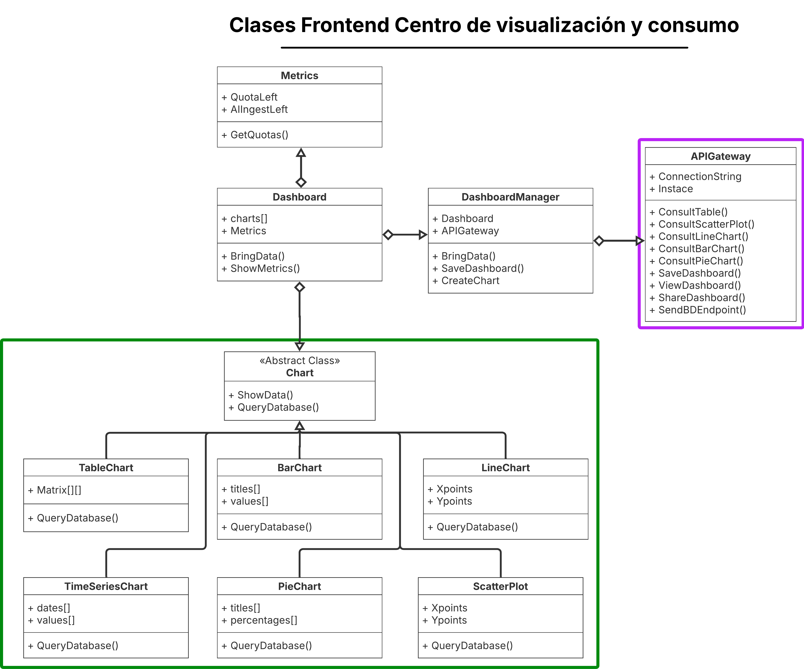
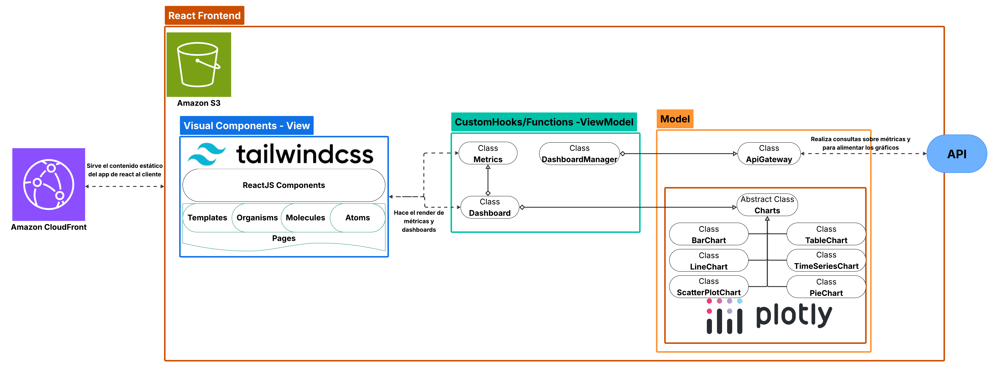
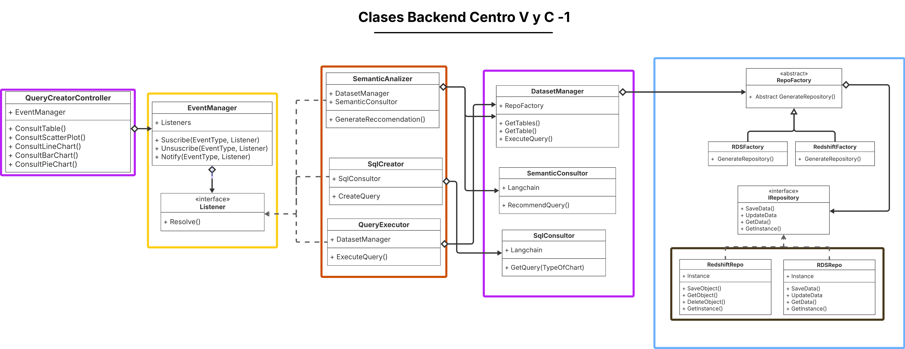
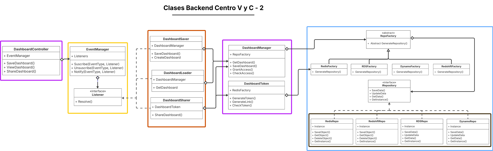
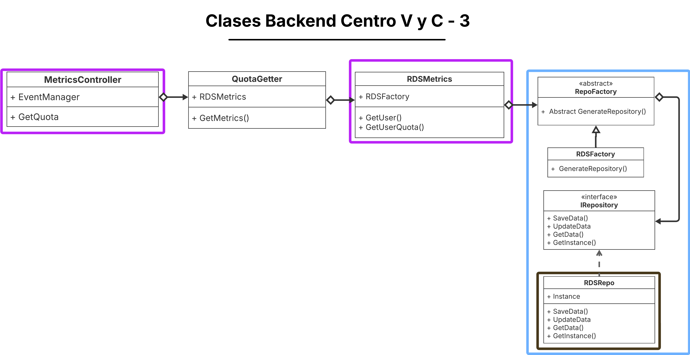
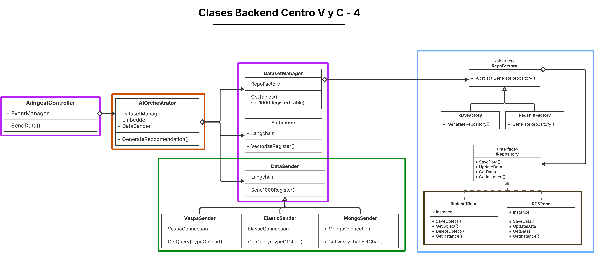
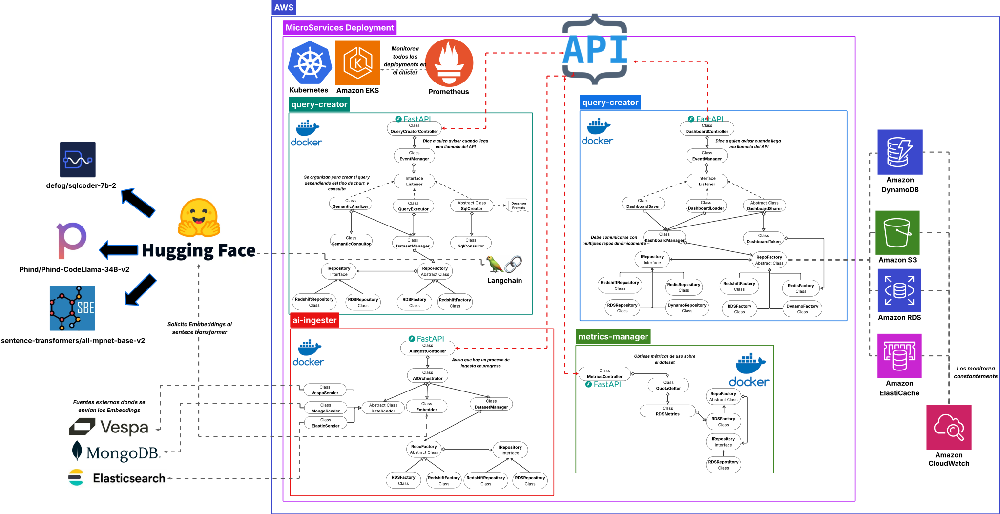
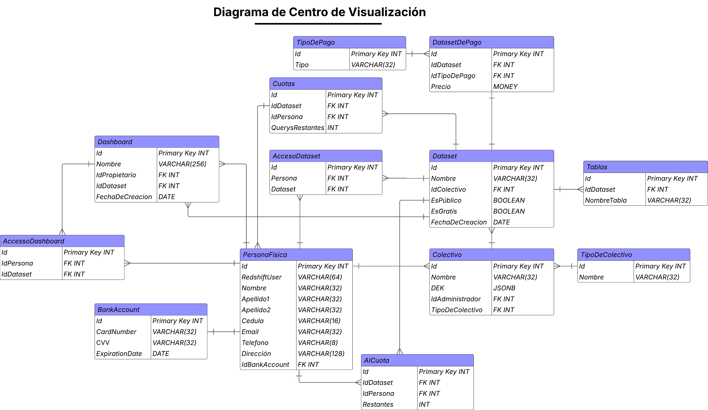

# 4.6 Centro de Visualización y Consumo

## Diseño del Frontend

### Arquitectura del Cliente

Nuestra arquitectura de cliente consistirá en Client Side Rendering con rendering estático, con una única capa dedicada a la web. Esta decisión se toma porque los bundles de React generados en el build de cada proyecto serán almacenados en un bucket de S3, el cual será servido a los clientes mediante el CDN provisto por CloudFront.

Además, para acceder al backend se utilizará una única API, desarrollada en FastAPI.


### Flujo Completo de Funcionamiento

1. **Selección y configuración inicial:**
   - El usuario accede a la interfaz gráfica desde el portal web.
   - Selecciona los datasets disponibles a los que tiene acceso según los permisos RBAC ya aplicados por la bóveda de datos.

2. **Definición del gráfico:**
   - El usuario selecciona el tipo de visualización: tabla, barras, líneas, series temporales, pie chart o scatter plot.
   - Debe definir el nombre que tendrá el gráfico
   - Luego de ello, el usuario debe presentar con lenguajes natural la consulta que desea hacer al dataset.

4. **Renderización de gráficos:**
   - Una vez el backend procesa la respuesta devuelve los datos en el formato requerido por el tipo de gráfico de Plotly.js seleccionado.

### Patrones de Diseño de Objetos

A Continuación el diagrama de clases del frontend del Centro de Visualización y Consumo:



- **Caja Verde**: La caja verde representa el patrón de Strategy, permite que el dashboard pueda tener distintos tipos de charts.
- **Caja Rosada**: Representa un facade, ya que la clase del APIGateway actua como fachada ante el API del Backend.

### Principios de Diseño Aplicados

- **Responsive Design**: Aunque el enfoque principal de nuestro sistema está en el uso desde web desktop, también se dará un interfáz responsive por si ocasionalmente se desea visualizar algún dashboard. Este diseño responsivo se logrará aprovechando las opciones que ofrece Tailwind CSS para distintos tamaños de pantalla, utilizando prefijos como sm:, md:, lg:, y xl:, que permiten adaptar los estilos según el dispositivo.

- **Atomic Design:**
  - Átomos: Botones, inputs, selects.
  - Moléculas: Formularios de configuración de gráficos.
  - Organismos: Contenedores de dashboards.
  - Templates: Editor completo de dashboards.

- **SOLID:**
  - SRP: Las clases están bien separadas el Dashboard Manager se encarga solo de tareas relacionadas a los dashboards. O bien cada chart está especializado para mostrar información solo asociada a ese tipo.
  - OCP: Nuevos tipos de gráficos pueden añadirse sin modificar código existente gracias a que se usa un strategy pattern en la clase Chart.
  - LSP: Se usa herencia solo cuando es necesario, por ejemplo en los charts.
  - ISP: El diseño actual no contempla interfaces, pero en caso de ser necesarias hay que recordar este principio.
  - DIP: La clase de dashboard sirve igual de bien con cualquier tipo de chart, no importa las subclases todas deben funcionar igual que su clase padre.

- **Dry principle**: En la medida de lo posible se usará la menor cantidad de código repetido. Dos ejemplos de esto son: gracias a que usaremos atomic design, componentes como botones o labels serán reutilizado no solo en el centro de visualización y consumo, pero en todo el sistema; y otro ejemplo es que en los charts se reutilizarán los métodos que compartan los distintos tipos  .

- **Separation of Concern**: Se cumple este principio ya que las distintas capas del frontend estarán bien definidas. En la capa de datos solo se gestionarán los objetos como Charts. Luego por medio de CustomHooks se gestionará la lógica del ViewModel, por ejemplo, las funciones como CreateChart(). Y Finalmente la capa de Vista se dedicará a tan solo eso, hacer el render de los componentes.

- **Toolkits y Standards**:
  - Vite: Se usará como servidor local para el desarrollo, y también para hacer el bundle de la aplicación.
  - React Router: Herramienta que permite manejar un app de react por medio de rutas.
  - ESlint: Se usará para mantener un estándar de código y evitar errores comunes.


### Estructura de Carpetas

```txt
frontend/
├── public/                   #Assets como imagenes
├── src/
│   ├── api/                  #Acá estarán las funciones del API
│   ├── model/                #Acá se almacenarán las clases del modelo
│   │   └── Chart
│   ├── components/           #Atomic Design
│   │   ├── atoms/            #Componentes más básicos
│   │   │   ├── Button.jsx
│   │   │   └── Icon.jsx
│   │   │
│   │   ├── molecules/
│   │   │   └── TableChart.jsx
│   │   │
│   │   ├── organisms/
│   │   │   └── Dashboard.jsx
│   │   │
│   │   └── templates/
│   │       ├── CollectiveForm.jsx
│   │       └── PersonForm.jsx
│   │
│   ├── hooks/                 #ViewModel
│   │   └── UpdateChart.jsx
│   │
│   ├── pages/                 #Uso de las templates lista para formar una página completqa
│   │   └── DatasetVisualization.jsx
│   │
│   ├── styles/               #Tailwind
│   │   └──globals.css        #Configuración de Tailwind
│   │
│   ├── utils/                #Funciones DRY
│   │
│   └── App.tsx               #Punto de Entrada
│
│
└── tests/
    ├── unit/
    └── integration/
```

### Diagrama del Frontend

A continuación se presenta el diagrama del frontend del Centro de Visualización y consumo, en el se evidencia como las peticiones al frontend se envían gracias a cloudfront, y dentro de un S3 bucket con react usando CSR se envían las páginas html ya listas para ser renderizadas en cliente. Dichas páginas usan Plotly para poder crear gráficos dinámicamente dependiendo del tipo de consulta.





## Diseño del Backend

A continuación se presenta la sección de Diseño del Backend, donde se detallan los microservicios correspondientes. El trabajo principal está enfocado en cómo construir consultas dinámicas que permitan generar distintos tipos de gráficos y aplicar diversos tipos de consultas; más adelante se abordará cómo resolver este desafío. También se explicará cómo se planea ofrecer consumo de IA sobre los datasets sin exportar directamente los datos, además de cómo gestionar tareas operativas como el almacenamiento de dashboards.


### Microservicios del Componente


**1. query-creator**

Este microservicio es el encargado de poder transformar las consultas en lenguaje natural que hacen los usuarios para obtener información de los datasets, a consultas en SQL válidas para poder retornar resultados apropiados (Similar a lo que hace Snowflake con su integración de Cortex).

Funcionará gracias a dos agents de IA con base en los modelos de hugging face:
- defog/sqlcoder-7b-2
- Phind/Phind-CodeLlama-34B-v2

Los componentes principales son

 - **QueryCreatorController**: Expone el endpoint RESTful del microservicio.
  - `/query`: todas las consultas seguidas de query especifican que tipo de dataset es el que se está solicitando
  - `/query/consult-table`
  - `/query/consult-scatter-plot`
  - `/query/consult-line-chart`
  - `/query/consult-bar-chart`
  - `/query/consult-pie-chart`
- **SemanticAnalizer**: Se encarga de analizar el dataset en Redshift junto con sus campos de CategoríaSemántica y Descipciones.
- **sqlCreator**: Se encarga de crear las consultas sql.
- **QueryExecutor**: Se encarga de ejecutar el query sql y devolver el resultado al frontend.

El flujo principal sería el siguiente:

1. La consulta llega al QueryCreatorController:
- El frontend hace un  `POST /query/{algun-endpoint}`
```json
{
  "tipoDeGrafico": "tipo de gráfico",
  "datasetName": "Nombre del dataset",
  "nlpQuery": "query en lenguaje natural"
}
```
- Una vez obtenida dicha información se pasará el control al SemanticAnalizar para que revise cuales son las tablas correspondientes al dataset en RDS, para que luego extraiga sus columnas, tablas, y en especial, al menos 20 registros de cada una para ver que datos hay en las columnas de Descripcion y Categoria Semantica.

- Posteriormente a esto usando el Langchain con Phind/Phind-CodeLlama-34B-v2 se le dará todo el contexto usando:
  - La consulta en nlp.
  - El schema del dataset.
  - Los campos de Categoria semántica y descripción.
- Con base en eso generará una recomendación.

2. Creación del script:

- Con base en las recomendaciones del agente anterior, ahora con defog/sqlcoder-7b-2 se creará el script de SQL en sí. Se le dará de contexto:
  - Las recomendaciones del paso pasado.
  - La consulta en lenguaje natural del cliente.
  - El formato con el que se debe devolver la data (varia de gráfico a gráfico, es importante para que calze con el modelo en el frontend)

3. Ejecución del script:

- Una vez se obtenga el query del sql-creator, se pasará el string obteniedo al query-executor, para que realice la consulta en la base de datos, y retorno la data con el formato previamente solicitado al frontend.

**2. dashboard-manager**

Este componente se encarga de gestionar los dashboards: permite guardarlos, compartirlos con otros usuarios y consultar los datasets previamente guardados.

Primeramente cabe aclarar que los dashboards serán guardados en DynamoDB con la siguiente estructura:
``` json
{
  "nombre": "Nombre del dashboard",
  "gráficos": [
    {
      "query_sql": "Consulta SQL generada durante la creación",
      "tipo_visualizacion": "Tipo de gráfico"
    }
  ],
  "dataset_id": "Id del dataset en RDS",
  "usuario_id": "Id del usuario propietario en RDS"
}
```

Los componentes principales son

 - **DashboardController**: Expone el endpoint RESTful del microservicio.
  - `/dashboard/save-dashboard`: permite guardar un dashboard
  - `/dashboard/view-dashboard`: permite visualizar un dashboard
  - `/dashboard/share-dashboard`: permite compartir un dashboard
- **DashboardSaver**: Se encarga de traer el dashboard.
- **DashboardLoader**: Se encarga de traer el dashboard.
- **DashboardSharer**: Da la funcionalidad para compartir dashboards.

- El componente DashboardSaver se encarga exclusivamente de guardar dashboards en la tabla "Dashboards" de DynamoDB, utilizando el formato previamente definido.
- Por su parte, el DashboardLoader busca un dashboard por su nombre dentro de DynamoDB, valida que el usuario tenga permisos de accederlo en AccesoDashboard de RDS, y en caso afirmativo, lo recupera para que se puedan ejecutar las consultas asociadas.

Sin embargo el proceso de compartir un dashboard es un tanto más largo:

1. Creación de link
- Una vez el usuario llama a `POST /dashboard/share-dashboard` con
```json
{
  "username": "nombre de usuario de la persona",
  "datasetName": "Nombre del dataset"
}
```

- Se genera un token UUID que se guardará con formato "collective-register:<TOKEN_UID> : <NOMBRE_DEL_DASHBOARD>" para ser guardado en redis con un TTL de una semana.

- Luego se generará un link con base en ese token que se vea así:

  ```txt
  https://data-pura-vida.com/dataset/dashboard?token=<TOKEN_UID>
  ```

2. El link copleto se devuelve al frontend para que peuda compartirlo

3. Uso del link

- Ahora, cualquier usuario que acceda a dicho link en una semana podrá tener acceso al dashboard

- Además, para evitar que el token en redis expire, y la persona no pueda acceder más al dashboard, desde la primera vez que lo acceda se va a haber guardado su usuario en la tabla de AccesoDashboard en RDS.

**3. metrics-manager**

Este componente se encarga de mostrar las métricas de sesión del usuario, incluyendo el número de consultas restantes disponibles. La lógica relacionada con el registro y control de cuotas se encuentra detallada en la sección correspondiente al backend de La Bóveda.

Además, como tal lo que es mostrar el volumen de consultas, y datos extraidos se hace implicitamente al visualizar los dashboards o en el query-creator, ya que este como parte de la información que devuelve al cliente está cuantos datos fueron traidos durante la consulta.

Los componentes principales son

 - **MetricsController**: Expone el endpoint RESTful del microservicio.
  - `/metrics/use-stats`: da las estadísticas de uso sobre cuantas cuotas quedan
- **QuoataGetter**: Se encarga de traer las métricas de uso del dashboard.

Este componente es sencillo: su función principal es actualizar en el frontend las métricas de uso cada vez que el usuario ejecuta una consulta a través del servicio query-creator. El manejo del contador de cuota y su trazabilidad está descrito en detalle en la sección de La Bóveda.

**4. ai-ingester**

Finalmente, este microservicio es el que permite que la alimentación de sistema de inteligencia artificial sea posible y segura para los datos del propieatario del dataset.

Los componentes principales son

 - **AiIngestController**: Expone el endpoint RESTful del microservicio.
  - `/ingest/dataset`: con este endpoint se llama a la alimentación de IAs.
- **Embedder**: Se encarga de crear embeddings.
- **DataSender**: Se encarga de enviar la data vectorizada.
- **DatasetManager**: Se encarga de traer el dataset de Redshift.

Este es el flujo principal:

1. La consulta llega al AiIngestController:
- El frontend hace un  `POST /ingest/dataset`
```json
{
  "nombreDeColeccion": "Nombre de la colección donde guardar los vectores",
  "coonectionString": "URI a una base de datos de vectores",
  "BDtype": "elastic|Mongo|Vespa"
}
```
- Con esa información se sabrá a que base de datos de vectores se deberá enviar la información de los datasets ya tokenizada

2. Generación de Embeddings y Envió:

- Cabe aclarar que este proceso es iterativo.

- Primero se traerá una tabla de redshift, cada 1000 registros.

- Luego el embedder generará los embeddings para cada uno de los campos. Tomará en cuenta cada una de las columnas, especialmente las de Descripción y CategoriaSemantica. Este proceso se hará gracias a sentence-transformers/all-mpnet-base-v2, el cual puede vectorizar oraciones y producir embeddings de 768 dimensiones.

- Luego de esto se pasará la información al origen con el DataSender, cabe aclarar que se usarán distintas estrategias dependiendo de cual tipo de destino sea la base de datos.

- Se repite este proceso de 1000 en 1000 hasta finalizar el dataset.


### Diagramas de Clases

**1. query-creator**

Primeramente, los patrones de diseño orientados a objetos utilizados son los siguientes:

- Morado: Representa un facade.
- Amarillo: Representa un observer.
- Naranja: Representa un dependency injection.
- Celeste: Muestra un factory.
- Café: Representa un singleton.

Ahora bien, las clases están organizadas de la siguiente manera:

El punto de entrada es el QueryCreatorController, que actúa como facade para que el API general del backend se comunique con este microservicio. Este controlador delega las llamadas a un observer mediante el EventManager, encargado de notificar a la lógica de negocio correspondiente según el tipo de llamada realizada al QueryCreatorController.

Dentro de esa lógica se encuentran el SemanticAnalizer, SqlCreatory QueryExecutor, que reciben como dependencias los servicios de la segunda capa de facade.

En esta segunda capa se encuentran:

- DatasetManager: Actua como un facade encima de los datasets, haciendo consultas en RDS o Redshift segun sea necesario.
- SemanticConsultor: Se encarga de generar recomendaciones segun el tipo de chart y el contenido del dataset.
- SQLConsultor: Se encarga de crear el query de SQL según lo que haya sido acordado.

Finalmente, existe una capa de repositorios gestionada mediante el patrón Factory. Además, cada conexión se maneja utilizando el patrón Singleton.




**2. dashboard-manager**

Primeramente, los patrones de diseño orientados a objetos utilizados son los siguientes:

- Morado: Representa un facade.
- Amarillo: Representa un observer.
- Naranja: Representa un dependency injection.
- Celeste: Muestra un factory.
- Café: Representa un singleton.

Ahora bien, las clases están organizadas de la siguiente manera:

El punto de entrada es el DashboardController, que actúa como facade para que el API general del backend se comunique con este microservicio. Este controlador delega las llamadas a un observer mediante el EventManager, encargado de notificar a la lógica de negocio correspondiente según el tipo de llamada realizada al DashboardController.

Dentro de esa lógica se encuentran el DashboardSaver, DashboardLoader y DashboardSharer, que reciben como dependencias los servicios de la segunda capa de facade.

En esta segunda capa se encuentran:

- DashboardManager: abstrae toda la lógica sobre Dashboards, como salvarlos, traerlos, crear accesos.
- DashboardToken: Se encarga de crear los links con tokens y asociarlos a un registro en redis.

Finalmente, existe una capa de repositorios gestionada mediante el patrón Factory. Además, cada conexión se maneja utilizando el patrón Singleton.



**3. metrics-manager**

Primeramente, los patrones de diseño orientados a objetos utilizados son los siguientes:

- Morado: Representa un facade.
- Celeste: Muestra un factory.
- Café: Representa un singleton.

Ahora bien, las clases están organizadas de la siguiente manera:

El punto de entrada es el MetricsController, que actúa como facade para que el API general del backend se comunique con este microservicio. Este controlador delega la llamada al QuotaGetter para qeu abstraiga la lógica sobre las cuotas restantes de Consultas y de consumo de IA en dicho dataset.

En esta segunda capa se encuentran:

- RDSMetrics: abstrae la lógica para obtener las métricas de RDS.

Finalmente, existe una capa de repositorios gestionada mediante el patrón Factory. Además, cada conexión se maneja utilizando el patrón Singleton.



**4. ai-ingester**

Primeramente, los patrones de diseño orientados a objetos utilizados son los siguientes:

- Morado: Representa un facade.
- Amarillo: Representa un observer.
- Naranja: Representa un dependency injection.
- Verde: Representa un strategy.
- Celeste: Muestra un factory.
- Café: Representa un singleton.

Ahora bien, las clases están organizadas de la siguiente manera:

El punto de entrada es el AiIngestController, que actúa como facade para que el API general del backend se comunique con este microservicio. Este controlador delega las llamadas al AIOrchestrator para que se encarga de coordinar el proceso de traida de datos, embedding de los mismos, y envío a la fuente. Para eso usa DatasetManager, Embedder y DataSender respectivamente

Finalmente, existe una capa de repositorios gestionada mediante el patrón Factory. Además, cada conexión se maneja utilizando el patrón Singleton.



### Servicios de AWS

**Amazon EKS**

La API REST principal del Centro de Visualización está desarrollada con FastAPI y desplegada en un clúster de EKS, el cual administra dinámicamente los microservicios responsables del manejo de usuarios, dashboards, procesamiento de solicitudes y exportación de reportes. Este clúster permite escalar horizontalmente ante aumentos de tráfico, especialmente durante jornadas de alta consulta o actualización masiva de visualizaciones.


### Sistema de Monitoreo

El monitoreo del Centro de Visualización y Consumo se enfoca en la observabilidad en tiempo real del uso de datos, el rendimiento de las visualizaciones y la seguridad. Es clave para el acceso fluido a la información, la gestión de consumo de datos pagos y la detección rápida de anomalías.

- **Métricas y Rendimiento**

AWS CloudWatch herramienta principal para recopilar métricas operacionales.

  - **Métricas de Negocio:**
      - **Cantidad de consultas por usuario y dataset:** Sirve para entender el nivel de interés y uso de nuestros datos, el Módulo de Gestión de Consumo las usará para seguimiento. El Servicio de Analítica de Uso las analizará para tendencias y popularidad de datasets.
      - **Volumen de datos consultados (MB/GB) por usuario y dataset:** Se usan para facturar a los usuarios por el consumo de datos pagos, el Módulo de Interfaz de Usuario las mostrará en tiempo real. El Servicio de Facturación las usará para cálculos.
      - **Tasa de éxito en la construcción de dashboards:** Utilizadas para evaluar si nuestras herramientas de visualización son efectivas El Módulo de Diseño de Dashboards las analizará para mejorar la experiencia de usuario.
      - **Métricas de consumo de datos pagados:** Se usan para gestionar las suscripciones, servicios como la Gestión de Licencias y Suscripciones las gestionará en tiempo real. El Módulo de Notificaciones alertará a los usuarios.

  - **Métricas de Infraestructura:**
      - **EKS:** Esta métrica se usan para garantizar que los microservicios tengan suficientes recursos (CPU, memoria) y para detectar problemas de rendimiento o errores (latencia, errores 4xx/5xx) que puedan afectar la disponibilidad de la visualización.
      - **PostgreSQL/DynamoDB:** Usada para asegurar que las bases de datos respondan rápido (latencia, IOPS) y no estén sobrecargadas (utilización de CPU/memoria). Esto es vital para la operativa y el acceso a la información de los usuarios y de los dashboards.

`Prometheus` complementará `CloudWatch`, recopilando métricas granulares de cada uno de los microservicios.

- **Visualización y Dashboards**

Grafana integrará métricas de CloudWatch y Prometheus para crear dashboards:

  -	**Dashboard Operacional de Visualización:** Vista en tiempo real del estado general (volumen de consultas, usuarios activos, estado de pods). El Módulo de Operaciones/SRE lo usará para supervisión proactiva.
  - **Dashboard de Rendimiento:** Monitoreo de latencias de carga de dashboards y consultas, consumo de recursos. El Servicio de Consultas y el Servicio de Visualización lo usarán para identificar cuellos de botella.
  - **Dashboard de Consumo y Seguridad:** Seguimiento de métricas de consumo de datos pagados y eventos de seguridad. El Servicio de Gestión de Licencias y Suscripciones y el Servicio de Seguridad lo usarán.


- **Health Checks y Disponibilidad**

Los microservicios del Centro de Visualización usarán health checks monitoreados por Kubernetes:

  -	**Liveness Probe:** Verifica que el microservicio esté activo. Kubernetes (EKS) lo usará para autorecuperación.
  -	**Readiness Probe:** Verifica que el microservicio pueda procesar solicitudes (conectividad con S3, DBs). Kubernetes (EKS) lo usará para gestionar el tráfico.
  -	**Deep Health Checks:** Verificaciones exhaustivas de integridad de configuraciones y flujo de consultas simuladas. El Módulo de Diagnóstico del Servicio de Visualización las ejecutará.

- **Análisis y Mejora Continua**
El sistema de monitoreo proporcionará insights para la mejora continua:
  -	**Análisis de Tendencias:** Identificación de patrones de volumen y tipo de consultas para optimizar recursos y predecir necesidades. El Servicio de Analítica de Uso las analizará.
  -	**Detección de Anomalías:** Identificación de comportamientos inusuales. Las Alertas de CloudWatch y el Servicio de Monitoreo las detectarán.
  -	**Reportes de Capacidad:** Proyecciones de crecimiento de infraestructura. El Servicio de Planificación de Recursos las generará.
  -	**Optimización de Costos:** Análisis de uso de recursos para identificar oportunidades de optimización. El Módulo de Gestión de Costos las realizará.


### Modelo de Seguridad Detallado

- **Auditoría y Trazabilidad**

Esenciales para la responsabilidad y el cumplimiento normativo, permitiendo reconstruir eventos.

  -	**Elementos Auditados:** Creación, modificación, eliminación de configuraciones; validaciones, aprobaciones, errores, consultas.
  -	**Origen y Estructura del Registro:** Incluye identificador de usuario/rol, timestamp, tipo de operación, IP/microservicio de origen, resultado.
  -	**Tecnologías: **
    -	**Amazon CloudWatch Logs:** Registro estructurado en tiempo real.
    -	**Amazon DynamoDB Streams:** Replicación de eventos sensibles a una tabla de auditoría.
  -	**Acceso y Resguardo:** Restringido a roles con privilegios de auditoría vía IAM. Almacenamiento cifrado con retención mínima de 12 meses.

- **Monitoreo y Gestión de Incidentes**

Diseñado para identificar y responder rápidamente ante eventos que comprometan la integridad o seguridad de los datos.

  - **Monitoreo en Tiempo Real:**
    -	**Prometheus:** Recolecta métricas personalizadas (ej., tiempo de validación, tasa de éxito). El Microservicio de Gestión de Cargas las genera.
    -	**AWS CloudWatch:** Monitorea logs de microservicios, alertando sobre patrones anómalos (ej., fallos recurrentes). Los Microservicios de Backend y el Servicio de Monitoreo de Infraestructura envían logs.
 -	**Gestión de Incidentes:**
    -	**Detección:** Reglas de alerta en CloudWatch detectan errores de carga, archivos rechazados, caídas de servicios. El Servicio de Monitoreo de Infraestructura y el Microservicio de Gestión de Cargas envían los eventos.
    -	**Clasificación:** Se evalúa la gravedad (Crítico, Medio, Bajo). El Módulo de Gestión de Incidentes (parte del backend) la realiza.
    -	**Respuesta Automática:** AWS Lambda ejecuta funciones para mitigar el impacto (ej., reintentar cargas). El Módulo de Resiliencia del backend usa AWS Lambda.
    -	**Notificación:** AWS SNS envía notificaciones a administradores para incidentes críticos. El Módulo de Notificaciones del backend se integra con AWS SNS.

### Elementos de alta disponibilidad

**1. PostgreSQL en modo Multi-AZ**

La base de datos principal corre sobre Amazon RDS con replicación activa entre dos zonas de disponibilidad (`us-east-1a` y `us-east-1b`). Esto permite que, si ocurre una falla en la zona primaria, el sistema haga failover automático en menos de 30 segundos, sin afectar el acceso a dashboards ni a configuraciones de usuario.

**2. Balanceador de carga con ALB**

El tráfico hacia el backend (FastAPI en EKS) entra a través de un Application Load Balancer. Este balanceador distribuye las solicitudes entre los pods disponibles, y revisa cada 10 segundos que todos estén sanos mediante health checks. Si uno falla, lo saca de rotación sin afectar a los demás.

**3. Escalamiento automático**

Cuando hay muchos usuarios conectados o se generan muchos dashboards al mismo tiempo, el sistema escala automáticamente la cantidad de pods en EKS. Si la CPU o la memoria de los servicios sube más de lo normal (ej. CPU >75% por 5 minutos), se activan más instancias para atender la demanda.

**4. Almacenamiento seguro y replicado**

Todo lo que el usuario genera—gráficos, reportes, configuraciones—se guarda en S3. Estos buckets tienen versionado habilitado y replicación a otra región, por si alguna zona falla. Además, se aplican políticas de retención que envían archivos antiguos a Glacier después de 90 días.

**5. Respaldos automáticos diarios**

Cada noche, un job dentro del clúster de EKS lanza respaldos de las visualizaciones, plantillas y configuraciones. Estos respaldos se almacenan tanto en RDS como en S3, y se validan después para asegurar que estén completos y correctos.


### Diagrama del Backend

El diagrama a continuación muestra como en este componente cada microservicio tiene funciones tan separadas que no se deben comunicar entre sí, tan solo el API General del Backend es la que acceder a ellos. Además se evidencia la interacción con distintos servicios de AWS como ElasticCache y cloudwatch. Junto a ellos también se ve como algunas partes de la ejecución ocurren fuera de AWS, por ejemplo la consulta a modelos de hugging face por medio del api, o la carga de datasets vectorizados a personas externas.




## Diseño de los Datos

La influencia de este componente sobre la base de datos es mínima, ya que reutiliza la misma instancia de RDS compartida con La Bóveda, el Bioregistro y todas las que tengan control sobre contenido administrativo. Del mismo modo, las configuraciones para DynamoDB se mantienen idénticas a las de esos componentes.

El único aporte nuevo se encuentra reflejado en el diagrama de base de datos que se presenta a continuación.

### Diagrama de Base de Datos

A continuación se presenta el diagrama de base de datos correspondiente al módulo del Centro de Carga. Este diagrama incluye las tablas clave que componen el componente, entre ellas:

- **AccessoDashboard**: Es una tabla que guarda quien tiene acceso a la visualización de un dashboard
- **Dashboard**: Almacena los dashboards, como tal la meta data de cada uno es guardada en Dynamo en la tabla de "Dashboards", pero también se ocupa llevar control de accesos y relacional, por lo que se tiene una copia en RDS también.
- **AICuota**: Lleva la cuenta de cuantos usos le quedan a un usuario para hacer consumo de IA sobre un dataset.


