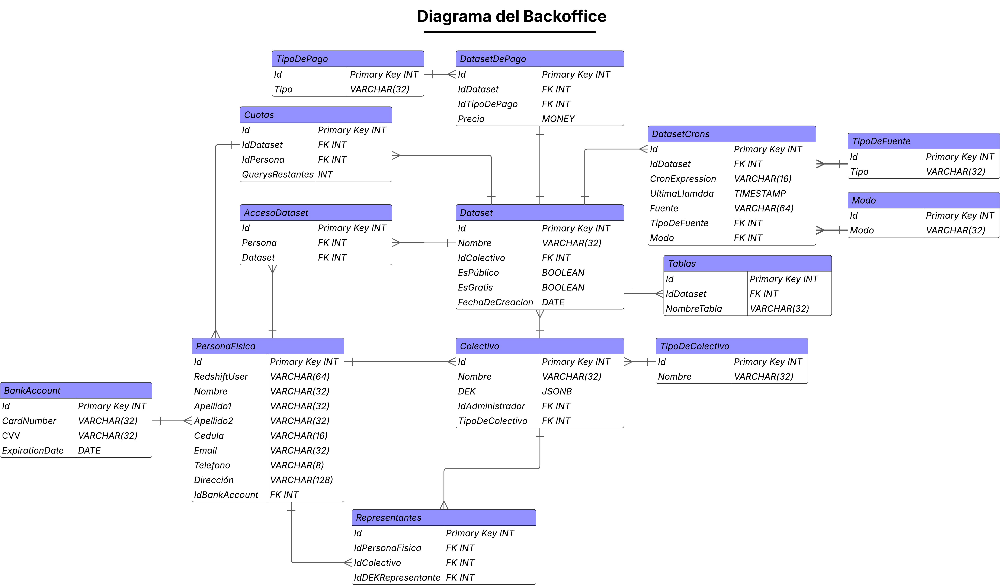

# 4.7 Backoffice Administrativo

## Diseño del Frontend

### Arquitectura de Construcción del Backoffice Administrativo

El módulo de Backoffice Administrativo permite a los operadores internos gestionar todos los aspectos críticos de la operación, seguridad, auditoría y configuración del ecosistema de Data Pura Vida. Su arquitectura sigue los mismos principios de escalabilidad, modularidad, seguridad avanzada y desacoplamiento que el resto de los módulos del sistema.

El frontend del Backoffice está completamente desacoplado de los microservicios backend, consumiendo únicamente las APIs expuestas por los servicios administrativos centralizados. La aplicación utiliza Client Side Rendering (CSR) en React, desplegado de forma estática sobre S3 y servido globalmente mediante CloudFront.

Todo el ciclo de gestión administrativa (usuarios, llaves de seguridad, flujos de datos, auditoría de operaciones, monitoreo de tareas, configuración de pipelines, manejo de custodios y autorizaciones mancomunadas) es orquestado desde esta interfaz, garantizando visibilidad centralizada, control granular de permisos, validación de identidades, auditoría continua y trazabilidad completa.

La arquitectura modular permite extender nuevos módulos administrativos de forma independiente, manteniendo una estricta separación entre vistas, lógica de negocio, y acceso a servicios backend a través de clientes HTTP centralizados, aplicando los principios de MVVM, Atomic Design y Patrones de Diseño de Objetos para su mantenimiento escalable.

### Patrones de Diseño de Objetos - Backoffice Administrativo

El diseño del frontend del módulo Backoffice Administrativo de Data Pura Vida sigue estrictamente principios de diseño orientado a objetos para lograr un sistema altamente desacoplado, escalable, mantenible y seguro.  
Dado que este módulo administra operaciones críticas del ecosistema (usuarios, llaves de seguridad, auditoría, pipelines y permisos), se aplican múltiples patrones de diseño para asegurar la extensibilidad y robustez de la solución.

A continuación, se describen los principales patrones aplicados en la arquitectura:

#### 1️ Patrón Strategy

- **Ubicación:** Gestión de configuraciones administrativas.
- **Uso:** Cada módulo de configuración (usuarios, roles, llaves, pipelines, custodia) implementa su propia estrategia de validación y operación, pero todos exponen una interfaz común. Por ejemplo, al crear nuevas políticas de pipelines, cada tipo de flujo sigue una estrategia específica de configuración, permitiendo extender validaciones y reglas sin afectar el flujo global del sistema.
- **Beneficio:** Permite agregar nuevas reglas de negocio o validadores administrativos de forma desacoplada, sin necesidad de modificar el núcleo del sistema de configuración.

#### 2️ Patrón Singleton

- **Ubicación:** Cliente HTTP centralizado (BackofficeApiClient).
- **Uso:** Gestiona las conexiones HTTP hacia el backend administrativo mediante una única instancia compartida. Toda configuración de headers, manejo de tokens de autenticación, interceptores de error, retries y logging de requests se concentra en un único punto.
- **Beneficio:** Evita duplicación de lógica de comunicación, asegura consistencia en todas las llamadas al backend y facilita el mantenimiento centralizado de seguridad y auditoría de requests.

#### 3️ Patrón Observer (Pub-Sub)

- **Ubicación:** Actualización reactiva de estado en la UI.
- **Uso:** Cuando ocurren eventos administrativos (creación de usuarios, cambios de llaves, actualizaciones de pipelines), los componentes visuales suscritos a los contextos globales de React reciben las actualizaciones en tiempo real, actualizando la UI automáticamente sin necesidad de refrescar el estado global de forma manual.
- **Beneficio:** Desacopla completamente los componentes de visualización de los flujos de negocio, permitiendo que cualquier acción administrativa propague sus efectos en los paneles correspondientes de forma automática y reactiva.

#### 4️ Patrón Facade

- **Ubicación:** Servicios administrativos de integración.
- **Uso:** Cada dominio de negocio expone una fachada que encapsula la lógica interna de interacción con los servicios backend. Por ejemplo: UserService, KeyService, PipelineService o AuditService centralizan la interacción de cada módulo con el API, ocultando los detalles de validación de endpoints, manejo de errores, transformaciones de datos y validación de permisos.
- **Beneficio:** Simplifica la integración entre el frontend y el backend, facilita el testing unitario de los servicios de negocio y centraliza la lógica de orquestación administrativa.

#### 5️ Patrón Dependency Injection

- **Ubicación:** Hooks de negocio (ViewModel).
- **Uso:** Los hooks de cada módulo (`useUserManagement()`, `usePipelineManagement()`, `useKeyManagement()`) reciben como dependencias los servicios de backend que encapsulan el acceso a datos. Esto permite desacoplar completamente la lógica de negocio de los detalles de infraestructura.
- **Beneficio:** Facilita la prueba aislada de cada ViewModel, reduce el acoplamiento entre capas, permite mockear servicios en testing y mejora la mantenibilidad a largo plazo.

#### 6️ Patrón MVVM (Model-View-ViewModel)

- **Model:** Define los objetos de negocio (User, Role, Pipeline, Key, AuditLog, Custodian), estableciendo sus validaciones, transformaciones y estructuras de datos compartidas entre frontend y backend.
- **ViewModel:** Implementado en hooks altamente especializados para cada dominio (`useUserManagement()`, `usePipelineManager()`, `useAuditLogs()`, etc.). Gestionan el estado de la interfaz, control de formularios, validación previa, llamadas al API y propagación de eventos.
- **View:** Los componentes visuales de React, diseñados bajo Atomic Design, presentan las pantallas administrativas consumiendo exclusivamente los datos gestionados por los ViewModels.

- **Beneficio:** Permite una separación clara y robusta entre la lógica de presentación, la lógica de negocio y el acceso a datos, mejorando la mantenibilidad, escalabilidad y capacidad de evolución del sistema sin riesgo de introducir errores cruzados.

#### 7️ Patrón Atomic Design

- **Aplicación en el Backoffice:**
  - **Atoms:** Button, Input, Checkbox, Modal, TableRow.
  - **Molecules:** UserForm, PipelineEditor, KeyConfigForm.
  - **Organisms:** AuditLogTable, PipelineDashboard, UserManagementPanel.
  - **Templates:** AdminLayout, FormLayout.
  - **Pages:** AdminDashboardPage.

- **Beneficio:** Facilita la reutilización de componentes visuales en distintas vistas, garantiza consistencia visual y simplifica el mantenimiento de la UI.

#### 8️ Separation of Concerns (Separación de Responsabilidades)

- **Uso:** Cada capa (View, ViewModel, Model, API Service) tiene responsabilidades bien delimitadas, evitando cruces de lógica entre capas.
- **Beneficio:** Permite desarrollar, probar y mantener cada módulo del frontend de forma aislada, minimizando el riesgo de errores regresivos y facilitando la incorporación de nuevos programadores al equipo.

#### 9️ DRY (Don’t Repeat Yourself)

- **Uso:** La lógica repetitiva de validación, manejo de formularios, transformación de datos y comunicación con el API se encapsula en servicios y utilitarios reutilizables.
- **Beneficio:** Minimiza la duplicación de código, reduce el mantenimiento y asegura consistencia de comportamiento en toda la aplicación.

### Estructura de Carpetas del Sistema - Backoffice Administrativo

El frontend del Backoffice sigue una estructura modular organizada bajo los principios de **MVVM**, **Atomic Design** y principios de escalabilidad, permitiendo una separación clara entre lógica de negocio, visualización, modelos de datos y comunicación con el backend.

```plaintext
frontend-backoffice/
├── public/                       # Archivos estáticos
├── src/
│   ├── api/                      # Servicios de comunicación con el backend
│   │   └── backofficeApi.ts
│   │
│   ├── models/                   # Modelos de negocio
│   │   ├── User.ts
│   │   ├── Role.ts
│   │   ├── Key.ts
│   │   ├── Pipeline.ts
│   │   ├── Custodian.ts
│   │   └── AuditLog.ts
│   │
│   ├── hooks/                    # ViewModels - lógica de negocio
│   │   ├── useUserManagement.ts
│   │   ├── useRoleManagement.ts
│   │   ├── useKeyManagement.ts
│   │   ├── usePipelineManagement.ts
│   │   ├── useCustodianManagement.ts
│   │   └── useAuditLogs.ts
│   │
│   ├── components/               # Componentes visuales siguiendo Atomic Design
│   │   ├── atoms/                # Inputs, botones, iconos
│   │   ├── molecules/            # Formularios, tablas, filtros
│   │   ├── organisms/            # Dashboards, tablas de auditoría, paneles de administración
│   │   └── templates/            # Layouts completos
│   │
│   ├── pages/                    # Páginas principales del Backoffice
│   │   ├── AdminDashboardPage.tsx
│   │   ├── UserManagementPage.tsx
│   │   ├── PipelineConfigPage.tsx
│   │   ├── KeyManagementPage.tsx
│   │   ├── AuditLogPage.tsx
│   │   └── CustodianPage.tsx
│   │
│   ├── contexts/                 # Contexto global de estado (opcional)
│   │   ├── UserContext.tsx
│   │   └── SessionContext.tsx
│   │
│   ├── utils/                    # Funciones utilitarias reutilizables
│   ├── constants/                # Constantes de configuración o enumerados
│   └── App.tsx                   # Entry point de la aplicación
│
├── amplify/                      # Configuración de despliegue en Amplify
│   ├── backend/
│   └── aws-exports.js
│
└── tests/                        # Pruebas unitarias e integración
    ├── unit/
    └── integration/
```
### Arquitectura del Cliente - Backoffice Administrativo

La arquitectura del cliente para el módulo de Backoffice Administrativo de Data Pura Vida está diseñada bajo los principios de desacoplamiento, modularidad y mantenibilidad, aplicando el patrón MVVM (Model-View-ViewModel) combinado con Atomic Design para la construcción de interfaces escalables.

#### Modelo de despliegue

- El frontend es construido mediante Vite, optimizando los tiempos de build.
- Los artefactos generados (archivos estáticos de React: HTML, JS, CSS y assets) son desplegados sobre Amazon S3.
- El contenido es distribuido globalmente a través de Amazon CloudFront para asegurar baja latencia y alta disponibilidad para los operadores internos.
- El sistema opera bajo un esquema de Client Side Rendering (CSR), manteniendo una única capa web desacoplada del backend.

#### Comunicación con el backend

- Todas las operaciones administrativas se comunican con los microservicios administrativos desplegados en FastAPI sobre AWS EKS.
- La comunicación HTTP es gestionada mediante un cliente centralizado (`BackofficeApiClient`), implementado como un Singleton.
- Este cliente maneja:
  - Inyección automática de headers de autenticación (JWT de Cognito).
  - Gestión de renovación de tokens.
  - Interceptores globales de error.
  - Retrys controlados para operaciones críticas.

#### Flujo de arquitectura del cliente

El frontend sigue estrictamente el patrón MVVM:

```plaintext
[ Usuario Operador ]
   ↓
[ View (React Components / Pages) ]
   ↓
[ ViewModel (Custom Hooks especializados) ]
   ↓
[ Model (Entidades de negocio) ]
   ↓
[ ApiConnector (BackofficeApiClient) ]
   ↓
[ Backend REST (FastAPI sobre EKS) ]
```

### Componentes Visuales - Backoffice Administrativo

#### Patrones y Principios Aplicados


- **Diseño Responsivo:**  
  Todo el sistema de componentes visuales del Backoffice está desarrollado bajo un esquema completamente responsivo. Se utiliza Tailwind CSS como framework principal de estilos, aplicando unidades relativas (`rem`, `%`, `vw`, `vh`) y breakpoints definidos para adaptar automáticamente el diseño a diferentes resoluciones de pantalla, incluyendo desktop, tablets y laptops corporativos. Aunque el Backoffice está orientado a usuarios administrativos, el diseño mantiene compatibilidad con resoluciones múltiples para máxima accesibilidad.

- **Principios SOLID:**

  - **Single Responsibility:**  
    Cada componente visual cumple una única función de renderizado. Los componentes no contienen lógica de negocio; ésta es gestionada exclusivamente por los hooks (ViewModel). Por ejemplo, `UserTable`, `PipelineForm` o `KeyEditor` se encargan únicamente de presentar datos y recibir eventos de interacción.

  - **Open/Closed Principle:**  
    Los componentes son completamente extensibles vía props sin necesidad de modificar su estructura interna. Agregar nuevos campos en formularios o parámetros en dashboards de auditoría puede realizarse sin alterar los componentes existentes.

  - **Liskov Substitution Principle:**  
    Las tablas administrativas (ej. `UserTable`) permiten utilizar distintas variantes de filas o celdas (ej.: filas ampliadas para custodios, roles o auditoría detallada), sin alterar el comportamiento del componente principal.

  - **Interface Segregation Principle:**  
    Cada componente recibe exclusivamente las props que necesita. No existen props innecesarias ni parámetros opcionales forzados.

  - **Dependency Inversion Principle:**  
    La lógica de negocio es totalmente consumida a través de los ViewModels (custom hooks). Los componentes visuales no conocen ni interactúan directamente con los servicios o el backend.


- **DRY (Don’t Repeat Yourself):**  
  Los formularios administrativos (`UserForm`, `KeyForm`, `PipelineForm`) utilizan componentes de formulario reutilizables, validadores comunes y estructuras de inputs parametrizables. Además, los mensajes de error, validaciones de negocio y lógicas de estado están centralizadas, evitando duplicación de código en distintos módulos.


- **Separation of Concerns (Separación de Responsabilidades):**  
  La responsabilidad de cada capa está claramente delimitada:
  - Las **Views** presentan la información.
  - Los **ViewModels** gestionan el estado, validaciones y lógica de negocio.
  - Los **Models** definen las estructuras de datos.
  - El **ApiConnector** gestiona la comunicación con el backend.


- **Atomic Design Aplicado:**

| Nivel | Ejemplos de componentes utilizados |
|-------|------------------------------------|
| **Atoms** | `Button`, `Input`, `Select`, `Badge`, `Modal`, `TableRow` |
| **Molecules** | `UserForm`, `PipelineForm`, `KeyForm`, `AuditLogFilter` |
| **Organisms** | `UserTable`, `PipelineManager`, `KeyManagementPanel`, `AuditLogTable` |
| **Templates** | `AdminLayout`, `ConfigLayout`, `AuditLayout` |
| **Pages** | `AdminDashboardPage`, `UserManagementPage`, `PipelineConfigPage`, `KeyManagementPage`, `AuditLogPage` |


- **Adaptabilidad y mantenibilidad:**  
  Gracias a esta estructura, el sistema permite:
  - Agregar nuevos módulos administrativos (por ejemplo: gestión de roles o integración de APIs externas) sin afectar los módulos existentes.
  - Reutilizar patrones visuales homogéneos en todas las pantallas.
  - Mantener la coherencia visual y funcional del sistema completo.


## Diseño del Backend

### Microservicios del Backoffice Administrativo

#### 1. admin-operations-service

**Responsabilidad**: Operaciones administrativas centrales y gestión de configuraciones.

##### Componentes Clave
- **UserValidationController**: Validación y aprobación de registros del Bio Registro 
- **DataRulesManager**: Gestión de reglas de carga de datos, formatos y validaciones 
- **ExternalConnectionsManager**: Configuración de APIs, BDs y callbacks externos 
- **PipelineController**: Supervisión y control de pipelines de datos 
- **SecurityKeyManager**: Gestión básica de llaves de seguridad 
- **CustodianCoordinator**: Administración de custodios de llaves 
- **RBACManager**: Control de acceso basado en roles 
- **ConfigurationController**: Gestión flexible de accesos y configuraciones 

##### Operación
Interfaz administrativa unificada para todas las operaciones de gestión. Los administradores validan usuarios, configuran reglas de negocio, supervisan pipelines y gestionan configuraciones del sistema. Integra con Bio Registro vía API para consultar datos sin duplicarlos.

**Tecnologías**: FastAPI, PostgreSQL, Redis, AWS Cognito


#### 2. audit-compliance-service

**Responsabilidad**: Auditoría, compliance y reportería del sistema.

##### Componentes Clave
- **AuditController**: Auditoría de operaciones por usuario, fecha y acción 
- **ReportGenerator**: Generación de reportes de uso, calidad e integración 
- **SystemMonitor**: Monitoreo del estado operativo de servicios 
- **EvidenceManager**: Extracción de evidencias para procesos legales 
- **AnomalyDetector**: Detección de patrones anómalos básica

##### Operación
Sistema de auditoría y compliance que registra todas las operaciones administrativas. Genera reportes automáticos y bajo demanda. Preserva evidencia para procesos legales con cadena de custodia.

**Tecnologías**: FastAPI, PostgreSQL, CloudWatch, S3

### Servicios AWS

#### Amazon EKS
**Propósito**: Orquestación de los 2 microservicios del backoffice
- **Configuración**: Cluster multi-AZ con node groups t3.medium
- **Auto Scaling**: HPA basado en CPU >70% por 5 minutos
- **Servicios**: admin-operations-service, audit-compliance-service

#### AWS Cognito
**Propósito**: Autenticación administrativa

**User Pool**: backoffice-administrators
- MFA obligatorio (TOTP + SMS)
- Atributos: admin_level, clearance_level
- Roles: admin_junior, admin_senior, admin_super

#### AWS KMS
**Propósito**: Cifrado especializado

**Llaves**:
- `backoffice-main-key`: Datos generales, rotación trimestral
- `backoffice-audit-key`: Evidencia forense, rotación manual
- `backoffice-security-key`: Metadatos de llaves, rotación semestral

#### AWS Secrets Manager
**Propósito**: Credenciales con rotación

**Secrets**:
- external-api-credentials (SumSub, Stripe, Banco Central)
- database-credentials (rotación cada 30 días)

#### Integration & Communication

##### Amazon EventBridge
**Propósito**: Eventos administrativos simples

**Buses**:
- backoffice-events: Eventos internos
- external-integration: Bio Registro, La Bóveda

**Eventos Clave**:
- user.validation.approved/rejected
- pipeline.intervention.required
- security.anomaly.detected
- backup.completed

### Diagrama de Clases


#### Explicación de los Patrones:

**(Morado) Facade:**
**AdminController** y **AuditController** actúan como fachadas que simplifican el acceso a las funciones complejas del backoffice

**(Amarillo) Observer:**
**EventManager** notifica a los servicios correspondientes cuando ocurren eventos administrativos

**(Azul) Factory:**
**ServiceFactory** crea las instancias apropiadas de los servicios según se necesite

**(Verde) Strategy:**
**Repository** permite cambiar entre diferentes tipos de almacenamiento (PostgreSQL, DynamoDB, S3) sin afectar la lógica de negocio

**(Rojo) Singleton:**
**DBConnection** garantiza una única instancia para manejar las conexiones a base de datos


### Monitoreo

**Prometheus en EKS**

Prometheus está siempre activo dentro del clúster EKS, recolectando métricas del BackOffice. Se adapta la cantidad de recolección según el ritmo de uso; por ejemplo cambios masivos en usuarios o configuraciones. El sistema baja el intervalo de recolección a 20 segundos para captar todo al detalle. En momentos más tranquilos, como fuera del horario laboral, lo sube a 60 segundos para no gastar recursos innecesarios.

**Monitoreo por servicio:**

- `auth-service`: Se pone más atento cuando detecta muchos inicios de sesión o cambios de roles y lanza alertas si hay muchos errores 401 o 403.
- `config-manager`: Siempre activo, especialmente cuando se cambian parámetros que afectan a más de un módulo del sistema.
- `log-service`: Solo activa el monitoreo cuando el volumen de logs por minuto se dispara, ideal para detectar incidentes.


**CloudWatch**

CloudWatch se encarga de vigilar todo lo que pasa a nivel de servidores, discos y base de datos. Nos ayuda a ver si algo en el fondo está afectando la experiencia del BackOffice.

- **Nodos en EKS:** Uso de CPU y RAM, sobre todo cuando hay varias tareas administrativas corriendo al mismo tiempo.
- **RDS**: Se trackea cuántas conexiones hay, especialmente cuando alguien lanza consultas pesadas o saca reportes grandes.

**X-Ray**

Con AWS X-Ray podemos seguir el camino de cada acción dentro del BackOffice. Por ejemplo, si un admin cambia permisos o configura algo, vemos todo el recorrido: desde el clic en la interfaz hasta el cambio en la base de datos.

- **Gestión de usuarios**: Desde que alguien edita un usuario hasta que se actualiza el sistema y se reflejan los permisos nuevos.
- **Cambios en configuración**: Vemos cómo el cambio se propaga al resto del ecosistema y si tarda más de lo esperado.
- **Problemas de lentitud**: Cuando una petición tarda más de 1 segundo, se activa un trace automáticamente para ver qué la está frenando.


**AWS Config**

AWS Config revisa todo el tiempo si el BackOffice está cumpliendo con las reglas de seguridad y configuración. Si algo se sale de lo permitido, lo detecta y lo revierte si es necesario.

Algunas reglas clave:

- **Security Groups:** Solo permiten acceso desde las redes que se definieron como seguras.
- **Logs cifrados:** Todos los registros tienen que estar cifrados tanto al guardarse como al moverse.
- **Cambios importantes:** Si alguien cambia un parámetro sensible, se dispara una corrección automática.

**CloudTrail**

CloudTrail deja un rastro de todo lo que pasa: quién hizo qué, desde dónde, y cuándo. Sirve tanto para auditorías como para investigar si algo salió mal.

Eventos que registramos siempre:

- **Cambios en roles y permisos:** Se guarda el detalle completo: usuario, acción, IP y hora.
- **Accesos a configuraciones sensibles:** Cada consulta o modificación queda anotada.
- **Altas y bajas de usuarios:** Todo el historial queda disponible para consulta.

**Grafana**

- **BackOffice Overview:** Muestra cómo está funcionando el sistema en general: errores, tiempos de respuesta, cantidad de peticiones, etc.
- **Security & Access Logs:** Junta información de CloudTrail y Prometheus para detectar accesos sospechosos o cambios críticos.
- **Performance & Latency:** Señala los endpoints más cargados y ayuda a identificar qué podría optimizarse.


### Modelo de Seguridad Detallado

El Backoffice Administrativo maneja operaciones críticas del ecosistema Data Pura Vida, requiriendo el más alto nivel de seguridad dado que gestiona validaciones de usuarios, llaves tripartitas, configuraciones de sistema y evidencia legal.

#### 1. Control de Acceso Granular

##### Autenticación Multi-Factor Obligatoria
Todos los administradores deben completar un proceso de autenticación robusto:

**Proceso de Login:**
1. **Credenciales primarias**: Usuario/contraseña con política estricta (mínimo 12 caracteres, números, símbolos, mayúsculas)
2. **MFA obligatorio**: TOTP (Google Authenticator) + SMS backup
3. **Validación geográfica**: Restricción por provincia configurada en Cognito
4. **Sesión limitada**: Máximo 8 horas con re-autenticación para operaciones críticas

##### RBAC Detallado por Nivel de Clearance

| Rol | Clearance | Operaciones Permitidas | Restricciones Adicionales |
|-----|-----------|------------------------|---------------------------|
| **admin_junior** | standard | - Validar registros de usuarios básicos<br>- Leer reportes de auditoría<br>- Consultar configuraciones (solo lectura) | - No puede aprobar registros de organizaciones<br>- Máximo 10 validaciones/hora |
| **admin_senior** | elevated | - Todo lo anterior<br>- Gestionar pipelines de datos<br>- Configurar conexiones externas<br>- Generar reportes personalizados<br>- Supervisar estado del sistema | - Requiere aprobación para cambios críticos<br>- Re-autenticación MFA cada 4 horas |
| **admin_super** | maximum | - Acceso total al sistema<br>- Gestión de llaves tripartitas<br>- Administración de custodios<br>- Acceso a evidencia legal<br>- Configuraciones de emergencia | - Todas las acciones son auditadas<br>- Re-autenticación MFA para cada operación crítica<br>- Notificación automática al CERT nacional |

##### Validación de Contexto en Tiempo Real
Cada operación administrativa se valida contra múltiples factores:

**Validaciones Automáticas:**
- **Clearance Level**: Verificación de que el usuario tiene el nivel de autorización requerido
- **Horario**: Operaciones críticas restringidas a horario laboral (6:00-18:00 GMT-6)
- **Ubicación**: Validación de IP contra provincias autorizadas en el perfil del usuario
- **Rate Limiting**: Límites por rol para prevenir abuso o compromiso de cuentas
- **Contexto**: Validación de que la operación es apropiada para el estado actual del sistema

#### 2. Cifrado de Datos Multicapa

##### Cifrado en Tránsito
**Nivel 1 - Cliente a Gateway:**
- HTTPS/TLS 1.3 obligatorio con certificados AWS Certificate Manager
- HSTS (HTTP Strict Transport Security) habilitado
- Certificate pinning para prevenir ataques man-in-the-middle

**Nivel 2 - Entre Microservicios:**
- mTLS (mutual TLS) en todas las comunicaciones internas
- Certificados rotados automáticamente cada 30 días
- Service mesh con Istio para enforcar políticas de red

#### 3. Auditoría Completa

##### Qué se Registra
Cada acción administrativa genera un registro con:
- **Quién** realizó la acción (usuario y rol)
- **Qué** se hizo exactamente
- **Cuándo** ocurrió (fecha y hora precisa)
- **Desde dónde** (IP y ubicación)
- **Resultado** (exitoso, fallido, parcial)

##### Dónde se Almacena
- **PostgreSQL**: Para consultas rápidas y reportes
- **S3**: Para evidencia legal permanente e inmutable
- **CloudWatch**: Para monitoreo en tiempo real

#### 4. Protección Avanzada

##### Detección de Anomalías
El sistema aprende el comportamiento normal de cada administrador y alerta cuando detecta:
- **Horarios inusuales** de acceso
- **Ubicaciones** no habituales
- **Velocidad anormal** de operaciones
- **Patrones sospechosos** de acceso a datos

#### Protección Interna
- **Separación de funciones**: Operaciones críticas requieren dos personas
- **Rotación de responsabilidades** cada 6 meses
- **Monitoreo cruzado** entre administradores

#### 5. Gestión Segura de Credenciales

##### Secretos y Contraseñas
- **Rotación automática** de todas las credenciales del sistema
- **Almacenamiento seguro** en AWS Secrets Manager
- **Acceso controlado** por rol y función específica

##### Llaves de Seguridad
- **Solo metadatos** almacenados en el backoffice (nunca las llaves reales)
- **Coordinación segura** con custodios distribuidos
- **Protocolos de emergencia** con tiempos definidos


### Elementos de Alta Disponibilidad

El Backoffice debe estar disponible 99.9% del tiempo para garantizar operaciones continuas.

#### 1. Base de Datos Redundante

##### PostgreSQL con Respaldo Automático
- **Servidor principal** en una zona de disponibilidad
- **Servidor de respaldo** en otra zona, siempre sincronizado
- **Cambio automático** en menos de 2 minutos si el principal falla
- **Respaldos automáticos** cada 6 horas guardados por 30 días

#### 2. Aplicaciones Escalables

##### Pods de Kubernetes que Crecen Según Demanda
- **Mínimo 2 instancias** de cada servicio siempre activas
- **Escalado automático** cuando CPU >70% o memoria >80%
- **Máximo 8 instancias** para manejar picos de carga
- **Distribución** en múltiples zonas para evitar puntos únicos de falla

### 3. Monitoreo Continuo

#### Vigilancia 24/7 del Sistema
- **Verificación** cada 30 segundos de que los servicios respondan
- **Alertas automáticas** cuando algo no funciona bien
- **Escalado preventivo** basado en patrones históricos
- **Reinicio automático** de servicios que fallan

## Diseño de los datos

### Topología de Datos

- **Tipo:** OLTP + NoSQL + Búsqueda + Almacenamiento de Objetos

- Para el Backoffice, se empleará una arquitectura de datos híbrida que combine `OLTP` para transacciones y mantenimiento de registros principales, `NoSQL` para metadatos dinámicos y de alto rendimiento, y almacenamiento de objetos para grandes volúmenes de datos no estructurados como las reglas de carga o las evidencias legales.

- Para `OLTP` utilizaremos `RDS` como la base de datos principal para la gestión. Esta base de datos es ideal para operaciones transaccionales. Se usarán tablas para:

   - **Usuarios:** Mantenimiento de usuarios, roles, perfiles.
   - **RolEntidad:** Definición de roles y su asignación a usuarios a través de la tabla `UsuarioEntidad`.
   - **Entidad:** Representa las organizaciones que se registran en la plataforma.
   - **CargaDatos:** Registro de los procesos de carga de datos, incluyendo su estado y origen.
   - **Dataset:** Mantenimiento de los datasets publicados, incluyendo si son públicos/privados o pagados y sus permisos de acceso.
   - **LlaveSeguridad y LlaveTripartita :** Almacenamiento y gestión de llaves criptográficas.
   - **CustodioLlave:** Gestión de los custodios de llaves.
   - **Sesion:** Gestión de sesiones activas de los usuarios del Backoffice.
   - **DatasetPermisos:** Define los permisos específicos que una entidad o usuario sobre datos.
   - **UsuarioEntidad:** Tabla intermedia que vincula a los usuarios con una entidad.
   - **Auditoria:** Registra todas las acciones relevantes realizadas.

- Para el `NoSQL` utilizaremos `DynamoDB` ya que este almacena metadatos dinámicos y de alto rendimiento. Ejemplos de uso:
   - Estado operativo.
   - Historial de cambios de `Dataset`.
   - Logs de ejecución.
   - Configuraciones de conectividad.


`Almacenamiento de Objetos` atreves de `AWS S3` será utilizado para almacenar grandes volúmenes de datos no estructurados y semiestructurados. Esto incluye:

   - Archivos complejos.
   - Información legal o regulatoria.
   - Respaldo de las bases de datos `OLTP` y `NoSQL`.
   - Datos sin procesar.


- Para el `Caching` utilizaremos `Redis` para almacenar información con TTL (Time To Live), ideal para:
   -  Sesiones activas del backoffice.
   -  Permisos de usuarios para acceso rápido.
   -  Métricas en tiempo real para monitoreo.

- **Tecnología Cloud:**
   - **Amazon RDS**
   - **Amazon DynamoDB**
   - **Amazon S3**
   - **Amazon Redis**

- **Políticas y Reglas:**
- **Single-region:** Toda la infraestructura estará localizada en `us-east-1` para simplificar la gestión y reducir la latencia.

- **Backups automáticos:**
   - **RDS:** respaldo diario automático en S3.
   - **DynamoDB:** habilitado con Point-in-Time Recovery
   - **OpenSearch:** snapshots automatizados en S3.
   - **S3:** versionado activado y ciclo de vida configurado.

- **Failover automático:**
   - **RDS:** habilitado con Multi-AZ.
   - **OpenSearch:** replicación entre zonas de disponibilidad.
   - **DynamoDB y S3**: diseñados como servicios multi-AZ por defecto.

### Tenencia, Seguridad y Privacidad

- **Modelo:** Single-Access-Point, RBAC (Role-Based Access Control), Single-Tenant

- Todo acceso a datos en el Backoffice se hace a través del Single-Access-Point. Solo las clases autorizadas como `UserRepository`, `SecurityKeyRepository`, `ConfigurationRepository`, y `AuditRepository` están habilitadas para interactuar con las fuentes de datos.

- Esto incluye `AWS RDS`, `DynamoDB` y `OpenSearch`. Toda consulta o acción desde APIs, Lambda o dashboards debe pasar por estas clases.

- Se usará `Single-Tenant`, ya que el Backoffice es una aplicación interna para la gestión y administración de la plataforma.

- Para hacer el manejo de control de acceso y RBAC se hará lo siguiente:

- **AWS Cognito + IAM:**
   - AWS Cognito para autenticación de usuarios.
   - IAM Roles con políticas de mínimos privilegios para servicios AWS.
   - Capa adicional de autorización implementada en FastAPI, que valida permisos a partir de los roles entregados por Cognito.

   - Ejemplo conceptual de control RBAC en FastAPI:
    ```py
    # Ejemplo conceptual: Decorador de FastAPI para RBAC
    from fastapi import Depends, HTTPException, status
    from app.core.security import get_current_user # Obtiene el usuario autenticado y sus roles

    def requires_role(role: str): # 'admin', 'auditor', 'configurator'
        def role_checker(user: dict = Depends(get_current_user)):
            if role not in user.get("roles", []): # Asumiendo que los roles vienen del token de Cognito
                raise HTTPException(status_code=status.HTTP_403_FORBIDDEN, detail="Access denied")
            return user
        return role_checker

    # Uso en un endpoint del Backoffice:
    # @router.post("/config/rules", dependencies=[Depends(requires_role("configurator"))])
    # async def update_rule(...):
    #     pass
    ```


- **Cloud:**
   - **AWS Cognito** para autenticación de usuarios
   - **AWS IAM** para la gestión de identidades y permisos
   - Cifrado de datos con **AWS KMS**
   - Gestión segura de credenciales con **AWS Secrets Manager**
   - **Amazon OpenSearch Service**
   - **AWS S3** almacena logs
   - Para el envío de notificaciones **AWS SNS/SES**

- **Beneficios:**
- Con Single-Access-Point los accesos a datos del Backoffice pasan por validadores en las clases de repositorio del backend minimizando riesgo de acceso directo.

- El `RBAC` y `AWS IAM` asegura que solo los usuarios y servicios autorizados puedan realizar operaciones específicas.

### Conexión a Base de Datos

- **Modelo:** Transaccional vía Mapeo de Objetos / SDKs Nativos / Funciones Asincrónicas

- El Backoffice adopta un modelo de conexión híbrido. Usaremos un sistema de Mapeo de Objetos a Relaciones (ORM) para interactuar con PostgreSQL (RDS). Para bases de datos NoSQL como DynamoDB y OpenSearch, usaremos sus SDKs nativos directamente en nuestras clases de repositorio. Algunas operaciones que necesitan ejecutarse de forma independiente o escalar bajo demanda se manejarán con AWS Lambda.

- **Patrones de POO:**
Aplicamos el Patrón `Repositorio` para manejar el acceso a cada tipo de dato, lo que nos permite cambiar de base de datos o hacer pruebas más fácilmente.

   -	**UserRepository:** Para usuarios en PostgreSQL.
   -	**SecurityKeyRepository:** Para llaves de seguridad en PostgreSQL.
   -	**ConfigurationRepository:** Para reglas y configuraciones en PostgreSQL.
   -	**AuditRepository:** Para registros de auditoría en OpenSearch y S3.
   -	**DynamicMetadataRepository:** Para metadatos en DynamoDB.

- **Beneficios:**
   - Protección contra inyecciones SQL.
   -Abstracción para pruebas automatizadas.
   -Flexibilidad para escalar vertical u horizontalmente.

- **Pool de Conexiones:**
Un sistema de pool de conexiones para gestionar de forma eficiente las conexiones a PostgreSQL desde el backend.
   -	Tamaño base del pool: 10 conexiones
   -	Tamaño máximo: 20 conexiones
   -	Tiempo de espera: 30 segundos
   -	Tiempo de vida inactiva: 60 segundos

- **Beneficios:** Reutiliza las conexiones reduciendo la carga. Para DynamoDB y OpenSearch, no necesitamos pools, ya que sus SDKs están diseñados para conexiones rápidas y a demanda.


- **Drivers y SDKs:**
  -	**PostgreSQL:**
      -	Se usa `psycopg2` para manejar modelos y transacciones.
      -	Gestiona los modelos de datos y las sesiones para las transacciones.

  -	**DynamoDB, S3, KMS, Cognito:**
      -	Usaremos el SDK oficial de AWS para Python (boto3).
      -	DynamoDB guarda metadatos dinámicos.
      -	S3 almacena archivos (logs, modelos IA, datasets).
      -	KMS maneja claves y cifrado.
      -	Cognito valida usuarios y tokens.

  -	OpenSearch:
      -	Se usa `opensearch-py` para búsquedas y auditoría.
      -	Se usa para buscar, indexar y analizar los logs de auditoría.
      -	Protegido con `AWS Signature v4`.

  -	AWS Lambda:
      -	Las Lambdas usarán el entorno de ejecución python3.11.
      -	Accederán a los servicios de AWS (bases de datos, S3) usando los SDKs (boto3, nuestro sistema de mapeo de objetos, opensearch-py).
      -	Se activarán por eventos de EventBridge (ej., para procesar logs o enviar notificaciones).

- **Diseño para IA**
El Backoffice es clave para administrar los datos y procesos que usa la IA, garantizando control y calidad.

- **Implementaciones para la Habilitación de IA:**
Para que el Backoffice apoye los sistemas de IA, hacemos lo siguiente:

  - **Gestión de Metadatos para IA:**
      - `PostgreSQL` guarda modelos y datasets.
      - `DynamoDB` registra ejecuciones de IA en tiempo real.

  - **Almacenamiento de Componentes de IA (AWS S3):**
      - `S3` guarda modelos, datasets y embeddings.

  - **Gestión de Reglas y Datos para IA (PostgreSQL / S3):**
      - PostgreSQL y S3 almacenan reglas de carga de datos.
      - Spark o Glue las aplican; Airflow coordina los procesos.

  - **Integración con AWS SageMaker:**
      - El Backoffice permite configurar SageMaker para el entrenamiento de modelos.
      - Aunque el entrenamiento es externo, el Backoffice puede mostrar su progreso.

  - **Monitoreo y Auditoría para IA:**
      - Las interacciones con los modelos de IA se registran en OpenSearch para monitorear.

- **Justificación:**
Al centralizar la gestión de los elementos de IA en el Backoffice:

  -  **Optimizamos el entrenamiento:** Aseguramos que la IA use datos consistentes y de alta calidad siempre que se prepare un dataset.
  -  **Garantizamos la Gobernanza:** Tenemos un control centralizado para supervisar y auditar los modelos de IA y el uso de sus datos en todo momento.
  -  **Facilitamos la Innovación:** Agilizamos el desarrollo y la mejora de soluciones de IA para todo Data Pura Vida continuamente.

### Diagrama de Base de Datos
A continuación, se describen las tablas principales para PostgreSQL:




